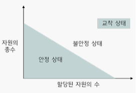
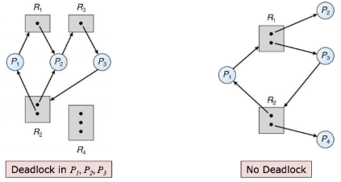

# 교착상태 해결 방법 

### **1. 예방** 

: 교착 상태를 유발하는 네가지 조건을 무력화한다. 

: 교착상태가 발생하기 위해서는 상호배제, 비선점, 점유와 대기, 원형대기 4가지 조건을 **"모두"** 만족해야하기 때문에, 이 중 1개의 조건만 발생하지 않도록 막아도 교착상태는 발생하지 않습니다. 

- **상호 배제 예방** 

  : 독점적으로 사용할 수 있는 자원을 없애버리는 방법. 그러나 현실적으로 모든 자원을 공유할 수 없으며 상호 배제를 적용하여 보호해야 하는 자원이 있기 때문에 사실상 어렵다.  

- **비선점 예방** 

  : 모든 자원을 빼앗을 수 있도록 만드는 방법. 그러나 어떤 기준으로 빼앗고, 얼마나 빼앗을지에 대한 기준이 불분명하고 선점으로 인한 아사현상이 발생할 수 있다. 

- **점유와 대기 예방**

  : 전부 할당하거나 아예 할당하지 않는 방식을 적용하는 방법으로, 이를 위해 프로세스는 시작 초기에 자신이 사용하려는 모든 자원을 한번에 점유하거나, 그렇지 못한 경우는 모두 반납해야한다. 

  : 프로세스의 자원 사용 방식을 변화시켜 교착상태를 처리하는 방법이다. 

  - 단점 

    - 프로세스가 자신이 사용하는 모든 자원을 알기 어렵다. 
    - 자원의 활용성이 떨어진다. ( 당장 사용도 안하면서 자원을 미리 선점하기에 낭비가 심하다. )
    - 많은 자원을 사용하는 프로세스는 동시에 모든 자원을 확보하기 어렵기에 아사현상이 발생할 수 있다. 
    - 일괄 작업 방식으로 동작하기에 시스템의 효율이 떨어진다. 

    

- **원형 대기 예방** 

  : 모든 자원에 숫자를 부여하여 숫자가 큰 방향으로 자원을 할당받게 하여 자원을 한방향으로만 사용해 원형 대기를 예방하는 방법이다. 

  - 단점 

    - 프로세스 작업 진행에 유연성이 떨어진다. 

    - 자원의 번호를 어떻게 부여할 것인지에 대한 문제가 있다. 

      

### **2. 회피** 

: 자원 할당량을 조절하여 교착 상태를 해결하는 방식

: 프로세스에 자원을 할당할 때 어느 수준 이상의 자원을 나누어주면 교착상태가 발생하는지 파악하여 그 수준 이하로 자원을 나누어 주는 방법. 

: 자원의 총수와 현재 할당된 자원의 수를 기준으로 안정상태와 불안정 상태를 나누고 시스템이 안정상태를 유지하도록 자원을 할당한다.  ( 불안정 상태에서 항상 교착 상태가 발생하는 것은 아니다. )

### 3.**검출과 회복**

: 자원 할당 그래프를 모니터링 하면서 교착상태가 발생하는지 살펴보는 방식이다. 만약 교착상태가 발생하면 교착 상태 회복 단계가 진행된다. 

**검출 )** 

- **타임아웃을 활용한 교착 상태 검출 ( 가벼운 교착 상태 검출 )**

  : 일정 시간 동안 작업이 진행되지 않은 프로세스를 교착상태가 발생한 것으로 간주하여 처리.

  - 문제점 

    _ 엉뚱한 프로세스가 강제 종료될 수 있다. 

    _ 모든 시스템에 적용할 수 없다. 

  - 예시 

    

- **자원 할당 그래프를 이용한 교착 상태 검출 ( 무거운 교착상태 검출 )**

  - 단일 자원을 사용하는 경우 자원 할당 그래프에 사이클이 있으면 교착 상태 

  - 다중 자원을 사용하는 경우 사이클이 있더라도 무조건 교착상태는 아니다. 

    ( 대기 그래프에서 그래프 감소를 한 이후에도 사이클이 남아있다면 교착 상태 )

---

- 다중 자원이 포한된 자원 할당 그래프에서는 **대기 그래프**와 **그래프 감소 방법**을 이용하여 사이클을 찾는다. 

  - **대기 그래프와 그래프 감소** 

    **대기 그래프** : 자원 할당 그래프에서 프로세스와 프로세스 간에 **기다리는 관계**만 나타내는 그래프. 

    **그래프 감소** : 대기 그래프에서 자원이 없는 프로세스의 화살표와 관련 프로세스의 화살표를 연속적으로 지워가는 작업 

    

    대기 그래프에서 그래프 감소를 완료한 후에도 사이클이 남아있다면 교착 상태 발생. 

> 쉽게 배우는 운영체제 - 한빛 아카데미 참고. 