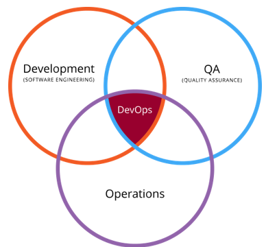

## DevOps

Dev (개발자) : 고객에게 제공한 변경을 빠르게 보길 원한다. 

Ops (운영자) : 제공하는 서비스 또는 소프트웨어의 안정성에 관심을 둔다. 

위의 이유로 개발자는 개발 생산성을 향상시키는 프레임워크를 도입하고자 하지만 운영자는 안정성의 이유로 이를 꺼린다. 

이러한 배경에서 등장한 것이 DevOps . 

**DevOps** : 개발과 운영을 하나의 조직으로 합쳐서 팀을 운영하는 문화이자 방법론 

- 소프트웨어 상품과 서비스를 신속히 생산하는 것에 도움이 되는 임무를 수행. 
- Dev 와 Ops 간의 목적을 일치시키고 프로세스와 도구에 대한 접근을 공유하여 그 차이를 줄이는데 목적. 

