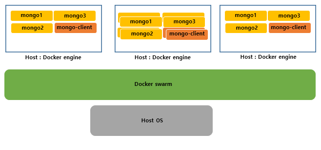
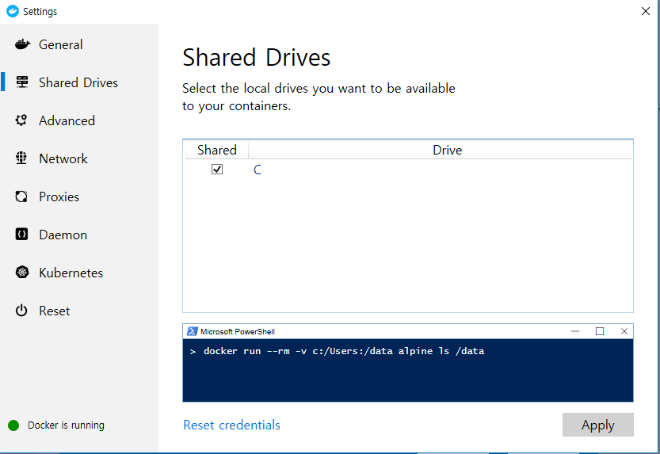
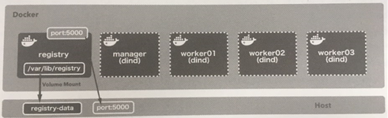
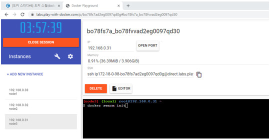
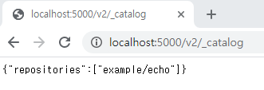

## Docker Swarm 

#### 도커 스웜

도커 컨테이너를 위한 클러스터링, 스케쥴링 툴로서, 스웜을 이용하면 여러 개의 서버와 컨테이너 관리를 쉽게 할 수 있다. 

- Swarm 에서 사용할 포트 
  - TCP port 2377  : cluster management 통신에 사용 
  - TCP/UDP port 7946 : node 간의 통신에 사용 
  - TCP/UDP port 4789 : overlay network 트래픽에 사용 

Docker Swarm --> 오케스트레이션 

 여러 Docker host 를 클러스터로 묶어주는 컨테이너 오케스트레이션 


| 이름    | 역할                                                         | 대응하는 명령어 |
| ------- | ------------------------------------------------------------ | --------------- |
| compose | 여러 컨테이너로 구성된 도커 어플리케이션을 관리 ( 주로 단일 호스트 ) | docker-compose  |
| swarm   | 클러스터 구축 및 관리 (주로 멀티 호스트)                     | docker swarm    |
| service | 스웜에서 클러스트 안의 서비스 (컨테이너 하나 이상의 집합)을 관리 | docker service  |
| stack   | 스웜에서 여러 개의 서비스를 합한 전체 어플리케이션을 관리    | docker stack    |


**Swarm 의 역할 **




교재 108p ~ 참고. 


docker-compose up 했을 때 암호 로그인을 해결할 때에는 컴퓨터 계정의 비밀번호를 입력해야한다. 

미리 마운트 시켜 놓기 




도커의 매니져 쉘로 접속하여 `docker swarm init` 명령어 실행. 이 때 bash 가 지원이 안될수도 있으니 접속시에 `docker exec -it manager sh` 로 접속. 


``` bash
/ # docker swarm init
Swarm initialized: current node (n7wfjxhy4qgowlf036l8vmg2b) is now a manager.

To add a worker to this swarm, run the following command:

    docker swarm join --token SWMTKN-1-59f2bjpnjndrn1ye93o7gzmf1nqj53l1pwbtxoyp67nwalt30u-83iwf4mhte8rcdvj7fapuhjj1 172.23.0.3:2377

To add a manager to this swarm, run 'docker swarm join-token manager' and follow the instructions.
```


위에서 `docker ---- 2377` 까지 복사한 이후에 worker 들을 아래와 같은 명령어로 붙여넣어서 등록 

```bash
$ docker exec -it worker01 docker swarm join --token SWMTKN-1-59f2bjpnjndrn1ye93o7gzmf1nqj53l1pwbtxoyp67nwalt30u-83iwf4mhte8rcdvj7fapuhjj1 172.23.0.3:2377

This node joined a swarm as a worker.
```

``` bash
$ docker exec -it worker02 docker swarm join --token SWMTKN-1-59f2bjpnjndrn1ye93o7gzmf1nqj53l1pwbtxoyp67nwalt30u-83iwf4mhte8rcdvj7fapuhjj1 172.23.0.3:2377

This node joined a swarm as a worker.
```

```bash
$ docker exec -it worker03 docker swarm join --token SWMTKN-1-59f2bjpnjndrn1ye93o7gzmf1nqj53l1pwbtxoyp67nwalt30u-83iwf4mhte8rcdvj7fapuhjj1 172.23.0.3:2377

This node joined a swarm as a worker.
```


위의 worker 등록이 정상적으로 되었는지 확인하는 명령어. 

```bash
$ docker exec -it manager docker node ls 

ID                            HOSTNAME            STATUS              AVAILABILITY        MANAGER STATUS      ENGINE VERSION
jlk3ot35lhwk6xqkxscjlf3xg     0eda6d670d78        Ready               Active                                  19.03.5
n7wfjxhy4qgowlf036l8vmg2b *   3f47a50123bb        Ready               Active              Leader              19.03.5
x9bfonhu4u2wb1bv8iec46irv     6235746f8ec9        Ready               Active                                  19.03.5
mziwi3fgjk6qlc0pn1ywfd8wu     f3097d2089b3        Ready               Active                                  19.03.5
```

매니져는 리더가 되어있고 나머지는 worker 로 등록되어있음을 확인할 수 있다. 


#### Docker in Docker -dind 

도커 컨테이너 안에서 도커 호스트를 실행 



registry 라는 이미지를 사용시 사용하고자 하는 도커 호스트에 레파지토리 저장소를 만들어 사용할 수 있다. 

manager : Worker 들이 가지고 있는 내용들을 관리해주는 작업을 담당. 


#### 설치 없이 가상의 환경에서 도커를 사용하여 SWARM 실습

play-with-docker.com ( 도커의 설치 없이 웹에서 가상으로 사용하는 툴 )




**node1)**  

```bash
$ docker swarm init 

Error response from daemon: could not choose an IP address to advertise since this system has multiple addresses on different interfaces (192.168.0.33 on eth0 and 172.18.0.97 on eth1) - specify one with --advertise-addr
```

```bash
$ docker swarm init --advertise-addr eth0 

Swarm initialized: current node (uvbsk83e5h43nhl2wbw8tqggm) is now a manager.

To add a worker to this swarm, run the following command:

    docker swarm join --token SWMTKN-1-3hae0gaoy7ke2koqtc7pak8jd3upjhsla5qj11dw60jl6dvtro-6gdvcxmwkxrvjw626ccjb8i4s 192.168.0.33:2377

To add a manager to this swarm, run 'docker swarm join-token manager' and follow the instructions.
```


**node2 / node3 ) Manager 에 Worker 등록하기 **

```bash
$ docker swarm join --token SWMTKN-1-3hae0gaoy7ke2koqtc7pak8jd3upjhsla5qj11dw60jl6dvtro-6gdvcxmwkxrvjw626ccjb8i4s 192.168.0.33:2377

This node joined a swarm as a worker.
```


#### Local 의 레지스트리 서버에 이미지를 등록하는 방법


```bash
$ docker image push [push_대상_레지스트리_호스트/]리포지토리명[:태그명]

ex )$ docker image push localhost:5000/example/echo:latest
```

push하는 대상의 default 는 도커 허브이고, 로컬의 레지스트리 서버에 등록하기 위해서는 호스트PC와 포워딩 된 레지스트리 포트의 주소를 넣어 줘야한다.  


- 도커 레지스트리용 이미지 생성 

```bash
$ docker tag example/echo:latest localhost:5000/example/echo:latest
```

- 도커 레지스트리에 이미지 등록 

```bash
$ docker push localhost:5000/example/echo:latest
```

이미지 등록이 되었는지는 웹 브라우저에서 `localhost:5000/v2/_catalog` 를 접속하면 확인할 수 있다. 



- 도커 레지스트리로부터 이미지 다운 ( 각각의 Worker에서 작업 )

셸에서 실행하거나 cmd 창에서 worker 에 접속하며 명령어를 바로 실행하는 방법 2가지가 있다. 

```sh
 # sh 셸
 docker pull registry:5000/example/echo
 
 # cmd 
 $ docker exec -it worker03 docker pull registry:5000/example/echo:latest
```

