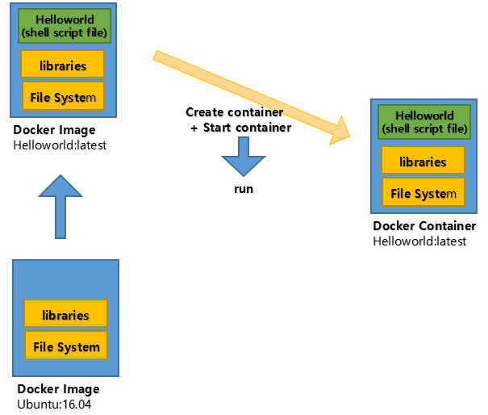
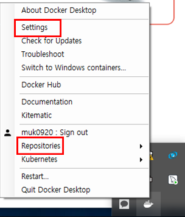
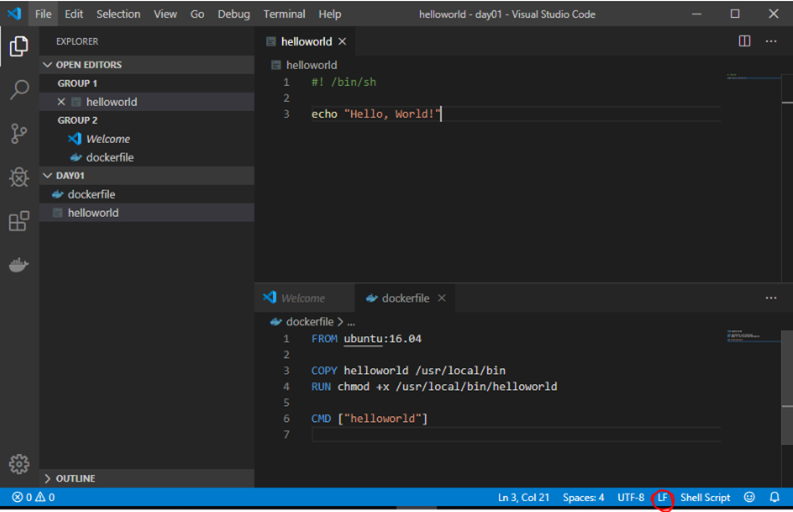
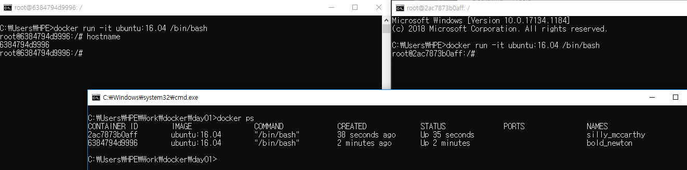
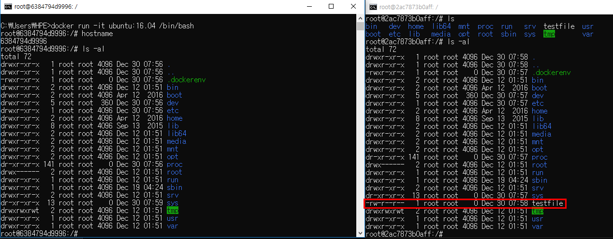
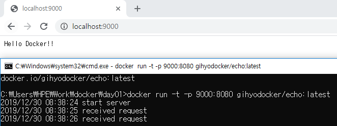

# Docker


## Docker 란

- 2014년 6월 docker 1.0 발표 

- 컨테이너 기반의 오픈소스 가상화 플랫폼

- 백앤드프로그램, 데이터베이스, 메시지 큐 --> **컨테이너**로 추상화 가능 

- 일반 PC, AWS, Azure, Google cloud 등에서 실행이 가능하다. 

- CPU의 가상화 기술 이용 방식 -> **Kernel-based Virtual Machine**

  - 전체 OS 를 가상화 하지 않는다. 호스트 형식에 비해 속도 향상
  - OpenStack, AWS 등의 클라우드 서비스 
  - **추가적인 OS**는 여전히 필요, 성능 문제 

- 프로세스 격리 -> 리눅스 컨테이너

  - CPU나 메모리는 프로세스에 필요한 만큼만 추가로 사용
  - 성능 손실 거의 없음
  - 컨테이너들 사이는 서로 영향을 주지 않음. 
  - 컨테이너 생성 속도 빠름 (1-2초 내 )

- Docker Hub 에 등록 or Docker Registry 저장소를 직접 만들어 관리 

  - 공개된 도커 이미지는 50만개 이상, 다운로드 수는 80억회 이상. 

- **Layer** 저장 방식 

  - 유니온 파일 시스템을 이용 -> 여러 개의 Layer 를 하나의 파일 시스템으로 사용 가능. 

  


##### Docker Image

- 컨테이너 실행에 필요한 파일과 설정 값 등을 포함 -> **상태값x , Immutable** 

- 실체화 -> Container 

  


### 도커 실행 방식




**Docker Repositories** : 사용자의 이미지 저장 서버 역할을 한다. 

`Setting` -> `Advanced` 에서 메모리 사이즈 4096MB 로 확장.  




```bash
$ docker version 
```

도커의 버전을 출력해주는 명령어. 


### 도커 스타일 체험하기_1

>  **실습 ) 셸 스크립트와 Docker file 을 작성하여 실행하기. **


1. **helloworld 라는 이름으로 셸 스크립트 파일을 만든다. (스크립트 파일이 여기서는 애플리케이션의 역할)**

   ``` bash
   #!/bin/sh
   
   echo "Hello, World!"
   ```

2. **셸 스크립트와 같은 폴더에 Dockerfile 을 작성한다. Docker 가 어떻게 이미지를 만들고 실행할지가 Dockerfile 에 정의된다. **

   ``` dockerfile
   FROM ubuntu:16.04   # 컨테이너의 원형(틀) 역할을 할 도커 이미지(운영체제)를 정의
   
   COPY helloworld /usr/local/bin   # 셸 스크립트 파일을 도커 컨터이너 안의 디렉터리에 복사 
   RUN chmod +x /usr/local/bin/helloworld #RUN은 도커컨테이너 안에서 어떤 명령을 수행하기 위한 것
   
   CMD ["helloworld"] # 완성된 이미지를 도커 컨테이너로 실행하기 전에 먼저 실행할 명령어를 정의
   ```

3. **위의 Dockerfile 을 사용해 이미지를 빌드하고 실행. **

   ```bash
   $ docker image build -t helloworld:latest .
   
   Sending build context to Docker daemon  6.656kB
   Step 1/4 : FROM ubuntu:16.04
    ---> c6a43cd4801e
   Step 2/4 : COPY helloworld /usr/local/bin
    ---> Using cache
    ---> 9d8e8e44e9b9
   Step 3/4 : RUN chmod +x /usr/local/bin/helloworld
    ---> Using cache
    ---> f7afa5402e99
   Step 4/4 : CMD ["helloworld"]
    ---> Using cache
    ---> c401fa906d7b
   Successfully built c401fa906d7b
   Successfully tagged helloworld:latest
   SECURITY WARNING: You are building a Docker image from Windows against a non-Windows Docker host. All files and directories added to build context will have '-rwxr-xr-x' permissions. It is recommended to double check and reset permissions for sensitive files and directories.
   ```

   helloworld 는 우리가 부르는 **이름**, latest 는 **태그**로서 보통 버전을 많이 쓴다. 

4. **도커 컨테이너를 실행**

   ```bash
   $ docker container run helloworld:latest
   
   Hello, World!
   ```

   `docker run helloworl:latest` 는 helloworld:latest 의 이미지를 실행하는 도커의 명령어. 

   `run` 은 `create` 와 `start` 의 혼합 명령어로 , 해당 이미지가 없으면 생성하고 있으면 그냥 시작. (실체화 시켜주는 작업)

**위의 실습 중 주의사항 ) **

만약 Dockerfile 과 셸 스크립트 파일을 visual code 로 열어서 확인했을 때, 우측 하단의 줄바꿈 옵션이 `CRLF` 일 경우 오류가 발생할 수 도 있다. 따라서 줄 바꿈 옵션을 `LF` 로 바꿔주고 위의 실습을 진행하자. 




### 도커 이미지 및 컨테이너 확인

현재 도커에 존재하는 이미지를 확인하는 명령어 

``` bash
$ docker image ls 

REPOSITORY          TAG                 IMAGE ID            CREATED             SIZE
helloworld          latest              2199c3cace20        36 seconds ago      123MB
ubuntu              16.04               c6a43cd4801e        11 days ago         123MB
```


해당 ID 에 해당하는 이미지를 강제로 삭제하는 명령어. ( 강제성을 띄기 위해서는 `-f` 필요 )

``` bash
$ docker rmi -f 이미지ID 

Untagged: helloworld:latest
Deleted: sha256:2199c3cace20ebf5ad3d0596a92e0c57156b0de3d9fb52cc92a535e2cbd52c29
Deleted: sha256:d92be1f5724c2620f47cfcdca887ab8c2854520bf046102c0e43cc159cb37e73
Deleted: sha256:3718243faa1cc1de162aed1d947db68794457a27a6a76c88fb1b3bd2717a3982
```


새로운 cmd 창에서 리눅스 컨테이너로 이동하여 직접적인 커맨드 입력이 가능하게 되었다.


```bash
$ docker run -it ubuntu:16.04 /bin/bash

root@baa2338214fb:/#
```

 

현재 도커에 실행중인 컨테이너를 확인하는 명령어. (위의 `docker run -it` 명령어를 통해 지속적으로 컨테이너를 실행하고 있기 때문에 `docker ps` 통해 현재 실행중인 컨터이너 목록에서 확인할 수 있다. )

``` bash
$ docker container ls 
( == $ docker ps)

CONTAINER ID        IMAGE               COMMAND             CREATED             STATUS              PORTS               NAMES
6384794d9996        ubuntu:16.04        "/bin/bash"         21 seconds ago      Up 19 seconds                           bold_newton
```


아래의 사진은 2개의 cmd 창에서 `ubuntu 컨테이너`를 실행하고 있고, `docker ps` 명령어를 통해 동작 중인 컨테이너를 확인한 사진이다. 




각각의 우분투 컨테이너들은 **독립적으로 동작**한다.  하나의 우분투에서 testfile 을 생성하고 다른 우분투에서 `ls -al ` 명령어를 이용하여 확인하면 독립적으로 동작하기 때문에 testfile 이 없는것을 확인할 수 있다. 




이전에 실행했던 컨테이너들의 목록을 모두 출력하는 명령어.

``` bash
$ docker ps -a 
```


### 컨테이너와 이미지 삭제하기 

``` bash
$ docker stop 컨테이너ID 
$ docker rm
$ docker rmi
```

컨테이너는 이미지로 부터 만들어지는 실체화된 내용 .

컨테이너가 모두 종료된 상태에서 이미지를 삭제해야 한다. 또한 컨테이너가 동작 중 일 경우에도 지워지지않기 때문에 `docker stop` 으로 동작 중인 컨테이너를 종료한다. 그리고 `docker rm` 으로 컨테이너를 삭제하고 `docker rmi` 를 통해 이미지를 삭제해야 한다.  


### 도커 스타일 체험하기_2

> **실습) 외부로부터 이미지를 가져와서 실행하기**


앞에 있는 계정 사이트(외부)에서 echo라는 이름의 이미지를 가져와 사용. 만약 해당 이미지가 있을 경우 사용. 

``` bash
$ docker image pull gihyodocker/echo:latest
```


``` bash
$ docker run -t -p 9000:8080 gihyodocker/echo:latest
```

`-t` 옵션 : 터미널 같은 역할을 해줄 수 있는 화면을 하나 띄어주는 명령어. 

`-p` 는 포트포워딩의 역할로 외부에서 사용할 때 9000번으로 사용하겠다는 것을 의미. ( 외부 클라이언트가 9000 번 포트로 접근하면 포트포워딩으로 8080 포트로 접속 ) 


현재 실행한 `gihyodocker/echo:latest`는  웹 브라우저에서 들어오는 요청을 받으면 `Hello Docker!!` 반환해주는 컨테이너 . 아래 사진은 웹브라우저(클라이언트)에서 9000포트를 실행했을 때의 화면. 





