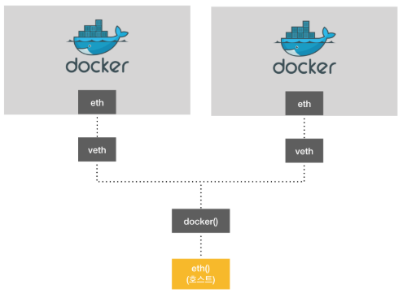
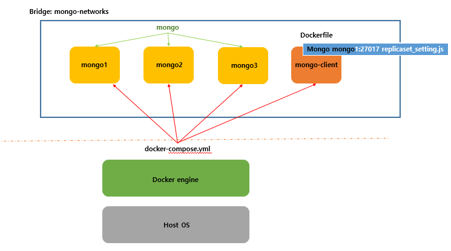

### Docker 네트워크


도커 내에 존재하는 eth 카드는 물리적으로 존재하는 eth 가 아닌, 호스트가 가지고 있는 eth 카드의 일부를 할당 받아서 사용하는 개념. 




현재 도커가 사용중인 네트워크의 목록을 확인하는 명령어.

``` bash
$ docker network ls 

NETWORK ID          NAME                DRIVER              SCOPE
7162ed0695d6        bridge              bridge              local
c806bb166bfc        host                host                local
06bc666050e4        none                null                local
```


- Bridge network

  ``` bash
  $ docker network create --driver bridge [브릿지이름]
  ```

  ``` bash
  $ docker run 또는 docker create 에서 --net 옵션으로 커스텀 브릿지 사용 
  ```

- Host network

  - 네트워크를 호스트로 설정하면 호스트의 네트워크환경을 그대로 사용 
  - 포트 포워딩 없이 내부 어플리케이션 사용 
  - $docker run -it --name network_host --net host ubuntu:16.04

- None network

  - 네트워크를 사용하지 않음 
  - local 네트워크만 사용, 외부와 단절 

- Container network

  - 다른 컨테이너의 네트워크 환경 공유
  - --net container:[다른 컨테이너의 ID or Name]
  - 두 컨테이너 사이의 네트워크 정보가 동일 

- Overlay network

  - 다른 호스트들에 있는 여러 호스트들의 네트워크를 묶어서 사용(공유)


아래의 명령어를 통해 IP Address 와 네트워크의 정보 등을 확인할 수 있다. 

```bash
$ docker inspect 컨테이너ID
```


### docker compose (p76~)

- 도커 어플리케이션을 정의하고 실행하는 도구로서, 여러 개의 컨테이너들을 관리하기 위해 사용. 

- Docker 커맨드 or 복잡한설정을 쉽게 관리하기 위한 도구 
  - YAML format 에 Docker 생성, 설정 관련된 작업을 작성해 놓은 Script 파일. 


설치된 도커의 버전을 확인하는 명령어. 

```bash
$ docker-compose version

docker-compose version 1.24.1, build 4667896b
docker-py version: 3.7.3
CPython version: 3.6.8
OpenSSL version: OpenSSL 1.0.2q  20 Nov 2018
```


`day03` 디렉터리 밑에 `docker_compose` 디렉터리를 생성한 후 그 내부에 `docker-compose.yml` 파일을 아래와 같이 생성하고 `docker-compose up` 명령어를 이용하여 도커 컴포즈를 실행. 

```yml
## docker-compose.yml 내용

version : "3" 
services:
    echo:
        image: busybox:latest
        ports:
            - 9000:8080
```

```bash
$ docker-compose up
```


### Docker Compose 실습 - MongoDB 서버 3개를 한 번에 실행. 

`day03` 디렉터리 밑에 `mongo` 라는 디렉터리를 생성한 후 내부에 `docker-compose.yml` 파일을 생성한 이후 실행.

`yml` 파일을 작성할 때 들여쓰기를 잘못 사용하게 될 경우 오류가 발생한다.

```yml
## docker-compose.yml 내용

version : "3"
services:
    mongo1:
        image: "mongo"
        ports : 
            - 16010:27017
        volumes:
            - $HOME/mongoRepl/mongo1:/data/db
        networks:
            - mongo-networks
        command: mongod --replSet myapp

    mongo2:
        image: "mongo"
        ports : 
            - 26010:27017
        volumes:
            - $HOME/mongoRepl/mongo2:/data/db
        networks:
            - mongo-networks
        command: mongod --replSet myapp
        depends_on:
            - mongo1

    mongo3:
        image: "mongo"
        ports : 
            - 36010:27017
        volumes:
            - $HOME/mongoRepl/mongo3:/data/db
        networks:
            - mongo-networks
        command: mongod --replSet myapp
        depends_on:
            - mongo2

networks:
    mongo-networks:
        driver: bridge
```

`depends_on` : 의존성을 이용하여 작업 순서를 제어하기 위한 옵션으로, mongo1 이 실행되고 mongo2가 실행되고 mongo3 이 실행되는 순서로 실행. 

```bash
$ docker-compose up
```

```bash
$ docker-compose down
```


### Docker-Compose 실습 - ReplicaSet _ 2가지 방법

1. Secondary 를 추가하는 명령어들을 한 곳에 모아 작성한 JavaScript 를 작성. 

   ```javascript
   rs.initiate(); 
   rs.add("172.19.0.3:27017");
   rs.add("172.19.0.4:27017");
   ```

   위와 같이 작성할 경우 수시로 변하는 IP 주소에 대응하지못하기 때문에 **"같은 네트워크의 Bridge"** 로 묶여있을 경우에만 한정으로 Name으로 접근한다. 

   ```javascript
   rs.initiate(); 
   rs.add("mongo1:27017");
   rs.add("mongo2:27017");
   ```
   
   

2. 초기화 시에 아래 `config` 파일을 작성한 뒤에 초기화 시에 사용하여 Secondary 추가. 

   ```javascript
   config = {
       _id: "myapp",
       members:[
           {_id:0, host: "mongo1:27017"},
           {_id:1, host: "mongo2:27017"},
           {_id:2, host: "mongo3:27017"},
       ]
   };
   rs.initiate(config);
   rs.config();
   ```


Dockerfile 내에서 CMD 라는 명령어는 1개만 와야한다. 


네트워크 목록을 확인하는 명령어. 

```bash
$ docker network ls 
```


새롭게 만들어진 네트워크에 참여하고 있는 네트워크가 무엇인지 확인하는 명령어. 

```bash
$ docker network inspect 네트워크ID

...
"Containers": {
            "9f372b529d04228945a2c4c9ca7478a5a5465187da2ad1c23d5139720fbed81f": {
                "Name": "mongo_mongo3_1",
                "EndpointID": "ad9f078944266d7b3a1f0da6890493d2e634a2152a001f9da445b2a03f9a1a0b",
                "MacAddress": "02:42:ac:13:00:04",
                "IPv4Address": "172.19.0.4/16",
                "IPv6Address": ""
            },
            "c4924952bb56d5528f3be9b83855dc1bc85ebc808a82e56f9976b3cf3c9f1bd7": {
                "Name": "mongo_mongo1_1",
                "EndpointID": "2832de41a279df807075743a928bb67cfacff0a8b220c675d31b7000113ac646",
                "MacAddress": "02:42:ac:13:00:02",
                "IPv4Address": "172.19.0.2/16",
                "IPv6Address": ""
            },
            "cf7b405beb81aeb40c6bbe26f6ffeade1b5fbace29b4be3e416c59c87665ec6b": {
                "Name": "mongo_mongo2_1",
                "EndpointID": "225501aaddbc5e7d8223c215ed16ee9b40b9306f42dbb70ed9b0e1eb4f5bd4bf",
                "MacAddress": "02:42:ac:13:00:03",
                "IPv4Address": "172.19.0.3/16",
                "IPv6Address": ""
            }
        }
...
```


### 실습


1. Dockerfile 생성

   ```dockerfile
   FROM mongo:latest
   
   WORKDIR  /usr/src
   RUN mkdir mongo_config
   WORKDIR /usr/src/mongo_config
   
   COPY replicaset_setting.js .
   
   CMD ["mongo", "mongodb://mongo1:27017", "./replicaset_setting.js"]
   ```

2. image 빌드 (`docker` -> `day03` -> `mongo` 디렉터리)

   ```bash
   $ docker build -t mongodb_setting:latest .
   ```

   이 때 mongdb_setting 은 위의 실습에서 생성한 mongo 들과 같은 네트워크로 묶여있지 않기 때문에 에러가 발생한다. 따라서 아래와 같이 `docker-compose.yml` 에 네트워크로 묶어준 이후에 다시 실행한다.

   ```yml
   version : "3"
   services:
       mongo1:
           image: "mongo"
           ports : 
               - 16010:27017
           volumes:
               - $HOME/mongoRepl/mongo1:/data/db
           networks:
               - mongo-networks
           command: mongod --replSet myapp
   
       mongo2:
           image: "mongo"
           ports : 
               - 26010:27017
           volumes:
               - $HOME/mongoRepl/mongo2:/data/db
           networks:
               - mongo-networks
           command: mongod --replSet myapp
           depends_on:
               - mongo1
   
       mongo3:
           image: "mongo"
           ports : 
               - 36010:27017
           volumes:
               - $HOME/mongoRepl/mongo3:/data/db
           networks:
               - mongo-networks
           command: mongod --replSet myapp
           depends_on:
               - mongo2
   
       mongodbsetup:
           image: "mongdb_setting"
           depends_on:
               - mongo3
           networks:
               - mongo-networks
   
   networks:
       mongo-networks:
           driver: bridge
   
   ```

   

   

   

   

   image 테스트 (컨테이너 생성)

3. docker-compose.yml 파일에 새로운 service(container) 추가 

   - mongo_repl_setting

4. docker-compose up

   


**주의 )** 오류 발생 시 volume 디렉터리의 문제일 수도 있다. 기존의 정보가 삭제되지않고 남아있어서 발생하는 문제  ( 윈도우에서 발생하는 오류 ) - OTHER 뜬 경우 

volume 의 디렉터리 경로를 변경한 이후에 다시 실행해보자.


### 실습 3 

1. MySQL 설치 -> docker-compose.yml 파일 작성
   - mysql:5.7  -->  test_mysql 이미지 빌드
     - Dockerfile 생성
     - root 패스워드 사용하지 않도록 설정 (-e 옵션 또는 environment 옵션)
   - test_mysql 이미지를 docker-compose 에서 실행 