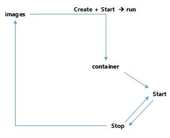
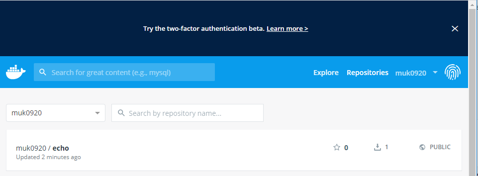
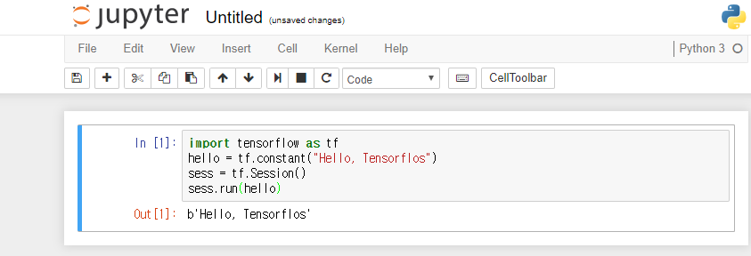

###### Docker 동작 방식




###### Docker 명령어 

도커의 이미지 목록을 확인하는 명령어. 

``` bash
$ docker images 

REPOSITORY          TAG                 IMAGE ID            CREATED             SIZE
example/echo        latest              c40905b07eb3        9 minutes ago       750MB
ubuntu              16.04               c6a43cd4801e        11 days ago         123MB
hello-world         latest              fce289e99eb9        12 months ago       1.84kB
golang              1.9                 ef89ef5c42a9        17 months ago       750MB
gihyodocker/echo    latest              3dbbae6eb30d        24 months ago       733MB
```


도커의 이미지를 삭제하는 명령어 

```bash
$ docker rmi 이미지ID
```


현재 디렉토리에 있는 파일을 도커의 이미지 파일로 만드는 명령어. 

```bash
$ docker build -t example/echo:latest .
```


###### DockerFile 인스트럭션

이미지는 상태데이터 (로그인정보, 사용자계정정보) 를 가질 수 없다. 그냥 템플릿. 


- **FROM 인스트럭션 **: 도커 이미지의 바탕이 될 베이스 이미지를 지정한다. 
- **RUN 인스트럭션** : 도커 이미지를 실행할 때 컨테이너 안에서 실행할 명령을 정의한다. 
- **COPY 인스트럭션 **: 도커내에 있는 가상화 폴더(컨테이너) 안에 호스트 머신의 파일이나 디렉터리를 복사한다.
- **CMD 인스트럭션 **: 실행 시 컨테이너 안에서 실행할 프로세스를 지정. 명령을 공백으로 나눈 배열로 표시 


``` bash
$ docker container run -p  9000:8080 example/echo:latest
```

`-p` 옵션 : 포트를 지정하는 옵션.  (포트포워딩 이용 시 사용)


``` bash
$ docker run -it golang:1.9 bash

root@fbb2bf9035d4:/go#                      <-- Golang 	이미지의 터미널로 접속했을 때의 상태

root@e5e671c8d135:/go# go version
go version go1.9.7 linux/amd64
```

`-it` 옵션 : 터미널의 환경으로 접속하여 커맨드(입력)를 계속 입력하겠다는 옵션 

위의 방법 처럼 터미널에서 접속하지 않고 컨테이너 실행 시 command 를 전달하면서 실행할 수 있다. 

``` bash
$ docker golang:1.9 go version

go version go1.9.7 linux/amd64
```

```bash
$ docker golang:1.9 ls -al

total 16
drwxrwxrwx 4 root root 4096 Jul 17  2018 .
drwxr-xr-x 1 root root 4096 Dec 31 01:16 ..
drwxrwxrwx 2 root root 4096 Jul 17  2018 bin
drwxrwxrwx 2 root root 4096 Jul 17  2018 src
```


#### 도커 예제 실습 _p43

1. Dockerfile 을 아래와 같이 변경해라 . 

   ``` dockerfile
   FROM golang:1.10
   
   
   ENTRYPOINT [ "go" ]
   CMD [""]
   ```

   ENTRYPOINT 인스트럭션은 CMD 와 마찬가지로 컨테이너 안에서 실행할 프로세스를 지정하는 인스트럭션으로, ENTRYPOINT 에 지정된 값이 기본 프로세스를 지정하는 것이다. 

   

2. Dockerfile 이 위치한 디렉터리에서 이미지를 빌드한다. 

   ``` bash
   $ docker image build -t mygolang:1.10
   ```

    
   
3. go version 이라 입력했던 명령어에서 version 으로 입력. 그 이유는 ENTRYPOINT 에서 go 로 지정했기에 go 이후의 명령만 인자로 넘길 수 있다.  

   ``` bash
   $ docker run mygolang:1.10 version 
   
   go version go1.10.8 linux/amd64
   ```

   

``` bash
$ docker run -d -p 9000:8080 example/echo:latest

796c3871b158f7e6f1e3c49ac504015aecf00ad65023fcc0a0c4db436b737351
```

`-d` 옵션 : 데몬, 백그라운드에서 실행하기 위해서 사용하는 옵션. 

실행중인 컨테이너의 ID 를 반환하고 끝난 것 처럼 보이지만,  `docker ps` 명령어로 확인해보면 실행 중임을 확인할 수 있다. 

``` bash
$ docker ps

CONTAINER ID        IMAGE                 COMMAND                  CREATED              STATUS              PORTS                    NAMES
796c3871b158        example/echo:latest   "go run /echo/main.go"   About a minute ago   Up About a minute   0.0.0.0:9000->8080/tcp   tender_sanderson
```


``` bash
$ docker logs 796c3871b158

2019/12/31 01:29:24 start server
```

위의 명령 중 `796c3871b158` 은 컨터이너의 ID 이다. 


``` bash
$ docker container ls --filter "ancestor=example/echo"

CONTAINER ID        IMAGE                 COMMAND                  CREATED             STATUS              PORTS                    NAMES
796c3871b158        example/echo:latest   "go run /echo/main.go"   4 minutes ago       Up 4 minutes        0.0.0.0:9000->8080/tcp   tender_sanderson
```


``` bash
$ docker container ls --filter "ancestor=example/echo" -q

796c3871b158
```


``` bash
$ docker stop $(docker container ls --filter "ancestor=example/echo" -q)

796c3871b158
```

위의 명령어는 명령프롬프트에서 지원이 안될 수 도있다 . 따라서 powershell 에서 실행해보자. 

( 기존에 사용하던 명령프롬프트 보다 기능이 좀 더 추가된 윈도우가 제공하는 프롬프트 --> **powershell** )


``` bash
$ docker  build --pull=true --no-cache -t gihydocker/concrete:latest .
```

`--pull=true` : 항상 새로운 자료를 다운받아서 사용하겠다. 

`--no-cache` : 캐시를 사용하지 않고 새로운 자료를 사용. 


``` bash
$ docker search mysql
```

도커 허브 사이트에서 사용가능한 mysql 의 이미지를 검색하는 명령어. 


```bash
$ docker search --limit 5 mysql
```

`--limt 숫자` : 검색 시에 출력하는 것을 최대 5개 까지 출력


##### 기존의 이미지에 새로운 태그로 변경

``` bash
$ docker image tag example/echo:latest example/echo:0.1.0

$ docker ps 

...
example/echo               0.1.0               c40905b07eb3        2 hours ago         750MB
example/echo               latest              c40905b07eb3        2 hours ago         750MB
...
```


##### 이미지를 외부에 공개하기

``` bash
$ docker image push example/echo:0.1.0

...
denied: requested access to the resource is denied
```

도커 허브는 자신 혹은 소속 기관이 소유한 리포지토리에만 이미지를 등록할 수 있기 때문에 네임스페이스 example 을 도커 허브의 ID 로 변경해야한다. 

``` bash
$ docker image tag example/echo:0.1.0 muk0920/echo:latest
```

```bash
$ docker image push muk0920/echo:latest

The push refers to repository [docker.io/muk0920/echo]
85615fb580ed: Preparing
...
e7dc337030ba: Pushed
latest: digest: sha256:499be21a6ce11b4d4a10aa91e8ac4e44720fb555ad59c25076222f904e4b1690 size: 2417
```

성공적으로 push 가 되었을 경우 도커 허브 사이트에서 자신의  리포지토리를 확인하면 아래와 같다. 




``` bash
$ docker run --name my-goserver muk0920/echo:latest
```

도커의 서버를 띄울 때 이름을 부여. 해당 이름은 컨테이너 내에서만 사용하는 이름이다. 

다름 프롬프트에서 `docker ps` 를 이용하여 컨테이너의 상태를 확인해보면 이름을 확인할 수 있다. 

``` bash
$ docker ps

CONTAINER ID        IMAGE                 COMMAND                  CREATED             STATUS              PORTS               NAMES
fdb521da6a13        muk0920/echo:latest   "go run /echo/main.go"   51 seconds ago      Up 48 seconds                           my-goserver
```

이제 해당 이름을 이용하여 도커 컨테이너의 서비스를 멈추고 시작할 수 있다. 


``` bash
$ docker container run -d --rm --name myserver muk0920/echo:latest
```

`--rm` 옵션 : 컨테이너가 종료되면 자동으로 삭제하는 옵션. `docker stop` 으로 종료한 이후 `docker ps -a ` 를 통해 확인하면 삭제된 것을 알 수 있다. (주의해야할 점은 컨테이너 사용 시 사용했던 모든 데이터들이 다 삭제 된다.)


```bash
$ docker container ls -q 
```

`-q` 옵션을 사용하면 컨테이너 ID 만 추출할 수 있다. 


``` bash
$ docker container ls --filter "name=myserver"

CONTAINER ID        IMAGE                 COMMAND                  CREATED             STATUS              PORTS               NAMES
35f93002ab12        muk0920/echo:latest   "go run /echo/main.go"   6 seconds ago       Up 3 seconds                            myserver

```


불필요한 컨테이너들을 일괄적으로 삭제하는 명령어. 

```bash
$ docker container prune

WARNING! This will remove all stopped containers.
Are you sure you want to continue? [y/N] y
Deleted Containers:
3d82a08f661900714d19eff412253abe9bc2a96c7abf128f02c1a831788fbb3c
0485825483ab175edae586676acb32e65a239f61bc2c5150a95ff4ce4d8f49e3
fdb521da6a137d89db18b8930ee8cb6b0ddc81d4ade861af50790214fe3adead
796c3871b158f7e6f1e3c49ac504015aecf00ad65023fcc0a0c4db436b737351
734ed51b2df7f2c96dc07706f977e1bfcdabcdfd4b5395749a3389c47091ad0d
a8a7f09ed190529732ee9422f62615c0e211340b52a337ced731e80473316881
a352b29e2706f6e45567e2af071ec2d7d403c78d6a115826788858d890d617f0
9e8f677a8a6b30161339b399329cdf866f498f33e8ab9d4e3ddc5ae6ce7ee832
e5e671c8d1354b1bf91e87e673132658b330afbe988e53e931df95bf75cc6403
fbb2bf9035d401bfbd27746f91089cce96a8308c1c965484d5f9dacbf2e4a7b3
f002864de1052eb6defda2133178116e9f586a0938bc4a717036d7873ad01720

Total reclaimed space: 12.6MB
```


불필요한 이미지들을 일괄적으로 삭제하는 명령어 

```bash
$ docker image prune

WARNING! This will remove all dangling images.
Are you sure you want to continue? [y/N] y
Total reclaimed space: 0B
```


불필요한 컨테이너와 이미지들을 일괄적으로 삭제하는 명령어

```bash
$ docker system prune

WARNING! This will remove:
  - all stopped containers
  - all networks not used by at least one container
  - all dangling images
  - all dangling build cache

Are you sure you want to continue? [y/N] y
Total reclaimed space: 0B
```


#### Docker 에서 TensorFlow 설치 

텐서플로우 : 구글에서 제공하는 머신러닝 프레임워크 

```bash
$ docker run -d -p 8888:8888 teamlab/pydata-tensorflow:0.1

Unable to find image 'teamlab/pydata-tensorflow:0.1' locally
0.1: Pulling from teamlab/pydata-tensorflow
...
Digest: sha256:cb5e036afc0aa647a6fe1f384475275aeed946c751de5209d84282c986589b7f
Status: Downloaded newer image for teamlab/pydata-tensorflow:0.1
717436d47bec6b637cb983205dcb433b963481a1857c2ebb619cefa7fffcf952
```

현재 로컬에 해당 이미지가 없기 때문에 외부에서 다운받아서 실행. 

웹 브라우저에서 8888 포트로 접속하여서 python3 파일로 아래의 내용을 작성하고 `Run All` 하면 아래와 같은 모습을 확인할 수 있다. 

