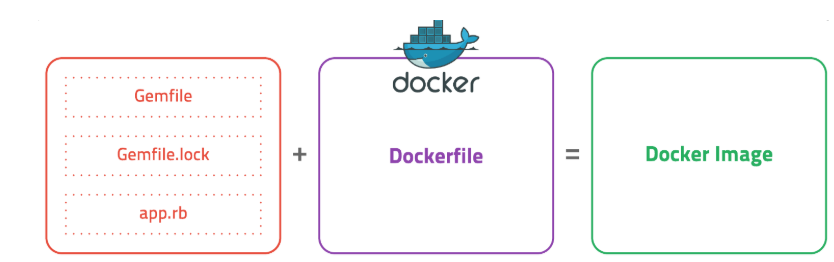
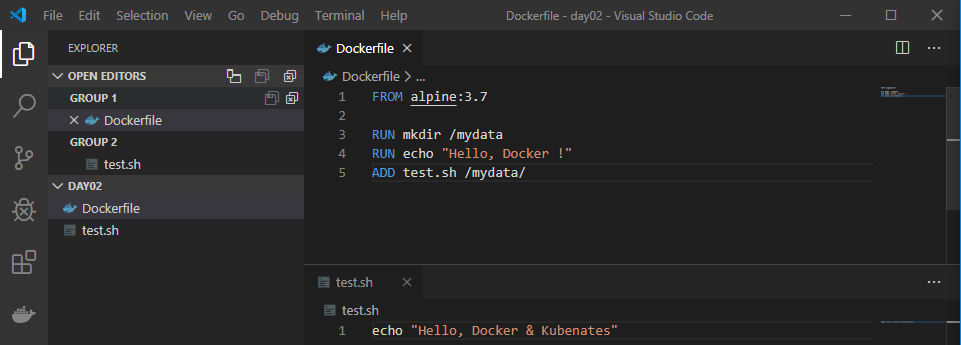
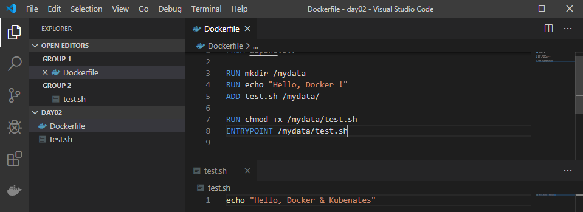
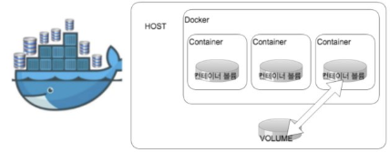
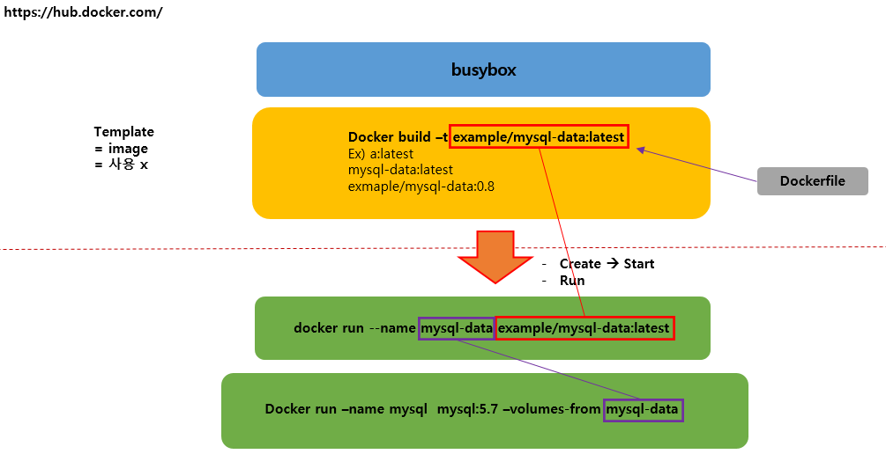

#### Docker 이미지 생성 

- 컨테이너 상태를 그대로 이미지로 저장. 

- Application file + Docker file 




#### Docker 테스트_1

`visual code` 파일을 열어서 `day02` 디렉터리를 생성하고 그 안에 `Dockerfile` 파일 생성. 

code Dockerfile 에서 아래 라인만 추가하고 저장한 이후에 테스트 해보자. 

``` dockerfile
FROM alpine:3.7
```


```bash
$ docker build -t fromtest:0.1 .

Sending build context to Docker daemon  2.048kB
Step 1/1 : FROM alpine:3.7
3.7: Pulling from library/alpine
...
Successfully tagged fromtest:0.1
...
```

현재 `Dockerfile` 의 실행 라인이 1줄이기 때문에 step 이 1밖에 없음을 확인할 수 있다. 


다시 code Dockerfile 에서 아래 라인으로 명령어를 수정한 후 테스트. 

```dockerfile
FROM alpine:3.7

RUN mkdir /mydata
RUN echo "Hello, Docker !"
```


```bash
$ docker build -t fromtest:0.1 .

Sending build context to Docker daemon  2.048kB
Step 1/3 : FROM alpine:3.7
 ---> 6d1ef012b567
Step 2/3 : RUN mkdir /mydata
 ---> Running in 32312833bd27
Removing intermediate container 32312833bd27
 ---> 2caf7f27a2c9
Step 3/3 : RUN echo "Hello, Docker !"
 ---> Running in b3c34a2a768c
Hello, Docker !
Removing intermediate container b3c34a2a768c
...
```

명령어의 라인 수가 늘어났기 때문에 step 의 수가 늘어났음을 확인할 수 있으며, step3 에서 echo 명령어가 실행됨을 확인할 수 있다. 


#### Docker 테스트_2

1. Dockerfile 을 아래와 같이 수정한다. 그리고 `ADD` 명령어를 수행하기 위해서는 `test.sh` 파일이 존재해야하기 때문에 `visual code` 를 이용하여 생성해준다. 

   

   

2. ``` bash
   $ docker build -t addtest:0.1 .
   ```

   

3. ``` bash
   $ docker run -it --name addtest addtest:0.1
   
   / # 
   ```


4. ```bash
   / # cd mydata/
   /mydata # ls
   test.sh
   ```

   위의 결과에서 알 수 있듯이 `ADD` 명령어를 수행한 결과를 확인할 수 있다. 


#### Docker 테스트_3

1. Dockerfile 을 아래와 같이 수정 .

   


2. ``` bash
   $ docker build -t entrytest:0.1 .
   ```

3. ```bash
   $ docker run -it --name entrytest entrytest:0.1
   
   Hello, Docker & Kubenates
   ```


#### Docker 테스트_4

1. Dockerfile 을 아래와 같이 수정. 

   ```Dockerfile
   FROM alpine:3.7
   
   CMD [ "ping", "www.google.com" ]
   ```

   

2. ```bash
   $ docker build -t pingtest
   ```

   

3. ``` bash
   $ docker run --name pingtest pingtest
   
   PING www.google.com (172.217.174.100): 56 data bytes
   64 bytes from 172.217.174.100: seq=0 ttl=37 time=30.338 ms
   64 bytes from 172.217.174.100: seq=1 ttl=37 time=31.978 ms
   64 bytes from 172.217.174.100: seq=2 ttl=37 time=31.393 ms
   ```


**busy box** : 도커 이미지를 만들 때 테스트 용도로 많이 사용. 속도가 매우 빠르다. 

**alpine** : 용량이 적은 초소형 리눅스로 되어있어 도커에서 사용 가능한 이미지 파일


---


#### Docker 데이터 볼륨 

컨테이너 업데이트	

- 새 버전의 이미지 다운 --> pull 
- 기존 컨테이너 삭제 --> stop, rm 
- 새 이미지를 이용하여 새 컨테이너 실행 --> run 


컨테이너 유지 정보 -> 데이터들을 컨테이너 내부에 보관하지 말고, host pc 쪽에 보관. 

- AWS S3
- 데이터 볼륨 




#### Docker 데이터 볼륨 실습 

1. `mkdir` 명령어를 이용하여 `volume` 디렉터리를 생성하고, 그 밑에 `Dockerfile` 을 만들고 아래와 같이 명령어를 입력한다.

   ``` dockerfile
   FROM busybox
   
   VOLUME /var/lib/mysql
   
   CMD [ "bin/true" ]
   ```

2. `volume` 디렉터리에서 아래의 명령어를 실행하여 컨테이너 생성. 

   ```bash
   $ docker build -t example/mysql-data:latest .
   ```

3.  ```bash
   $ docker run -d --name mysql-data example/mysql-data:latest
   
   6b8fd6a556ccc9c71d806e6dec6ad66cafc8a2b63db6b9fa50a6d9b904d09c4e
    ```


4.  MySQL을 동작시킬 컨테이너를 실행한다. 이 때 환경변수로 데이터베이스 이름, 사용자명, 패스워드를 설정한다. 그리고 `--volumes-from` 옵션을 사용하여 데이터 볼륨 컨테이너 `mysql-data` 를 MySQL 컨테이너에 마운트 한다. 이제 MySQL 컨테이너의 `/var/lib/mysql` 에는 데이터가 저장되지 않는다. 

   ```bash
   $ docker run -d --name mysql \
   -e "MYSQL_ALLOW_EMPTY_PASSWORD=yes" \
   -e "MYSQL_DATABASE=volume_test" \
   -e "MYSQL_USER=example" \
   -e "MYSQL_PASSWORD=example" \
   --volumes-from mysql-data mysql:5.7
   
   bf20ce30d65ef208d4888d6a01598ef661456c260f80273956b2335ff5879838
   ```

5.  실행중인 mysql 컨테이너에 root 계정으로 로그인한다. 

   ```bash
   $ docker exec -it mysql bash
   root@bf20ce30d65e:/# mysql -uroot
   
   Welcome to the MySQL monitor.  Commands end with ; or \g.
   Your MySQL connection id is 2
   Server version: 5.7.28 MySQL Community Server (GPL)
   ...
   mysql>
   ```

   위와 동일한 명령어를 한줄로 실행 . 

   만약 명령어 실행 시  `volume_test ` 를 적지 않으면 내부에서 `use volume_test` 를 해야한다.

   ``` bash
   $ docker exec -it mysql mysql -uroot volume_test
   
   Welcome to the MySQL monitor.  Commands end with ; or \g.
   Your MySQL connection id is 3
   Server version: 5.7.28 MySQL Community Server (GPL)
   ...
   mysql>
   ```

6.  user 라는 테이블을 만들고 데이터를 삽입. 

   ```mysql
   create table user(id int primary key auto_increment, name varchar(20));
   insert into user(name) values( 'test1');
   insert into user(name) values( 'test2');
   insert into user(name) values( 'test3');
   ```

7.  현재 실행중인 컨테이너를 삭제하고 다시 실행해본다. 

   **주의) **컨테이너를 삭제할 때 COMMAND 가 `bin/true` 인 컨테이너를 삭제하면 데이터가 날라간다. 따라서 아래의 컨테이너 중에서 `3a` 로 시작하는 컨테이너 ID 만 삭제하고 진행하면 새로 생성한 컨테이너에서도 데이터가 유지됨을 확인할 수 있다. 

   ```bash
   $ docker ps -a
   CONTAINER ID        IMAGE                       COMMAND                  CREATED             STATUS                      PORTS                 NAMES
   3ab0fba88193        mysql:5.7                   "docker-entrypoint.s…"   57 seconds ago      Up 55 seconds               3306/tcp, 33060/tcp   mysql
   66d08b92c1f8        example/mysql-data:latest   "bin/true"               16 minutes ago      Exited (0) 16 minutes ago                         mysql-data
   ```

   

   **비교 ) **새로 컨테이너를 생성할 때 아래와 같이 `--volumes-from mysql-data` 이 부분 없이 생성하면 데이터를 공유하지 못하는 것을 또한 확인할 수 있다. 

   ``` bash
   docker run -d --name mysql \
   -e "MYSQL_ALLOW_EMPTY_PASSWORD=yes" \
   -e "MYSQL_DATABASE=volume_test" \
   -e "MYSQL_USER=example" \
   -e "MYSQL_PASSWORD=example" \
   mysql:5.7
   ```

   

8. 다시 실행해서 테이블을 확인하면 아래와 같이 테이블이 존재함을 확인할 수 있다. 

   ```bash
   mysql> select * from user;
   +----+-------+
   | id | name  |
   +----+-------+
   |  1 | test1 |
   |  2 | test2 |
   |  3 | test3 |
   +----+-------+
   3 rows in set (0.00 sec)
   ```

   


#### 데이터볼륨 실습의 전체적인 흐름도




