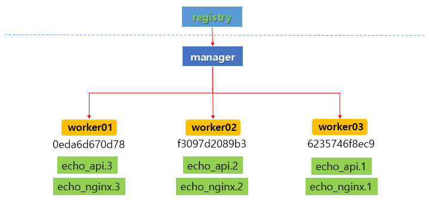
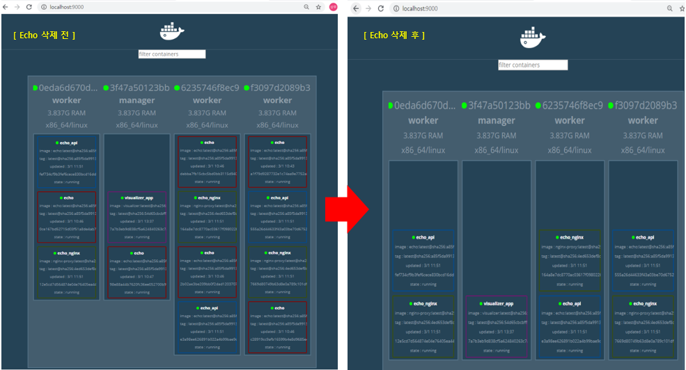

## Docker-Service


**서비스란 ? **

​	 애플리케이션을 구성하는 일부 컨테이너를 제어하기 위한 단위. 


#### 도커 서비스 만들기 - in Manager 

`docker service create` : 서비스를 생성하는 명령어.  

``` bash
$ docker exec -it manager docker service create --replicas 1 --publish 8000:8080 --name echo registry:5000/example/echo:latest

vv9kgjywmqnjbvtk8luicfco9
overall progress: 1 out of 1 tasks
1/1: running   [==================================================>]
verify: Service converged
```

`--replicas` 옵션 : 레플리카 셋팅의 수를 지정하는 옵션 --> 현재 서비스는 레플리카 셋팅을 1개로 설정.

`--publish` 옵션 : 호스트에 연결된 특정 포트를 외부로 노출하는 옵션 


`docker service ls` : 현재 생성된 비스의 목록을 확인하는 명령어.

```bash
$ docker exec -it mananger docker service ls # 현재 가지고 있는 서비스의 목록을 확인하는 명령어

ID                  NAME                MODE                REPLICAS            IMAGE                               PORTS
vv9kgjywmqnj        echo                replicated          1/1                 registry:5000/example/echo:latest   *:8000->8080/tcp
```


`docker service scale` : 해당 서비스의 컨테이너의 수를 늘리거나 줄일 수 있다. 

여러 노드에 걸쳐 컨테이너 수를 조정할 수 있으므로 스케일 아웃을 적용할 때 유리. 

```bash
$ docker exec -it mananger docker service scale echo=6 #레플리카 셋팅을 6개로 확장

# 위의 명령어를 실행후 ls 를 통해 확인하면 REPLICAS 가 6/6 으로 확장됨을 확인할 수 있다. 
ID                  NAME                MODE                REPLICAS            IMAGE                               PORTS
vv9kgjywmqnj        echo                replicated          6/6                 registry:5000/example/echo:latest   *:8000->8080/tcp
```


`docker service ps ` : 특정 서비스의 정보를 확인하는 명령어. 

```bash
$ docker exec -it mananger docker service ps echo # echo 서비스가 어떤 서비스인지 확인

ID                  NAME                IMAGE                               NODE                DESIRED STATE       CURRENT STATE           ERROR               PORTS
zedwaohzzg7q        echo.1              registry:5000/example/echo:latest   f3097d2089b3        Running             Running 5 minutes ago
hbj70zks06us        echo.2              registry:5000/example/echo:latest   6235746f8ec9        Running             Running 2 minutes ago
7tk5jea8mr5s        echo.3              registry:5000/example/echo:latest   f3097d2089b3        Running             Running 2 minutes ago
s6nhgxgw8agf        echo.4              registry:5000/example/echo:latest   0eda6d670d78        Running             Running 2 minutes ago
ix3mfswcsnae        echo.5              registry:5000/example/echo:latest   3f47a50123bb        Running             Running 2 minutes ago
oe3tvtooshv8        echo.6              registry:5000/example/echo:latest   6235746f8ec9        Running             Running 2 minutes ago
```


`docker service rm` : 배포된 서비스를 삭제하는 명령어. 

```bash
$ docker exec -it mananger docker service rm echo # echo 서비스를 삭제하는 명령어.
```


-----


## Docker-Stack


**스택이란 ? **

- 하나 이상의 서비스를 그룹으로 묶은 단위, 어플리케이션 전체 구성을 정의 . 
  - 서비스는 어플리케이션 이미지를 하나밖에 다루지 못함 
- 여러 서비스를 함께 다룰 수 있음 
- 스택을 사용해 배포된 서비스 그룹은 overlay 네트워크에 속함. 
- 스웜에서 동작하는 스케일 인, 스케일 아웃, 제약 조건 부여가 가능한 컴포즈.


**Overlay 네트워크란 ?**

​	여러 도커 호스트에 걸쳐 배포된 컨테이너 그룹을 같은 네트워크에 배치하기 위한 기술을 의미한다. overlay 네트워크를 사용해야 서로 다른 호스트에 위치한 컨테이너끼리 통신할 수 있다. 


- **Overlay 네트워크 생성 **

  ```bash
  $ docker exec -it manager sh
  > docker network create --driver=overlay --attachable ch03 
  
  njjbgnwm6c9wf8cu2thturamp
  ```

  ```bash
  # 네트워크 목록 확인 - overlay 네트워크 생성 확인  
  $ docker network ls 
  
  NETWORK ID          NAME                DRIVER              SCOPE
  05b5a91dab37        bridge              bridge              local
  njjbgnwm6c9w        ch03                overlay             swarm
  519c31982ecb        docker_gwbridge     bridge              local
  1939d7e1d05b        host                host                local
  gjdqcux38r8o        ingress             overlay             swarm
  f83ad5b19f0a        none                null                local
  ```

  

- **nginx 와 api 서비스의 compose 파일 작성하기** 

  ```yml
  # ch03-webapi.yml 소스코드 
  
  version: "3" 
  services:
      nginx:
          image: gihyodocker/nginx-proxy
          deploy:
              replicas: 3
              placement:
                  constraints: [node.role != manager]
          environment:
              BACKEND_HOST: echo_api:8080
          depends_on:
              - api
          networks:
              - ch03
  
      api: 
          image: registry:5000/example/echo:latest
          deploy:
              replicas: 3
              placement:
                  constraints: [node.role != manager]
          networks:
              - ch03
  
  
  networks:
      ch03:
          external : true 
  ```

  `environment 속성 ` : 컨테이너의 배치 전략을 설정 할 수 있다. 또한 제약 조건을 부여할 수도 있다. 


- **docker stack 의 하위 명령**

  | 스택 하위 명령 | 내용                                      |
  | -------------- | ----------------------------------------- |
  | deploy         | 스택을 새로 배포, 혹은 업데이트 함        |
  | ls             | 배포된 스택의 목록을 출력                 |
  | ps             | 스택에 의해 배포된 컨테이너의 목록을 출력 |
  | services       | 스택에 포한된 서비스 목록을 출력          |
  | rm             | 배포된 스택을 삭제                        |


  - **스택 배포하기 **

    ```bash
    > docker stack deploys -c /stack/ch03-webapi.yml echo 
      
    Creating service echo_api
    Creating service echo_nginx
    ```

    `-c` 옵션 : 스택 정의 파일 경로를 지정하는 옵션 

    

- **배포된 스택의 목록을 확인 **

  ```bash
  > docker stack ls
  
  NAME                SERVICES            ORCHESTRATOR
  echo                2                   Swarm
  ```

  

- **배포된 스택 확인**

  ```bash
  > docker stack services echo
  
  ID                  NAME                MODE                REPLICAS            IMAGE                               PORTS
  2mv9x66hwau6        echo_nginx          replicated          3/3                 gihyodocker/nginx-proxy:latest
  sx1baoopnmaj        echo_api            replicated          3/3                 registry:5000/example/echo:latest
  ```


- **스택에 배포된 컨테이너 확인하기**

  ```bash
  > docker stack ps echo 
  
  ID                  NAME                IMAGE                               NODE                DESIRED STATE       CURRENT STATE         ERROR                       PORTS
  16izrxhbx4y4        echo_api.1          registry:5000/example/echo:latest   6235746f8ec9        Running             Running 2 hours ago
  njdv56fx1kdf        echo_nginx.1        gihyodocker/nginx-proxy:latest      6235746f8ec9        Running             Running 2 hours ago
  9oobqed987k7        echo_nginx.2        gihyodocker/nginx-proxy:latest      f3097d2089b3        Running             Running 2 hours ago
  ey34o770o9vo        echo_api.2          registry:5000/example/echo:latest   f3097d2089b3        Running             Running 2 hours ago
  j0lrya22x537        echo_nginx.3        gihyodocker/nginx-proxy:latest      0eda6d670d78        Running             Running 2 hours ago
  xovouintlfv1        echo_api.3          registry:5000/example/echo:latest   0eda6d670d78        Running             Running 2 hours ago
  ```


- **스택 도식화**

  

  

- **Visualizer 를 사용해 컨테이너 배치 시각화 ****

  - **visualizer 란 ? ** 

    ​     스웜 클러스터에 컨테이너 그룹이 어떤 노드에 어떻게 배치됐는지 시각화해주는 어플리케이션

  - 도커 허브의 dockersamples/visualizer 이미지로 배포 됨. 

  

  ```yml
  # visualizer.yml 코드 (경로 :호스트의 stack 디렉터리 )
  
  version: "3" 
  services:
      app:
          image: dockersamples/visualizer
          ports:
              - "9000:8080"
          volumes:
              - /var/run/docker.sock:/var/run/docker.sock
          deploy:
              mode: global
              placement:
                  constraints: [node.role == manager]
  ```

  `mode : global` : 특정 컨테이너를 클러스터 상의 모든 노드에 배치하라는 의미 . 

  ```bash
  $ docker exec -it manager docker stack deploy -c /stack/visualizer.yml visualizer
  
  Creating network visualizer_default
  Creating service visualizer_app
  ```

  ```bash
  $ docker stack services visualizer
  
  ID                  NAME                MODE                REPLICAS            IMAGE                             PORTS
  dciga9776pqf        visualizer_app      global              1/1                 dockersamples/visualizer:latest   *:9000->8080/tcp
  ```

  

  웹 브라우저를 이용하여 접속할 경우 아래와 같이 컨테이너의 배치가 시각화 된 화면을 확인할 수 있다. 

  

  

  echo 라는 서비스가 많이 보이는 이유는 `docker service ls ` 목록을 통해 확인해 보면 echo 의 레플리카가 6개 있기 때문에 위와 같이 보임을 알 수 있다.  만약 echo 의 서비스를 삭제하면 우측 그림과 같이 echo 의 서비스가 사라진 상태의 컨테이너 배치 화면을 확인할 수 있다. 


----


## Docker HAProxy 

- Visualizer 는 외부 호스트에서 접속 가능 
  - Host -> Manager 사이는 port forwarding 설정 


- **HAProxy ( 가용성 구조까지 겸비 ) **

  - 외부 호스트에서 요청되는 트래픽을 목적 서비스로 보내주는 프록시 서버 설정 
  - 도커 허브의 dockercloud/haproxy 이미지로 배포  --> 이미지를 가지고 Dockerfile 을 만든다고 생각
    - 컨테이너 외부에서 서비스에 접근할 수 있도록 해주는 다리 역할 (ingress-접속 입구 역할) 
    - 서비스가 배치된 노드에 로드 밸런싱(하나의 서비스가 다 못하는 것을 분산) 기능 제공 

  

- **Docker-Compose 코드 작성하기 **

  ```yml
  # ch03-ingress.yml 코드 ( stack 디렉터리에 ) 
  
  version: "3"
  services:
      haproxy:
          image: dockercloud/haproxy
          networks:
              - ch03
          volumes:
              - /var/run/docker.sock:/var/run/docker.sock
          deploy:
              mode: global
              placement:
                  constraints: [node.role == manager]
          ports:
              - 80:80
              - 1936:1936 # for stats page (basic auth. stats:stats)
              
          networks:
              - ch03
  
  networks:
      ch03:
          external: true
  ```

  

- **스택 배포하기**

  ```bash
  $ docker exec -it manager docker stack deploy -c /stack/ch03-webapi.yml echo
  
  Updating service echo_nginx (id: 2mv9x66hwau69qgrozugx01xr)
  Updating service echo_api (id: sx1baoopnmaj642uyxbb9kcu3)
  ```

  ```bash
  $ docker exec -it manager docker stack deploy -c /stack/ch03-ingress.yml ingress
  
  Creating service ingress_haproxy
  ```

  


