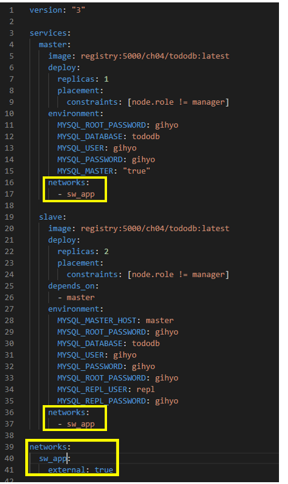

<<<<<<< HEAD
# Docker 테스트 - 교재 4단원

1. docker-compose up 을 이용하여 Manager와 Work1, Work2, Work3 을 띄운다. 

   

2. 매니저에서 `docker swarm init` , 나머지 work 들에서 join 을 해준다. 

3. visualizer 서비스를 실행한다. 

   

4. MySQL 서비스 구축 + 초기 데이터 구축

   - **.sh 파일은 LF 로 꼭 바꿔줘야한다 .** 

   - Dockerfile 이미지 빌드 및 레지스트리에 push 

     ```bash
     (tododb) $ docker image build -t localhost:5000/ch04/tododb:latest .
     ```

     ```bash
     (tododb) $ docker image push localhost:5000/ch04/tododb:latest
     ```

   - todo-mysql.yml 파일 수정 ( 네트워크만 변경하는 경우 )

     

   - manager 에서 overlay 네트워크 생성. 

     ```bash
     (manager)/# docker network create --driver=overlay --attachable sw_app
     oa7pawwthqokcem1ydkkbu1s9
     ```

     

   - MySQL  서비스 스택을 이용하여 배포 ( 스택 이용시 서비스명 앞에 스택명이 붙는다 )

     ```bash
     (manager)/# docker stack deploy -c /stack/todo-mysql.yml sw_mysql
     Creating service sw_mysql_master
     Creating service sw_mysql_slave
     ```

     

   - tododb/init-data.sh 파일에 존재하는 SQL 쿼리를 실행하여 초기 데이터를 넣어준다. 우선 초기데이터를 넣기 전 마스터 컨테이너가 스웜 노드 중 어느것에 배치되어있는지 확인할 필요가 있다. 

     

     ```bash
     (manager)/# docker ps sw_mysql_master --no-trunc
     ID                          NAME                IMAGE                                                                                                      NODE                DESIRED STATE       CURRENT STATE            ERROR               PORTS
     9ku7kohzh4dw9q4np4hftztnx   sw_mysql_master.1   registry:5000/ch04/tododb:latest@sha256:bed66765d69f43dc7c8f52e91e40ec6cbcd90ae447a28eade127cba50fce7e2f   bac05ca409d4        Running             Running 13 minutes ago
     ```

     `--no-trunc` : 모든 정보를 보는 옵션 ( 이 옵션이 없을 경우 태스크의 ID 가 잘려서 보인다. )

   - 해당 노드(worker)로 들어가서 태스크의 ID 를 이용하여 실행 .

     ```bash
     $ docker exec -it bac05ca409d4 docker exec -it sw_mysql_master.1.9ku7kohzh4dw9q4np4hftztnx  bash
     root@8e0239971cb6:/# 
     ```

     ```bash
     # 데이터 초기화 및 확인 
     root@8e0239971cb6:/# init-data.sh
     
     # mysql 접속 
     root@8e0239971cb6:/# mysql -u gihyo -pgihyo
     Welcome to the MySQL monitor.  Commands end with ; or \g.
     Your MySQL connection id is 16
     Server version: 5.7.28-log MySQL Community Server (GPL)
     
     Copyright (c) 2000, 2019, Oracle and/or its affiliates. All rights reserved.
     
     Oracle is a registered trademark of Oracle Corporation and/or its
     affiliates. Other names may be trademarks of their respective
     owners.
     
     Type 'help;' or '\h' for help. Type '\c' to clear the current input statement.
     
     mysql>
     
     # 데이터 생성 확인 
     mysql> show databases; 
     +--------------------+
     | Database           |
     +--------------------+
     | information_schema |
     | tododb             |
     +--------------------+
     2 rows in set (0.00 sec)
     ```

5. todoapi 도커 이미지 빌드 및 레지스트리에 등록

   ```bash
   (todoapi)$ docker image build -t localhost:5000/ch04/todoapi:latest .
   ```

   ```bash
   (todoapi)$ docker image push localhost:5000/ch04/todoapi:latest
   ```

   todoapi 서비스의 배포는 nginx 서비스 배포시 같이 진행. 

6. Nginx 이미지 빌드 및 레지스트리에 등록 

   ```bash
   (todonginx)$ docker image build -t localhost:5000/ch04/nginx:latest .
   (todonginx)$ docker image push localhost:5000/ch04/nginx:latest 
   ```

7. Nginx 를 거쳐 API에 접근하기 

   - todo-app.yml 을 수정하기 (서비스 이름 , 스택이름, 네트워크 이름 수정 )

     

   - sangwoo_app 스택을 이용하여 todo_app 와 nignx 서비스 배포. 

     ```bash
     (manager)/ # docker stack deploy -c /stack/todo-app.yml sangwoo_app
     Creating service sangwoo_app_sw_api
     Creating service sangwoo_app_sw_nginx
     ```

     

8. 웹 서비스 구축 

   - 웹 애플리케이션의 도커 이미지를 생성하기 전에 먼저 애플리케이션이 정상적으로 빌드되고 실행되는지 확인. 

     ```bash
     (todoweb)$ npm install    # 의존 모듈 다운로드 
     (todoweb)$ npm run build  # 릴리스용 빌드 
     (todoweb)$ npm run start  # 애플리케이션 서버 시작
     ```

   - 웹 애플리케이션 이미지 빌드 및 레지스트리에 등록 

     ```bash
     (todoweb)$ docker image build -t localhost:5000/ch04/todoweb:latest .
     (todoweb)$ docker image push localhost:5000/ch04/todoweb:latest 
     ```

   - 앱 애플리케이션의 앞단에 Nginx 를 배치하기 위한 이미지파일 생성. 이 때 그냥 도커파일이 아닌 `Dockerfile-nuxt` 파일을 빌드하기 때문에 `-f` 옵션을 이용해야한다. 

     ```bash
     (todonginx)$ docker image build -f Dockerfile-nuxt -t localhost:5000/ch04/nginx-nuxt:latest .
     (todonginx)$ docker image push localhost:5000/ch04/nginx-nuxt:latest
     ```

   - todo-frontend.yml 파일 수정 ( 서비스 이름 수정, 스택 이름 수정, 네트워크 이름 수정 )

     

     

   - sw_frontend 이름의 스택으로 서비스 배포 

     ```bash
     (manager)/# docker stack deploy -c /stack/todo-fronted.yml sw_frontend
     Creating service sw_frontend_nginx
     Creating service sw_frontend_sw_web
     ```

     

9. 인그레스로 서비스 노출하기 

   - todo-ingress.yml 파일을 아래와 같이 서비스 배포 

     ```bash
     (manager)/# docker stack deploy -c /stack/todo-ingress.yml sw_ingress
     Creating service sw_ingress_haproxy
     ```

10. 웹브라우저에서` localhost:8000` 으로 접속하여 todoapp 확인 

    

---

##  에러 상황 

- 

  MySQL 서비스를 스택을 이용하여 배포하였을 때 위와 같은 에러가 발생한다면 이미지 빌드시 같이 빌드 되어진 **.sh 파일이 LF 형식**인지 확인을 해보아라 . 

- 

  Nginx 서비스를 배포했을 경우 서비스가 올바르게 올라갔는데 에러뜨는 이유가 뭐지 ???..... 


---

리버스 프록시란 

Nginx 

RESTful API 

바이너리 로그란 

insecure-registries 항목은 registry 에서 pulling 시 https 가 아닌 http 로 pulling을 하기 위해 설정이 필요하다.

애셋 파일

expose 는 호스트와 연결할 포트 번호를 설정. 

expose 하나로 포트번호를 2개 이상 동시에 설정할 수도 있다. 호스트와 연결만 할 뿐 외부에 노출은 되지 않는다. 

tty : true   -> 터미널 환경을 허용. 

privileged Mode 란 ? 

- 도커 컨테이너는 일반적으로 unprivileged 이며 도커 데몬과 같은 프로세스를 도커 컨테이너 안에서 실행할 수 없다. privileged 된 컨테이너들만 모든 호스트의 장치에 접근 가능. 일반적인 컨테이너는 보안상 해당 기능이 없는 unprivileged 로 실행. 
=======
# Docker 테스트 - 교재 4단원

1. docker-compose up 을 이용하여 Manager와 Work1, Work2, Work3 을 띄운다. 

   

2. 매니저에서 `docker swarm init` , 나머지 work 들에서 join 을 해준다. 

3. visualizer 서비스를 실행한다. 

   

4. MySQL 서비스 구축 + 초기 데이터 구축

   - **.sh 파일은 LF 로 꼭 바꿔줘야한다 .** 

   - Dockerfile 이미지 빌드 및 레지스트리에 push 

     ```bash
     (tododb) $ docker image build -t localhost:5000/ch04/tododb:latest .
     ```

     ```bash
     (tododb) $ docker image push localhost:5000/ch04/tododb:latest
     ```

   - todo-mysql.yml 파일 수정 ( 네트워크만 변경하는 경우 )

     

   - manager 에서 overlay 네트워크 생성. 

     ```bash
     (manager)/# docker network create --driver=overlay --attachable sw_app
     oa7pawwthqokcem1ydkkbu1s9
     ```

     

   - MySQL  서비스 스택을 이용하여 배포 ( 스택 이용시 서비스명 앞에 스택명이 붙는다 )

     ```bash
     (manager)/# docker stack deploy -c /stack/todo-mysql.yml sw_mysql
     Creating service sw_mysql_master
     Creating service sw_mysql_slave
     ```

     

   - tododb/init-data.sh 파일에 존재하는 SQL 쿼리를 실행하여 초기 데이터를 넣어준다. 우선 초기데이터를 넣기 전 마스터 컨테이너가 스웜 노드 중 어느것에 배치되어있는지 확인할 필요가 있다. 

     

     ```bash
     (manager)/# docker ps sw_mysql_master --no-trunc
     ID                          NAME                IMAGE                                                                                                      NODE                DESIRED STATE       CURRENT STATE            ERROR               PORTS
     9ku7kohzh4dw9q4np4hftztnx   sw_mysql_master.1   registry:5000/ch04/tododb:latest@sha256:bed66765d69f43dc7c8f52e91e40ec6cbcd90ae447a28eade127cba50fce7e2f   bac05ca409d4        Running             Running 13 minutes ago
     ```

     `--no-trunc` : 모든 정보를 보는 옵션 ( 이 옵션이 없을 경우 태스크의 ID 가 잘려서 보인다. )

   - 해당 노드(worker)로 들어가서 태스크의 ID 를 이용하여 실행 .

     ```bash
     $ docker exec -it bac05ca409d4 docker exec -it sw_mysql_master.1.9ku7kohzh4dw9q4np4hftztnx  bash
     root@8e0239971cb6:/# 
     ```

     ```bash
     # 데이터 초기화 및 확인 
     root@8e0239971cb6:/# init-data.sh
     
     # mysql 접속 
     root@8e0239971cb6:/# mysql -u gihyo -pgihyo
     Welcome to the MySQL monitor.  Commands end with ; or \g.
     Your MySQL connection id is 16
     Server version: 5.7.28-log MySQL Community Server (GPL)
     
     Copyright (c) 2000, 2019, Oracle and/or its affiliates. All rights reserved.
     
     Oracle is a registered trademark of Oracle Corporation and/or its
     affiliates. Other names may be trademarks of their respective
     owners.
     
     Type 'help;' or '\h' for help. Type '\c' to clear the current input statement.
     
     mysql>
     
     # 데이터 생성 확인 
     mysql> show databases; 
     +--------------------+
     | Database           |
     +--------------------+
     | information_schema |
     | tododb             |
     +--------------------+
     2 rows in set (0.00 sec)
     ```

5. todoapi 도커 이미지 빌드 및 레지스트리에 등록

   ```bash
   (todoapi)$ docker image build -t localhost:5000/ch04/todoapi:latest .
   ```

   ```bash
   (todoapi)$ docker image push localhost:5000/ch04/todoapi:latest
   ```

   todoapi 서비스의 배포는 nginx 서비스 배포시 같이 진행. 

6. Nginx 이미지 빌드 및 레지스트리에 등록 

   ```bash
   (todonginx)$ docker image build -t localhost:5000/ch04/nginx:latest .
   (todonginx)$ docker image push localhost:5000/ch04/nginx:latest 
   ```

7. Nginx 를 거쳐 API에 접근하기 

   - todo-app.yml 을 수정하기 (서비스 이름 , 스택이름, 네트워크 이름 수정 )

     

   - sangwoo_app 스택을 이용하여 todo_app 와 nignx 서비스 배포. 

     ```bash
     (manager)/ # docker stack deploy -c /stack/todo-app.yml sangwoo_app
     Creating service sangwoo_app_sw_api
     Creating service sangwoo_app_sw_nginx
     ```

     

8. 웹 서비스 구축 

   - 웹 애플리케이션의 도커 이미지를 생성하기 전에 먼저 애플리케이션이 정상적으로 빌드되고 실행되는지 확인. 

     ```bash
     (todoweb)$ npm install    # 의존 모듈 다운로드 
     (todoweb)$ npm run build  # 릴리스용 빌드 
     (todoweb)$ npm run start  # 애플리케이션 서버 시작
     ```

   - 웹 애플리케이션 이미지 빌드 및 레지스트리에 등록 

     ```bash
     (todoweb)$ docker image build -t localhost:5000/ch04/todoweb:latest .
     (todoweb)$ docker image push localhost:5000/ch04/todoweb:latest 
     ```

   - 앱 애플리케이션의 앞단에 Nginx 를 배치하기 위한 이미지파일 생성. 이 때 그냥 도커파일이 아닌 `Dockerfile-nuxt` 파일을 빌드하기 때문에 `-f` 옵션을 이용해야한다. 

     ```bash
     (todonginx)$ docker image build -f Dockerfile-nuxt -t localhost:5000/ch04/nginx-nuxt:latest .
     (todonginx)$ docker image push localhost:5000/ch04/nginx-nuxt:latest
     ```

   - todo-frontend.yml 파일 수정 ( 서비스 이름 수정, 스택 이름 수정, 네트워크 이름 수정 )

     

     

   - sw_frontend 이름의 스택으로 서비스 배포 

     ```bash
     (manager)/# docker stack deploy -c /stack/todo-fronted.yml sw_frontend
     Creating service sw_frontend_nginx
     Creating service sw_frontend_sw_web
     ```

     

9. 인그레스로 서비스 노출하기 

   - todo-ingress.yml 파일을 아래와 같이 서비스 배포 

     ```bash
     (manager)/# docker stack deploy -c /stack/todo-ingress.yml sw_ingress
     Creating service sw_ingress_haproxy
     ```

10. 웹브라우저에서` localhost:8000` 으로 접속하여 todoapp 확인 

    

---

##  에러 상황 

- 

  MySQL 서비스를 스택을 이용하여 배포하였을 때 위와 같은 에러가 발생한다면 이미지 빌드시 같이 빌드 되어진 **.sh 파일이 LF 형식**인지 확인을 해보아라 . 

- 

  Nginx 서비스를 배포했을 경우 서비스가 올바르게 올라갔는데 에러뜨는 이유가 뭐지 ???..... 


---

리버스 프록시란 

Nginx 

RESTful API 

바이너리 로그란 

insecure-registries 항목은 registry 에서 pulling 시 https 가 아닌 http 로 pulling을 하기 위해 설정이 필요하다.

애셋 파일

expose 는 호스트와 연결할 포트 번호를 설정. 

expose 하나로 포트번호를 2개 이상 동시에 설정할 수도 있다. 호스트와 연결만 할 뿐 외부에 노출은 되지 않는다. 

tty : true   -> 터미널 환경을 허용. 

privileged Mode 란 ? 

- 도커 컨테이너는 일반적으로 unprivileged 이며 도커 데몬과 같은 프로세스를 도커 컨테이너 안에서 실행할 수 없다. privileged 된 컨테이너들만 모든 호스트의 장치에 접근 가능. 일반적인 컨테이너는 보안상 해당 기능이 없는 unprivileged 로 실행. 
>>>>>>> 275db1ec3019348b9545d31a31d2f5a50acef4d0
- 모든 장치에 접근할 수 있을 뿐만 아니라 호스트 컴퓨터 커널의 대부분의 기능을 사용하며, `systemctl` 과 같은 프로그램이나 도커 컨테이너 내부에서 도커를 사용할 수 있다. 