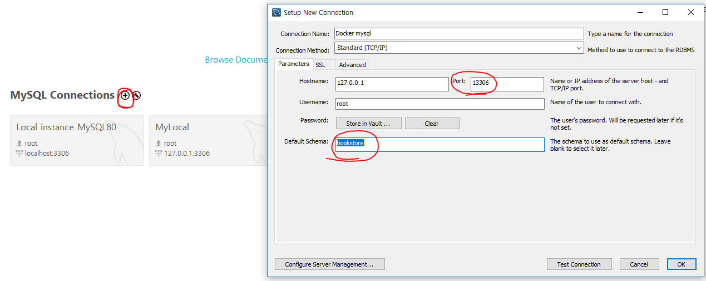
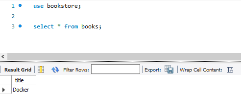

**Docker-Compose** : 한번에 여러개의 container 를 통합 관리 할 수 있게 하는 툴. 

```bash 
$ docker-compose version 

docker-compose version 1.24.1, build 4667896b
docker-py version: 3.7.3
CPython version: 3.6.8
OpenSSL version: OpenSSL 1.0.2q  20 Nov 2018
```


#### Docker Run Option

`-d` : detached mode 흔히 말하는 백그라운드 모드

`-p` : 호스트와 컨테이너의 포트를 연결 ( 포워딩 )

`-v` : 호스트와 콘테이너의 디렉토리를 연결 (마운트)

`-e` : 컨테이너 내에서 사용할 환경변수 설정 

`-name`: 컨테이너에 이름을 설정하는 옵션.  이름을 설정하지 않을 경우 자동으로 부여. 

`-rm ` : 컨테이너 안의 프로세스가 종료되면 컨테이너를 자동으로 삭제하는 옵션.

`-it` : -i 와 -t 를 동시에 사용. 

`-link` : 컨테이너 연결 [컨테이너명 : 별칭]


#### Docker 에서 MySQL 설치 

실행가능한 mysql 이미지 파일을 최대 5개 까지 보여주는 명령어. 

```bash
$ docker search --limit 5 mysql

NAME                  DESCRIPTION                                     STARS               OFFICIAL            AUTOMATED
mysql                 MySQL is a widely used, open-source relation…   8982                [OK]
mysql/mysql-server    Optimized MySQL Server Docker images. Create…   667                                     [OK]
mysql/mysql-cluster   Experimental MySQL Cluster Docker images. Cr…   59
bitnami/mysql         Bitnami MySQL Docker Image                      35                                      [OK]
circleci/mysql        MySQL is a widely used, open-source relation…   16

```


mysql 을 설치하기 위해서 필요한 mysql 이미지 파일을 외부에서 가져오는 명령어. 

```bash
$ docker pull mysql:5.7


5.7: Pulling from library/mysql
...
Status: Downloaded newer image for mysql:5.7
docker.io/library/mysql:5.7
```


```bash
$ docker run -d -p 13306:3306 -e MYSQL_ALLOW_EMPTY_PASSWORD=true --name my-mysql mysql:5.7

12b2df1e8928b72a611125bf864e9222574d7777a35f24d897e0c15db719827e
```

`-e` 옵션 : 환경변수 옵션으로,  `MYSQL_ALLOW_EMPTY_PASSWORD=true` 는 패스워드 없이 실행하는 것을 허용. 


```bash
$ docker exec -it my-mysql bash 

root@12b2df1e8928:/#
```

루트로 접속이 되어있고, @ 뒤의 호스트 네임은 컨터이너 네임이다. 


#### Docker 에서 MySQL 실행하기

1. mysql 접속하기 

   ``` bash
   root@12b2df1e8928:/# mysql -h127.0.0.1 -uroot
   
   Welcome to the MySQL monitor.  Commands end with ; or \g.
   Your MySQL connection id is 6
   Server version: 5.7.28 MySQL Community Server (GPL)
   
   Copyright (c) 2000, 2019, Oracle and/or its affiliates. All rights reserved.
   
   Oracle is a registered trademark of Oracle Corporation and/or its
   affiliates. Other names may be trademarks of their respective
   owners.
   
   Type 'help;' or '\h' for help. Type '\c' to clear the current input statement.
   
   mysql>
   ```

2. 이후에는 윈도우에서 실행했던 것처럼 mysql 사용 가능. 

   ``` mysql
   mysql> show databases;
   +--------------------+
   | Database           |
   +--------------------+
   | information_schema |
   | mysql              |
   | performance_schema |
   | sys                |
   +--------------------+
   4 rows in set (0.00 sec)
   
   mysql> create database bookstore;
   Query OK, 1 row affected (0.00 sec)
   
   mysql> insert into books values('Docker');
   Query OK, 1 row affected (0.04 sec)
   ```


#### 윈도우에서 Docker MySQL 에 접속 

1. 윈도우에서 Workbench 실행하여 새롭게 추가. 

   포트포워딩을 했기 때문에 `port ` 는 13306 을 입력해준다. 그리고 도커의 mysql 에서 생성한 databases 인 `bookstore` 를 이용하기 위해 `default schema` 에 `bookstore` 를 입력해준다. 



2.  접속 테스트 

   이제 생성한 Docker mysql 로 들어가서 `select ` 명령어를 이용하여 `books 테이블` 을 확인하면 사용이 가능함을 확인할 수 있다. 

