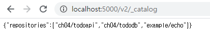
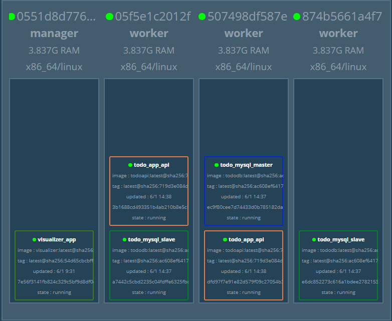
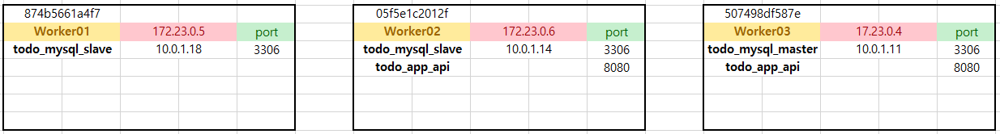
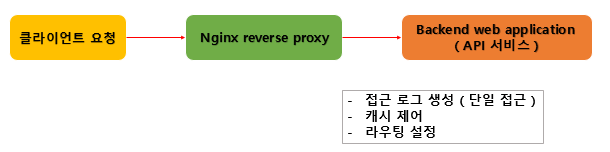
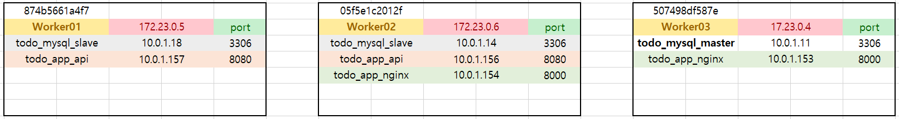
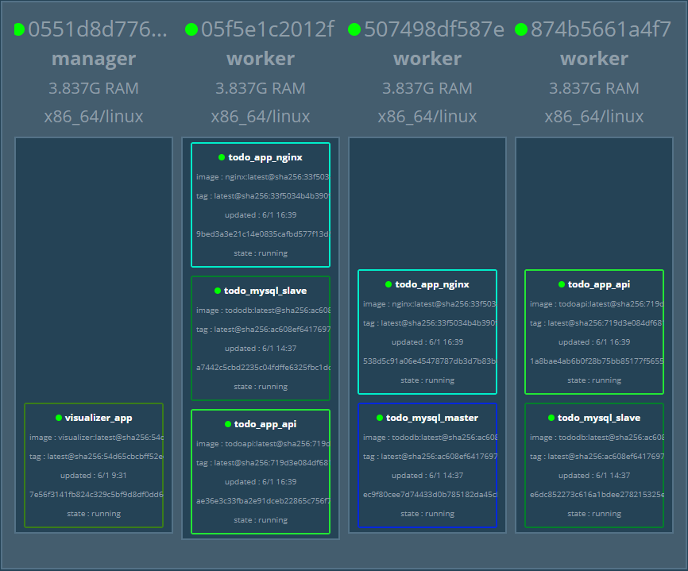
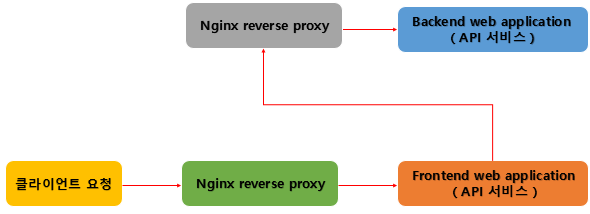

## 스웜을 이용한 실전 어플리케이션 개발 


- 배치 전략
  - 데이터 스토어 역할을 할 MySQL 서비스를 Master-Slave 구조로 구축
  - MySQL 과 데이터를 주고받을 API 구현
  - Nginx 를 웹 어플리케이션과 api 사이에서 리버스 프록시 역할을 하도록 설정 
  - API를 사용해 서버 사이드 랜더링을 수행할 웹 애플리케이션 구현 
  - 프론트앤드 쪽에 리버스 프록시(Nginx) 배치


### MySQL 서비스 구축 


##### 0. overlay 네트워크 생성하기 ( in Manager )

```bash
> docker network create --driver=overlay --attachable todoapp
```


##### 1. Master/Slave 구조 구축

- Docker hub의 Mysql:5.7 이미지로 생성
- Master/Slave 컨테이너는 두 역할을 모두 수행할 수 있는 하나의 이미지로 생성 ( Master 와 Slave 는 각각 서버 ID 가 unique 하게 가져야한다. --> 환경 변수 설정에 따라서 Master 와 Slave 를 분류하여 생성 )
- MYSQL_MASTER 환경 변수의 유무에 따라 Master, Slave 결정 
- replicas 값을 설정하여 Slave 개수 조정 


##### 


강사님 강의자료의  `todo` 디렉터리 복사해서 `day03` 디렉터리 밑에 옮긴다. 그리고 `swarm` 디렉터리 밑의 `todo-mysql.yml` 파일을 `stack` 디렉터리 밑으로 복사한다. ( `stack` 디렉터리가 매니져와 volume 을 공유 )


- Build 및 Swarm Cluster 에서 사용하기 ( `tododb` 디렉터리 밑에서 작업 )

  - Dockerfile 빌드 -> ch04/tododb:latest 이미지 생성

    ```bash
    $ docker build -t ch04/tododb:latest .
    ```

    

  - 생성 된 이미지를 swarm cluster 의 worker node 에서 사용할 수 있도록 localhost:5000/ch04/tododb:latest 태그를붙여 레지스트리에 등록

    ```bash
    # 태그를 변경하는 작업 
    $ docker tag ch04/tododb:latest localhost:5000/ch04/tododb:latest
    ```

    ``` bash
    # 레지스트리에 등록하는 작업
    $ docker image push localhost:5000/ch04/tododb:latest
    ```

  

  
---

  - 각각의 Worker 에서 `pull` 을 이용하여 레지스트리로 부터 이미지를 다운

  ```bash
    $ docker pull registry:5000/ch04/tododb:latest
  ```

  ```bash
    $ docker images ls
  ```

  - 다운 받은 이미지를 이용하여 컨테이너 실행 
  
    ```bash
    # 우리가 필요한 컨테이너 설치 및 실행 
      $ docker run -d -p registry:5000/tododb:latest 
    ```
  
    ```bash
    # 설치한 컨테이너 목록 확인 
      $ docker container ls 
    ```

---

  위의 명령어는 일일이 작업해야하기 때문에 이를 하나의 stack 으로 묶어서 아래와 같이 작업

  **주의) `.sh` 파일들이 `CRLF`  형식으로 저장되어있으면 오류가 발생하기 때문에 이를 `LF` 로 모두 바꿔준 이후에 작업을 진행해야 오류가 발생하지 않는다 !! **

  - Swarm 에서 Master/Slave 실행 
  
    - MySQL master x 1 (replicas=1), MySQL slave x 2 (replicas=2)
    
      ```yml
      # todo-mysql.yml 코드 
      version: "3"
      
      services:
        master:
          image: registry:5000/ch04/tododb:latest
          deploy:
            replicas: 1
            placement:
              constraints: [node.role != manager]
          environment:
            MYSQL_ROOT_PASSWORD: gihyo 
            MYSQL_DATABASE: tododb 
            MYSQL_USER: gihyo 
            MYSQL_PASSWORD: gihyo 
            MYSQL_MASTER: "true"
          networks:
            - todoapp
      
        slave:
          image: registry:5000/ch04/tododb:latest
          deploy:
            replicas: 2
            placement:
              constraints: [node.role != manager]
          depends_on:
            - master
          environment:
            MYSQL_MASTER_HOST: master
            MYSQL_ROOT_PASSWORD: gihyo 
            MYSQL_DATABASE: tododb 
            MYSQL_USER: gihyo 
            MYSQL_PASSWORD: gihyo 
            MYSQL_ROOT_PASSWORD: gihyo 
            MYSQL_REPL_USER: repl 
            MYSQL_REPL_PASSWORD: gihyo 
          networks:
            - todoapp
      
      networks:
        todoapp:
          external: true
      ```
    
    - 스택 배포하기
    
      ```bash
      > docker stack deploy -c /stack/todo-mysql.yml todo_mysql
      
      Creating service todo_mysql_master
      Creating service todo_mysql_slave
      ```
    
    - 마스터와 슬레이브의 서비스 구동 상태를 확인 
    
      ```bash
      > docker stack services todo_mysql
      
      ID                  NAME                MODE                REPLICAS            IMAGE                              PORTS
      0kj0fbb05e2k        todo_mysql_master   replicated          1/1                 registry:5000/ch04/tododb:latest
      hxzwbo1fdxui        todo_mysql_slave    replicated          2/2                 registry:5000/ch04/tododb:latest
      ```
    
      
    
      위의 명령들을 순차적으로 실행하면 3개의 worker 중 임의로 마스터 1개와 slave 2개가 지정됨을 확인할 수 있고 아래 컨테이너 시각화 툴 visualizer 를 통해 확인할 수 있다. 
      
      
      
    


---

#### MySQL 컨테이너 확인 및 초기 데이터 투입


**Manager )**

마스터 컨테이너가 스웜 노드 중 어느 것에 배치됐는지 확인하기 위해  `docker service ls` 에서 마스터의 ID 를 찾는다. 

```bash
/ # docker service ls

ID                  NAME                MODE                REPLICAS            IMAGE                              PORTS
cuhy9y8berab        todo-mysql_master   replicated          1/1                 registry:5000/ch04/tododb:latest
rhgbblarju00        todo-mysql_slave    replicated          2/2                 registry:5000/ch04/tododb:latest
4igstvlflflu        visualizer_app      global              1/1                 dockersamples/visualizer:latest    *:9000->8080/tcp
```

`docker service ps 마스터ID` 를 이용하여 ID 찾기 . ( 마스터가 무슨 노드에 있는 지 확인하기 )

```bash
/ # docker service ps cuhy9y8berab

ID                  NAME                  IMAGE                              NODE                DESIRED STATE       CURRENT STATE           ERROR               PORTS
a7ka2vonqzr7        todo-mysql_master.1   registry:5000/ch04/tododb:latest   874b5661a4f7        Running             Running 9 minutes ago
```


**cmd 창 )**

`docker exec -it 노드ID ` 

```bash
PS C:\Users\HPE> docker exec -it 874b5661a4f7 sh
/ # docker ps

CONTAINER ID        IMAGE                              COMMAND                  CREATED             STATUS              PORTS                 NAMES
1a0dcbebb7fa        registry:5000/ch04/tododb:latest   "prehook add-server-…"   9 minutes ago       Up 9 minutes        3306/tcp, 33060/tcp   todo-mysql_master.1.a7ka2vonqzr70zma4enjiunvj
```


`docker exec -it 컨테이너ID` 

```bash
/ # docker exec -it 1a0dcbebb7fa bash

root@1a0dcbebb7fa:/#
```


todo-mysql_master 의 정확한 정보를 얻어오기 위한 명령어. (Manager 에서 수행)

```bash
/# docker service ps todo_mysql_master \
--no-trunc \
--filter "desired-state=running" \
--format "docker container exec -it {{.Node}} docker container exec -it {{.Name}}.{{.ID}} bash"

docker container exec -it 874b5661a4f7 docker container exec -it todo-mysql_master.1.a7ka2vonqzr70zma4enjiunvj bash
```

`--no-trunc` 옵션 : 모든 정보를 다 보겠다는 옵션 .

`--format` 옵션 : 특정 컨테이너에 데이터를 넣는 명령을 표준 출력으로 출력. 


todo-mysql_slave 의 정확한 정보를 얻어오기 위한 명령어. (Manager 에서 수행)

```bash
/# docker service ps todo_mysql_slave \
--no-trunc \
--filter "desired-state=running" \
--format "docker container exec -it {{.Node}} docker container exec -it {{.Name}}.{{.ID}} bash"

docker container exec -it 05f5e1c2012f docker container exec -it todo-mysql_slave.1.y9feox50pls74do0h0l9m4mmm bash
docker container exec -it 507498df587e docker container exec -it todo-mysql_slave.2.xvdov7gi16frx52qvxolniqf0 bash
```


또 다른 Cmd 창에서 위에서 얻은 표준 출력 ( 마스터 )을 실행. 

```bash
$ docker container exec -it 874b5661a4f7 docker container exec -it todo-mysql_master.1.a7ka2vonqzr70zma4enjiunvj bash
```


**마스터 )**

`ls -al /usr/local/bin` 명령어를 통해 해당 위치에 `init-data.sh` 파일이 잘 복사됐는지 확인. 

```bash
root@1a0dcbebb7fa:/# ls -al /usr/local/bin

total 11648
drwxrwsr-x 1 root staff    4096 Jan  3 08:55 .
drwxrwsr-x 1 root staff    4096 Dec 24 00:00 ..
-rwxr-xr-x 1 root root      185 Jan  3 08:52 add-server-id.sh
lrwxrwxrwx 1 root staff       8 Jan  3 07:44 codep -> entrykit
-rwxrwxr-x 1 root root    12715 Dec 28 23:00 docker-entrypoint.sh
-rwxr-xr-x 1 root root  9191600 Jan 21  2016 entrykit
-rwxr-xr-x 1 root staff 2698808 May 21  2017 gosu
-rwxr-xr-x 1 root root      130 Jan  3 08:52 init-data.sh
lrwxrwxrwx 1 root staff       8 Jan  3 07:44 prehook -> entrykit
lrwxrwxrwx 1 root staff       8 Jan  3 07:44 render -> entrykit
lrwxrwxrwx 1 root staff       8 Jan  3 07:44 switch -> entrykit
```

`init-data.sh` 스크립트를 실행하여 테이블 및 초기 데이터를 생성. 

```bash
root@1a0dcbebb7fa:/# init-data.sh
```

```bash
root@1a0dcbebb7fa:/# mysql -ugihyo -p tododb
Enter password:

# 패스워드 : gihyo 
```


**슬레이브)**

마스터에 등록된 데이터가 슬레이브에도 반영됐는지 확인. 

Cmd 창에서 아래 명령어 실행 ( 현재 2개의 슬레이브 존재 ) . 

```bash
$ docker container exec -it 05f5e1c2012f docker container exec -it todo-mysql_slave.1.y9feox50pls74do0h0l9m4mmm bash
```

```bash
$ docker container exec -it 507498df587e docker container exec -it todo-mysql_slave.2.xvdov7gi16frx52qvxolniqf0 bash
```


포트 번호 열려있는 상태를 확인하는 명령어. 

```bash
$ netstat -ntpl 

# 만약 위의 명령어가 동작하지 않을 경우 패키지를 설치해야한다. 
# apt-get update
# apt-get install -y net-tools 
```


------------------

위의 실습 요약 

1. `docker-compose up` --> ( R, M, W1, W2, W3 )

2. (M) `docker swarm init` 

3. (W) docker swarm join 

4. (M) docker node ls 

5. (M) visualizer 설치 

6. MySQL 이미지 생성 ->  push ( registry )

7. (M) docker network create (overlay ) --> todoapp

8. (M) docker stack deploy ... 

9. (M) MySQL Master  접속 

   `init-data.sh`   .   `mysql -u gihyo -p todoapp` . --> 확인 


---

### API 서비스 구축


환경 설정에 대한 파일 todoapi -> env.go 

DB에 접속할 수 있는 정보  todoapi -> db.go 

사용자가 요청할 수 있는 함수들이 정의되어있는 파일 todoapi -> handler.go 


- API 서비스의 Dockerfile build  ( `todoapi` 디렉터리 밑에서 작업 )

  ```bash
  $ docker build -t localhost:5000/ch04/todoapi:latest .
  ```

  ```bash
  $ docker push localhost:5000/ch04/todoapi:latest
  
  The push refers to repository [localhost:5000/ch04/todoapi]
  7d81115644b0: Pushed
  8bb58de27c0c: Pushed
  015d6d761fec: Pushed
  8e215dc61b40: Pushed
  c586568d9571: Pushed
  7b9a9415bf3a: Mounted from example/echo
  facf15440126: Mounted from example/echo
  77b4b6493272: Mounted from example/echo
  6257fa9f9597: Mounted from example/echo
  578414b395b9: Mounted from example/echo
  abc3250a6c7f: Mounted from example/echo
  13d5529fd232: Mounted from example/echo
  latest: digest: sha256:719d3e084df6814bd750bd05af10158abebe9f7247159bc9fdd109e4632e389e size: 2848
  ```

  정상적으로 push 되었는지 해당 포트를 통해 확인 

  ```web
  localhost:5000/v2/_catalog
  ```

  

- `stack` -> `todo-app.yml`  : 3번 라인 ~ 23번 라인 주석 처리 ( 단계적으로 할 것이기 때문에 nginx 나중에 추가 )

- ```bash
  $ docker stack deploy -c /stack/todo-app.yml todo_app
  ```

  위의 서비스가 올바르게 실행됐는지는 `docker service ls` 를 통해 확인. 

  ```bash
  / # docker service ls 
  
  ID                  NAME                MODE                REPLICAS            IMAGE                               PORTS
  j91geegxvcui        todo_app_api        replicated          2/2                 registry:5000/ch04/todoapi:latest
  nl644gkn0r54        todo_mysql_master   replicated          1/1                 registry:5000/ch04/tododb:latest
  64mtfv0hdf7h        todo_mysql_slave    replicated          2/2                 registry:5000/ch04/tododb:latest
  4igstvlflflu        visualizer_app      global              1/1                 dockersamples/visualizer:latest     *:9000->8080/tcp
  ```

  정상적으로 서비스가 작동하는지 `docker service logs -f ` 명령어를 통해서도 확인 가능 

  ```bash
  / # docker service logs -f todo_app_api 
  
  todo_app_api.2.hg6ahzotwkhk@507498df587e    | 2020/01/06 05:38:23 Listen HTTP Server
  todo_app_api.1.qhwoyu3j8vij@05f5e1c2012f    | 2020/01/06 05:38:23 Listen HTTP Server
  ```

- 실행한 서비스가 어느 노드에서 동작중인지 `docker service ps ` 명령어를 통해 확인할 수 있다. 

  ```bash
  / # docker service ps todo_app_api
  
  ID                  NAME                IMAGE                               NODE                DESIRED STATE       CURRENT STATE           ERROR               PORTS
  qhwoyu3j8vij        todo_app_api.1      registry:5000/ch04/todoapi:latest   05f5e1c2012f        Running             Running 5 minutes ago
  hg6ahzotwkhk        todo_app_api.2      registry:5000/ch04/todoapi:latest   507498df587e        Running             Running 5 minutes ago
  ```

  


- ```bash
  /# docker service ps todo_app_api \
  --no-trunc \
  --filter "desired-state=running" \
  --format "docker container exec -it {{.Node}} docker container exec -it {{.Name}}.{{.ID}} bash"
  
  docker container exec -it 05f5e1c2012f docker container exec -it todo_app_api.1.qhwoyu3j8vij55zgz95p35p1h bash
  docker container exec -it 507498df587e docker container exec -it todo_app_api.2.hg6ahzotwkhkl4602bnkoh2n6 bash
  ```

- ```bash
  root@3b1688cd4933:/# netstat -ntpl
  Active Internet connections (only servers)
  Proto Recv-Q Send-Q Local Address           Foreign Address         State       PID/Program name
  tcp        0      0 127.0.0.11:35823        0.0.0.0:*               LISTEN      -
  tcp6       0      0 :::8080                 :::*                    LISTEN      1/todoapi
  ```


#### todo_app_api 에서 DB 에 데이터 요청하고 받아오기 





master ( Worker03 접속 ) -- ( 다른 워커에서 접속해도 된다 ) 

```bash
$ docker exec -it worker03 sh 
```

```bash
/ # docker ps 

CONTAINER ID        IMAGE                               COMMAND                  CREATED             STATUS              PORTS                 NAMES
dfd97f7e91e8        registry:5000/ch04/todoapi:latest   "todoapi"                33 minutes ago      Up 33 minutes                             todo_app_api.2.hg6ahzotwkhkl4602bnkoh2n6
ec9f80cee7d7        registry:5000/ch04/tododb:latest    "prehook add-server-…"   34 minutes ago      Up 34 minutes       3306/tcp, 33060/tcp   todo_mysql_master.1.p6evpyakt94sjr6rujlfc39eg
```

todo_app_api 접속

```bash
/ # docker exec -it dfd97f7e91e8 bash
```


```bash
root@dfd97f7e91e8:/# curl -XGET http://todo_app_api:8080/todo?status=DONE

[{"id":1,"title":"MySQL 도커 이미지 만들기","content":"MySQL 마스터와 슬레이브를 환경 변수로 설정할 수 있는 MySQL 이미지 생성","status":"DONE","created":"2020-01-06T06:25:16Z","updated":"2020-01-06T06:25:16Z"},{"id":2,"title":"MySQL 스택 만들기","content":"MySQL 마스터 및 슬레이브 서비스로 구성된 스택을 스웜 클러스터에 구축한다","status":"DONE","created":"2020-01-06T06:25:16Z","updated":"2020-01-06T06:25:16Z"}]

# 해당 명령어 안될경우 패키지 설치 
# apt-get install -y curl 
```


#### todo_app_api 에서 DB에 새로운 데이터 삽입 

```mysql
 root@dfd97f7e91e8:/# curl -XPOST -d '{"title":"Test9", "content":"Content9"}' http://todo_app_api:8080/todo
```

데이터가 잘 들어갔는지 DB 쪽에서 확인하면 잘 삽입 됐음을 확인할 수 있다. 

```mysql
mysql> select title, content from todo where title = 'Test9';

+-------+----------+
| title | content  |
+-------+----------+
| Test9 | Content9 |
+-------+----------+
1 row in set (0.00 sec)
```


#### todo_app_api 에서 DB의 정보를 업데이트

```bash
root@ec9f80cee7d7:/#  curl -XPUT -d '{"id":9,"title":"Modified title2","content":"Modified Content","status":"DONE"}' http://todo_app_api:8080/todo
```

```mysql
mysql> select id,title,content,status from todo where id = 9;

+----+----------------+------------------+--------+
| id | title          | content          | status |
+----+----------------+------------------+--------+
|  9 | Modified title | Modified Content | DONE   |
+----+----------------+------------------+--------+
1 row in set (0.00 sec)
```


---

### Nginx 구축





- entrykit 템플릿을 이용하여 환경 변수 제어 

  ```bash
  {{var "환경 변수명"}}
  ```

  ```bash
  {{var "환경 변수명" | default "기본값"}}
  ```


- `todonginx` 디렉터리 밑에서 API 를 위한 Dockerfile build 

- Nginx 를 거쳐 API 서비스에 접근하기 ( 조금 전에 작성한 todo_api 서비스 앞에 배치하기 )

  ( 위의 API 서비스 구축 실습에서 주석처리한 Nginx 부분의 주석을 해제한 이후에 빌드 )

  ```bash
  $ docker exec -it manager docker stack deploy -c /stack/todo-app.yml todo_app
  
  Updating service todo_app_api (id: j91geegxvcuistt7pfqzodj2a)
  Creating service todo_app_nginx
  ```

  ```bash
  / # docker service ls 
  
  ID                  NAME                MODE                REPLICAS            IMAGE                               PORTS
  y6k398w22onz        todo_app_api        replicated          2/2                 registry:5000/ch04/todoapi:latest
  k480qm7shl1y        todo_app_nginx      replicated          2/2                 registry:5000/ch04/nginx:latest
  nl644gkn0r54        todo_mysql_master   replicated          1/1                 registry:5000/ch04/tododb:latest
  64mtfv0hdf7h        todo_mysql_slave    replicated          2/2                 registry:5000/ch04/tododb:latest
  4igstvlflflu        visualizer_app      global              1/1                 dockersamples/visualizer:latest     *:9000->8080/tcp
  ```

  

  현재 각 Worker 에 할당된 서비스가 위에서와 달라진 이유는 서비스를 종료하고 재 시작했기 때문. 

  

  

  


#### Nginx 에서 DB에 데이터를 요청하고 받아오기 

```bash
root@9bed3a3e21c1:/# curl http://todo_app_nginx:8000/todo?status=DONE

[{"id":9,"title":"Modified","content":"Modfdified Content","status":"DONE","created":"2020-01-06T06:39:26Z","updated":"2020-01-06T07:05:08Z"},{"id":1,"title":"MySQL 도커 이미지 만들기","content":"MySQL 마스터와 슬레이브를 환경 변수로 설정할 수 있는 MySQL 이미지 생성","status":"DONE","created":"2020-01-06T06:25:16Z","updated":"2020-01-06T06:25:16Z"},{"id":2,"title":"MySQL 스택 만들기","content":"MySQL 마스터 및 슬레이브 서비스로 구성된 스택을 스웜 클러스터에 구축한다","status":"DONE","created":"2020-01-06T06:25:16Z","updated":"2020-01-06T06:25:16Z"}]
```


---

### 웹 서비스 구축 





- Web Service Dockerfile

  ```bash
  (todoweb) $ npm install 
  (todoweb) $ npm run build 
  (todoweb) $ npm run start 
  ```