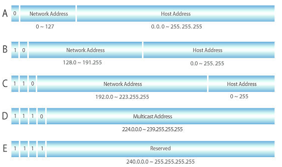

## IP 주소 클래스

클래스 : 하나의 IP 주소에서 네트워크영역과 호스트영역을 나누는 약속.  ( A, B, C ,D, E 클래스 총 5개가 있지만 보통 3개의 클래스만 알고있어도 된다. )

- A 클래스 

  ​	호스트의 수가 가장 많은 클래스로서,  IP주소를 2진수로 표현할 경우 `0` 으로 시작하는 경우

  ​    범위 : 0.0.0.0 ~ 127.255.255.255 (모두 0인 경우 - 네트워크 주소 / 모두 1인 경우 - 브로드캐스트 주소)

- B 클래스

  ​    IP주소를 2진수로 표현할 경우 10 으로 시작. 

  ​    범위 : 128.0.0.0 ~ 191.255.255.255 (모두 0 - 네트워크 주소 / 모두 1 - 브로드캐스트 주소)

- C 클래스 

  ​	IP주소를 2진수로 표현할 경우 `110` 으로 시작. 

  ​	범위 : 192.0.0.0 ~ 223.255.255.255 (모두 0 - 네트워크 주소 / 모두 1 - 브로드캐스트 주소)

