# 색상과 배경 


## 7-1 웹에서 색상 표현하기 

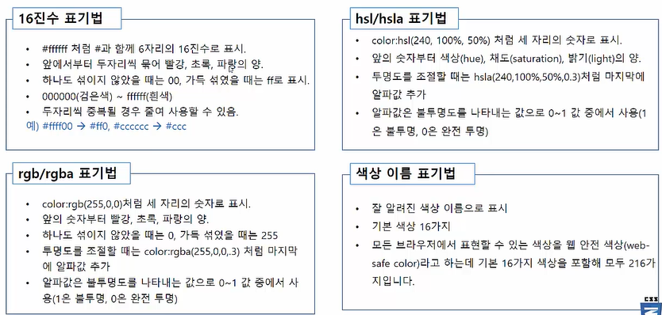

- 16진수 표기법을 주로 사용. ( 두자리씩 중복될 경우 하나로 줄여 사용할 수 있다. )


## 7-2 배경 색과 배경 이미지 

### `background-color`  속성 

- 웹 문서의 요소에 배경색 지정 

- ex ) 웹 문서 전체의 지정하려면 body 요소에 사용 

- 16진수나 rgb값, rgba 값 또는 색상 이름 사용 

  - ```css
    background-color : #00ff00; 
    background-color : rgb(0,255,0);  /*필요하면 투명도도 함께 조절 가능*/
    background-color : green;  
    ```

- 배경 색은 상속되지 않는다. 

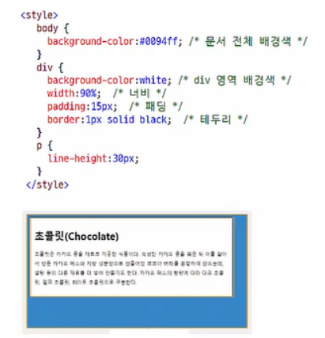


### `background-clip` 속성 

- 배경을 어디까지 적용할지 지정 

- 박스 모델 기준 

- ```css
  background-clip : border-box | padding-box | content-box
  ```

| 속성 값     | 설명                                                  |
| ----------- | ----------------------------------------------------- |
| border-box  | 박스 모델의 가장 외곽인 테두리(border)까지 적용       |
| padding-box | 박스 모델에서 테두리를 뺀 패딩(padding) 범위까지 적용 |
| content-box | 박스 모델에서 내용 부분에만 적용                      |

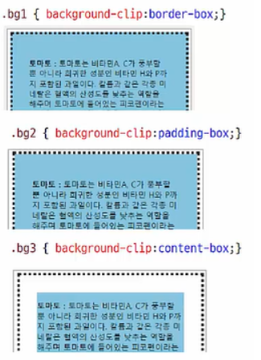


### `background-image` 속성 

- 배경 이미지 지정하기 

- 배경 이미지 파일 경로 지정 

- ```css
  background-image : url(파일 경로)
  ```

- 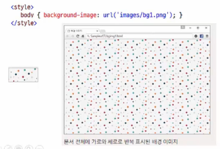


### `background-repeat` 속성 

- 배경 이미지 반복 여부 및 반복 방향 지정 

- ```css
  background-repeat : repeat | repeat-x | repeat-y | no-repeat 
  ```

| 속성 값   | 설명                                                         |
| --------- | ------------------------------------------------------------ |
| repeat    | 브라우저 화면에 가득 찰 때까지 배경 이미지를 가로와 세로로 반복 |
| repeat-x  | 브라우저 창 너비와 같아질때까지 배경 이미지를 가로로 반복    |
| repeat-y  | 브라우저 창 높이와 같아질때까지 배경 이미지를 세로로 반복    |
| no-repeat | 배경 이미지를 한 번만 표시하고 반복하지 않는다.              |

- 이미지 크기에 관계없이 배경을 계속 채운다. 


### `background-position` 속성 

- 배경 이미지를 반복하지 않을 경우, 배경 이미지를 표시할 위치 지정 

- ```css
  background-position : <수평위치> <수직위치> ; 
  수평위치 : left | center | right | <백분율> | <길이값>
  수직위치 : top | center | bottom | <백분율> | <길이값>
  ```

  - 백분율 : 배경 이미지의 가로위치와 세로 위치를 `%` 로 나타냄. 

    ```css
    background-position : 0% 0%,    background-position : 30% 60%
    ```

  - 길이 : 배경 이미지의 위치를 직접 길이로 지정 

    ```css
    background-position : 30px 30px
    ```

  - 키워드 : top, left, center, right, top, middle, bottom 

    가로배치는 left, center, top 중에서 선택

    세로배치는 top, bottom, center 중에서 선택

    ```css
    background-position : left bottom 
    ```

    

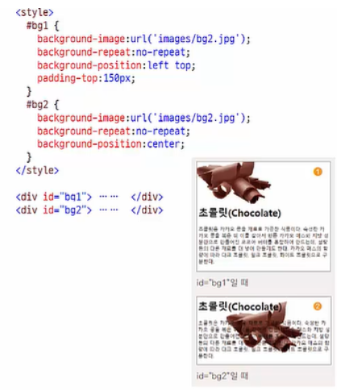

- 백분율이나 숫자값을 쓸 때에는 left, center 과 같은 위치를 먼저 쓰고 써야한다. 


### `background-attachment` 속성 

- 배경 이미지를 고정하는 속성 

- ```css
  background-attachment : scroll | fixed 
  ```

- | 속성   | 설명                                                         |
  | ------ | ------------------------------------------------------------ |
  | scroll | 화면 스크롤과 함께 배경 이미지도 스크롤됩니다. 기본 값입니다. |
  | fixed  | 화면이 스크롤되더라도 배경 이미지는 고정된다.                |

  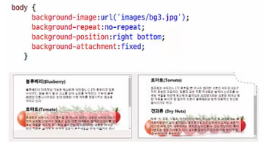

- 스크롤시에 배경 이미지가 딸려서 이동하지 않고 부착시키는 것. 


### `background` 속성 

- 배경 관련 속성을 줄여서 표기 

- 각 속성 값이 다르므르 표기 순서는 상관 없음 

- ```css
  background : url('images/bg3.jpg') no-repeat fixed right bottom; 
  ```

| 속성                  | 속성값                |
| --------------------- | --------------------- |
| background-images     | url('images/bg3.jpg') |
| background-repeat     | no-repeat             |
| background-attachment | fixed                 |
| background-position   | right bottom          |
| background-clip       | border-box            |
| background-origin     | padding-box           |
| background-size       | auto                  |


## 7-3 그라데이션 효과로 배경 꾸미기 

### 그라데이션과 브라우저 접두사 

- 그러데이션은 크기가 없는 배경이미지이므로, background-image 나 background 속성에서 사용. 
- 그러데이션 속성은 표준화 됨. 
- 하지만 구형 모던 브라우저에서는 브라우저 접두사를 붙여야 동작한다. 

| 접두사   | 브라우저 버전      |
| -------- | ------------------ |
| -webkit- | 사파리5.1~6.0      |
| -moz-    | 파이어폭스 3.6~15  |
| -o-      | 오페라 11.1 ~ 12.0 |

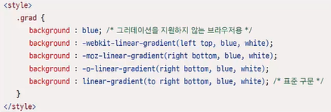


### 선형 그러데이션 

- 수직 방향이나 수평 방향으로, 혹은 대각선 방향으로 색상이 일정하게 변하는 것
- 선형 그러데이션을 지정할 때는 방향과 색상이 필요하다.

- 방향이 중요하다.  그 다음은 색상이 중요하다. 

- ```css
  linear-gradient( <각도> to <방향>, color-stop, [color-stop, ...]);
  ```

- 위 구문이 표준 구문이지만 '위치' 와 '각도' 를 표시하는 방법이 중간에 몇 번 바뀌다보니 브라우저별, 버전별 사용법이 조금씩 다르다. 


####	**1. 방향**

- [표준 구문] 끝 지점을 기준으로 'to' 키워드와 함께 사용 

| 속성 값   | 설명                            |
| --------- | ------------------------------- |
| to top    | 아래에서 시작해 위로 그라데이션 |
| to left   | 오른쪽 -> 왼쪽                  |
| to right  | 왼쪽 -> 오른쪽                  |
| to bottom | 위 -> 아래                      |

- [접두사 구문] 예전 모던 브라우저에서는 접두사를 사용해야하는데, 접두사마다 방향 속성 값을 사용하는 기준이 다름 

| 접두사   | 브라우저 버전      | '위치' 속성 값                  |
| -------- | ------------------ | ------------------------------- |
| -webkit- | 사파리5.1~6.0      | 그러데이션 시작 위치 기준       |
| -moz-    | 파이어폭스 3.6~15  | 끝 위치 기준.  키워드 to 사용 x |
| -o-      | 오페라 11.1 ~ 12.0 | 끝 위치 기준. 키워드 to 사용 x  |

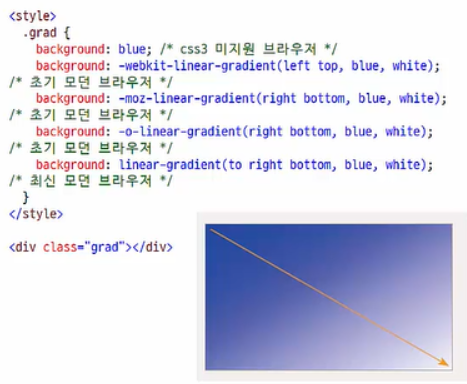

####  2. 각도

- 그러데이션이 끝나는 각도 
- 단위는 deg
- 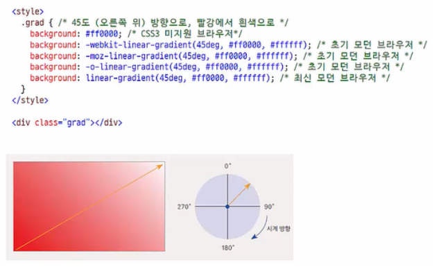

- 끝나는 각도를 기준으로 잡아준다. 


#### 3. 색상 중지점

- 색상이 바뀌는 지점
- 색상만 지정할 수도 있고, 색상과 함께 중지점의 위치도 함께 지정할 수도 있음 
- 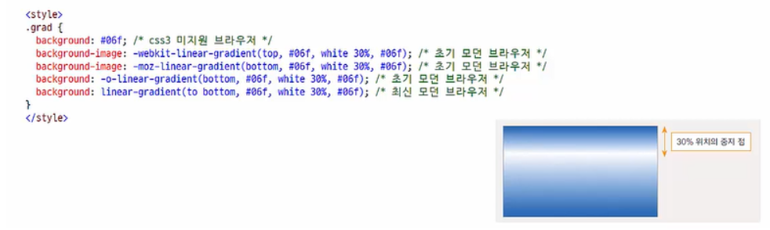

### 원형 그러데이션 

- 원이나 타원의 중심부터 동심원을 그리며 바깥 방향으로 색상이 바뀌는 그러데이션 

- 색상이 바뀌기 시작하는 원의 중심과 크기를 지정하고 그러데이션의 모양을 지정해야 함.

- ```css
  radial-gradient( <최종모양> <크기> at <위치>, color-stop, [color-stop, ...])
  ```


#### 1. 모양

- 원형 그러데이션에서 만들어지는 모양은 circle 과 ellipse(타원)
- 따로 지정하지 않으면 ellipse 로 인식 

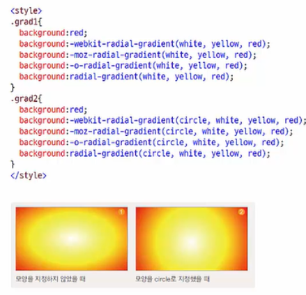


#### 2. 위치 

- 그러데이션이 시작하는 원의 중심 지정 
- [표준 구문] '모양'과 '크기' 속성 다음에 at 키워드와 함께 위치 값 지정 
- [접두사 구문] at 키워드 없이 구문의 맨 앞에 위치 값 지정 
- 사용할 수 있는 값 : 키워드 (left, center, right 중 하나, top, center, bottom 중 하나) 또는 백분율

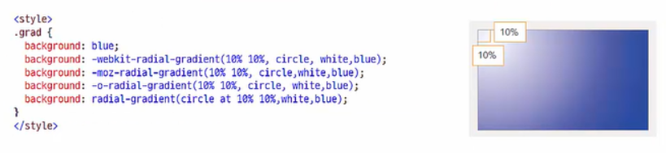

- 백분율 값은 왼쪽 구석부터 시작해서 퍼센트 만큼의 거리. 


#### 3. 크기 

- 그러데이션 원의 크기 지정 

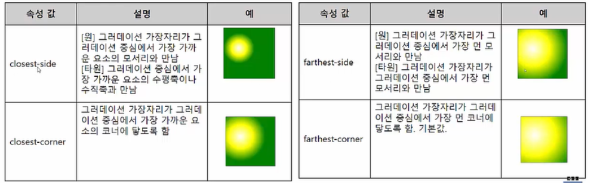

 

#### 4. 색상 중지점 

- 색상이 바뀌는 지점 
- 색상만 지정할 수도 있고 색상과 함께 중지 점의 위치도 함께 지정할 수도 있음. 
- 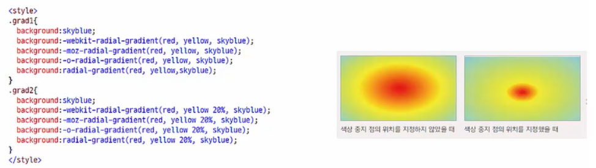

- 검색엔진에서 css 그라데이션 generator 이 있다. 검색해서 사용 


### 그러데이션 반복 

- 단순히 그러데이션을 반복하는 것이 아니라 '패턴'을 만들어서 반복 

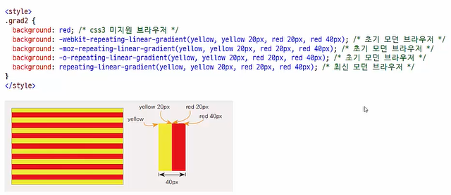