## 8-1 CSS와 박스 모델 

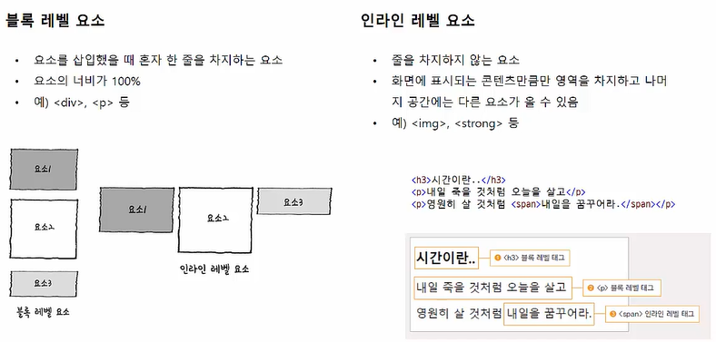

- 블록 레벨 요소는 삽입했을 때 혼자 한 줄을 차지하는 요소 

- `` 은 인라인 레벨 요소. ( 자기가 필요한 만큼만 사용 )

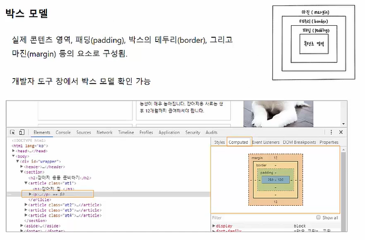

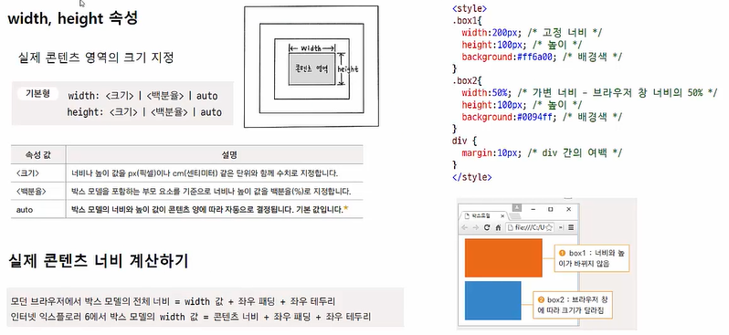

- 너비값을 `%` 로 할 경우 부모 요소의 크기에 영향을 받는다. 

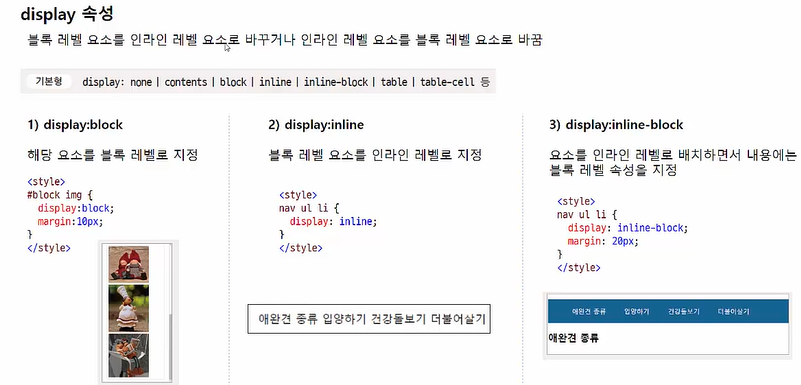

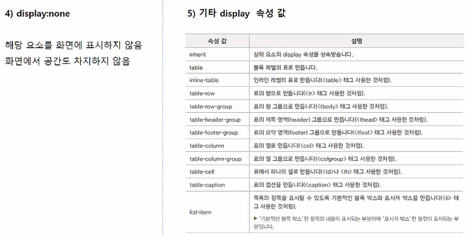

## 8-2 테두리 관련 속성들 

### border-style 속성 

- 기본 값이 none -> 화면에 테두리 표시 안됨. 
- 테두리를 그리기 위해서는 맨 먼저 테두리 스타일부터 지정해야 함. 

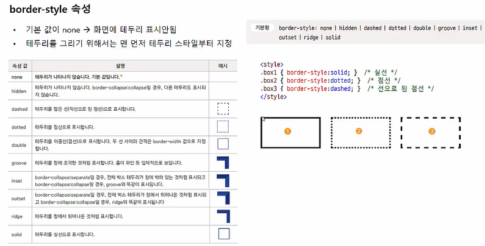

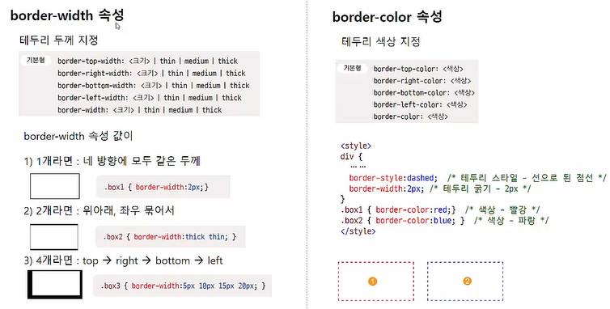

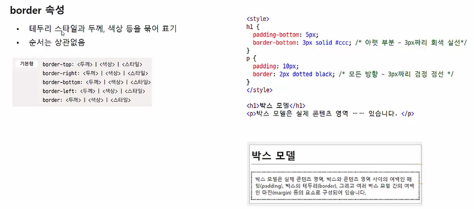

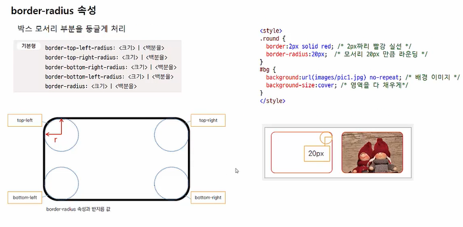

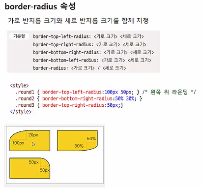

- 가로반지름을 먼저 쓰고 그 이후에 세로 반지름을 써야한다. 

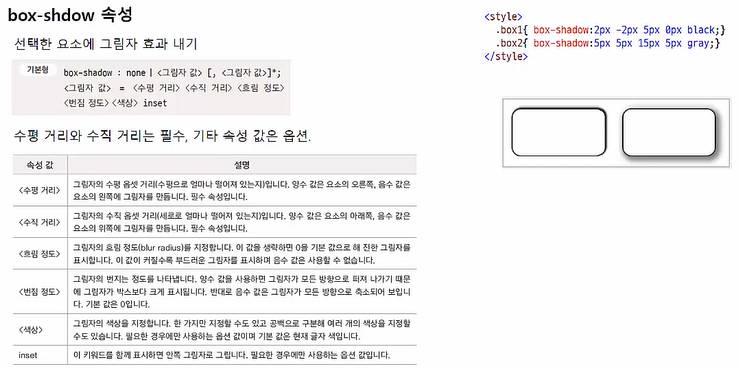

## 8-3 여백을 조절하는 속성들 

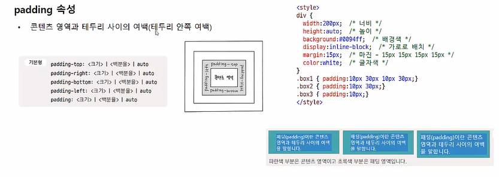

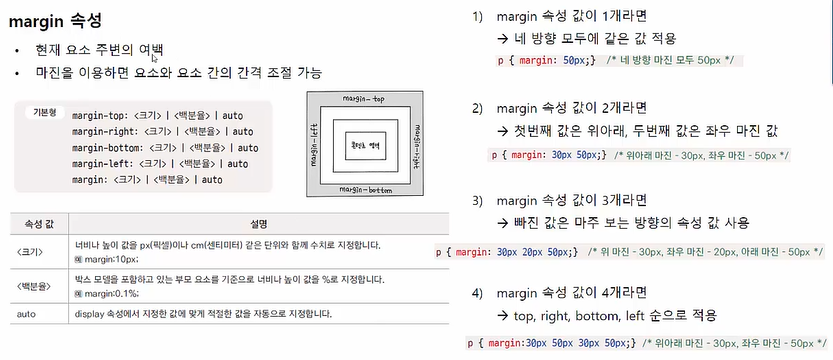