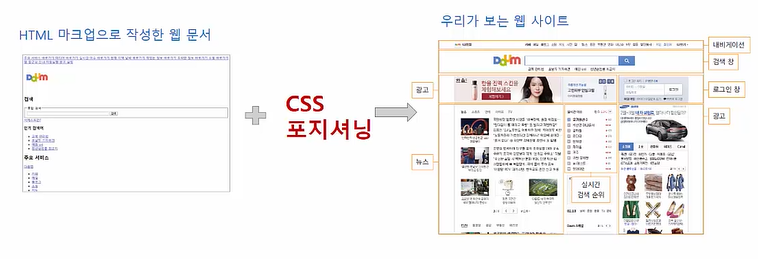
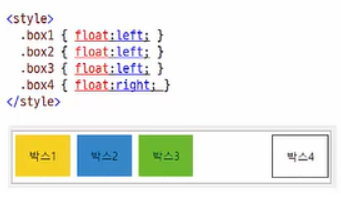
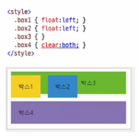
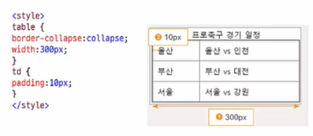

## 9-1 CSS 포지셔닝과 주요 속성들 

### CSS 포지셔닝이란 

- CSS를 웹 문서 요소를 적절히 배치하는 것. 



### `box-sizing` 속성 

- 박스 모델의 너비 값 기준 지정 

- ```css
  box-sizing : content-box | border-box 
  ```

| 속성 값     | 설명                                                         |
| ----------- | ------------------------------------------------------------ |
| content-box | width 속성 값을 콘텐츠 영역 너비 값으로 사용한다. 기본 값이다. |
| border-box  | width 속성 값을 콘텐츠 영역의 테두리까지 포함한 박스 모델 전체 너비 값으로 사용한다 . |


- 콘텐츠 너비와 패딩, 테두리 값까지 고려 해야한다. -> border-box 일 경우 박스 크기를 전체를 포함해서 계산. 


### `float` 속성 

- 요소를 왼쪽이나 오른쪽에 떠 있게 만듬 

- ```css
  float : left | right | none 
  ```

| 속성 값 | 설명                               |
| ------- | ---------------------------------- |
| left    | 해당 요소를 문서의 왼쪽으로 배치   |
| right   | 해당 요소를 문서의 오른쪽으로 배치 |
| none    | 좌우 어느쪽으로도 배치하지 않는다. |




### `clear 속성 ` 

- float 속성을 무효화 시키는 속성 

- ```css
  clear: none | left | right | both S
  ```



### `position` 속성 

- 웹 문서 안에 요소들을 배치하기 위한 속성 

- ```css
  position : static | relative | absolute | fixed 
  ```

| 속성 값  | 설명                                                         |
| -------- | ------------------------------------------------------------ |
| static   | 요소를 문서의 흐름에 맞추어 배치한다.                        |
| relative | 이전 요소에 자연스럽게 연결해 배치하되 위치를 지정할 수 있다 |
| absolute | 원하는 위치를 지정해 배치                                    |
| fixed    | 지정한 위치에 고정해 배치한다. 화면에서 요소가 잘릴 수도 있다 . |


#### 1. static 

- 문서의 흐름대로 배치한다. 
- left 속성이나 top 속성을 지정할 수 없다. 


#### 2. relative 

- 자연스럽게 배치 
- 고정되어 있지 않고 다른 요소에 의해 바뀔 수 있다. 
- 상대적인 위치를 사용하기 때문에 다른 요소와 조화를 이룬다. 
- left 나 top 속성을 이용해 요소의 위치를 옮길 수도 있다. 


#### 3. absolute 

- 문서의 흐름과는 상관없이 원하는 위치에 요소를 배치 
- 요소의 위치는 가장 가까운 부모 요소나 조상 요소 중 `position:relative` 인 요소 
- left, top, right, bottom 속성을 사용해 네 모서리에서 얼마나 떨어져있는지 지정 


- absolulte 를 사용하기 위해선 부모 요소나 조상 요소 중 position:relative 인 요소가 있어야 사용이 가능하다.  


#### 4. fixed 

- 문서의 흐름과는 상관없이 원하는 위치에 요소를 배치 

- 부모 요소가 아닌 브라우저 창 기준 

  -> 브라우저 창 왼쪽 위 꼭지점(0,0) 기준으로 좌표 계산

- 브라우저 창 화면을 스크롤하더라도 계속 같은 위치에 고정 


- 브라우저 창을 기준으로 해서 좌표값을 계산 


### `visibility` 속성 

- 특정 요소를 화면에 보이거나 보이지 않게 설정하는 속성 

- ```css
  visibility : visible | hidden | collapse 
  ```

| 속성 값  | 설명                                                         |
| -------- | ------------------------------------------------------------ |
| visible  | 화면에 요소를 표시한다. 기본값                               |
| hidden   | 화면에서 요소를 감춥니다. 하지만 크기는 그대로 유지하기 때문에 배치에 영향을 미친다. |
| collapse | 표의 행, 열, 행그룹, 열 그룹 등에서 지정하면 서로 겹치도록 조절한다. 그 외의 영역에서 사용하면 'hidden' 처럼 처리한다. |


### `z-index` 속성 

- 요소 쌓는 순서 정하기 
- z-index 값이 크면 값이 작은 요소보다 위에 쌓인다. 
- z-index 값을 명시하지 않으면 1부터 시작해서 1씩 커진다. 

- z-index 를 설정하지 않을 경우, 소스의 순서대로 쌓인다. z-index 는 애니메이션 효과를 만들 때 유용하게 사용될 수 있다. 


## 9-2 다단으로 편집하기 


### `column-width`

- 단의 너비를 고정해 놓고 화면 분할 

- 화면이 커지면 단의 개수가 많아진다.

- ```css
  column-width : <크기> | auto
  ```

  

### `column-count` 

- 단의 개수를 먼저 정해놓고 화면 분할 

- 화면이 커질수록 단의 너비가 넓어진다

- ```css
  column-count : <숫자> | auto 
  ```

- `column-rule` 속성을 이용하면 단을 나누는 선을 표시할 수도 있다. 

  ```css
  column-rule : 2px dotted #ccc; 
  ```


### 다단 위치 지정 

- 특정 요소의 앞이나 뒤 ( 주로 인쇄 목적 ) 
  - `break-before:column`
  - `break-before:avoid-column`
  - `break-after:column`
  - `bread-after:avoid-column`


### column-span

- 여러 단을 하나로 합치기 

- ```css
  column-span : 1 | all
  ```

| 속성 값 | 설명                                                      |
| ------- | --------------------------------------------------------- |
| 1       | 단을 하나만 합치는 것이므로 합치지 않는 것과 동일, 기본값 |
| all     | 전체 단을 하나로 합쳐 표현. 단의 일부만 합칠 수는 없다.   |


## 9-3 표 스타일 


### `caption-side` 

- 캡션(설명글)은 기본으로 표 위쪽에 표시

- 속성을 이용해 아래쪽에 표시 가능 

- ```css
  caption-side : top | bottom 
  ```


### `border`

- 표의 바깥 테두리와 셀 테두리 모두 지정해야 한다. 


### `border-collapse` 

- 표 테두리와 셀 테투리를 합칠 것인지 설정 

- ```css
  border-collapse : collapse | separate
  ```

| 속성 값  | 설명                        |
| -------- | --------------------------- |
| collapse | 테두리를 하나로 합쳐 표시   |
| separate | 테두리를 따로 표시. 기본 값 |


### `border-spacing` 

- `border-collapse:separate` 를 사용해 셀들을 분리했을 경우, 인접한 셀 테두리 사이의 거리를 지정 

- 값이 1개 : 수평 거리 & 수직 거리를 같게 

- 값이 2개 : 첫번째 값은 수평거리, 두번째 값은 수직 거리 

- ```css
  border-spacing : <크기>
  ```


### empty-cell

- `border-collapse:separate` 를 사용해 셀들을 분리했을 경우, 내용이 없는 빈 셀들의 표시 여부를 지정 

- ```css
  empty-cells : show | hide
  ```


### `width` , `height` 

- 너비나 높이를 지정하지 않으면 셀 안의 내용이 표시될 만큼만 표시된다. 
- width 값을 지정할 경우 padding 속성을 이용해 여백을 넣어주면 보기 좋게 꾸밀 수 있다. 




### `table-layout` 

- 셀 안의 내용 양에 따라 셀 너비를 변하게 할지, 고정시킬지 결정 

- ```css
  table-layout : fixed | auto
  ```

| 속성 값 | 설명                                              |
| ------- | ------------------------------------------------- |
| fixed   | 셀 너비를 고정한다.                               |
| auto    | 셀 내용에 따라 셀의 너비가 달라진다. 기본 값이다. |


### `text-align` 

- 셀 안에서의 수평 정렬 방법

- ```css
  text-align : left | right | center 
  ```


### `vertical-align` 

- 셀 안에서의 수직 정렬 방법 

- ```css
  vertical-align : top | bottom | middle
  ```

| 속성 값 | 설명                                             |
| ------- | ------------------------------------------------ |
| top     | 위쪽 패딩 가장자리에 내용의 윗부분을 맞춥니다    |
| bottom  | 아래쪽 패딩 가장자리에 내용의 아랫부분을 맞춘다. |
| middle  | 패딩의 중앙에 내용의 중앙을 맞춘다.              |


