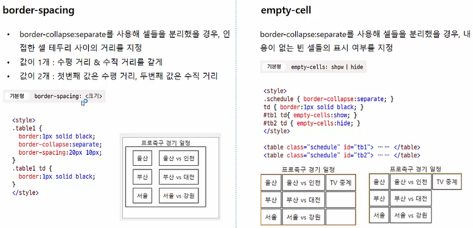

## 9-1 CSS 포지셔닝과 주요 속성들 

### CSS 포지셔닝이란 

- CSS를 웹 문서 요소를 적절히 배치하는 것. 


- 콘텐츠 너비와 패딩, 테두리 값까지 고려 해야한다. -> border-box 일 경우 박스 크기를 전체를 포함해서 계산. 


- absolulte 를 사용하기 위해선 부모 요소나 조상 요소 중 position:relative 인 요소가 있어야 사용이 가능하다.  


- 브라우저 창을 기준으로 해서 좌표값을 계산 


- z-index 를 설정하지 않을 경우, 소스의 순서대로 쌓인다. z-index 는 애니메이션 효과를 만들 때 유용하게 사용될 수 있다. 


## 9-2 다단으로 편집하기 


- `column-rule` 속성을 이용하면 단을 나누는 선을 표시할 수도 있다. 

  ```css
  column-rule : 2px dotted #ccc; 
  ```

  


## 9-3 표 스타일 





