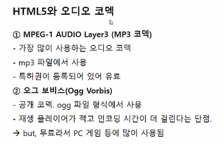
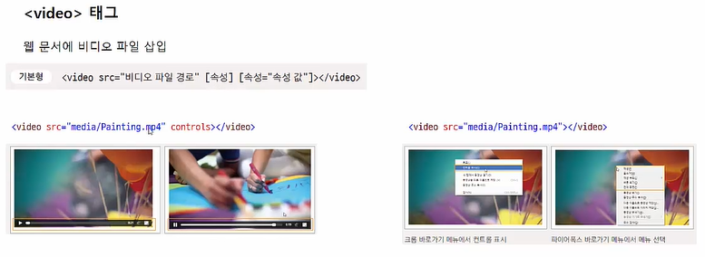

## 11-1 웹과 멀티미디어 

- HTML5 이전에는 플러그인을 사용해야만 오디오나 영상을 재생할 수 있었다. 

- HTML5 등장 이후에는 `<object>` 태그나 `<embed>` 태그는 거의 사용되지 않는다. 

- 코덱 : 인코딩과 디코딩을 수행해주는 명령 프로그램. 
- 오그 테오라는 무료이지만, 화질이 좀 떨어진다 -> 개선된 것이 v8, v9 (무료이면서 화질 좋다.)

## 11-2 오디오 & 비디오 재생하기 

- 웹 브라우저의 영상 플레이어가 통일되어있지 않기 때문에 mp4, webm, ogv 파일 형식에 대한 모든 처리를 `<source >` 안에서 해줘야한다. 

- 마이크로 소프트 - HTML5 Video Caption Maker : 비디오의 자막을 만드는 프로그램 ( .vtt 파일을 만들 수 있다. )