# 다재다능한 CSS3 선택자 


## 12-1 연결 선택자 

- 선택자와 선택자를 연결해 적용 대상을 한정하는 선택자. 
- '컴비네이션 선택자' 또는 '조합 선택자' 라고 한다. 


### 하위 선택자

- ```css
  상위요소 하위요소 { } 
  ```

- 부모 요소에 포함된 모든 하위 요소에 스타일이 적용된다. 

- 자식 요소 뿐만 아니라 손자 요소, 손자의 손자 요소 등 **모든 하위 요소**까지 적용 

- 하위 선택자를 정의할 때는 상위 요소와 하위 요소를 나란히 쓴다. 

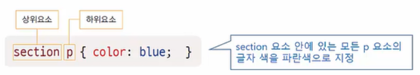

```html
<!DOCTYPE html>
<html>
	<head>
		<meta charset="utf-8">
		<title>id 선택자</title>
		<style>
			#container ul {
				border : 1px dotted blue;
			}
		</style>
	</head>
	<body>
		<section id="container">
			<header><h1>예약 방법 및 요금</h1></header>
			<p> 요안 도라에 예약하려면 ? 
			<ul>
				<li>예약방법
                    <ul>
                        <li>직접 통화</li>
                        <li>문자 남기기</li>
                    </ul>
				</li>
				<li>요금	
					<ul>
						<li> 1인 : 40,000원 </li>
						<li> 2인 : 60,000원 </li>
						<li> 3인 : 80,000원 </li>
						<li> 4인 : 100,000원 </li>
					</ul>
				</li>
			</ul>
		</section>
	</body>
</html>
```

​													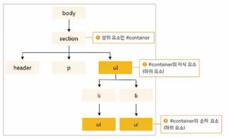

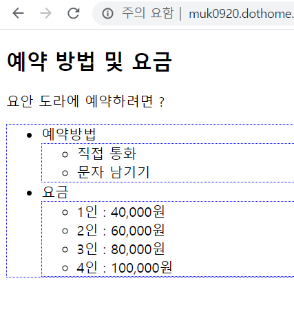

### 자식 선택자 

- ```css
  부모요소 > 자식요소 { }
  ```

- 자식 요소에 스타일을 적용하는 선택자 

- 두 요소 사이에 `>` 를 표시해 부모 요소와 자식 요소를 구분 

- 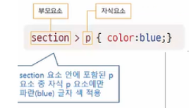

```html
<style>
    #container > ul {
        border : 1px dotted blue;
    }
</style>
```

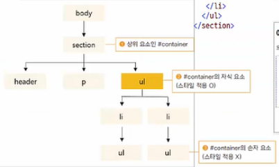

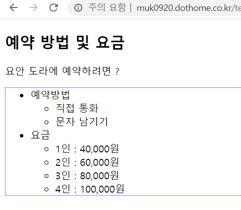


### 인접 형제 선택자 

- ```css
  요소 1 + 요소 2 { }
  ```

- 같은 부모를 가진 형제 요소 중 **첫 번째 동생 요소에만** 스타일 적용 

- 요소1과 요소2는 같은 레벨이면서 요소1 이후 맨 먼저 오는 요소2에 스타일을 적용. 


```html
<!DOCTYPE html>
<html>
	<head>
		<meta charset="utf-8">
		<title>id 선택자</title>
		<style>
			h1 + ul {
				color : blue; 
				font-weight : bold; 
			}
		</style>
	</head>
	<body>
		<section id="container">
			<h1>예약 방법 및 요금</h1> 
			<ul>
				<li>직접 통화</li>
				<li>문자 남기기</li>
			</ul>	
			<ul>
				<li> 1인 : 40,000원 </li>
				<li> 2인 : 60,000원 </li>
				<li> 3인 : 80,000원 </li>
				<li> 4인 : 100,000원 </li>
			</ul>
		</section>
	</body>
</html>
```

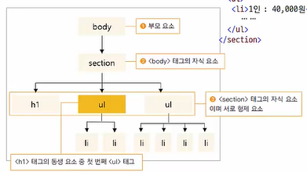

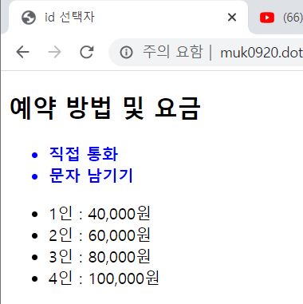

- 모든 형제일 경우 `~` 사용. 

  ```html
  <style>
      h1 ~ ul {
          color : blue; 
          font-weight : bold; 
      }
  </style>
  ```

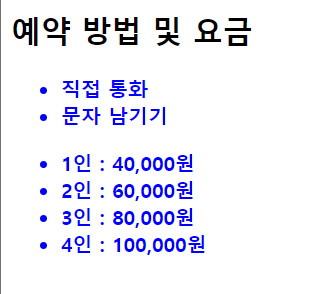


## 12-2 속성 선택자 

: 속성의 값에 따라 특정 부분에만 스타일 적용

### [속성] 선택자

- 지정한 속성을 가진 요소를 찾아 스타일 적용 

```html
<!DOCTYPE html>
<html>
	<head>
		<meta charset="utf-8">
		<title>id 선택자</title>
		<style>
			a[href] {
				background:yellow; 
				text-decoration : none; 		
			}
		</style>
	</head>
	<body>
		<ul>
			<li> <a>메인 메뉴 : </a> </li>
			<li> <a href="#">메뉴 1</a></li>
			<li> <a href="#">메뉴 2</a></li>
			<li> <a href="#">메뉴 3</a></li>
			<li> <a href="#">메뉴 4</a></li>									
		</ul>
	</body>
</html>
```

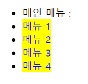


### [속성 = 값] 선택자 

- 주어진 속성과 속성 값이 일치하는 요소를 찾아 스타일 적용 

```html
<!DOCTYPE html>
<html>
	<head>
		<meta charset="utf-8">
		<title>id 선택자</title>
		<style>
			body ul li a{
				text-decoration : none; 
			}
			
			a[target="_blank"]{
				padding-right : 30px; 
				color : red; 
				text-decoration : underline;
			}
		</style>
	</head>
	<body>
		<h1> HTML 표준안 사이트 </h1>
		<ul>
			<li><a href="http://www.w3c.org/TR/html" target="_blank">HTML</a></li>
			<li><a href="##">CSS Selector Level</a></li>
			<li><a href="###">미디어 쿼리</a></li>
		</ul>
	</body>
</html>
```

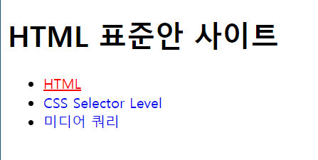


### [속성 ~= 값] 선택자

- 여러 속성 값 중에 해당 값이 포함되어 있는 요소를 찾아 스타일 적용 
- 하이픈으로 이어진 값에는 적용 x 

```html
<!DOCTYPE html>
<html>
	<head>
		<meta charset="utf-8">
		<title>id 선택자</title>
		<style>
			[class ~= "button"]{
				border : 2px solid black; 
				box-shadow : rgba(0,0,0,0.4) 5px 5px; 
			}
		</style>
	</head>
	<body>
		<h1> HTML 표준안 사이트 </h1>
		<ul>
			<li><a href="#">메뉴1</a></li>
			<li><a href="#">메뉴2</a></li>
			<li><a href="#" class="button">메뉴 3</a></li>
			<li><a href="#" class="flat button">메뉴4</a></li>
			<li><a href="#" class="flabutton">메뉴5</a></li>
			<li><a href="#" class="flat-button">메뉴6</a></li>
			<li><a href="#" class="button-flat">메뉴7</a></li>			
		</ul>
	</body>
</html>
```

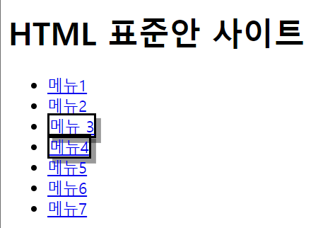


### [속성 |= 값] 선택자 

- 특정 값이 포함된 속성을 가진 요소를 찾아 스타일 적용 
- 하이픈으로 연결해 한 단어 값을 이루는 요소에도 적용 (특정 단어 뒤에 하이픈 와야 적용)
- 지정하는 것은 '한 단어' 이어야 한다. 

```html
<!DOCTYPE html>
<html>
	<head>
		<meta charset="utf-8">
		<title>id 선택자</title>
		<style>
			[class |= "button"]{
				border : 2px solid black; 
				box-shadow : rgba(0,0,0,0.4) 5px 5px; 
			}
		</style>
	</head>
	<body>
		<h1> HTML 표준안 사이트 </h1>
		<ul>
			<li><a href="#">메뉴1</a></li>
			<li><a href="#">메뉴2</a></li>
			<li><a href="#" class="button">메뉴 3</a></li>
			<li><a href="#" class="flat button">메뉴4</a></li>
			<li><a href="#" class="flabutton">메뉴5</a></li>
			<li><a href="#" class="fla-button">메뉴6</a></li>	
			<li><a href="#" class="button-fla">메뉴7</a></li>			
		</ul>
	</body>
</html>
```

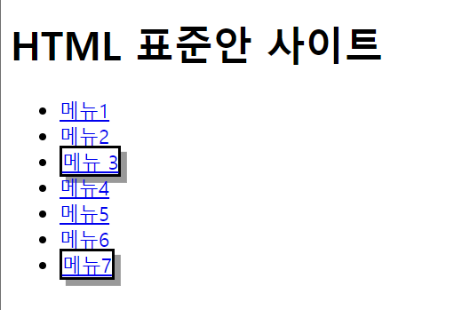


### [속성^=값] 선택자

- **특정 값으로 시작**하는 속성을 가진 요소를 찾아 스타일 적용 

```html
<!DOCTYPE html>
<html>
	<head>
		<meta charset="utf-8">
		<title>id 선택자</title>
		<style>
			[class ^= "bu"]{
				border : 2px solid black; 
				box-shadow : rgba(0,0,0,0.4) 5px 5px; 
			}
		</style>
	</head>
	<body>
		<h1> HTML 표준안 사이트 </h1>
		<ul>
			<li><a href="#">메뉴1</a></li>
			<li><a href="#">메뉴2</a></li>
			<li><a href="#" class="button">메뉴 3</a></li>
			<li><a href="#" class="flat button">메뉴4</a></li>
			<li><a href="#" class="flabutton">메뉴5</a></li>
			<li><a href="#" class="botton">메뉴6</a></li>	
			<li><a href="#" class="button-fla">메뉴7</a></li>			
		</ul>
	</body>
</html>
```


### [속성 $= 값] 선택자 

- **특정 값으로 끝나는** 속성을 가진 요소를 찾아 스타일 적용

```html
<!DOCTYPE html>
<html>
	<head>
		<meta charset="utf-8">
		<title>id 선택자</title>
		<style>
			[class $= "la"]{
				border : 2px solid black; 
				box-shadow : rgba(0,0,0,0.4) 5px 5px; 
			}
		</style>
	</head>
	<body>
		<h1> HTML 표준안 사이트 </h1>
		<ul>
			<li><a href="#">메뉴1</a></li>
			<li><a href="#">메뉴2</a></li>
			<li><a href="#" class="button">메뉴 3</a></li>
			<li><a href="#" class="flat button">메뉴4</a></li>
			<li><a href="#" class="flabutton">메뉴5</a></li>
			<li><a href="#" class="botton">메뉴6</a></li>	
			<li><a href="#" class="button-fla">메뉴7</a></li>			
		</ul>
	</body>
</html>
```

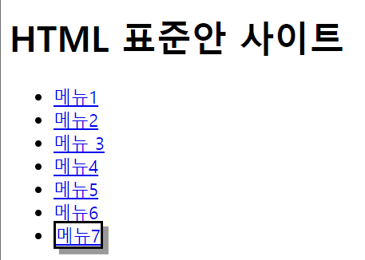


### [속성 *= 값] 선택자 

- 값의 일부가 일치하는 속성을 가진 요소를 찾아 스타일 적용 

```html
<!DOCTYPE html>
<html>
	<head>
		<meta charset="utf-8">
		<title>id 선택자</title>
		<style>
			[class *= "tt"]{
				border : 1px solid black; 
				box-shadow : rgba(0,0,0,0.4) 2px 2px; 
			}
		</style>
	</head>
	<body>
		<h1> HTML 표준안 사이트 </h1>
		<ul>
			<li><a href="#">메뉴1</a></li>
			<li><a href="#">메뉴2</a></li>
			<li><a href="#" class="button">메뉴 3</a></li>
			<li><a href="#" class="flat button">메뉴4</a></li>
			<li><a href="#" class="flabutton">메뉴5</a></li>
			<li><a href="#" class="botton">메뉴6</a></li>	
			<li><a href="#" class="button-fla">메뉴7</a></li>			
		</ul>
	</body>
</html>
```

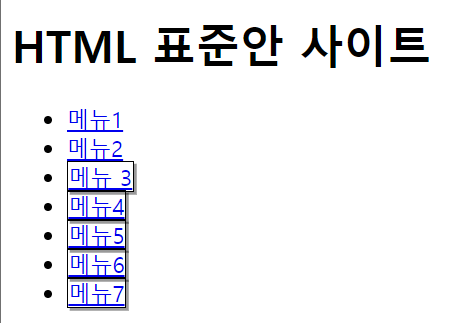


### 속성 선택자 표 

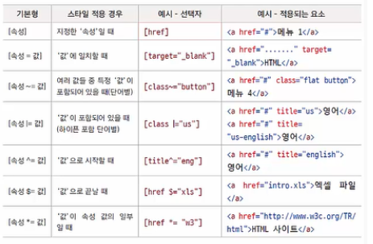


## 12-3 가상 클래스와 가상 요소 

- 마크업 상에 명시되어 있지는 않는 것들. 

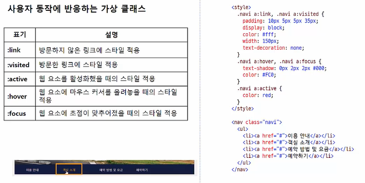

- active 는 클릭했을 경우. 
- focus 는 지체장애인등이 마우스를 이용하지 않고 tab 키를 통해서 판단할 때. 
- link - visited - active - hover - focus 이 순서를 꼭 지켜줘야한다. ( 지키지 않을 경우 스타일이 잘 적용되지 않을 수도 있다. )

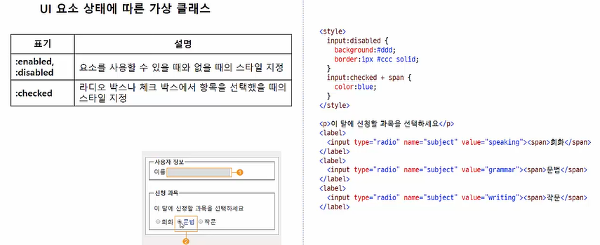


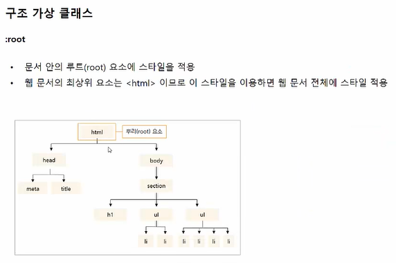

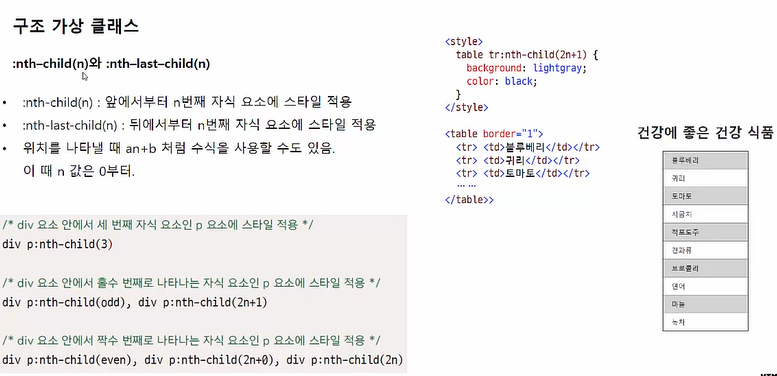


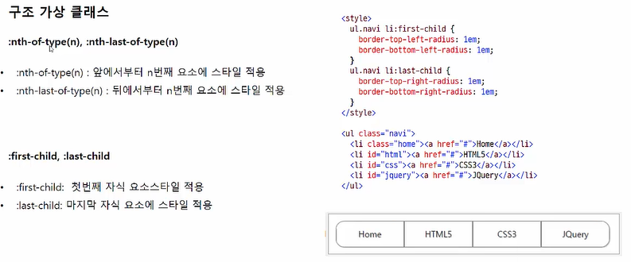


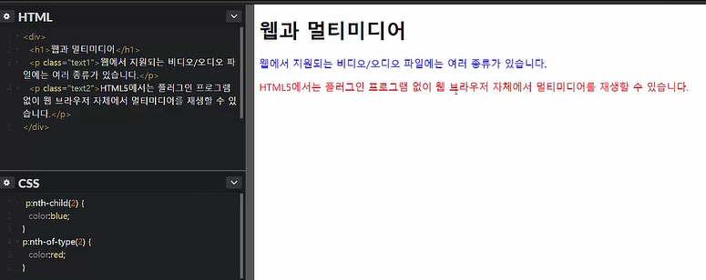


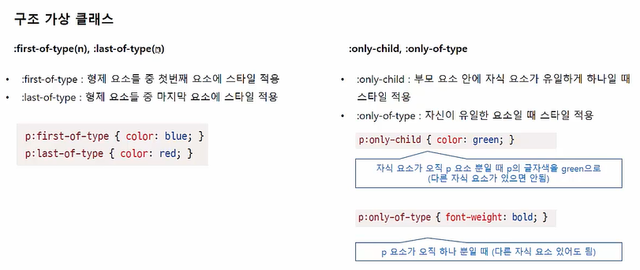

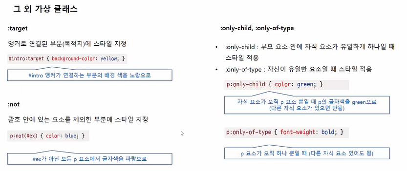

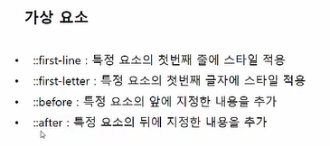

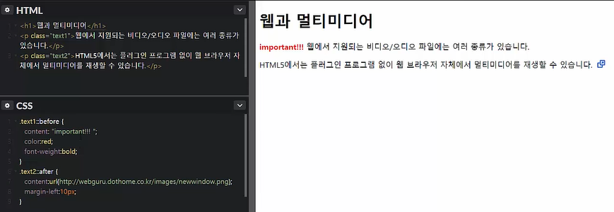