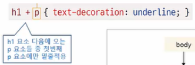
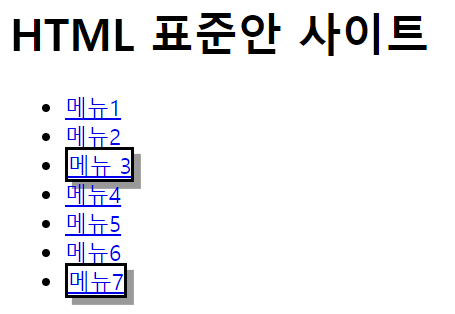

# 다재다능한 CSS3 선택자 


## 12-1 연결 선택자 

- 선택자와 선택자를 연결해 적용 대상을 한정하는 선택자. 
- '컴비네이션 선택자' 또는 '조합 선택자' 라고 한다. 


### 하위 선택자

- ```css
  상위요소 하위요소 { } 
  ```

- 부모 요소에 포함된 모든 하위 요소에 스타일이 적용된다. 

- 자식 요소 뿐만 아니라 손자 요소, 손자의 손자 요소 등 **모든 하위 요소**까지 적용 

- 하위 선택자를 정의할 때는 상위 요소와 하위 요소를 나란히 쓴다. 


```html
<!DOCTYPE html>
<html>
	<head>
		<meta charset="utf-8">
		<title>id 선택자</title>
		<style>
			#container ul {
				border : 1px dotted blue;
			}
		</style>
	</head>
	<body>
		<section id="container">
			<header><h1>예약 방법 및 요금</h1></header>
			<p> 요안 도라에 예약하려면 ? 
			<ul>
				<li>예약방법
                    <ul>
                        <li>직접 통화</li>
                        <li>문자 남기기</li>
                    </ul>
				</li>
				<li>요금	
					<ul>
						<li> 1인 : 40,000원 </li>
						<li> 2인 : 60,000원 </li>
						<li> 3인 : 80,000원 </li>
						<li> 4인 : 100,000원 </li>
					</ul>
				</li>
			</ul>
		</section>
	</body>
</html>
```

​													


### 자식 선택자 

- ```css
  부모요소 > 자식요소 { }
  ```

- 자식 요소에 스타일을 적용하는 선택자 

- 두 요소 사이에 `>` 를 표시해 부모 요소와 자식 요소를 구분 

- 

```html
<style>
    #container > ul {
        border : 1px dotted blue;
    }
</style>
```


### 인접 형제 선택자 

- ```css
  요소 1 + 요소 2 { }
  ```

- 같은 부모를 가진 형제 요소 중 **첫 번째 동생 요소에만** 스타일 적용 

- 요소1과 요소2는 같은 레벨이면서 요소1 이후 맨 먼저 오는 요소2에 스타일을 적용. 



```html
<!DOCTYPE html>
<html>
	<head>
		<meta charset="utf-8">
		<title>id 선택자</title>
		<style>
			h1 + ul {
				color : blue; 
				font-weight : bold; 
			}
		</style>
	</head>
	<body>
		<section id="container">
			<h1>예약 방법 및 요금</h1> 
			<ul>
				<li>직접 통화</li>
				<li>문자 남기기</li>
			</ul>	
			<ul>
				<li> 1인 : 40,000원 </li>
				<li> 2인 : 60,000원 </li>
				<li> 3인 : 80,000원 </li>
				<li> 4인 : 100,000원 </li>
			</ul>
		</section>
	</body>
</html>
```


- 모든 형제일 경우 `~` 사용. 

  ```html
  <style>
      h1 ~ ul {
          color : blue; 
          font-weight : bold; 
      }
  </style>
  ```


## 12-2 속성 선택자 

: 속성의 값에 따라 특정 부분에만 스타일 적용

### [속성] 선택자

- 지정한 속성을 가진 요소를 찾아 스타일 적용 

```html
<!DOCTYPE html>
<html>
	<head>
		<meta charset="utf-8">
		<title>id 선택자</title>
		<style>
			a[href] {
				background:yellow; 
				text-decoration : none; 		
			}
		</style>
	</head>
	<body>
		<ul>
			<li> <a>메인 메뉴 : </a> </li>
			<li> <a href="#">메뉴 1</a></li>
			<li> <a href="#">메뉴 2</a></li>
			<li> <a href="#">메뉴 3</a></li>
			<li> <a href="#">메뉴 4</a></li>									
		</ul>
	</body>
</html>
```


### [속성 = 값] 선택자 

- 주어진 속성과 속성 값이 일치하는 요소를 찾아 스타일 적용 

```html
<!DOCTYPE html>
<html>
	<head>
		<meta charset="utf-8">
		<title>id 선택자</title>
		<style>
			body ul li a{
				text-decoration : none; 
			}
			
			a[target="_blank"]{
				padding-right : 30px; 
				color : red; 
				text-decoration : underline;
			}
		</style>
	</head>
	<body>
		<h1> HTML 표준안 사이트 </h1>
		<ul>
			<li><a href="http://www.w3c.org/TR/html" target="_blank">HTML</a></li>
			<li><a href="##">CSS Selector Level</a></li>
			<li><a href="###">미디어 쿼리</a></li>
		</ul>
	</body>
</html>
```


### [속성 ~= 값] 선택자

- 여러 속성 값 중에 해당 값이 포함되어 있는 요소를 찾아 스타일 적용 
- 하이픈으로 이어진 값에는 적용 x 

```html
<!DOCTYPE html>
<html>
	<head>
		<meta charset="utf-8">
		<title>id 선택자</title>
		<style>
			[class ~= "button"]{
				border : 2px solid black; 
				box-shadow : rgba(0,0,0,0.4) 5px 5px; 
			}
		</style>
	</head>
	<body>
		<h1> HTML 표준안 사이트 </h1>
		<ul>
			<li><a href="#">메뉴1</a></li>
			<li><a href="#">메뉴2</a></li>
			<li><a href="#" class="button">메뉴 3</a></li>
			<li><a href="#" class="flat button">메뉴4</a></li>
			<li><a href="#" class="flabutton">메뉴5</a></li>
			<li><a href="#" class="flat-button">메뉴6</a></li>
			<li><a href="#" class="button-flat">메뉴7</a></li>			
		</ul>
	</body>
</html>
```


### [속성 |= 값] 선택자 

- 특정 값이 포함된 속성을 가진 요소를 찾아 스타일 적용 
- 하이픈으로 연결해 한 단어 값을 이루는 요소에도 적용 (특정 단어 뒤에 하이픈 와야 적용)
- 지정하는 것은 '한 단어' 이어야 한다. 

```html
<!DOCTYPE html>
<html>
	<head>
		<meta charset="utf-8">
		<title>id 선택자</title>
		<style>
			[class |= "button"]{
				border : 2px solid black; 
				box-shadow : rgba(0,0,0,0.4) 5px 5px; 
			}
		</style>
	</head>
	<body>
		<h1> HTML 표준안 사이트 </h1>
		<ul>
			<li><a href="#">메뉴1</a></li>
			<li><a href="#">메뉴2</a></li>
			<li><a href="#" class="button">메뉴 3</a></li>
			<li><a href="#" class="flat button">메뉴4</a></li>
			<li><a href="#" class="flabutton">메뉴5</a></li>
			<li><a href="#" class="fla-button">메뉴6</a></li>	
			<li><a href="#" class="button-fla">메뉴7</a></li>			
		</ul>
	</body>
</html>
```


### [속성^=값] 선택자

- **특정 값으로 시작**하는 속성을 가진 요소를 찾아 스타일 적용 

```html
<!DOCTYPE html>
<html>
	<head>
		<meta charset="utf-8">
		<title>id 선택자</title>
		<style>
			[class ^= "bu"]{
				border : 2px solid black; 
				box-shadow : rgba(0,0,0,0.4) 5px 5px; 
			}
		</style>
	</head>
	<body>
		<h1> HTML 표준안 사이트 </h1>
		<ul>
			<li><a href="#">메뉴1</a></li>
			<li><a href="#">메뉴2</a></li>
			<li><a href="#" class="button">메뉴 3</a></li>
			<li><a href="#" class="flat button">메뉴4</a></li>
			<li><a href="#" class="flabutton">메뉴5</a></li>
			<li><a href="#" class="botton">메뉴6</a></li>	
			<li><a href="#" class="button-fla">메뉴7</a></li>			
		</ul>
	</body>
</html>
```




### [속성 $= 값] 선택자 

- **특정 값으로 끝나는** 속성을 가진 요소를 찾아 스타일 적용

```html
<!DOCTYPE html>
<html>
	<head>
		<meta charset="utf-8">
		<title>id 선택자</title>
		<style>
			[class $= "la"]{
				border : 2px solid black; 
				box-shadow : rgba(0,0,0,0.4) 5px 5px; 
			}
		</style>
	</head>
	<body>
		<h1> HTML 표준안 사이트 </h1>
		<ul>
			<li><a href="#">메뉴1</a></li>
			<li><a href="#">메뉴2</a></li>
			<li><a href="#" class="button">메뉴 3</a></li>
			<li><a href="#" class="flat button">메뉴4</a></li>
			<li><a href="#" class="flabutton">메뉴5</a></li>
			<li><a href="#" class="botton">메뉴6</a></li>	
			<li><a href="#" class="button-fla">메뉴7</a></li>			
		</ul>
	</body>
</html>
```


### [속성 *= 값] 선택자 

- 값의 일부가 일치하는 속성을 가진 요소를 찾아 스타일 적용 

```html
<!DOCTYPE html>
<html>
	<head>
		<meta charset="utf-8">
		<title>id 선택자</title>
		<style>
			[class *= "tt"]{
				border : 1px solid black; 
				box-shadow : rgba(0,0,0,0.4) 2px 2px; 
			}
		</style>
	</head>
	<body>
		<h1> HTML 표준안 사이트 </h1>
		<ul>
			<li><a href="#">메뉴1</a></li>
			<li><a href="#">메뉴2</a></li>
			<li><a href="#" class="button">메뉴 3</a></li>
			<li><a href="#" class="flat button">메뉴4</a></li>
			<li><a href="#" class="flabutton">메뉴5</a></li>
			<li><a href="#" class="botton">메뉴6</a></li>	
			<li><a href="#" class="button-fla">메뉴7</a></li>			
		</ul>
	</body>
</html>
```


### 속성 선택자 표 


## 12-3 가상 클래스와 가상 요소 

- 마크업 상에 명시되어 있지는 않는 것들. 

  

### 사용자 동작에 반응하는 가상 클래스 

| 표기     | 설명                                              |
| -------- | ------------------------------------------------- |
| :link    | 방문하지 않은 링크에 스타일 적용                  |
| :visited | 방문한 링크에 스타일 적용                         |
| :active  | 웹 요소를 활성화했을 때의 스타일 적용             |
| :hover   | 웹 요소에 마우스 커서를 올려놓을 때의 스타일 적용 |
| :focus   | 웹 요소에 초점이 맞추어졌을 때의 스타일 적용      |

```html
<html>
    <head>
        <meta charset="utf-8">
        <title>Good-Don page</title>
        <style>
            .navi a:link, .navi a:visited{
                padding : 10px 5px 5px 35px; 
                display : block; 
                color : black; 
                width : 150px; 
                text-decoration : none; 
            }

            .navi a:hover, .navi a:focus {
                text-shadow : 0px 2px 2px #000; 
                color : #FC0; 
            }

            .navi a:active{
                color : red; 
            }
        
        </style>
    </head>        
    <body>
        <nav class="navi">
            <ul>
                <li><a href="#">이용안내</a></li>
                <li><a href="#">객실소개</a></li>
                <li><a href="#">예약 방법 및 요금</a></li>
                <li><a href="#">예약하기</a></li>
            </ul>
        </nav>
    </body>
</html>
```


- `:active` 는 클릭했을 경우. 
- `:focus` 는 지체장애인등이 마우스를 이용하지 않고 tab 키를 통해서 판단할 때. 
- link - visited - active - hover - focus 이 순서를 꼭 지켜줘야한다. ( 지키지 않을 경우 스타일이 잘 적용되지 않을 수도 있다. )


### UI 요소 상태에 따른 가상 클래스 

| 표기                 | 설명                                                         |
| -------------------- | ------------------------------------------------------------ |
| :enabled,  :disabled | 요소를 사용할 수 있을 때와 없을 때의 스타일 지정             |
| :checked             | 라디오 박스나 체크 박스에서 항목을 선택했을 때의 스타일 지정 |

```html
<html>
    <head>
        <meta charset="utf-8">
        <title>Good-Don page</title>
        <style>
            input:disabled{
                background : #ddd;
                border : 1px #ccc solid; 
            }
            input:checked + span{
                color : blue;
            }
        </style>
    </head>        
    <body>
        <p>이 달에 신청할 과목을 선택하세요</p>
        <label>
            <input type="radio" name="subject" value="speaking"><span>회화</span>
        </label>
        <label>
            <input type="radio" name="subject" value="grammer""><span>문법</span>
        </label>
        <label>
            <input type="radio" name="subject" value="writing"><span>작문</span>
        </label>
    </body>
</html>
```


### 구조 가상 클래스 


- `:root`
  - 문서 안의 루트 요소에 스타일을 적용 
  - 웹 문서의 최상위 요소는 <html> 이므로 이 스타일을 이용하면 웹 문서 전체에 스타일 적용 


- `:nth-child(n)`  과  `:nth-last-child(n)` 

  - `:nth-child(n)` : 앞에서부터 n 번째 자식 요소에 스타일 적용 

  - `:nth-last-child(n) ` : 뒤에서부터 n 번째 자식 요소에 스타일 적용 

  - 위치를 나타낼 때 an+b 처럼 수식을 사용할 수도 있음. 이때 n 값은 0부터. 

  - ```css
    /* div 요소 안에서 세 번째 자식 요소인 p 요소에 스타일 적용 */ 
    div p:nth-child(3)
    
    /* div 요소 안에서 홀수 번째로 나타나는 자식 요소인 p 요소에 스타일 적용 */ 
    div p:nth-child(odd)  ,    div p:nth-child(2n+1)
    
    /* div 요소 안에서 짝수번째로 나타나는 자식 요소인 p 요소에 스타일 적용 */ 
    div p:nth-child(even), div p:nth-child(2n+0),  div p:nth-child(2n)
    ```

  - 

```html
<html>
    <head>
        <meta charset="utf-8">
        <title>Good-Don page</title>
        <style>
            table tr:nth-child(2n+1){
                background : lightgray; 
                color : black; 
            }
        </style>
    </head>        
    <body>
        <table border="1">
            <tr> <td>블루베리</td></tr>
            <tr> <td>감자</td></tr>
            <tr> <td>고구마</td></tr>
            <tr> <td>호박</td></tr>
            <tr> <td>사과</td></tr>
            <tr> <td>바나나</td></tr>
            <tr> <td>파인애플</td></tr>
            <tr> <td>키위</td></tr>
            <tr> <td>상추</td></tr>
            <tr> <td>쌈무</td></tr>
        </table>
    </body>
</html>
```


- `:nth-of-type(n)`,  `:nth-last-of-type(n)` 
  - `:nth-of-type(n)` : 앞에서부터 n 번째 요소에 스타일 적용 
  - `:nth-last-of-type(n)` : 뒤에서부터 n 번째 요소에 스타일 적용 
- `:first-child`,  `:last-child`
  - `:first-child` : 첫번째 자식 요소 스타일 적용 
  - `:last-child` : 마지막 자식 요소에 스타일 적용 

```html
<html>
    <head>
        <meta charset="utf-8">
        <title>Good-Don page</title>
        <style>
            ul li{
                border : 1px solid ;
                display : inline;   
                padding : 3px 3px 3px 3px;
            }
            a{
                text-decoration: none;
            }
            ul.navi li:first-child{
                border-top-left-radius: 1em;
                border-bottom-left-radius: 1em;
            }

            ul.navi li:last-child{
                border-top-right-radius: 1em;
                border-bottom-right-radius: 1em;
            }
        </style>
    </head>        
    <body>
        <ul class="navi">
            <li class="home"><a href="#">Home</a></li>
            <li id="html"><a href="#">HTML5</a></li>
            <li id="css"><a href="#">CSS3</a></li>
            <li id="jquery"><a href="#">jquery</a></li>
        </ul>
    </body>
</html>
```


```html
<html>
    <head>
        <meta charset="utf-8">
        <title>Good-Don page</title>
        <style>
            p:nth-child(4){
                color : blue;
            }

            p:nth-of-type(2){
                color : red;
            }
        </style>
    </head>        
    <body>
        <div>
            <h1>웹과 멀티미디어</h1>
            <p class="text0">고구마감자깡</p>
            <p class="text1">웹에서 지원되는 가나다라마바사</p>
            <p class="text2">핸드폰에서 지원되는 아이폰 </p>
        </div>>
    </body>
</html>
```


- `:first-of-type(n)` ,  `:last-of-type(n)` 
  - `:first-of-type` : 형제 요소들 중 첫번째 요소에 스타일 적용 
  - `:last-of-type` : 형제 요소들 중 마지막 요소에 스타일 적용 


- `:only-child` , `:only-of-type` 
  - `:only-child` : 부모 요소 안에 자식 요소가 유일하게 하나일 때 스타일 적용 
  - `:only-of-type` : 자신이 유일한 요소일 때 스타일 적용 


### 그 외 가상 클래스 

- `:target` 

  - 앵커로 연결된 부분(목적지)에 스타일 지정 

  - ```css
    #intro:target { background-color : yellow; }
    /* #intro 앵커가 연결하는 부분의 배경색을 노랑으로 */
    ```

- `:not`

  - 괄호 안에 있는 요소를 제외한 부분에 스타일 지정 

  - ```css
    p:not(#ex) { color : blue; }
    /* #ex 가 아닌 모든 p 요소에서 글자색을 파랑으로  */
    ```

- `:only-child` 

  - 부모 요소 안에 자식 요소가 유일하게 하나일 때 스타일 적용 

  - ```css
    p:only-child { color : green; }
    /* 자식 요소가 오직 p 요소 뿐일 때 p 의 글자색을 green 으로 (다른 자식 요소가 있으면 안됌 ) */
    ```

- `:only-of-type` : 자신이 유일한 요소일 때 스타일 적용 

  - 자신이 유일한 요소일 때 스타일 적용 

  - ```css
    p:only-of-type { font-weight : bold; }
    /* p요소가 오직 하나 뿐일 때 (다른 자식 요소 있어도 됌) */
    ```


### 가상 요소 

- `::first-line` : 특정 요소의 첫번째 줄에 스타일 적용 
- `::first-letter` : 특정 요소의 첫번째 글자에 스타일 적용 
- `::before` : 특정 요소의 앞에 지정한 내용을 추가 
- `::after ` : 특정 요소의 뒤에 지정한 내용을 추가 

```html
<html>
    <head>
        <meta charset="utf-8">
        <title>Good-Don page</title>
        <style>
            .text0::before{
                content : "이렇게 앞에도 붙일 수 있다규!! ";
                color : red; 
            }

            .text2::after{
                content : "이거는 js 로 조작 불가해 - 가상이니까";
                color : blue; 
            }
        </style>
    </head>        
    <body>
        <div>
            <h1>웹과 멀티미디어</h1>
            <p class="text0">고구마감자깡</p>
            <p class="text1">웹에서 지원되는 가나다라마바사</p>
            <p class="text2">핸드폰에서 지원되는 아이폰 </p>
        </div>>
    </body>
</html>
```

