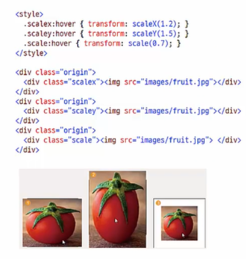
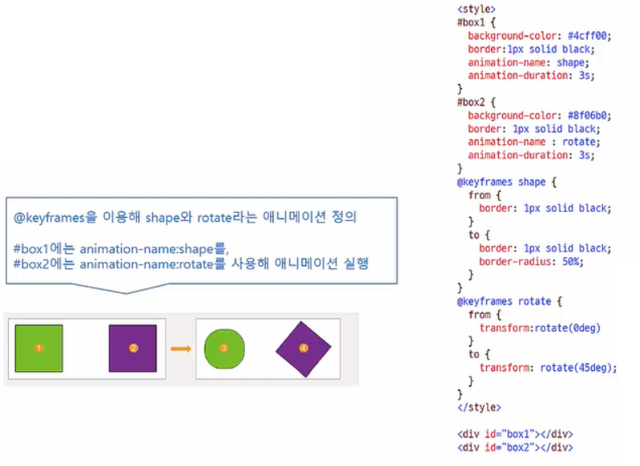

## 13-1 변형 


- 특정 요소의 크기나 형태 등 스타일이 바뀌는 것 


### 2차원 변형 

- 수평이나 수직으로 웹 요소 변형 
- 크기나 각도만 지정하면 된다.
- 2차원 좌표 사용 


### 3차원 변형 

- x 축과 y 축에 원근감 추가 
- z 축은 앞뒤로 이동. 보는 사람 쪽으로 다가올 수록 값이 더 커짐. 


### transform 과 변형함수 

- 웹 요소를 변형하려면 `tranform:` 다음에 변형 함수를 함께 입력한다. 
- 구식 모던 브라우저까지 고려한다면 브라우저 접두사를 붙여야 한다. 


#### translate 함수 

- 지정한 방향으로 이동할 거리를 지정하면 해당 요소를 이동시킴 
- `transform:translate(tx,ty)` : x축 방향으로 tx만큼, y축 방향으로 ty만큼 이동 ( tx, ty 두 가지 값을 사용하지만 ty 값이 주어지지 않으면 0으로 간주 )
- `transform:translate3d(tx,ty,tz) ` : x축 방향으로 tx 만큼, y축 방향으로 ty만큼, z축방향으로 tz만큼 이동
- `transform:translateX(tx)`  : x 축방향으로 tx 만큼 이동 ( Y, Z 도 동일 )


#### scale 함수 

- 지정한 크기만큼 요소를 확대/축소 
- `transform:scale(sx,sy) `  : x축 방향으로 sx 만큼, y축 방향으로 sy 만큼 확대. ( sy 값이 주어지지 않는다면 sx 값과 같다고 간주 )
- `transform:scale3d(sx,sy,sz) ` : x축 방향으로 sx 만큼, y축 방향으로 sy만큼, z 축 방향으로 sz 만큼 확대. 
- `transform:scaleX(sx)` : x축 방향으로 sx만큼 확대 (Y,Z 도 동일)




#### rotate 함수 

- 각도만큼 웹 요소를 시계 방향이나 시계 반대방향으로 회전 (양수-시계방향)

- 일반 각도(degree)나 레디안(radian) 값 사용 ( 1rad = 1/180도 ) 

- ```css
  transform:rotate(각도)
  ```


#### skew 함수 

- 요소를 지정한 각도만큼 비틀어 왜곡 
- 왼쪽 상단과 우측 하단을 잡고 비튼다는 개념.
- `transform:skewX(ax)` : x축을 따라 당긴다. 
- `transform:skewY(ay)` : y축을 따라 당긴다. 
- `transform:skew(ax, ay)` : 첫번째 각도는 x축을 따라 당기는 각도이고, 두번째 각도는 y축을 따라 당기는 각도이다. ( 두번째 값이 주어지지 않으면 y축에 대한 각도를 0으로 간주)


## 13-2 변형과 관련된 속성들 


### `transform-origin` 속성 

- 특정 지점을 변형의 기준으로 설정 

- ```css
  transform-origin : <x축> <y축> <z축> | initial | inherit; 
  ```

| 속성 값 | 설명                                                         |
| ------- | ------------------------------------------------------------ |
| <x축>   | 원점 기준의 x 좌표값으로 길이 값이나 <백분율>, left, center, right 중에서 사용할 수 있다. |
| <y축>   | 원점 기준의 y 좌표값으로 길이 값이나 <백분율>, top, center, bottom 중에서 사용할 수 있다. |
| <z축>   | 원점 기준의 z 좌표값으로 길이 값만 사용할 수 있다.           |


### `perspective` 속성 

- 원근감을 갖게 한다.

- 속성 값은 0보다 커야하며 값이 클수록 사용자로부터 멀어짐 

- ```css
  perspective : <크기> | none; 
  ```

| 속성 값 | 설명                                                         |
| ------- | ------------------------------------------------------------ |
| <크기>  | 원래 위치에서 사용자가 있는 방향으로 얼마나 이동하는지를 **픽셀 크기**로 지정한다. |
| none    | perspective를 지정하지 않는다. 기본값이다.                   |


### `perspective-origin` 속성 

- 입체적으로 표현할 요소의 아랫부분(bottom) 위치 지정 

- 좀 더 높은 곳에서 원근을 조절하는 듯한 느낌을 갖게 한다 

- ```css
  perspective-origin : <x축 값> | <y축 값>; 
  ```

| 속성 값  | 설명                                                         |
| -------- | ------------------------------------------------------------ |
| <x축 값> | 웹 요소가 x축에서 어디에 위치하는지를 지정한다. 사용할 수 있는 값은 길이 값이나 백분율, left, right, center 이다. 기본 값은 50% 이다. |
| <y축 값> | 웹 요소가 y축에서 어디에 위치하는지를 지정한다. 사용할 수 있는 값은 길이 값이나 백분율, top, center, bottom 이다. 기본 값은 50% 이다. |


### `transform-style` 속성 

- 부모 요소에 적용한 3D 변형을 하위 요소에도 적용 

- ```css
  transform-style : flat | preserve-3d
  ```

| 속성 값     | 설명                             |
| ----------- | -------------------------------- |
| flat        | 하위 요소를 평면으로 처리한다    |
| preserve-3d | 하위 요소들에 3D효과를 적용한다. |


### `backface-visibility` 속성 

- 요소의 뒷면, 즉 반대쪽 면을 표시할 것인지 결정 

- ```css
  backface-visibility : visible | hidden 
  ```

| 속성 값 | 설명                    |
| ------- | ----------------------- |
| visible | 뒷면을 표시. 기본값     |
| hidden  | 뒷면을 표시하지 않는다. |


- 두 개 이상의 변형을 동시에 사용하려면 `transform` 속성에 변형 함수를 나열한다. ( 이때 각 함수 사이에는 공백으로 구분 )

  ```css
  /* 예시 ) 크기를 2배 확대하면서 x 축 기준으로 180도 회전 */
  transform: scale(2) perspective(120px) rotateX(180deg)
  ```

  


## 13-3 트랜지션 

- 웹 요소의 스타일 속성이 조금씩 자연스럽게 바뀌는 것. 


### 트랜지션의 속성 

| 속성                       | 설명                                                         |
| -------------------------- | ------------------------------------------------------------ |
| transition-property        | 트랜지션 대상을 설정한다.                                    |
| transition-duration        | 트랜지션 진행 시간을 설정한다                                |
| transition-timing-function | 트랜지션 속도 곡선을 설정한다                                |
| transition-delay           | 트랜지션 지연 시간을 설정한다                                |
| transition                 | transition-property와 transition-duration, transition-timing-function, transition-delay 속성을 한꺼번에 설정. |


#### `transition-property` 속성 

- 트랜지션을 적용할 속성 선택

-  이 속성을 지정하지 않으면 모든 속성이 트랜지션 대상이 됨 . 

- ```css
  transition-property : all | none | <속성 이름> 
  ```

| 속성 값     | 설명                                                         |
| ----------- | ------------------------------------------------------------ |
| all         | all 값을 사용하거나 transition-property 를 생략할 경우, 요소의 모든 소성이 트랜지션 대상이 된다. 기본 값 . |
| none        | 트랜지션 동안 아무 속성도 바뀌지 않는다                      |
| <속성 이름> | 트랜지션 효과를 적용할 속성 이름을 지정. 속성이 여러 개일 경우 `,` (쉼표)로 구분해 나열 |

```css
transition-property : all /*해당 요소의 모든 속성에 트랜지션 적용 */
transition-property : background-color; /* 해당 요소의 배경 색에 트랜지션 적용 */
transition-property : width, height;  /* 해당 요소의 너비와 높이에 트랜지션 적용 */
```


#### `transition-duration ` 속성 

- 트랜지션 진행 시간 지정 
- 시간 단위는 초(seconds) 또는 밀리초 (milliseconds) 
- 트랜지션이 여러 개라면 쉼표(`,`) 로 구분해 진행 시간 지정 


#### `transition-timing-function` 속성 

- 트랜지션의 시작과 중간, 끝에서의 속도 지정 

- ```css
  transition-timing-function : linear | ease | ease-in | ease-out | ease-in-out | cubic-bezier(n,n,n,n)
  ```

| 속성 값               | 설명                                                         |
| --------------------- | ------------------------------------------------------------ |
| linear                | 시작부터 끝까지 똑같은 속도로 진행                           |
| ease                  | 처음에는 천천히 시작, 점점 빨라지다가 마지막에는 천천히 끝낸다. (기본값) |
| ease-in               | 시작을 느리게                                                |
| ease-out              | 느리게 끝낸다                                                |
| ease-in-out           | 느리게 시작하고 느리게 끝낸다                                |
| cubic-bezier(n,n,n,n) | 배지에 함수를 직접 정의해 사용한다. n 에서 사용할 수 있는 값은 0~1 이다. |


#### `transition-delay` 속성 

- 트랜지션이 언제부터 시작될지 지연 시간 지정 
- 시간 단위는 초(seconds) 또는 밀리초(milliseconds) . 
- 기본 값은 0 


## 13-4 애니메이션


### CSS와 애니메이션 

- 웹 요소에 애니메이션 추가
- 애니메이션을 시작해 끝내는 동안 원하는 곳 어디서든 스타일을 바꾸며 애니메이션을 정의할 수 있다. 
- 키프레임(keyframe) : 애니메이션 중간에 스타일이 바뀌는 지점. 


#### `@keyframs` 속성 

- 애니메이션의 시작과 끝을 비롯해 상태가 바뀌는 지점을 설정 

- '이름' 으로 애니메이션 구별 

- ```css
  @keyframs <이름>{
      <선택자> { <스타일> }
  }
  ```

- 시작 위치는 0% , 끝 위치는 100% 로 놓고 위치 지정 

- 시작과 끝 위치만 사용한다면 `from` , `to` 키워드 사용 가능 

- `@-webkit-keyframes` 나 `@-moz-keyframes` 처럼 브라우저 접두사를 붙여야한다.


#### `animation-name` 속성 

- `@keyframes` 속성으로 애니메이션 이름을 정의
- `animation-name` 을 이용해서 애니메이션을 사용. 




#### `animation-duration` 속성 

- 애니메이션 실행 시간 설정. 

- 기본값 0

- 사용 가능한 값은 초(s) 나 밀리초(ms)

- ```css
  animation-duration : <시간>
  ```


#### `animation-direction` 속성 

- 애니메이션이 끝난 후 원래 위치로 돌아가거나 반대 방향으로 애니메이션 실행하도록 지정 

- ```css
  animation-direction : normal | alternate
  ```

| 속성 값   | 설명                                                         |
| --------- | ------------------------------------------------------------ |
| normal    | 애니메이션을 끝까지 실행하면 원래 있던 위치로 돌아간다. 기본값이다. |
| alternate | 애니메이션을 끝까지 실행하면 왔던 방향으로 되돌아가면서 애니메이션을 실행한다. |


#### `animation-iteration-count` 속성 

- 애니메이션 반복 횟수 지정하기 

- ```css
  animation-iteration-count : <숫자> | infinite
  ```

| 속성 값  | 설명                                          |
| -------- | --------------------------------------------- |
| <숫자>   | 입력한 숫자만큼 반복합니다. 기본값은 1입니다. |
| infinite | 무한 반복합니다.                              |


#### `animation-timing-function` 속성

- 애니메이션 속도 곡선 지정 

- ```css
  animation-timing-function : linear | ease | ease-in | ease-out | ease-in-out | cubic-bezier(n,n,n,n)
  ```


#### `animation` 속성 

- 여러개의 애니메이션 속성을 하나의 속성으로 줄여서 사용 

- 지정하지 않은 속성은 기본 값 사용. 하지만 `animation-duration` 속성 값은 반드시 지정해야함. 

- ```css
  animation : <animation-name> | <animation-duration> | <animation-timing-function> | <animation-delay> | <animation-iteration-count> | <animation-direction>
  ```


