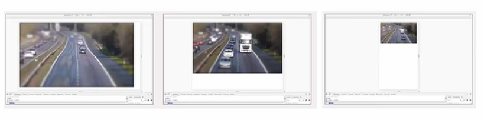

## 14-1 모바일 기기와 웹 디자인 


### 반응형 웹 디자인 

- 사용자가 사이트에 접속할 때 사용한 브라우저 창의 너비값에 반응한다. 
- 웹 사이트의 내용을 그대로 유지하면서 다양한 화면 크기에 맞게 웹 사이트를 표시하는 방법 
- **화면 크기에 '반응'**해 화면 요소들을 자동으로 바꾸어 사이트를 구현하는 것이 바로 반응형 웹 디자인 


### 반응형 웹 디자인의 장단점 

#### 장점 

- 모든 스마트 기기에서 접속 가능 
- 가로 모드에 맞춘 레이아웃 변경 가능 
- 사이트 유지, 관리 용이

#### 단점 

- 반응형 웹 기술이 최신 웹 표준인 CSS3의 일부 

  → 최신 모던 웹 브라우저에서만 지원됨. 


### 뷰포트 

- 실제 내용이 표시되는 영역

-  PC화면과 모바일 화면의 픽셀 표시 방법이 다르기 때문에 모바일 화면에서 의도한대로 표시되지 않음

  → 뷰포트를 지정하면 기기 화면에 맞춰 확대/축소해서 내용 표시 


#### 뷰포트 지정하기

- `<head>` 태그 안에서 `<meta>` 태그를 이용해 뷰 포트 지정 

- ```css
  <meta name="viewport" content="<속성1=값>, <속성2=값>, ... ">
  ```

- 일반적인 사용법 : 뷰포트의 너비를 스마트폰 화면 너비에 맞추고 초기 화면 배율을 1로 지정 

  ```css
  <meta name="viewport" content="width=device-width, initial-scale=1">
  ```

| 속성          | 설명                | 사용가능한 값           | 기본값  |
| ------------- | ------------------- | ----------------------- | ------- |
| width         | 뷰포트 너비         | device-width 또는 크기  | 기본 값 |
| height        | 뷰포트 높이         | device-height 또는 크기 | 기본 값 |
| user-scalable | 확대/축소 가능 여부 | yes 또는 no             | yes     |
| initial-scale | 초기 확대/축소 값   | 1~10                    | 1       |
| minimum-scale | 최소 확대/축소 값   | 0~10                    | 0.25    |
| maximum-scale | 최대 확대/축소 값   | 0~10                    | 1.6     |


## 14-2 가변 그리드 레이아웃

### 그리드 시스템 (grid system)

- 화면을 여러 개의 칼럼으로 나누어, 필요할 때마다 칼럼들을 묶어 배치하는 방법 
- 화면 너비 값에 따라 '960 그리드 시스템', '1200 그리드 시스템' 등으로 나뉨 
- 칼럼 개수에 따라 '12칼럼 그리드 시스템', '16칼럼 그리드 시스템', '24칼럼 그리드 시스템' 등으로 나뉨
- 주로 960픽셀 12칼럼의 그리드 시스템 사용 
- **고정 그리드** : 화면 너비를 일정하게 고정하고 레이아웃을 만듬 
- **가변 그리드 ** : 화면 너비를 `%` 같은 가변 값으로 지정 
- 가변 그리드 레이아웃을 사용할 경우, 너비 값이 줄어들면 실제 콘텐츠를 확인하기 불편하므로 가능하면 간결한 디자인을 사용하는 것이 좋다. 


### 고정 그리드 레이아웃일 경우 

- 문서의 맨 바깥 부분을 `#wrapper` 요소로 묶고 너비를 960px로 지정 
- 헤더와 본문, 사이드바, 푸터를 배치하는데 이때 너비는 px 값 
- 화면 너비가 좁아질 경우 내용의 일부가 가려진다. 
- 폭이 줄거나 늘지 않기 때문에 화면 너비값에 유연하게 반응하지 못한다. 

```html
<!DOCTYPE html>
<html>
	<head>
		<meta charset="utf-8">
		<title>CSS 및 HTML 연습</title>
		<style>
            #wrapper{
                width:960px; 
            }
            header{
                width:960px; 
                height:120px;
                background-color: blue; 
            }
            .content{
                float:left; 
                width:630px; 
                background-color: yellow;
            }
            .right-side{
                float:right; 
                width:330px; 
                background-color: green;
            }
            footer{
                clear:both; 
                width:960px;
                background-color : lightgray;
            }
		</style>
	</head>
	<body id="wrapper">
        <header>고정 그리드 레이아웃</header>
        <section class="content">본문</section>
        <section class="right-side">사이드바</section>
        <footer>푸터</footer>
	</body>
</html>
```


​															▼ ( 화면을 줄일 경우)


### 가변 그리드 레이아웃 만들기 

1. 전체를 감싸는 요소의 너비를 `%` 로 변환 ( 화면에 꽉 차게 하고 싶다면 100%, 여유를 두려면 적당히 )

2. 전체를 감싸는 요소의 너비를 기준으로 각 요소의 너비를 계산 

   `(요소의 너비 / 콘텐츠 전체를 감싸는 요소의 너비 ) *100 ` 

   ( 패딩값 역시 `%` 로 계산해줘야한다.  )

```html
<style>
    #wrapper{
        width:100%; 
    }
    header{
        width:100%; 
        height:80%;
        background-color: blue; 
    }
    .content{
        float:left; 
        width:60%; 
        background-color: yellow;
    }
    .right-side{
        float:right; 
        width:40%; 
        background-color: green;
    }
    footer{
        clear:both; 
        width:100%;
        background-color : lightgray;
    }
</style>
```


​																								▼


## 14-3 가변 요소 


### 가변글꼴 

#### em 단위

- 부모 요소 폰트의 대문자 M 너비를 1em 으로 지정. 1em=16px 
- `글자크기(em) = 글자크기(px) / 16px `
- `em` 은 화면에 표시되는 폰트 값을 기준으로 폰트의 몇배인지 판단.

```html
<style>
    .header-text { font-size : 2em; }
    .content { font-size : 1.5em; }
    .right-side { font-size : 1.5em; }
    footer { font-size : 1.5em; }
</style>
```

#### rem 단위 

- em 단위는 부모 요소가 중첩될 경우 글자 크기가 계속 달라짐. 
- rem 은 처음부터 기본 크기를 지정하고 그것을 기준으로 글자 크기를 지정

```html
<style>
    body{ font-size : 16px; }
    .header-text { font-size : 2rem; }
    .fluid-text { font-size  1.5rem; }
</style>
```


### 가변 이미지 

- 브라우저 창의 너비가 변하더라도 이미지 너비 값은 변하지 않음 -> 브라우저 화면 너비를 줄일 경우 이미지 일부가 가려짐 
- 가변 이미지로 만들면 창의 너비에 따라 이미지 너비도 조절됨. 


#### 1. CSS 를 이용한 방법 

- 이미지를 감싸고 있는 부모 요소만큼만 커지거나 작아지도록 `max-width` 속성 값을 100% 로 지정. 


#### 2. `` 태그와 `srcset` 속성 

- 화면 너비 값이나 픽셀 밀도에 따라 고해상도의 이미지 파일 지정 가능 

- ```html
  " srcset="<이미지1>[, <이미지2>, <이미지3>, ...]">
  
  <!-- 예시  -->
  
  ```


#### 3. `<picture>` 태그와 `<source>` 태그 

- 화면 해상도뿐만 아니라 화면 너비에 따라 다른 이미지 파일 표시 

| 속성   | 설명                                        |
| ------ | ------------------------------------------- |
| srcset | 이미지 파일의 경로                          |
| media  | srcset에 지정한 이미지를 표시하기 위한 조건 |
| type   | 파일 유형                                   |
| sizes  | 파일의 크기                                 |


### 가변 비디오 

- CSS 를 사용해 `max-width` 속성을 100% 로 지정 

```html
<style>
    video {max-width : 100%}
</style>

<video autoplay loop src="assets/cars.mp4"> </video>
```




## 14-4 미디어 쿼리 

- 접속하는 장치(미디어)에 따라 특정한 CSS 스타일을 사용하도록 함 . 
- 미디어 쿼리를 이용해 제작된 사이트들을 모아놓은 http://mediaqueri.es 참고 


### 미디어 쿼리 구문 

- ```css
  @media [only | not] 미디어 유형 [and 조건]*[and 조건]
  ```

| 연산자   | 설명                                                         |
| :------- | :----------------------------------------------------------- |
| and      | 조건을 계속 추가할 수 있다                                   |
| , (쉼표) | 동일한 스타일 유형을 사용할 미디어의 유형과 조건이 있다면 쉼표를 이용해 추가 |
| only     | 미디어 쿼리를 지원하는 웹 브라우저에서만 조건을 인식하게 한다. 이 키워드를 사용하면 미디어 쿼리를 지원하지 않는 웹 브라우저에서는 미디어 쿼리를 무시하고 실행하지 않습니다. IE에서는 미디어 쿼리를 제대로 인식하지 못하기 때문에 only 키워드를 사용하더라도 큰 의미가 없다. |
| not      | not 다음에 지정하는 미디어 유형을 제외한다. 예를 들어 `not tv` 라고 지정한다면 tv를 제외한 미디어 유형에만 적용된다. |


### 미디어 유형의 종류 


```css
@media screen and (min-width:200px) and (max-width:360px){
    ...
}
/* 조건은 괄호로 묶어서 표시 */
```


### 미디어 쿼리 조건 

#### 웹 문서의 가로 너비와 세로 높이 (뷰포트)

| 가로, 세로 값 설정하는 속성 | 설명                             |
| --------------------------- | -------------------------------- |
| width, height               | 웹 페이지의 가로 너비, 세로 높이 |
| min-width, min-height       | 최소 너비, 최소 높이             |
| max-width, max-height       | 최대 너비, 최대 높이             |


#### 단말기의 가로 너비와 세로 높이 

| 단말기의 가로, 세로 값을 설정하는 속성 | 설명                          |
| -------------------------------------- | ----------------------------- |
| device-width, device-height            | 단말기의 가로 너비, 세로 높이 |
| min-device-width, min-device-height    | 단말기의 최소 너비, 최소 높이 |
| max-device-width, max-device-height    | 단말기의 최대 너비, 최대 높이 |

- 단말기 크기와 뷰 포트 크기를 하나로 통일해 사용하기 위해 뷰포트를 지정할 때 `width="device-width" ` 로 놓고 사용 


#### 화면 회전

- orientation 속성을 사용해서 화면 방향 체크 

| 속성                   | 설명             |
| ---------------------- | ---------------- |
| orientation: portrait  | 단말기 세로방향  |
| orientation: landscape | 단말기 가로 방향 |


#### 화면 비율 

- 단말기 브라우저 화면의 너비 값을 높이 값으로 나눈 것 

| 속성             | 설명                            |
| ---------------- | ------------------------------- |
| aspect-ratio     | 화면 비율 (width값 / height 값) |
| min-aspect-ratio | 최소 화면 비율                  |
| max-aspect-ratio | 최대 화면 비율                  |


#### 단말기 화면 비율 

- 단말기의 너비 값을 높이 값으로 나눈 것 

| 속성                    | 설명                                   |
| ----------------------- | -------------------------------------- |
| device-aspect-ratio     | 단말기 화면 비율 (width값 / height 값) |
| min-device-aspect-ratio | 단말기 최소 화면 비율                  |
| max-device-aspect-ratio | 단말기 최대 화면 비율                  |


#### 색상당 비트 수 

- 단말기의 최대 색상 비트 수를 조건으로 사용

| 속성 값   | 설명        |
| --------- | ----------- |
| color     | 비트수      |
| min-color | 최소 비트수 |
| max-color | 최대 비트수 |


### 미디어 쿼리 중단점 만들기 

- **중단점(breakpoint)** : 서로 다른 CSS를 적용할 화면 크기 
- 대부분 기기의 화면 크기 기준. 
- 모든 기기를 반영할 수 없기 때문에 스마트폰과 태블릿, 데스크톱 정도로 구분 
- 모바일 퍼스트(mobile first) : 모바일 기기 레이아웃을 기본으로 작성 -> 태블릿 & PC 레이아웃 작성 
- 미디어 쿼리 중단점은 개발자나 작업 조건에 따라 달라질 수 있다. 


## 14-5 미디어 쿼리 사용한 사이트 구성 


### 외부 CSS 파일 연결 

- 특정 조건에 맞을 경우, 지정한 css 파일을 가져와 적용 


#### `<link>` 태그 사용하기

- `<head>` 와 `</head>` 사이에 삽입 

- ```css
  <link rel="stylesheet" media="미디어 쿼리 조건" href="css파일 경로">
  ```


#### `@import` 구문 사용하기

- `<style>` 와 `</style>` 사이에 삽입 

- ```css
  @import url(css파일 경로) 미디어 쿼리 조건 
  ```


### 웹 문서에서 직접 정의하기


#### `<style>` 태그 안에 media 속성 사용 

- ```html
  <style media="미디어 쿼리 조건"> 
      스타일 규칙들 
  </style>
  ```


#### `<style>` 태그 안에 `@media` 구문 사용하기 

- ```html
  <style>
      @media 미디어 쿼리 조건 {
          스타일 규칙들 
      }
  </style>
  ```


- 조건이 많지 않을 경우 편리 


## 14-6 플렉서블 박스 레이아웃 


### 플렉서블 박스 레이아웃(flexible box layout)

- 그리드 레이아웃을 기본으로 플렉스 박스를 원하는 위치에 배치하는 것 
- 여유 공간에 따라 너비나 높이, 위치를 자유롭게 변형할 수 있다. 


### 플렉서블 박스 레이아웃 기본 속성 


#### `display` 속성 

- 배치 요소들을 감싸는 부모 요소를 플렉스 컨테이너로 지정 

- ```css
  display : flex | inline-flex; 
  ```

| 속성 값     | 설명                                           |
| ----------- | ---------------------------------------------- |
| flex        | 플렉스 박스를 **박스 레벨 요소**로 정의한다.   |
| inline-flex | 플렉스 박스를 **인라인 레벨 요소**로 정의한다. |

```html
<!-- 예시 -->

<style>
    #container{
        display : flex; 
    }
</style>

<div id="container">
    <div></div>
    <div></div>
</div>
```


#### display 속성과 브라우저 접두사 

- 최신 모던 브라우저에서는 모두 지원되고 대부분의 구식 버전에서도 지원됨. 
- 하지만, 브라우저마다 플렉스 박스를 지원하는 방법이 달라 브라우저 접두사를 붙여야 함.


#### `flex-direction` 속성 

- 플렉스 항목 배치 방향 지정 

- ```css
  flex-direction : row | row-inverse | column | column-inverse
  ```

- 주측을 어디로 하고 어떤 방향으로 배치할 것인지를 결정하는 속성 


#### `flex-wrap` 속성

- 플렉스 항목을 한 줄 또는 여러 줄로 배치 

- ```css
  flex-wrap : no-wrap | wrap | wrap-reverse
  ```

- 컨테이너 영역보다 벗어나게 될 경우 어떻게 배치할 것인가를 정하는 속성. 


#### `flex-flow` 속성 

- 플렉스 배치 방향과 여러 줄 배치를 한꺼번에 지정 

- ```css
  flex-flow : <플렉스 방향> <플렉스 줄 배치> 
  ```

- 기본 값은 flex-flow: row no-wrap


#### `order` 속성 

- 플렉스 항목의 배치 순서 바꾸기 
- order 값에 지정된 순서에 따라 배치됨. 


### 플렉스 항목 배치를 위한 속성 


#### `justify-content` 속성 

- 플렉스 항목을 주축 방향으로 배치할 때의 배치 기준 

- ```css
  justify-content : flex-start | flex-end | center | space-between | space-around
  ```


#### `align-items` 속성 

- 교차축을 기준으로 하는 배치 방법 조절 

- ```css
  align-items : stretch | flex-start | flex-end | center | baseline
  ```

- ```css
  align-self : auto | stretch | flex-start | flex-end | center | baseline 
  ```


#### `align-content` 속성 

- 플렉스 항목이 여러 줄로 표시될 때 교차축 기준의 배치 방법 지정 

- ```css
  align-content : flex-start | flex-end | center | space-between | space-around
  ```


#### `flex` 속성 

- 플렉스 항목의 크기 조절 

- `flex-grow` 와 `flex-shrink` , `flex-basis` 속성을 flex 속성으로 묶어 사용. 

- 기본값  flex : 0  1 auto; 

- ```css
  flex : [ <flex-grow> <flex-shrink> <flex-basis> ] | auto | initial
  ```


