# 텍스트 관련 태그들 

## 2-1 텍스트를 묶어주는 태그 

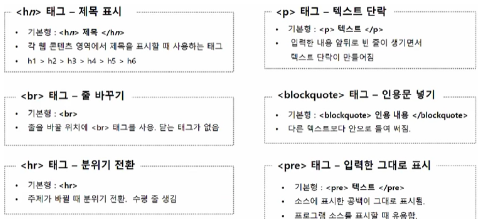

- `
` : 태그를 이용해서 크게 만든 글자는 웹브라우저에서는 동일하게 동일할 수 있지만 정보가 다르기 때문에 스마트 기기나 다른 방법으로 보여줄 경우 다르게 인식. 

예시 ) 

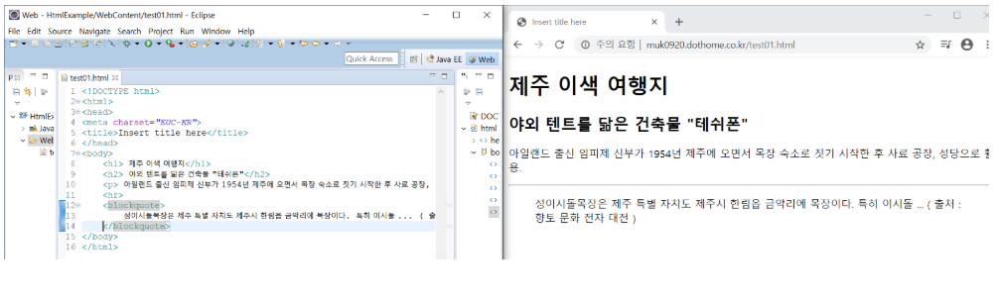

## 2-2 텍스트를 한 줄로 표시하는 태그 

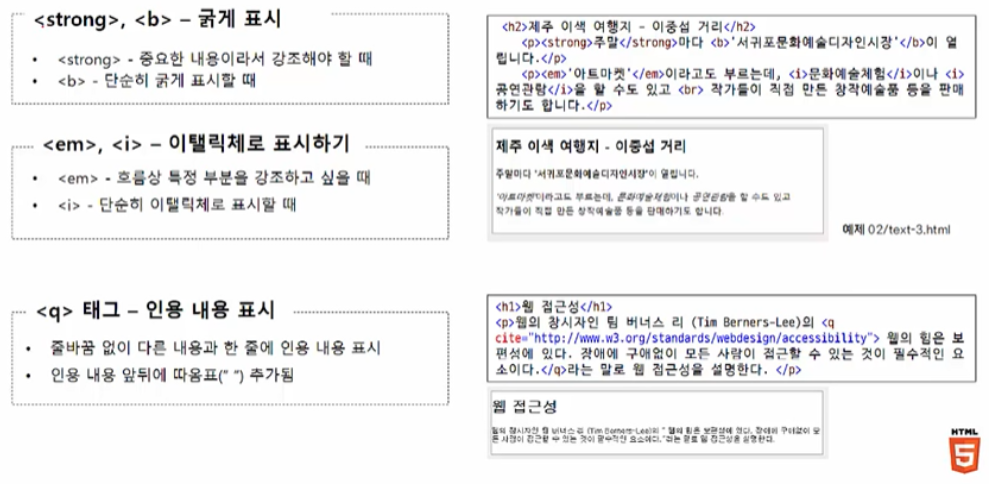

예시 ) 

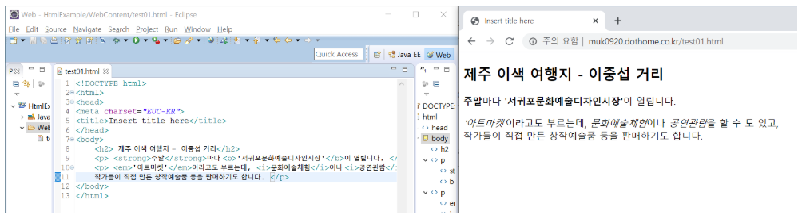

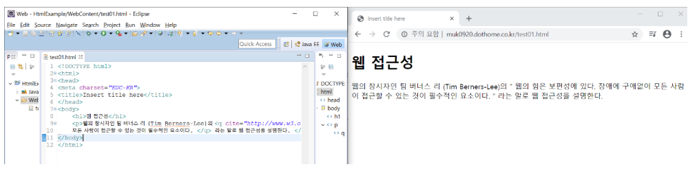

- 인용을 할 경우 `""` 가 붙는다. `""` 안에서는 줄 바꿈 없이 글이 이어진다. 

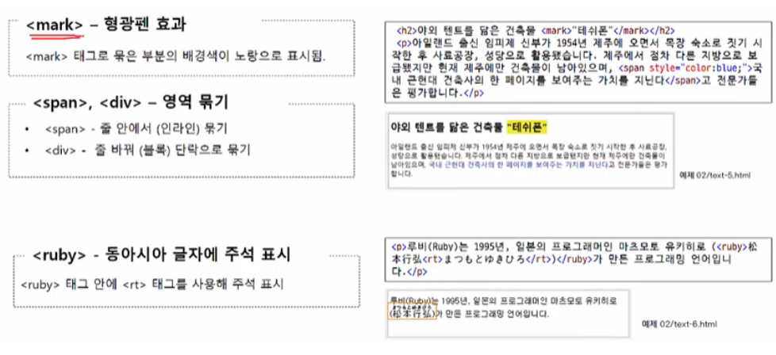

예시) 

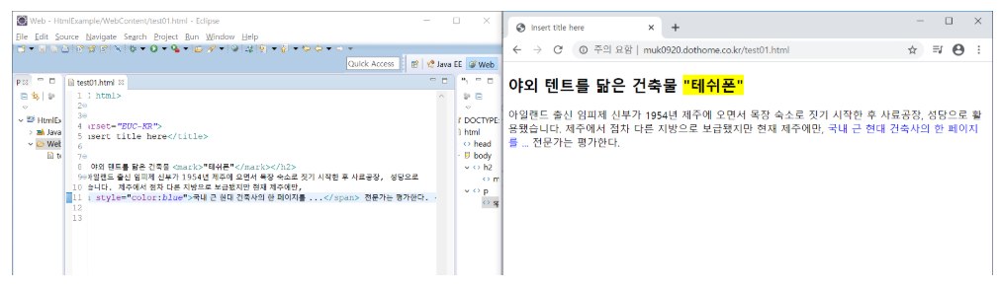

## 2-3 목록을 만드는 태그 

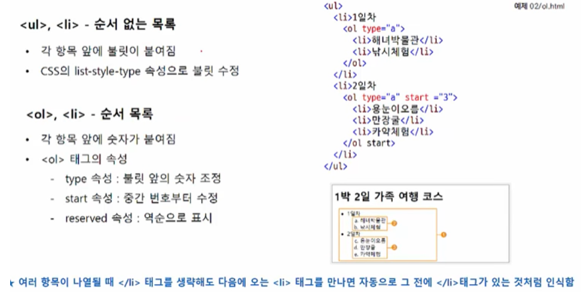

- `<ul>` : unordered list (순서x)
  - type="a" : 순서 목록을 알파벳으로 설정
- `<ol>` : ordered list (순서o)
  - start ="3"  : 숫자가 3부터 시작 

예시 ) 

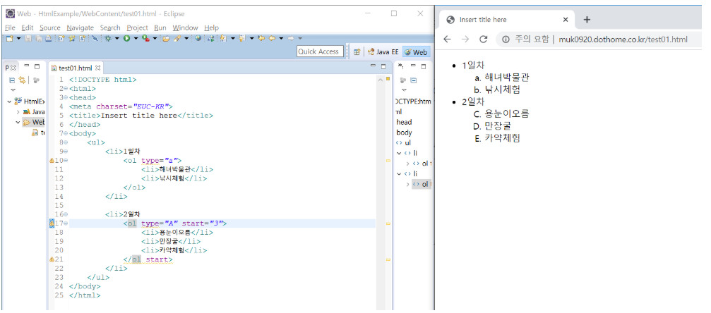

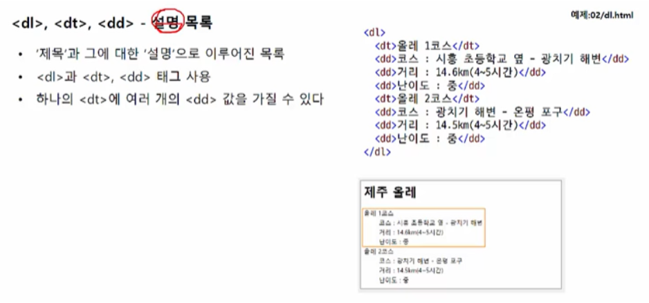

예시 ) 

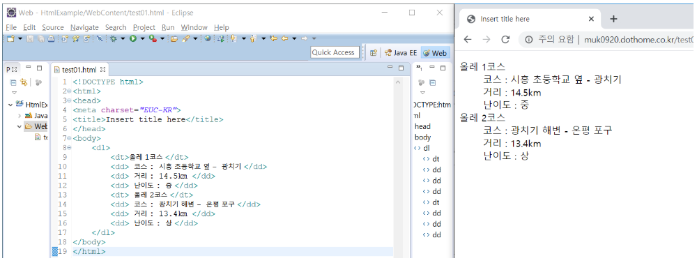

## 2-3 표를 만드는 태그 

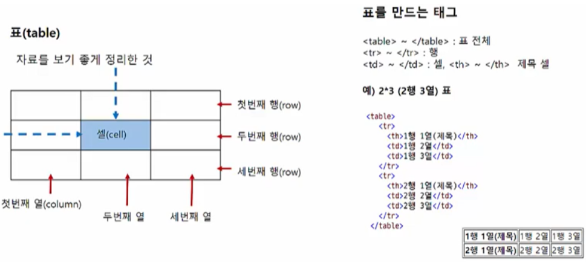

- 열을 만들어주는 태그는 따로 없다. 

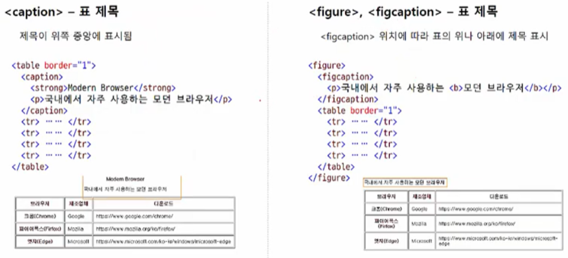

예시 ) 

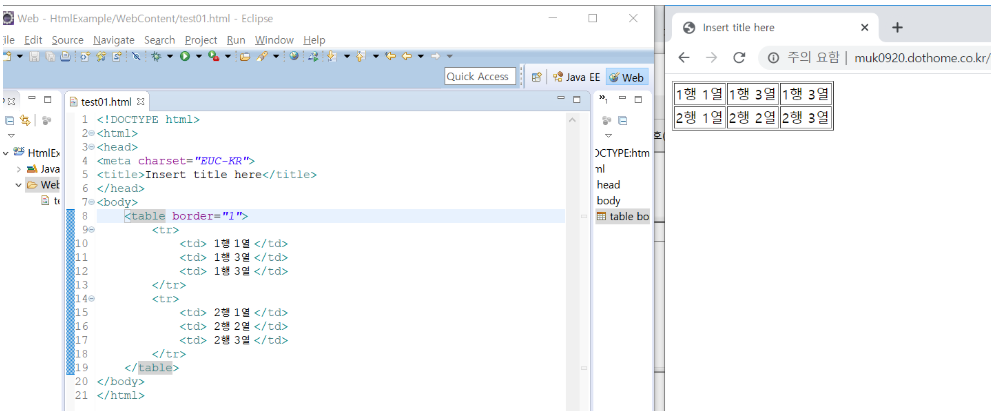

- 표의 선을 넣기 위해 `<table border="1">` 사용 
- 제목은 `<caption>` 태그를 이용하여 제목을 표시할 수 있다. 
- `<figure>`  로 캡션을 달고 싶은 부분을 묶어 주고 `<figcaption>` 을 통해 제목을 단다. 

예시 ) 

- `<caption> ` 태그 사용 

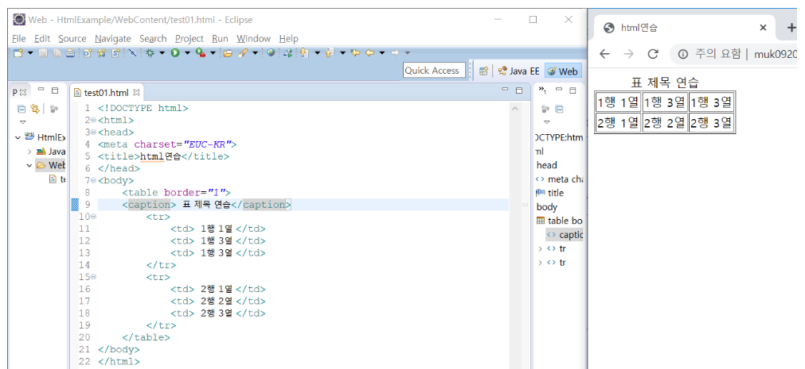

- `<figure>` 태그 사용 

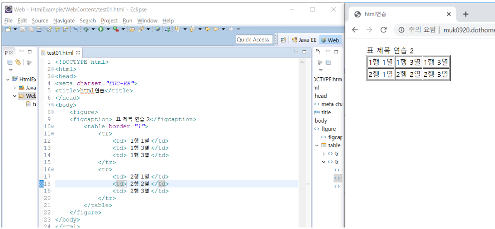

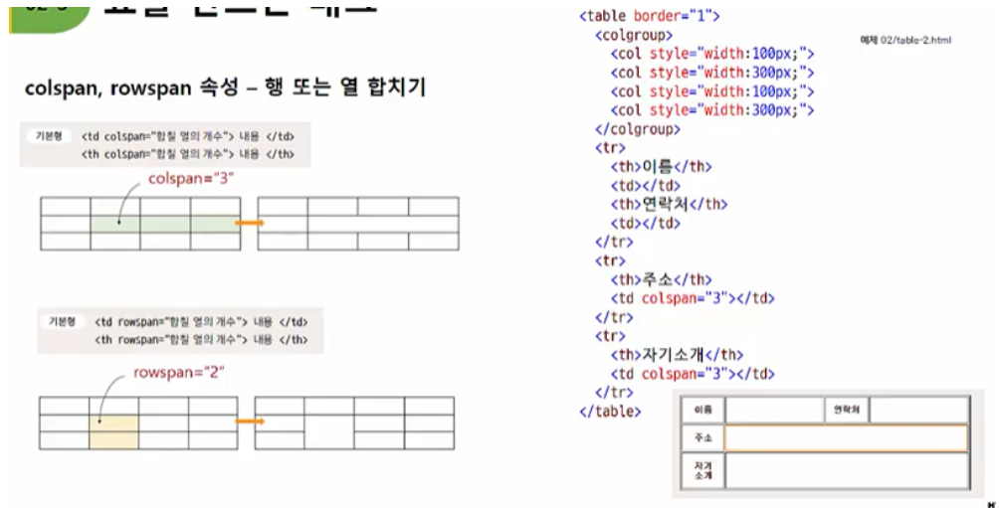

- `colspan` : 열을 합치는 것 
- `rowspan` : 행을 합치는 것 

예시 ) 

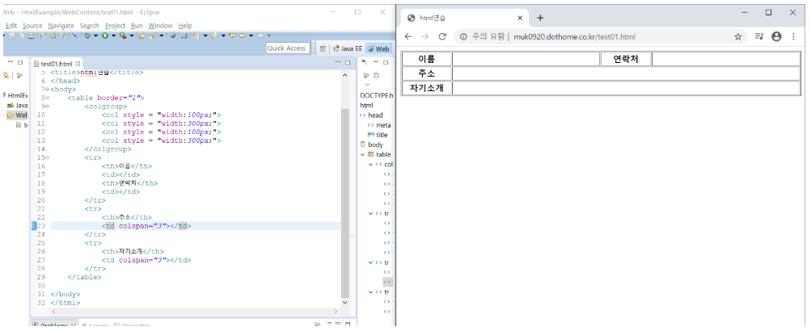

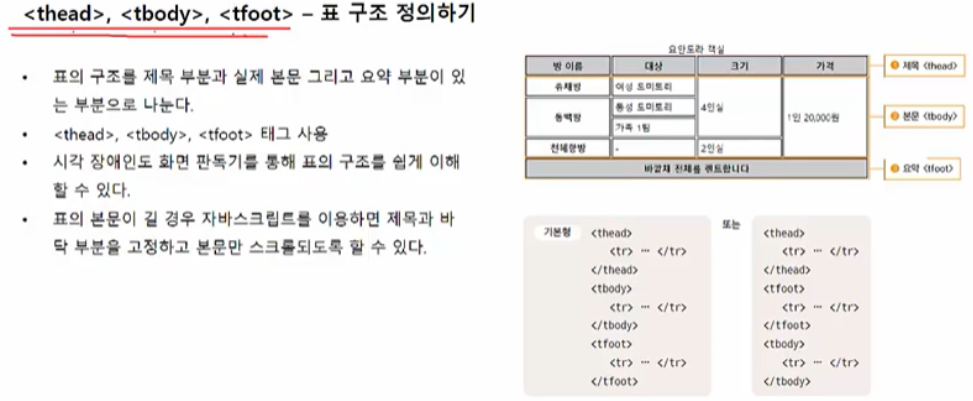

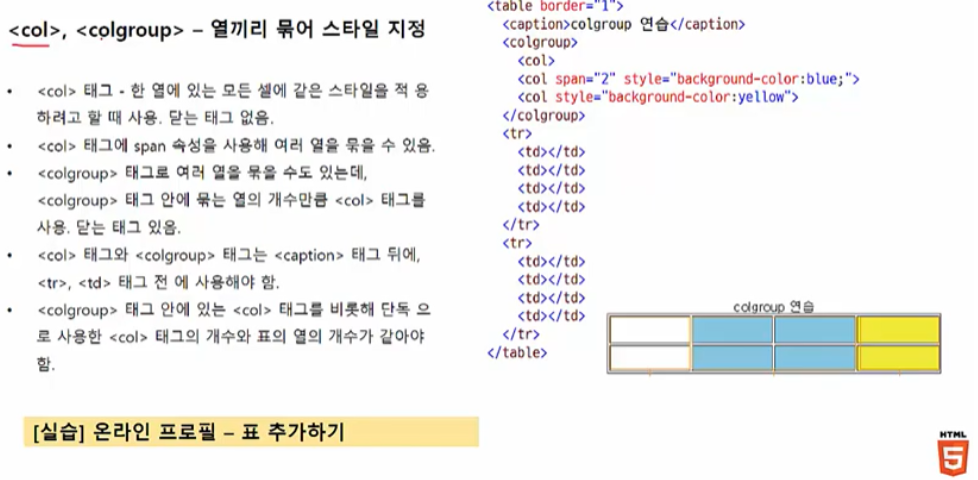

- `<col>` 은 닫는 태그가 없다. 