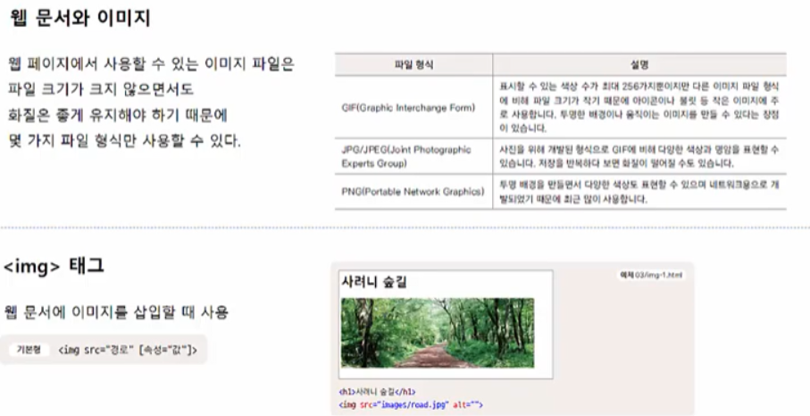
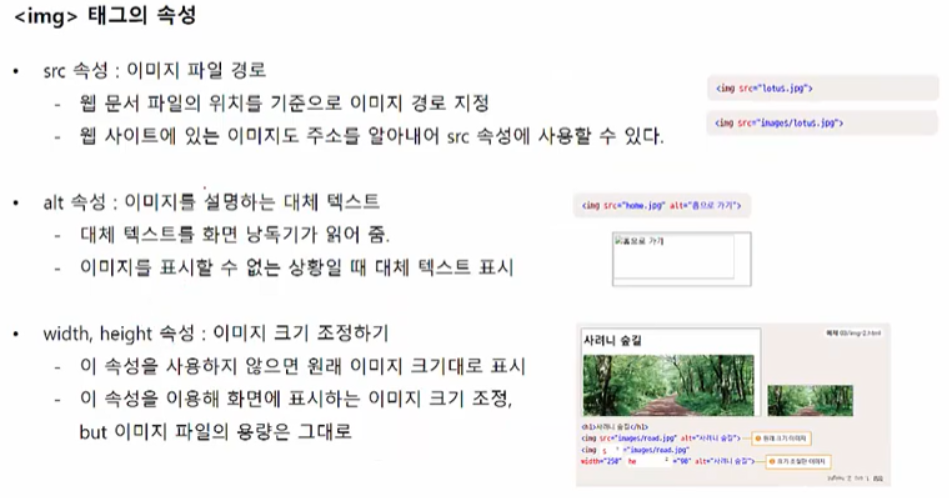
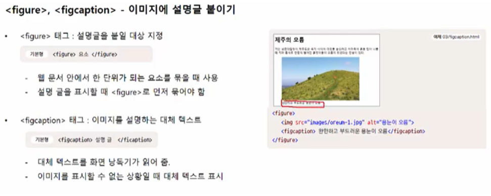
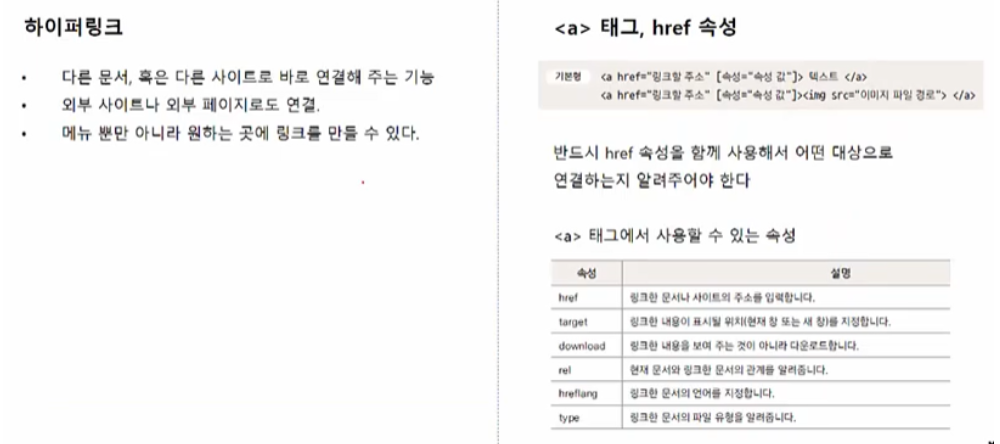
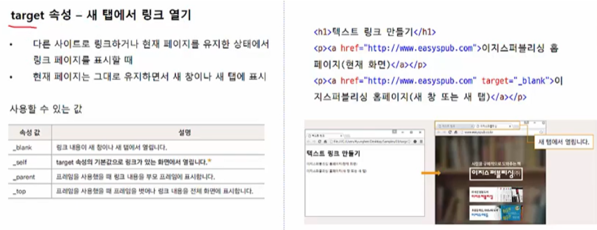
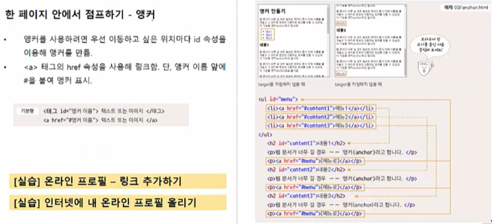
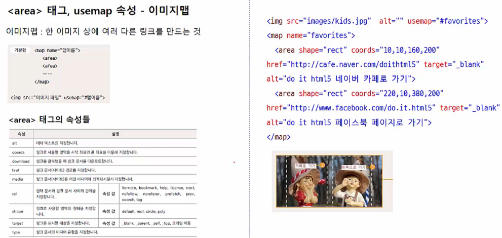
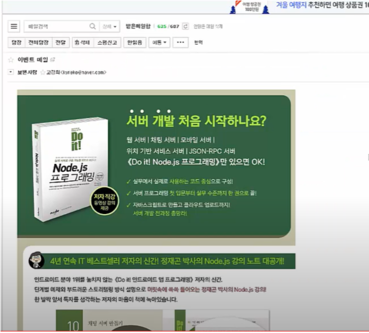

# 이미지와 하이퍼링크 

## 3-1 이미지 

- gif : 색상 수가 적기 때문에 파일 크기도 작다. 
- jpg/ jpeg 와 png : 색상 수가 많아 사진을 표현하기에 적합하다. 
- png : 투명 배경을 만들 수 있기 때문에 전체 배경 위에 특정 사진을 올릴 때 많이 사용. 

- 대체 텍스트가 중요한 이유는 화면 낭독기에서 이미지를 소리로 읽어준다. 

## 3-2 링크 만들기 

- `<a> 태그` : href 속성을 이용하여 어디로 이동할 지 설정 . 

- `#` 을 이용해서 앵커의 위치를 지정. 

- 하나의 이미지에 둘 이상의 링크를 만드는 것 : 이미지 맵 

- 그림판을 통해서 원의 중심과 반지름의 길이를 파악한다. 
- 사각형 영역은 시작하는 좌표값과, 우측 대각선의 끝나는 좌표값을 파악해야한다. 

- 이벤트 메일을 만드는 방법 
  - 웹 서버에 이벤트 이미지를 등록한다 
  - 이벤트 맵 작성 
  - 메일 보낼 경우 `<body>` 태그 부분을 드래그 하여서 메일로 전송하면 아래와 같이 뜸을 확인할 수 있다. 

