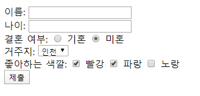

## < form > 태그 

- `<form>` 태그는 웹 페이지에서의 입력 양식을 의미. 

- 로그인 창이나 회원가입 폼 등이 해당. 


- input 

  - 사용자의 입력을 받는 태그 

  - `type`  : 종류를 나타낸다 ( ex- text, number )

    - `text` : 일반 문자 

    - `password` : 비밀번호 

    - `button` : 버튼 

    - `submit` : 양식 제출용 버튼 

    - `reset` : 양식 초기화용 버튼 

    - `radio` : 1개만 선택할 수 있는 컴포넌트 

    - `checkbox` : 다수를 선택할 수 있는 컴포넌트 

    - `file` : 파일 업로드 

      

  - `name` : 데이터의 이름을 지정 

  - `value` : 기본 값을 지정. 

- select   /   option 

  - 드롭 다운 리스트를 만드는 태그. 

- `<label>` , `<textarea>` , `<button>` 등 ... 

```html
<form action="서버페이지주소">
    <br/>이름: <input type="text" name="name" />
    <br/>나이: <input type="number" name="age" />
    <br/>결혼 여부:
        <input type="radio" name="married" value="Y" checked> 기혼
        <input type="radio" name="married" value="N"> 미혼
    <br/>거주지:
        <select name="city">
            <option value="seoul">서울</option>
            <option value="busan">부산</option>
            <option value="incheon" selected>인천</option>
    </select>
    <br/>좋아하는 색깔:
        <input type="checkbox" name="favColor" value="red" checked> 빨강
        <input type="checkbox" name="favColor" value="blue" checked> 파랑
        <input type="checkbox" name="favColor" value="yellow"> 노랑
    <br/><input type="submit" value="제출"/>
</form>

```


​											**실행 결과** :   