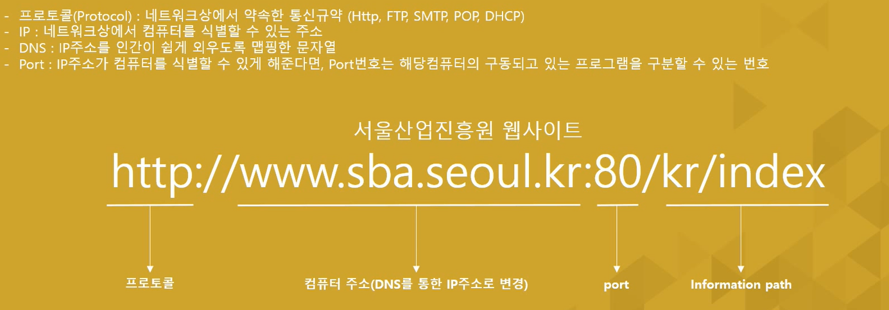
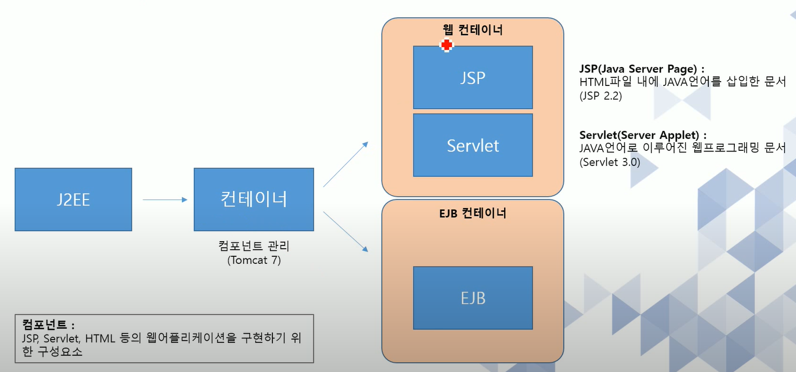
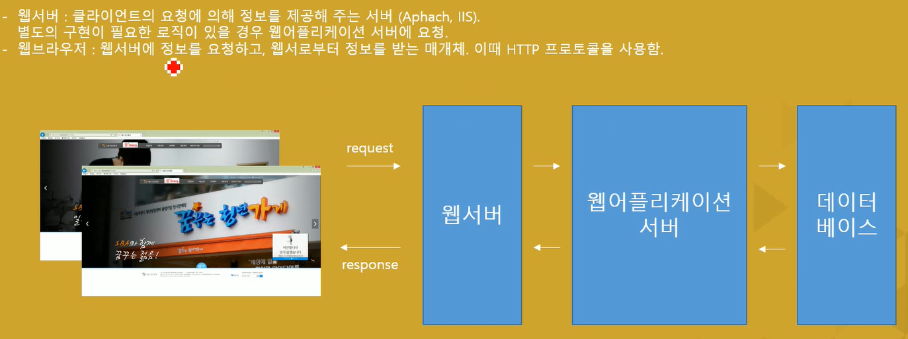
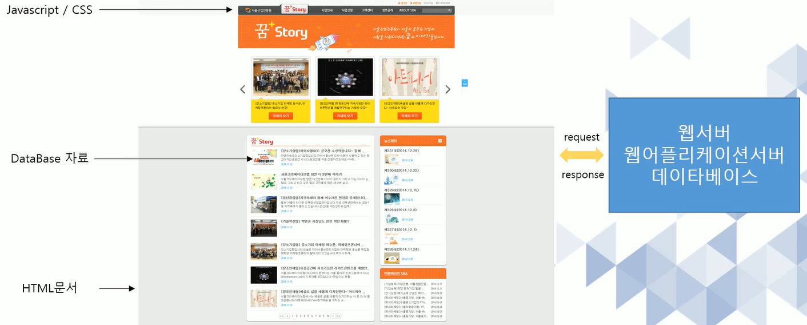

# 1. 웹 프로그래밍 

## 1-1 웹 프로그래밍이란? 

1. 웹프로그래밍이란  웹 애플리케이션을 구현하는 행위 

2. 웹 애플리케이션이란, 웹을 기반으로 작동되는 프로그램

3. 웹이란 1개 이상의 사이트가 연결되어 있는 인터넷 서비스의 한가지 형태를 의미 

4. 인터넷이란, 1개 이상의 네트워크가 연결되어 있는 형태

FTP : File Transfrom Protocol  - 파일을 주고 받을 때 사용하는 프로토콜 

SMTP - 메일을 전송해주는 것, POP -  메일을 받는 것 

DHCP - 동적으로 IP 주소가 바뀌는 것. 	

## 1-2 JAVA웹 

JAVA 플랫폼( J2SE, J2EE, J2ME ) 중에서 J2EE를 이용한 웹 프로그래밍

## 1-3 웹 프로그램의 동작 

## 1-4 필요한 학습 

1. JAVA : Java 웹 애플리케이션을 구현하기 위한 선행 학습 필요
2. HTML : 웹 애플리케이션을 구현하기 위한 기본 언어 
3. JavaScript : 클라이언트 기능을 구현하기 위한 언어 
4. JQuery : JavaScript 의 대표적인 라이브러리로써, 클라이언트 사이드 스크립트 언어를 단순화 할 수 있다. 
5. CSS : 웹 애플리케이션의 레이아웃 및 스타일을 지정하는 언어 

