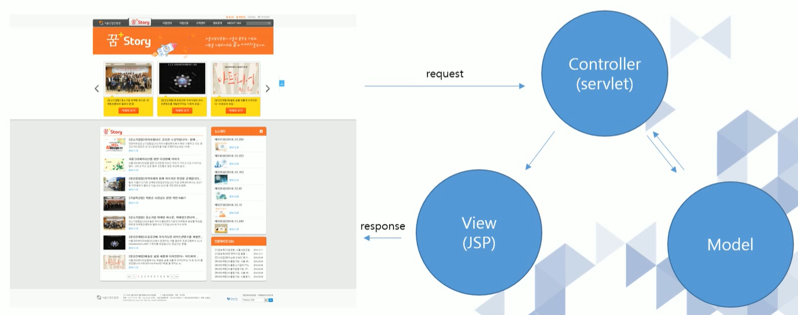
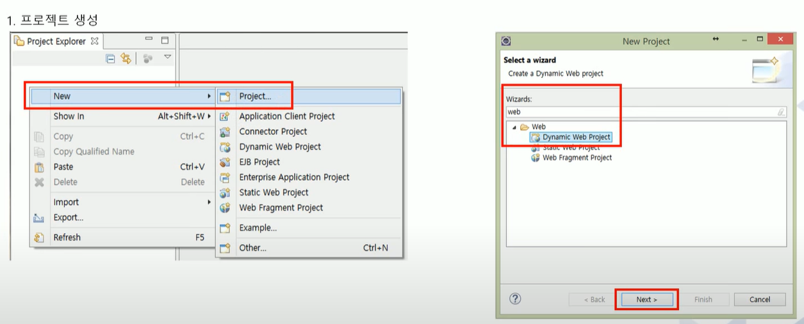
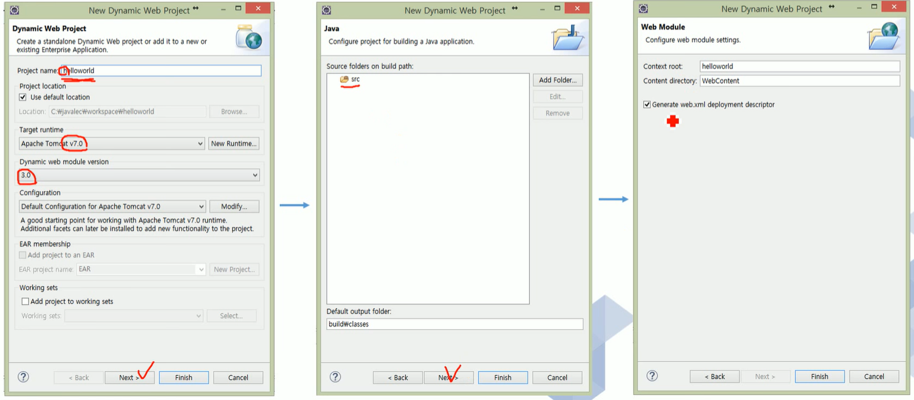
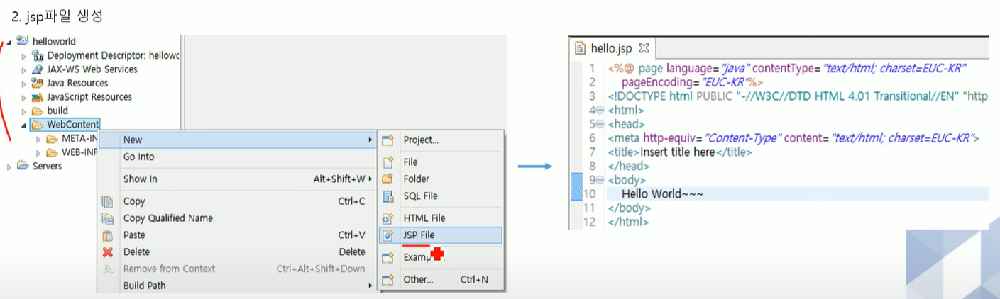
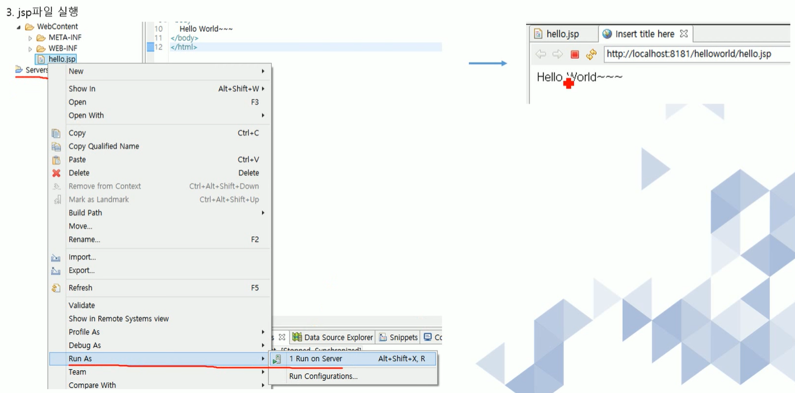
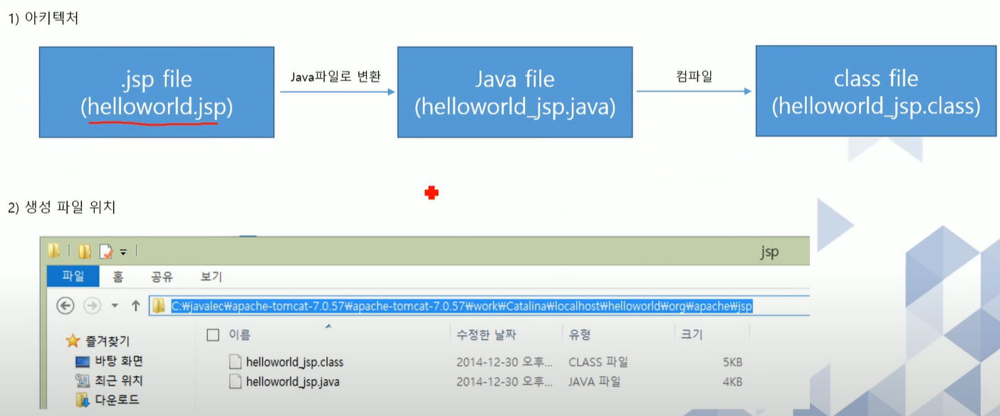
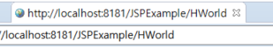
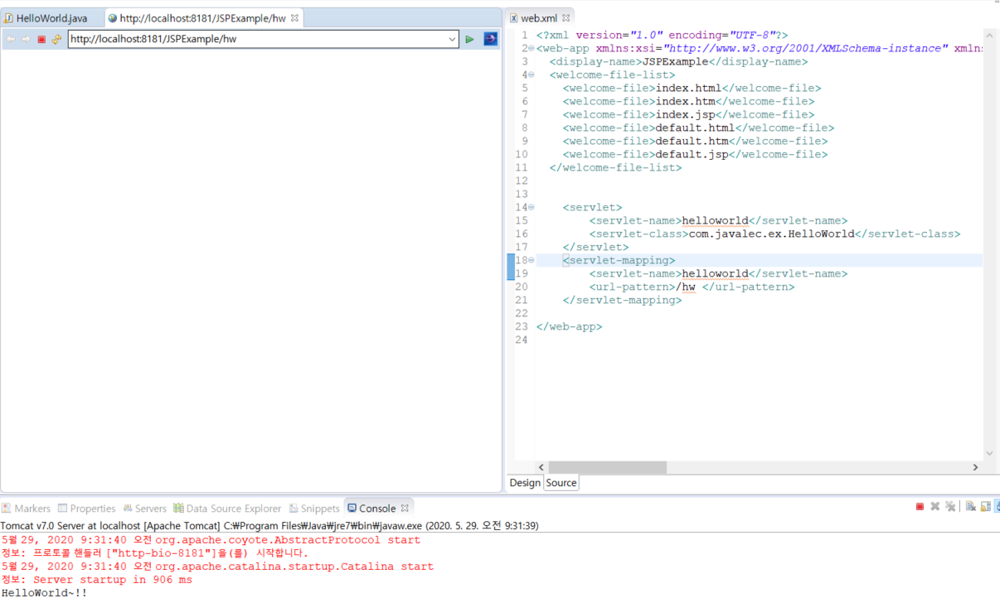
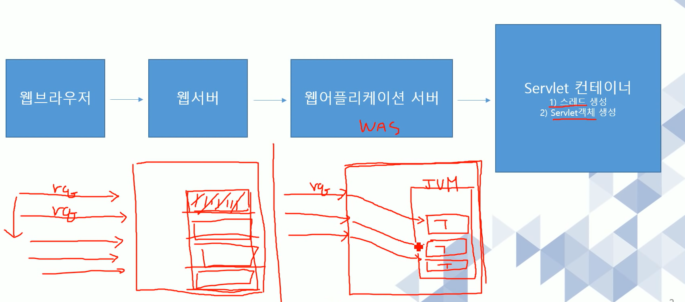

# 목차

[TOC]


# 1. 웹 프로그래밍 

## 1-1 웹 프로그래밍이란? 

1. 웹프로그래밍이란  웹 애플리케이션을 구현하는 행위 

2. 웹 애플리케이션이란, 웹을 기반으로 작동되는 프로그램

3. 웹이란 1개 이상의 사이트가 연결되어 있는 인터넷 서비스의 한가지 형태를 의미 

4. 인터넷이란, 1개 이상의 네트워크가 연결되어 있는 형태


- **프로토콜 ( Protocol )**  : 네트워크 상에서 약속한 통신규약(Http, FTP, SMTP, POP, DHCP)
  - FTP : File Transfrom Protocol  - 파일을 주고 받을 때 사용하는 프로토콜 
  - SMTP - 메일을 전송해주는 것
  - POP -  메일을 받는 것 
  - DHCP - 동적으로 IP 주소가 바뀌는 것. 
- **IP** : 네트워크 상에서 컴퓨터를 식별할 수 있는 주소 
- **DNS** : IP 주소를 인간이 쉽게 외우도록 맵핑한 문자열 
- **Port** : IP 주소가 컴퓨터를 식별할 수 있게 해준다면, Port 번호는 해당 컴퓨터의 구동되고 있는 **프로그램을 구분할 수 있는 번호** 

​	


## 1-2 JAVA웹 

JAVA 플랫폼( J2SE, J2EE, J2ME(모바일환경) ) 중에서 J2EE를 이용한 웹 프로그래밍


## 1-3 웹 프로그램의 동작 


## 1-4 필요한 학습 


1. JAVA : Java 웹 애플리케이션을 구현하기 위한 선행 학습 필요
2. HTML : 웹 애플리케이션을 구현하기 위한 기본 언어 
3. JavaScript : 클라이언트 기능을 구현하기 위한 언어 
4. JQuery : JavaScript 의 대표적인 라이브러리로써, 클라이언트 사이드 스크립트 언어를 단순화 할 수 있다. 
5. CSS : 웹 애플리케이션의 레이아웃 및 스타일을 지정하는 언어 


# 3. JSP 맛보기 


## 3-1 JSP 문서 작성하기 

**JSP 특징** 

- **동적** 웹 애플리케이션 컴포넌트
- .jsp 확장자 
- 클라이언트의 요청에 동적으로 작동하고, 응답은 html을 이용.
- jsp는 **서블릿으로 변환되어 실행** 
- MVC패턴에서 View 로 이용됨 . 




1. **프로젝트 생성**





Context root : 각 프로젝트를 구분하는 이름 (하나하나의 웹 애플리케이션을 지칭하는 이름)


2. JSP 파일 생성 



`<head /> ` : 어떠한 정보를 정의 

`<body />` : 화면에 출력되는 부분 


3. JSP 파일 실행 




- `Ctrl + F11`  : 해당 파일을 서버에서 실행 


## 3-2 JSP 아키텍처 





# 4. Servlet 맛보기 


HttpServlet 를 상속받아야 Servlet 클래스가 된다. 


Servlet 파일은 `Java Resources-src` 밑에 생성이 된다. 


anotation 을 이용하여 `HWorld` 라는 닉네임을 지정




url 맵핑 경로 : http://localhost:8181/`contextRoot명` /`닉네임`


맵핑을 하는 방법 2가지 

1. web.xml 을 이용 

   

2. 자바 anotation 을 이용하는 방법

   해당 자바 코드 안에 `@WebServlet("hw")`


# 5강 Servlet 본격적으로 살펴보기


`doGet` 


요청하는 객체는 클라이언트로부터 정보를 받을 수 있다. 


```java
response.setContentType("text/html")
```

응답을 해줄 때는 html 파일 형식으로 응답을 한다. 


  



서버의 요청이 있을 때 마다 스레드가 생성되어 실행되기 때문에 다른 CGI 에 비해서 부하가 적다. 


HttpServletRequest 객체를 이용하여 Parameter 값을 얻는다. 

`getParameter(name)` : 이름에 해당되는 value 값을 얻는것. 

`getParameterValues(name)` : 체크박스 처럼 값이 여러개일 경우 사용 

`getParameterNames()` : html 에서 넘어온 이름들을 얻는 것. 

반환값은 다 string 


Tomcat 은 한글을 지원하지 않기 때문에 개발자가 별도의 한글인코딩을 하지 않으면 한글이 깨져보이는 현상이 있다. 

get 의 한글 설정은 server.xml 파일에서 해주면 되고 , post 의 한글 설정은 자바 파일 내에서 해주면 된다. 


서블릿 초기화 파라미터는 `<servlet> </servlet> ` 내에 입력해줘야한다.  - 특정 서블릿에만 해당되기 때문에. 


ServletContext 는 특정한 서블릿만 사용하는 것이 아니기 때문에, web.xml 의 공통부분에 기술한다. 주의할 점은 서블릿을 맵핑하는 태그보다는 상단에 위치해야한다. 

