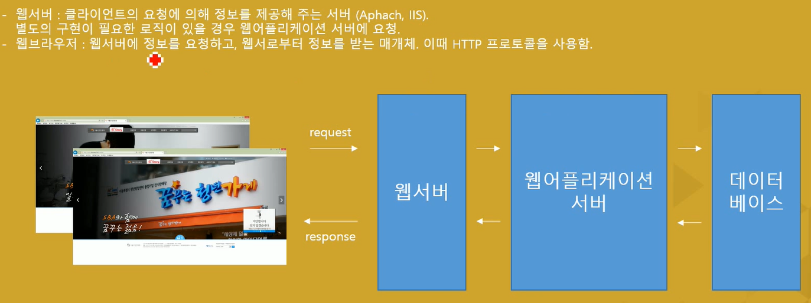
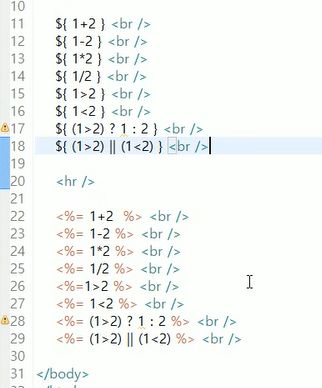
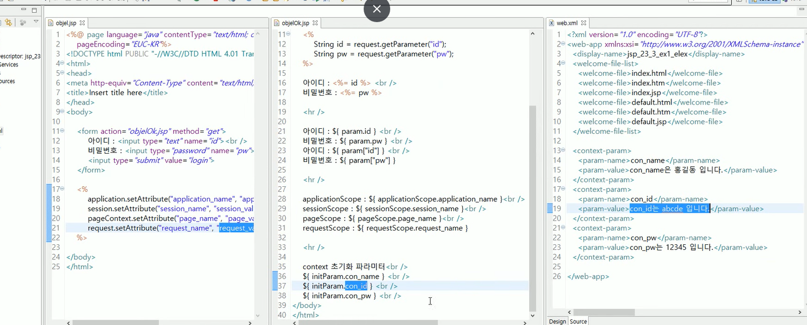
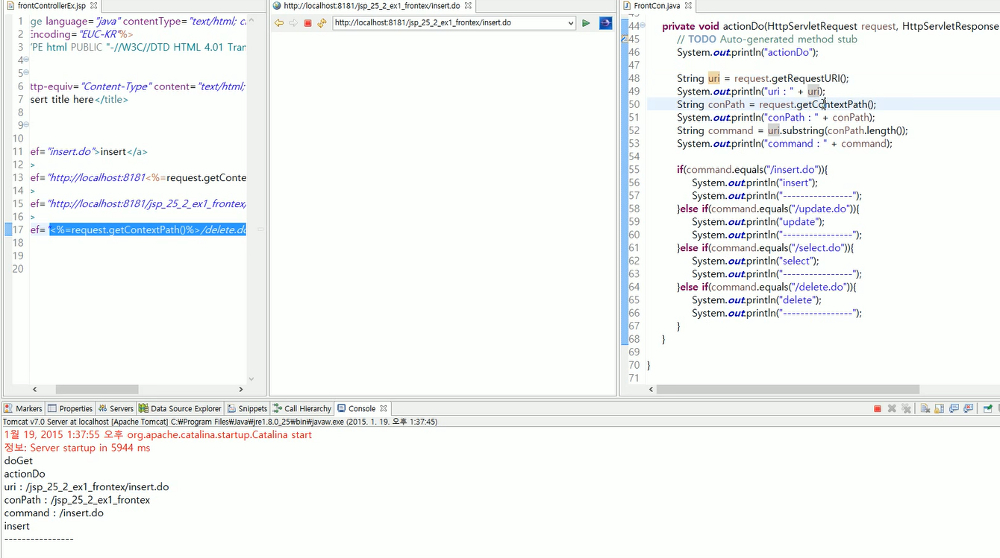

# 목차

[TOC]


# 1. 웹 프로그래밍 

## 1-1 웹 프로그래밍이란? 

1. 웹프로그래밍이란  웹 애플리케이션을 구현하는 행위 

2. 웹 애플리케이션이란, 웹을 기반으로 작동되는 프로그램

3. 웹이란 1개 이상의 사이트가 연결되어 있는 인터넷 서비스의 한가지 형태를 의미 

4. 인터넷이란, 1개 이상의 네트워크가 연결되어 있는 형태


- **프로토콜 ( Protocol )**  : 네트워크 상에서 약속한 통신규약(Http, FTP, SMTP, POP, DHCP)
  - FTP : File Transfrom Protocol  - 파일을 주고 받을 때 사용하는 프로토콜 
  - SMTP - 메일을 전송해주는 것
  - POP -  메일을 받는 것 
  - DHCP - 동적으로 IP 주소가 바뀌는 것. 
- **IP** : 네트워크 상에서 컴퓨터를 식별할 수 있는 주소 
- **DNS** : IP 주소를 인간이 쉽게 외우도록 맵핑한 문자열 
- **Port** : IP 주소가 컴퓨터를 식별할 수 있게 해준다면, Port 번호는 해당 컴퓨터의 구동되고 있는 **프로그램을 구분할 수 있는 번호** 

​	


## 1-2 JAVA웹 

JAVA 플랫폼( J2SE, J2EE, J2ME(모바일환경) ) 중에서 J2EE를 이용한 웹 프로그래밍


## 1-3 웹 프로그램의 동작 





## 1-4 필요한 학습 


1. JAVA : Java 웹 애플리케이션을 구현하기 위한 선행 학습 필요
2. HTML : 웹 애플리케이션을 구현하기 위한 기본 언어 
3. JavaScript : 클라이언트 기능을 구현하기 위한 언어 
4. JQuery : JavaScript 의 대표적인 라이브러리로써, 클라이언트 사이드 스크립트 언어를 단순화 할 수 있다. 
5. CSS : 웹 애플리케이션의 레이아웃 및 스타일을 지정하는 언어 


# 3. JSP 맛보기 


## 3-1 JSP 문서 작성하기 

**JSP 특징** 

- **동적** 웹 애플리케이션 컴포넌트
- .jsp 확장자 
- 클라이언트의 요청에 동적으로 작동하고, 응답은 html을 이용.
- jsp는 **서블릿으로 변환되어 실행** 
- MVC패턴에서 View 로 이용됨 . 


1. **프로젝트 생성**


Context root : 각 프로젝트를 구분하는 이름 (하나하나의 웹 애플리케이션을 지칭하는 이름)


2. JSP 파일 생성 


`<head /> ` : 어떠한 정보를 정의 

`<body />` : 화면에 출력되는 부분 


3. JSP 파일 실행 


- `Ctrl + F11`  : 해당 파일을 서버에서 실행 


## 3-2 JSP 아키텍처 


# 4. Servlet 맛보기 


HttpServlet 를 상속받아야 Servlet 클래스가 된다. 


Servlet 파일은 `Java Resources-src` 밑에 생성이 된다. 


anotation 을 이용하여 `HWorld` 라는 닉네임을 지정


url 맵핑 경로 : http://localhost:8181/`contextRoot명` /`닉네임`


맵핑을 하는 방법 2가지 

1. web.xml 을 이용 

   

2. 자바 anotation 을 이용하는 방법

   해당 자바 코드 안에 `@WebServlet("hw")`


# 5강 Servlet 본격적으로 살펴보기


`doGet` 


요청하는 객체는 클라이언트로부터 정보를 받을 수 있다. 


```java
response.setContentType("text/html")
```

응답을 해줄 때는 html 파일 형식으로 응답을 한다. 


  


서버의 요청이 있을 때 마다 스레드가 생성되어 실행되기 때문에 다른 CGI 에 비해서 부하가 적다. 


HttpServletRequest 객체를 이용하여 Parameter 값을 얻는다. 

`getParameter(name)` : 이름에 해당되는 value 값을 얻는것. 

`getParameterValues(name)` : 체크박스 처럼 값이 여러개일 경우 사용 

`getParameterNames()` : html 에서 넘어온 이름들을 얻는 것. 

반환값은 다 string 


Tomcat 은 한글을 지원하지 않기 때문에 개발자가 별도의 한글인코딩을 하지 않으면 한글이 깨져보이는 현상이 있다. 

get 의 한글 설정은 server.xml 파일에서 해주면 되고 , post 의 한글 설정은 자바 파일 내에서 해주면 된다. 


서블릿 초기화 파라미터는 `<servlet> </servlet> ` 내에 입력해줘야한다.  - 특정 서블릿에만 해당되기 때문에. 


ServletContext 는 특정한 서블릿만 사용하는 것이 아니기 때문에, web.xml 의 공통부분에 기술한다. 주의할 점은 서블릿을 맵핑하는 태그보다는 상단에 위치해야한다. 


# 18강 데이터베이스 2 


JDBC의 특징은 다양한 데이터베이스에 대해서 별도의 프로그램을 만들 필요 없이, 해당 데이터 베이스의 JDBC를 이용하면 하나의 프로그램으로 데이터베이스를 관리할 수 있다. 


#### 데이터베이스 연결 순서 


**JDBC 드라이버 로드**   :  [DriverManager] - `Class.forName()` 

**데이터베이스 연결**  :  [Connection] - `DriverManager.getConnection(url, uid, upw);` 

**SQL문 실행** :  [Statement]  - `connection.createStatement()` 

**데이터베이스 연결 해제**  : [ResultSet]  -  `statement.executeQuery()` , `statement.executeUpdate()` 


##### Statement 객체 - 쿼리를 실행하는 객체

- `executeQuery()` : SQL문 실행 후 여러 개의 결과값 생기는 경우 사용  (반환형이 ResultSet 객체)

  ex_ select 

- `executeUpdate()` : SQL문 실행 후 테이블의 내용만 변경되는 경우 사용 ( 반환형이 int 형 )

  ex_ insert, delete, update 


-  ResultSet 레코드 셋 
  - next() : 다음 레코드로 이동 
  - previous() : 이전 레코드로 이동 
  - first() : 처음으로 이동 
  - last() : 마지막으로 이동 
  - get메소드(getString, getInt) 


```java
<%!
    Connection connection ; 
	Statement statement; 
	ResultSet resultSet; 
 
	String driver = "com.microsoft.sqlserver.jdbc.SQLServerDriver"; 
	String url = "jdbc:sqlserver://localhost:9036; database=master; integratedSecurity=true";
    String query = "select * from member"; 
%>
        
<%
	try{
        Class.forName(driver);  // JDBC 드라이버 로드 
        connection = DriverManager.getConnection(url);  // 데이터베이스 연결 
        statement = connection.createStatement(); 
        resultSet = statement.executeQuery(query); 
        
        while(resultSet.next()){
            ...
        }
    }
%>
```


# 19강 데이터베이스 3 


### 실습 흐름도


#### join.html

```html
<!DOCTYPE html>
<html>
<head>
<meta charset="EUC-KR">
<title>Insert title here</title>
</head>
<body>
	<form action="JoinOk.java" method = "post">
		이름 : <input type="text" name = "name" size = "10"><br />
		아이디 : <input type="text" name = "id" size ="10"><br />
		비밀번호 : <input type="password" name="pw" size ="10"><br />
		전화번호 :  <select name ="phone1">
			<option value="010">010</option>
			<option value="016">016</option>
			<option value="017">017</option>
			<option value="018">018</option>
			<option value="019">019</option>
			<option value="011">011</option>
		</select> - 
		<input type="text" name ="phone2" size = "4" >-<input type="text" name ="phone3" size = "4" ><br />
		성별 구분 : <input type="radio" name="gender" value ="man"> 남자 &nbsp; <input type="radio" name="gender" value="woman">여자<br />
		<input type="submit" value="회원가입"> <input type="reset" value = "취소">
	</form>
</body>
</html>
```


#### JoinOk.java  - servlet 

```java
package com.javalec.ex;

import java.io.IOException;

import javax.servlet.ServletException;
import javax.servlet.annotation.WebServlet;
import javax.servlet.http.HttpServlet;
import javax.servlet.http.HttpServletRequest;
import javax.servlet.http.HttpServletResponse;

import java.sql.*; 

@WebServlet("/JoinOk")
public class JoinOk extends HttpServlet {
	private static final long serialVersionUID = 1L;
    
	private Connection connection ; 
	private Statement stmt; 
	
	private String id, pw, name, phone1, phone2, phone3, gender; 
	
    public JoinOk() {
        super();
    
    }

	protected void doGet(HttpServletRequest request, HttpServletResponse response) throws ServletException, IOException {
		// TODO Auto-generated method stub
	}

	protected void doPost(HttpServletRequest request, HttpServletResponse response) throws ServletException, IOException {
		actionDo(request, response); 
	}
	
	private void actionDo(HttpServletRequest req, HttpServletResponse res) throws ServletException, IOException{
		req.setCharacterEncoding("EUC-KR");
		
		id = req.getParameter("id");
		pw = req.getParameter("pw");
		name = req.getParameter("name");
		phone1 = req.getParameter("phone1");
		phone2 = req.getParameter("phone2");
		phone3 = req.getParameter("phone3");
		gender = req.getParameter("gender");
		
		String query = "insert into member values ('"+name+"','"+id+"','"+pw + "','" + phone1 + "','" + phone2 + "','" + phone3 + "','" + gender + "')";
		
		try{
			Class.forName("com.microsoft.sqlserver.jdbc.SQLServerDriver"); 
			connection = DriverManager.getConnection("jdbc:sqlserver://localhost:9036;database=master;integratedSecurity=true");
			stmt = connection.createStatement(); 
			int i = stmt.executeUpdate(query); 
			
			if(i==1){
				System.out.println("insert success");
				res.sendRedirect("joinResult.jsp"); 
			}else{
				System.out.println("insert fail");
				res.sendRedirect("join.html"); 
			}
		}catch(Exception e){
			e.printStackTrace(); 
		}finally{
			try{
				if(connection != null) connection.close(); 
				if(stmt != null) stmt.close(); 
			}catch(Exception e2){
				e2.printStackTrace();
			}
		}
	}
}
```


#### joinResult.jsp

```jsp
<%@ page language="java" contentType="text/html; charset=EUC-KR"
    pageEncoding="EUC-KR"%>
<!DOCTYPE html PUBLIC "-//W3C//DTD HTML 4.01 Transitional//EN" "http://www.w3.org/TR/html4/loose.dtd">
<html>
<head>
<meta http-equiv="Content-Type" content="text/html; charset=EUC-KR">
<title>Insert title here</title>
</head>
<body>
	회원가입이 정상 처리 되었습니다. <br />
	<a href = "login.html"> 로그인 </a>
</body>
</html>
```


#### login.html

```html
<!DOCTYPE html>
<html>
<head>
<meta charset="EUC-KR">
<title>Insert title here</title>
</head>
<body>
	<form action="LoginOk" method="post">
		아이디 : <input type="text" name="id"><br />
		비밀번호 : <input type="text" name="pw"><br />
		<input type="submit" value="로그인">
	</form>
</body>
</html>
```


#### LoginOk.java - servlet 

```java
package com.javalec.ex;

import java.io.IOException;

import javax.servlet.ServletException;
import javax.servlet.annotation.WebServlet;
import javax.servlet.http.HttpServlet;
import javax.servlet.http.HttpServletRequest;
import javax.servlet.http.HttpServletResponse;
import javax.servlet.http.HttpSession;

import java.sql.*; 

@WebServlet("/LoginOk")
public class LoginOk extends HttpServlet {
	private static final long serialVersionUID = 1L;
       
	private Connection conn; 
	private Statement stmt; 
	private ResultSet resultSet; 
	
	private String name, id, pw, phone1, phone2, phone3, gender ;
	

    public LoginOk() {
        super();
        // TODO Auto-generated constructor stub
    }


	protected void doGet(HttpServletRequest request, HttpServletResponse response) throws ServletException, IOException {
		// TODO Auto-generated method stub
	}


	protected void doPost(HttpServletRequest request, HttpServletResponse response) throws ServletException, IOException {
		actionDo(request, response); 
	}
	
	private void actionDo(HttpServletRequest req, HttpServletResponse res) throws IOException, ServletException {
		
		id = req.getParameter("id"); 
		pw = req.getParameter("pw");
		
		String query = "select * from member where id = '"+ id+ "'and pw = '" + pw + "'";
		String driver = "com.microsoft.sqlserver.jdbc.SQLServerDriver";
		String url = "jdbc:sqlserver://localhost:9036;database=master;integratedSecurity=true";
		
		try{
			Class.forName(driver); 
			conn = DriverManager.getConnection(url); 
			stmt = conn.createStatement(); 
			resultSet = stmt.executeQuery(query); 
			
			while(resultSet.next()){
				name = resultSet.getString("name"); 
				id = resultSet.getString("id");
				pw = resultSet.getString("pw");
				phone1 = resultSet.getString("phone1");
				phone2 = resultSet.getString("phone2");
				phone3 = resultSet.getString("phone3");
				gender = resultSet.getString("gender");
			}
			
			HttpSession httpSession = req.getSession(); 
			httpSession.setAttribute("name",name); 
			httpSession.setAttribute("id", id); 
			httpSession.setAttribute("pw", pw); 
			
			res.sendRedirect("loginResult.jsp");
		}catch(Exception e){
			e.printStackTrace();
		}finally{
			try{
				if(stmt != null) stmt.close(); 
				if(conn != null ) conn.close(); 
				if(resultSet != null) resultSet.close(); 
			}catch(Exception e2){
				e2.printStackTrace();
			}
		}
	}
}
```


#### loginResult.jsp

```jsp
<%@ page language="java" contentType="text/html; charset=EUC-KR"
    pageEncoding="EUC-KR"%>
<!DOCTYPE html PUBLIC "-//W3C//DTD HTML 4.01 Transitional//EN" "http://www.w3.org/TR/html4/loose.dtd">
<html>
<head>
<meta http-equiv="Content-Type" content="text/html; charset=EUC-KR">
<title>Insert title here</title>
</head>
<body>
	<%!
		String id, name, pw; 
	%>
	
	<%
		id = (String)session.getAttribute("id"); 
		name = (String)session.getAttribute("name"); 
		pw = (String)session.getAttribute("pw"); 
	%>
	
	<%= name %> 님 안녕하세요. <br />
	
	<a href="modify.jsp"> 정보 수정하기 </a>
</body>
</html>
```


#### modify.jsp 

```jsp
<%@page import="java.sql.DriverManager"%>
<%@page import="java.sql.ResultSet"%>
<%@page import="java.sql.Statement"%>
<%@page import="java.sql.Connection"%>
<%@ page language="java" contentType="text/html; charset=EUC-KR"
    pageEncoding="EUC-KR"%>
<!DOCTYPE html PUBLIC "-//W3C//DTD HTML 4.01 Transitional//EN" "http://www.w3.org/TR/html4/loose.dtd">
<html>
<head>
<meta http-equiv="Content-Type" content="text/html; charset=EUC-KR">
<title>Insert title here</title>
</head>
<body>
	<%!
		Connection conn; 
		Statement stmt; 
		ResultSet resultSet; 
		
		String id, pw, name, phone1, phone2, phone3, gender ; 
	%>
	
	<%
		id = (String)session.getAttribute("id"); 
	
		String query = "select * from member where id= '" + id + "'";
		
		Class.forName("com.microsoft.sqlserver.jdbc.SQLServerDriver"); 
		conn = DriverManager.getConnection("jdbc:sqlserver://localhost:9036;database=master;integratedSecurity=true");
		stmt = conn.createStatement(); 
		resultSet = stmt.executeQuery(query); 
		
		while(resultSet.next()){
			name = resultSet.getString("name");
			pw = resultSet.getString("pw"); 
			phone1 = resultSet.getString("phone1"); 
			phone2 = resultSet.getString("phone2"); 
			phone3 = resultSet.getString("phone3"); 
			gender = resultSet.getString("gender"); 
		}
	%>
	
	<form action ="ModifyOk" method = "post">
		이름 : <input type="text" name = "name" size = "10" value=<%= name %>><br />
		아이디 : <%= id %><br />
		비밀번호 : <input type="password" name ="pw" size="10" ><br />
		전화번호 : <select name="phone1">
			<option value="010">010</option>
			<option value="016">016</option> 
			<option value="017">017</option>
			<option value="018">018</option>
			<option value="019">019</option>
			<option value="011">011</option>
		</select> - 
		<input type="text" name="phone2" size="5" value=<%= phone2 %>> - <input type="text" name="phone3" size="5" value=<%= phone3 %>> <br />
		
		<%
			if(gender.equals("man")){
		%>
		성별 구분 : <input type = "radio" name = "gender" value ="man" checked="checked"> 남 &nbsp; <input type = "radio" name="gender" value ="woman">여 <br />
		<%
			} else{
		%>
				성별 구분 : <input type = "radio" name = "gender" value ="man"> 남 &nbsp; <input type = "radio" name="gender" value ="woman" checked = "checked">여 <br />
		<% } %>
		
		<input type="submit" value="정보수정"> <input type="reset" value="취소">
		
	</form>
</body>
</html>
```


#### ModifyOk.java - servlet

```java
package com.javalec.ex;

import java.io.IOException;

import javax.servlet.ServletException;
import javax.servlet.annotation.WebServlet;
import javax.servlet.http.HttpServlet;
import javax.servlet.http.HttpServletRequest;
import javax.servlet.http.HttpServletResponse;
import javax.servlet.http.HttpSession;

import java.sql.*; 


@WebServlet("/ModifyOk")
public class ModifyOk extends HttpServlet {
	private static final long serialVersionUID = 1L;

	private Connection connection; 
	private Statement stmt; 
	private ResultSet resultSet; 
	HttpSession httpSession; 
	
	private String name, id, pw, phone1, phone2, phone3, gender;  
	
    public ModifyOk() {
        super();
        // TODO Auto-generated constructor stub
    }


	protected void doGet(HttpServletRequest request, HttpServletResponse response) throws ServletException, IOException {
		// TODO Auto-generated method stub
	}


	protected void doPost(HttpServletRequest request, HttpServletResponse response) throws ServletException, IOException {
		// TODO Auto-generated method stub
		actionDo(request, response); 
	}
	
	private void actionDo(HttpServletRequest req, HttpServletResponse res) throws ServletException, IOException{
		req.setCharacterEncoding("EUC-KR");
		httpSession = req.getSession(); 
		
		name = req.getParameter("name"); 
		id = req.getParameter("id");
		pw = req.getParameter("pw");
		phone1= req.getParameter("phone1");
		phone2= req.getParameter("phone2");
		phone3= req.getParameter("phone3");
		gender = req.getParameter("gender");
		
		if(pwConfirm()){
			System.out.println("OK");
			String query = "update member set name = '" + name + "', phone1 = '" + phone1 + "',phone2 = '" + phone2 + "',phone3='" + phone3 + "',gender='" + gender + "'";
			
			try{
				Class.forName("com.microsoft.sqlserver.jdbc.SQLServerDriver");
				connection = DriverManager.getConnection("jdbc:sqlserver://localhost:9036;database=master;integratedSecurity=true"); 
				stmt = connection.createStatement(); 
				int i = stmt.executeUpdate(query); 
				
				if(i==1){
					System.out.println("update sucess");
					httpSession.setAttribute("name",name); 
					res.sendRedirect("modifyResult.jsp"); 
				}else{
					System.out.println("update fail");
					res.sendRedirect("modify.jsp");
				}
			}catch(Exception e){
				e.printStackTrace(); 
			}finally{
				try{
					if(stmt != null) stmt.close(); 
					if(connection != null) connection.close(); 
				}catch(Exception e2){
					e2.printStackTrace();
				}
			}
		}else{
			System.out.println("NG");
		}
	}
	
	
	private boolean pwConfirm(){
		boolean rs = false; 
		String sessionPw = (String)httpSession.getAttribute("pw"); 
		
		if(sessionPw.equals(pw)){
			rs= true; 
		}else{
			rs = false; 
		}
		return rs; 
	}
}
```


#### modifyResult.jsp

```jsp
<%@ page language="java" contentType="text/html; charset=EUC-KR"
    pageEncoding="EUC-KR"%>
<!DOCTYPE html PUBLIC "-//W3C//DTD HTML 4.01 Transitional//EN" "http://www.w3.org/TR/html4/loose.dtd">
<html>
<head>
<meta http-equiv="Content-Type" content="text/html; charset=EUC-KR">
<title>Insert title here</title>
</head>
<body>
	<%= session.getAttribute("name") %>님의 회원정보 수정이 정상 처리 되었습니다. <br />
	
	<a href = "logout.jsp">로그아웃</a> &nbsp; 
	<a href = "modify.jsp">정보수정</a>
</body>
</html>
```


#### logout.jsp

```jsp
<%@ page language="java" contentType="text/html; charset=EUC-KR"
    pageEncoding="EUC-KR"%>
<!DOCTYPE html PUBLIC "-//W3C//DTD HTML 4.01 Transitional//EN" "http://www.w3.org/TR/html4/loose.dtd">
<html>
<head>
<meta http-equiv="Content-Type" content="text/html; charset=EUC-KR">
<title>Insert title here</title>
</head>
<body>
	<%
		session.invalidate(); 
		response.sendRedirect("login.html"); 
	%>
</body>
</html>
```


# 20강. 커넥션풀 


### DAO _ DTO

- **DAO** : Data Access Object  
  - DB에 접근하여 어떠한 로직을 수행하는 객체 
  - 데이터베이스에 접속해서 데이터 추가, 삭체, 수정 등의 작업을 하는 클래스. 
  - 유지보수 및 코드의 모듈화를 위해 별도의 DAO 클래스를 만들어 사용한다. 


- **DTO** : Data Transfer Object 

  - Data를 모아서 객체로 묶어서 하나로 관리하는 객체  
  - DAO 클래스를 이용하여 데이터베이스에서 데이터를 관리할 때 데이터를 일반적인 변수에 할당하여 작업할 수도 있지만, 해당 데이터의 클래스르 만들어 사용. 

  

#### 예제 1) 

##### MemberDTO.java

```java
package com.javalec.daotoex;

public class MemberDTO {

	private String name;
	private String id;
	private String pw;
	private String phone1;
	private String phone2;
	private String phone3;
	private String gender;
	
	public MemberDTO(String name, String id, String pw, String phone1, String phone2, String phone3, String gender) {
		this.name = name;
		this.id = id;
		this.pw = pw;
		this.phone1 = phone1;
		this.phone2 = phone2;
		this.phone3 = phone3;
		this.gender = gender;
	}

	// ... 
    //     getter , setter 존재 
    // ...
}
```

##### MemberDAO.java

```java
package com.javalec.daotoex;

import java.sql.Connection;
import java.sql.DriverManager;
import java.sql.ResultSet;
import java.sql.Statement;
import java.util.ArrayList;

public class MemberDAO {

	private String url = "jdbc:sqlserver://localhost:9036;database=master;integratedSecurity=true";
	
	public MemberDAO() {
		try {
			Class.forName("com.microsoft.sqlserver.jdbc.SQLServerDriver");
		} catch (Exception e) {
			e.printStackTrace();
		}
	}
	
	public ArrayList<MemberDTO> memberSelect() {
		
		ArrayList<MemberDTO> dtos = new ArrayList<MemberDTO>();
		
		Connection con =null;
		Statement stmt = null;
		ResultSet rs = null;
		
		try {
			con = DriverManager.getConnection(url);
			stmt = con.createStatement();
			rs = stmt.executeQuery("select * from member");
			
			while (rs.next()) {
				String name = rs.getString("name");
				String id = rs.getString("id");
				String pw = rs.getString("pw");
				String phone1 = rs.getString("phone1");
				String phone2 = rs.getString("phone2");
				String phone3 = rs.getString("phone3");
				String gender = rs.getString("gender");
				
				MemberDTO dto = new MemberDTO(name, id, pw, phone1, phone2, phone3, gender);
				dtos.add(dto);
			}
		} catch (Exception e) {
			e.printStackTrace();
		} finally {
			try {
				if(rs != null) rs.close();
				if(stmt != null) stmt.close();
				if(con != null) con.close();
			} catch (Exception e) {
				e.printStackTrace();
			}
		}
		return dtos;
	}
}
```

##### memberSelect.jsp

```jsp
<%@page import="com.javalec.daotoex.MemberDTO"%>
<%@page import="java.util.ArrayList"%>
<%@page import="com.javalec.daotoex.MemberDAO"%>
<%@ page language="java" contentType="text/html; charset=EUC-KR"
    pageEncoding="EUC-KR"%>
<!DOCTYPE html PUBLIC "-//W3C//DTD HTML 4.01 Transitional//EN" "http://www.w3.org/TR/html4/loose.dtd">
<html>
<head>
<meta http-equiv="Content-Type" content="text/html; charset=EUC-KR">
<title>Insert title here</title>
</head>
<body>

	<%
		MemberDAO memberDAO = new MemberDAO();
		ArrayList<MemberDTO> dtos = memberDAO.memberSelect();
		
		for(int i=0; i<dtos.size(); i++) {
			MemberDTO dto = dtos.get(i);
			String name = dto.getName();
			String id = dto.getId();
			String pw = dto.getPw();
			String phone = dto.getPhone1() + " - "+ dto.getPhone2() + " - " + dto.getPhone3();
			String gender = dto.getGender();
			
			out.println("이름 : " + name + ", 아이디 : " + id + ", 비밀번호 : " + pw + ", 연락처 : " + phone + ",  성별 : " + gender + "<br />" );
		}	
	%>
</body>
</html>
```


### PreparedStatement 객체 

- Statement 객체의 중복 코드가 많아지는 단점을 보완한 객체 

- query 문 작성 이후 SET 을 이용하여 값들을 삽입. 

  ```java
  Class.forName(driver); 
  connection = DriverManager.getConnection(url, uid, upw); 
  int n; 
  String query = "insert into memberforpre (id, pw, name, phone ) values (?,?,?,?)"; 
  preparedStatement = connection.prepareStatement(query); 
  
  preparedStatement.setString(1, "abc"); 
  preparedStatement.setString(2, "1235"); 
  preparedStatement.setString(3, "홍길동"); 
  preparedStatement.setString(4, "010-1234-5678"); 
  n = preparedStatement.executeUpdate(); 
  ```


#### 예제 2) 

##### memberDatainsert.jsp 

```jsp
<%@page import="java.sql.PreparedStatement"%>
<%@page import="java.sql.DriverManager"%>
<%@page import="java.sql.ResultSet"%>
<%@page import="java.sql.Connection"%>
<%@ page language="java" contentType="text/html; charset=EUC-KR"
    pageEncoding="EUC-KR"%>
    <%!
		Connection connection;
		PreparedStatement preparedStatement;
		ResultSet resultSet;
	
		String driver = "com.microsoft.sqlserver.jdbc.SQLServerDriver";
		String url = "jdbc:sqlserver://localhost:9036;database=master;integratedSecurity=true";
	%>
<!DOCTYPE html PUBLIC "-//W3C//DTD HTML 4.01 Transitional//EN" "http://www.w3.org/TR/html4/loose.dtd">
<html>
<head>
<meta http-equiv="Content-Type" content="text/html; charset=EUC-KR">
<title>Insert title here</title>
</head>
<body>

	<%
		try{
			
			Class.forName(driver);
			connection = DriverManager.getConnection(url);
			int n;
			String query = "insert into member (id, pw, name, phone) values (?, ?, ?, ?)";
			preparedStatement = connection.prepareStatement(query);
			
			preparedStatement.setString(1, "abc");
			preparedStatement.setString(2, "123");
			preparedStatement.setString(3, "홍길동");
			preparedStatement.setString(4, "010-1234-5678");
			n = preparedStatement.executeUpdate();
			
			preparedStatement.setString(1, "def");
			preparedStatement.setString(2, "456");
			preparedStatement.setString(3, "홍길자");
			preparedStatement.setString(4, "010-9012-3456");
			n = preparedStatement.executeUpdate();
			
			preparedStatement.setString(1, "ghi");
			preparedStatement.setString(2, "789");
			preparedStatement.setString(3, "홍길순");
			preparedStatement.setString(4, "010-7890-1234");
			n = preparedStatement.executeUpdate();
			
			preparedStatement.setString(1, "AAA");
			preparedStatement.setString(2, "111");
			preparedStatement.setString(3, "이길동");
			preparedStatement.setString(4, "010-1234-1111");
			n = preparedStatement.executeUpdate();
			
			if(n == 1) {
				out.println("insert success");
			} else { 
				out.println("insert fail");
			}
			
		} catch(Exception e) {
				e.printStackTrace();
		} finally {
			try{
				if(resultSet != null) resultSet.close();
				if(preparedStatement != null) preparedStatement.close();
				if(connection != null) connection.close();
			} catch(Exception e){}
		}
	%>
	
	<br />
	<a href="memberDateView.jsp">회원정보 보기</a>

</body>
</html>
```


### 커넥션 풀 (DBCP) 

- 클라이언트에서 다수의 요청이 발생할 경우 데이터베이스의 부하가 발생하는데 이를 해결하기 위한 기법. 
- 미리 Connection 객체들을 많이 생성하고 ,이를 이용. 


- Tomcat 컨테이너가 데이터베이스 인증을 하도록 context.xml 파일을 열어 아래의 코드를 추가. 

  ```xml
  <Resource 
            auth = "Container"
            driverClassName = 
            url = 
            username = 
            password = 
            name = 
            type = 
            maxActive = 
            maxWait = 
  />
  ```


이후 `publish to server` 버튼을 클릭하여 해당 파일을 서버와 동기화. 


#### 예제 3)

##### Tomcat 컨테이너 context.xml

```xml
	<Resource 
		auth = "Container"
		driverClassName = "com.microsoft.sqlserver.jdbc.SQLServerDriver"
		url = "jdbc:sqlserver://localhost:9036;database=master;integratedSecurity=true"
		name = "mssql-jdbc-6.4.0.jre7"
		type = "javax.sql.DataSource"
		maxActive = "50"
		maxWait = "1000"
	/>
```

##### MemberDAO.java

```java
package com.javalec.daotoex;

import java.sql.Connection;
import java.sql.DriverManager;
import java.sql.ResultSet;
import java.sql.Statement;
import java.util.ArrayList;

import javax.naming.Context;
import javax.naming.InitialContext;
import javax.sql.DataSource;

public class MemberDAO {

	private DataSource dataSource;
	
	public MemberDAO() {
		try {
			Context context = new InitialContext();
			dataSource = (DataSource)context.lookup("java:comp/env/mssql-jdbc-6.4.0.jre7");
		} catch (Exception e) {
			e.printStackTrace();
		}
	}
	
	public ArrayList<MemberDTO> memberSelect() {
		
		ArrayList<MemberDTO> dtos = new ArrayList<MemberDTO>();
		
		Connection con =null;
		Statement stmt = null;
		ResultSet rs = null;
		
		try {
			con = dataSource.getConnection();
			stmt = con.createStatement();
			rs = stmt.executeQuery("select * from member");
			
			while (rs.next()) {
				String name = rs.getString("name");
				String id = rs.getString("id");
				String pw = rs.getString("pw");
				String phone1 = rs.getString("phone1");
				String phone2 = rs.getString("phone2");
				String phone3 = rs.getString("phone3");
				String gender = rs.getString("gender");
				
				MemberDTO dto = new MemberDTO(name, id, pw, phone1, phone2, phone3, gender);
				dtos.add(dto);
			}
			
		} catch (Exception e) {
			e.printStackTrace();
		} finally {
			try {
				if(rs != null) rs.close();
				if(stmt != null) stmt.close();
				if(con != null) con.close();
			} catch (Exception e) {
				e.printStackTrace();
			}
		}
		
		return dtos;
	}
	
}

```

나머지 소스는 예제 1 번과 동일. 


# 21강 


```html
<!-- join.html -->

<input type="button" value="회원가입" onclick="javascript:window.location=join.jsp">
```

클릭 이벤트가 발생할 경우 `join.jsp` 로 이동해라 


```jsp
// joinOk.jsp 파일 

<jsp:setProperty name="dto" property = "*" />
```

`*` 를 이용해서 속성을 자동적으로 입력하게 하려면, Dto 의 속성의 변수명과 join.form 의 input 이름이 같아야 자동으로 입력이 된다. 


# 22강. 파일 업로드 


- 파일 업로드 라이브러리 다운로드 및 설치 

  http://www.servlets.com 접속 후 아래 과정을 통해 설치 

  

- 여러가지 라이브러리가 존재하고, 우리가 실습한 라이브러리는 cos.jar 파일 라이브러리이다. 

- 다운로드 받은 라이브러리를 `WEB-INF` -> `lib` 로 복사한다. 
- 업로드 파일을 저장할 폴더를 생성한다. 

#### fileForm.jsp

```jsp
<%@ page language="java" contentType="text/html; charset=EUC-KR"
    pageEncoding="EUC-KR"%>
<!DOCTYPE html PUBLIC "-//W3C//DTD HTML 4.01 Transitional//EN" "http://www.w3.org/TR/html4/loose.dtd">
<html>
<head>
<meta http-equiv="Content-Type" content="text/html; charset=EUC-KR">
<title>Insert title here</title>
</head>
<body>

	<form action="fileFormOk.jsp" method="post" enctype="multipart/form-data">
		파일 : <input type="file" name="file"><br />
		<input type="submit" value="File Upload">
	</form>

</body>
</html>
```

`enctype = "multipart/form-data"`  라고 명시를 해야 파일 첨부가 정상적으로 이루어진다. 


#### fileFormOk.jsp

```jsp
<%@page import="java.util.Enumeration"%>
<%@page import="com.oreilly.servlet.multipart.DefaultFileRenamePolicy"%>
<%@page import="com.oreilly.servlet.MultipartRequest"%>
<%@ page language="java" contentType="text/html; charset=EUC-KR"
    pageEncoding="EUC-KR"%>
<%
	String path = request.getRealPath("fileFolder");

	int size = 1024 * 1024 * 10; //10M
	String file = "";
	String oriFile = "";
	
	try{
		MultipartRequest multi = new MultipartRequest(request, path, size, "EUC-KR", new DefaultFileRenamePolicy());
		
		Enumeration files = multi.getFileNames();
		String str = (String)files.nextElement();
		
		file = multi.getFilesystemName(str);
		oriFile = multi.getOriginalFileName(str);
		
	} catch (Exception e) {
		e.printStackTrace();
	}
%>
<!DOCTYPE html PUBLIC "-//W3C//DTD HTML 4.01 Transitional//EN" "http://www.w3.org/TR/html4/loose.dtd">
<html>
<head>
<meta http-equiv="Content-Type" content="text/html; charset=EUC-KR">
<title>Insert title here</title>
</head>
<body>
 	file upload success!
</body>
</html>
```


# 23강 








# 24강 


```jsp
	<c:set var="varName" value="varValue" />
	varName : <c:out value = "${varName }" /> 
```


```jsp
	<c:set var="varName" value="varValue" />
	varName : <c:out value = "${varName }" /><br /> 
	
	<c:remove var="varName" />
	varName : <c:out value = "${varName }" />
```


```jsp
	<c:forEach var="fe" begin="0" end="100" step ="5">
		${fe}<br />
	</c:forEach>
```


# 25강 


