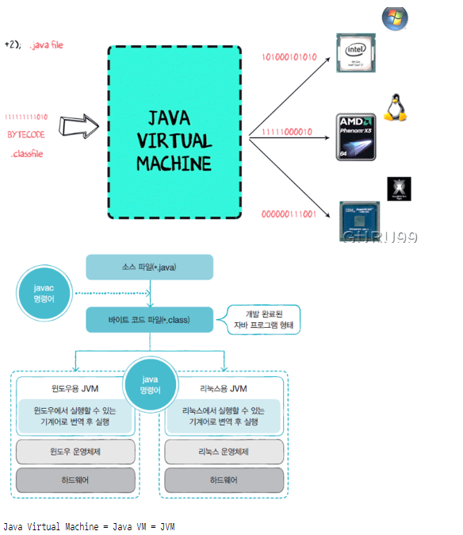
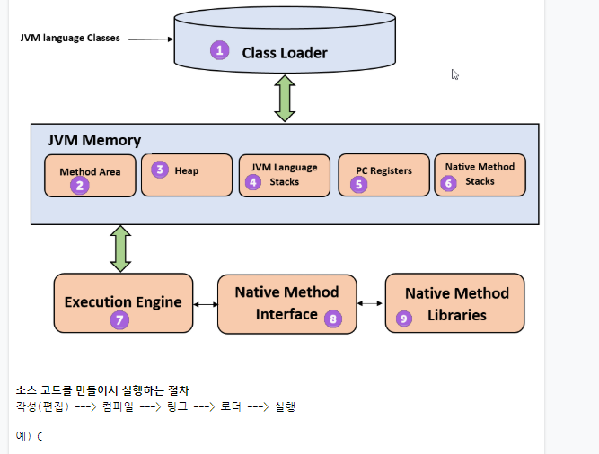
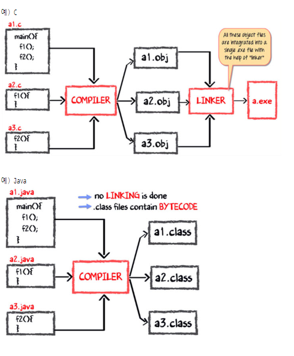
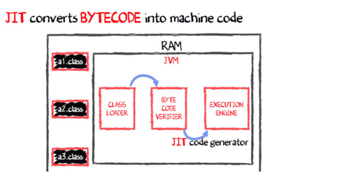

# JAVA


JRE ( Java RunTime Environment ) : 자바 프로그램이 동작하기 위한 최소 환경  ( JDK 는 JRE 를 포함하고 있다 )

IDE : 통합 개발 환경 ( 에디터 ( 편집기) + 컴파일러 + 링커 + 디버깅  )


- Java 의 버전 
  - `EE` : Enterprise Edition 
  - `SE` : Standard Edition 
  - `ME` : Micro Edition 


- What is Java ? 

  https://www.youtube.com/watch?time_continue=6&v=2Xa3Y4xz8_s&feature=emb_logo


- `Assembler`  : 사람이 어느정도 이해할 수 있는 어셈블리 언어를 기계가 이해할 수 있는 언어로 바꿔주는 도구 

- 플랫폼에 맞는 컴파일러를 이용해서 플랫폼에 맞는 각각의 실행파일을 생성해야한다. 그러나 JavaVM 이 있을 경우 플랫폼에 관계없이 동일한 코드가 실행될 수 있다. 

   .java file ------> javac ------> .class file -----> java -----> 실행 (Source)             (Byte Code)

  

- JVM 동작 

  

- JVM 구조 

  

- 소스코드를 만들어서 실행하는 절차 

  작성(편집) -> 컴파일 -> 링크 -> 로더 -> 실행 

  

  

`.java` 파일명과 class 이름은 동일해야한다. 


public : 접근 제한자 

```java
public class HelloJava{ 
	public static void main(String[] args){		
        System.out.println("Hello Java !!! "); 
    }
}
```

`static ` : 인스턴스가 하나만 생성되는 것. 

일반적으로 자바에서 class 의 이름은 대문자로 시작한다. 


패키지명은 클래스를 구분하는 용도로도 사용된다. 고로 유니크한 이름을 사용해야한다.

```javascript
public class HelloJava {
	public static void main(String[] args) {
		mulcam.msa.samples.HelloJava hj = new mulcam.msa.samples.HelloJava(); 
		hj.print();		
	}
}
```

패키지는 파일이 아닌 디렉터리 구조. 

`new` : 인스턴스를 생성할 때 사용하는 키워드. 


`Ctrl+Shift+o` : import 자동 생성. 

동일한 이름을 가진 하위 패키지를 사용할 경우에는 명시적으로 언급해야한다. 

```java
import mulcam.msa.samples.HelloWorld;
public class HelloJava {
	public static void main(String[] args) {
		mulcam.msa.samples.HelloJava hj = new mulcam.msa.samples.HelloJava(); 
		HelloWorld hw = new HelloWorld(); 
		hj.print();		
		hw.print(); 
	}
}
```


변수 : 값을 저장할 수 있는 메모리의 특정 주소에 붙여진 이름 