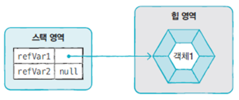

#### 참조 타입 (Reference Type)


```java
// 기본 타입 변수
int age = 25;
double price = 100.5;

// 참조 타입 변수
String name = "신용권";
String hobby = "독서";
```


#### 메모리 사용 영역 ( Runtime Data Area )


**메소드 영역 ( method area )** : 클래스별 정적 필드 (static field) , 상수 ( constant ), 생성자 ( constructor ), 메서드 (method) 코드 등을 분류해서 저장 

**힙 영역 ( heap area )** : 객체와 배열이 생성되는 영역

**JVM 스택 영역 ( stack area )**  :  메소드가 호출되면 프레임이 추가되고, 메소드 종료되면 프레임이 제거됨. 


참조 타입 변수는 스택 영역에 힙 영역에 생성된 객체의 주소를 가짐 


#### 참조 타입 변수 간 ==, != 연산 

동일 객체 ( 같은 주소 ) 참조 여부를 판단할 때 사용 . 

```java
public static void main(String[] args) throws IOException {
		String s1 = "Java String";
		String s2 = "Java String";
		String s3 = new String("Java String");
		String s4 = new String("Java String");
		
		System.out.println( s1 == s2 );
		System.out.println( s1 == s3 );
		System.out.println( s1 == s4 );
		System.out.println( s3 == s4 );
		
		String s5 = null;
		String s6 = null;
		System.out.println( s5 == s6 );	// true
}
```


#### null

참조 타입 변수는 객체를 참조하지 않는다는 뜻으로 null 값을 가질 수 있음. 

null 로 초기화 된 참조 변수도 스택 영역에 생성. 




#### NullPointerException

참조 타입 변수가 null 상태에서 존재하지 않는 객체의 데이터나 메소드를 사용하는 경우 발생 

```java
import java.io.IOException;

public static void main(String[] args) throws IOException {
		int[] intArray2;
		intArray2[0] = 100;
		
		int[] intArray = null;
		intArray[0] = 100;
		
		String str = null;
		System.out.println("총 문자수: " + str.length());
}
```


#### String 타입 변수에 문자열 리터럴을 대입하는 경우 

문자열 리터럴을 힙 영역에 String 객체로 생성하고, 변수가 String 객체를 참조 

**문자열 리터럴이 같은 경우에는 같은 String 객체를 공유** 


#### new 연산자를 이용한 String 객체 생성 

힙 영역에 새로운 String 객체를 생성 

```java
String name1 = new String("신용권");
String name2 = new String("신용권");
```


#### 문자열 리터럴과 new 연산자로 생성된 객체를 비교 

- `==` : 주소를 비교 

- `equals()`  : 값(문자열)을 비교 


String 변수에 null 대입 -> String 변수가 참조하는 객체가 없음 -> 참조를 읽은 String 객체는 Garbage Collector 을 통해 메모리에서 자옹으로 제거. 


#### 배열 

배열 변수 선언 

```java
int[] intArray; 
int intArray[]; 
```


1. 배열 생성 방법 _ **값 목록으로 배열 생성** 

   ```java
   타입[] 변수 = { 값0, 값1, 값2, ... }
   ```

   배열 변수 선언 후 다른 실행문으로 값 목록으로 배열 생성하는 것은 불가능. 

   ```java
   타입[] 변수; 
   변수 = {값0, 값1, 값2, ... }; // 컴파일 오류가 발생 
   ```

   배열 변수 선언 후 목록이 나중에 결정되는 경우 -> new 연산자를 사용 .

   ```java
   타입[] 변수; 
   변수 = new 타입[] {값0, 값1, 값2, ... }; 
   ```

2. 배열 생성 방법 _ **new 연산자를 이용한 배열 생성 -> 타입별 기본값으로 배열 요소가 초기화** 

   ```java
   타입[] 변수 = new 타입[배열크기]; 
   ```

   


#### main() 메소드의 String[] args 매개 변수 


```java
public class HelloJava
{
	public static void main(String[] args) {
		for (int i = 0; i < args.length; i ++) {
			System.out.printf("args[%d] = %s\n", i, args[i]);
		}
	}
}
```


#### LAB 

Gugudan.java 파일을 생성

파라미터로 전달한 단을 출력 (여러 단을 입력하면 낮은 단에서 높은 단으로 순차적으로 출력)

예) java Gugudan 5 7 9 4 ⇒ 4단, 5단, 7단, 9단을 출력

​					**소스코드** : 

​						**실행결과** : 


실습 예제 

1. 인원수와 이름을 입력받고 사전순으로 출력. 


2. 프로그램 실행 시 전달된 문장에 포함된 단어를 역순으로 출력하시오. 

   


#### 2차원 배열 

1. **행렬구조** 

   ```java
   int[][] scores = new int[2][3]; 
   scores.length;      -> 2 // A 
   scores[0].length;   -> 3 // B
   scores[1].length;   -> 3 // C
   ```

   

2. **계단식 구조** 

   ```java
   int[][] scores = new int[2][]; 
   scores[0] = new int [2]; 
   scores[1] = new int [3]; 
   scores.length ; 	->2 //A
   scores[0].length; 	->2 //B
   scores[1].length;   ->3 //C
   ```

   


**값 목록을 이용한 2차원 배열 생성** 

```java
타입[][] 변수 = { {값1, 값2, ... }, {값1, 값2, ...}, ...}; 
```


#### 참조 타입 배열 

```java
public class CarExample {
	public static void main(String[] args) {
		String[] strArray = new String[3] ; 
		strArray[0] = "java";
		strArray[1] = "java";
		strArray[2] = new String("Java"); 
		
		System.out.println(strArray[0] == strArray[1] );
		System.out.println(strArray[0] == strArray[2] );
		System.out.println(strArray[0].equals(strArray[1]));
		System.out.println(strArray[0].equals(strArray[2]));
	}
}
```


#### 배열 복사 

1. for문을 이용해서 요소 하나하나를 복사 

2. `System.arraycopy()` 를 이용 

   ```java
   import java.util.Arrays;
   
   public class Sample
   {
   	public static void main(String[] args) {
   		{
   			String[] sources = { "Java", "Array", "Copy" };
   			String[] targets = sources;
   			
   			System.out.println(Arrays.toString(sources));	// [Java, Array, Copy]
   			System.out.println(Arrays.toString(targets));	// [Java, Array, Copy]
   			
   			sources[2] = "Delete";
   			targets[0] = "Python";
   			
   			System.out.println(Arrays.toString(sources));	// [Python, Array, Delete]
   			System.out.println(Arrays.toString(targets));	// [Python, Array, Delete]
   		}
   	}
   }
   ```

   

   ```java
   import java.util.Arrays;
   
   public class Sample
   {
   	public static void main(String[] args) {
   		{
   			//	for 루프를 이용한 배열 값 복사
   			String[] sources = { "Java", "Array", "Copy" };
   			String[] targets = null;
   			if (sources != null) {
   				targets = new String[sources.length];
   				for (int i = 0; i < sources.length; i ++) {
   					targets[i] = sources[i];
   				}
   			}
   			System.out.println(Arrays.toString(sources));	// [Java, Array, Copy]
   			System.out.println(Arrays.toString(targets));	// [Java, Array, Copy]
   			
   			sources[2] = "Delete";
   			targets[0] = "Python";
   			
   			System.out.println(Arrays.toString(sources));	// [Java, Array, Delete]
   			System.out.println(Arrays.toString(targets));	// [Python, Array, Copy]
   		}
   	}
   }
   ```

   

   ```java
   import java.util.Arrays;
   
   public class Sample
   {
   	public static void main(String[] args) {
   		{
   			//	System.arraycopy() 이용한 배열 값 복사
   			String[] sources = { "Java", "Array", "Copy" };
   			String[] targets = null;
   			if (sources != null) {
   				targets = new String[sources.length];
   				System.arraycopy(sources, 0, targets, 0, sources.length);
   			}
   			System.out.println(Arrays.toString(sources));	// [Java, Array, Copy]
   			System.out.println(Arrays.toString(targets));	// [Java, Array, Copy]
   			
   			sources[2] = "Delete";
   			targets[0] = "Python";
   			
   			System.out.println(Arrays.toString(sources));	// [Java, Array, Delete]
   			System.out.println(Arrays.toString(targets));	// [Python, Array, Copy]
   		}
   	}
   }
   ```

   

- `System.arraycopy` 메소드를 이용해서 배열을 복사할 때 원본 배열과 타켓 배열의 크기가 다를 경우 
  - 원본 > 타겟   -->  java.lang.ArrayIndexOutOfBoundsException 
  - 원본 < 타겟  -->  남는 부분은 초기값으로 채워짐 


#### 향상된 for 문 

배열이나 컬렉션 등을 쉽게 다룰 수 있는 방법

 반복 실행을 위한 루프 카운터 변수나 증감식을 필요로 하지 않을 때 사용. 


#### 열거형 

열거 상수(한정된 값) 을 저장하는 타입 

**열거형 선언** 

```java
public enum 열거형이름 { .... }

ex_ public enum Week { MONDAY, TUESDAY, WENDESDAY, THURSDAY, FRIDAY, SATURDAY, SUNDAY }
```


**열거형 변수 선언** 

```java 
열거형 변수이름; 
ex_  Week today ; 
	 Week reservationsDay ;
```

열거 상수 저장 

```java
열거형 변수 = 열거타입.열거상수 ;

ex_ Week today = Week.SUNDAY; 
	today = Week.SUNDAY; 
```


예제 - 


​																			▼

