#### 객체 

**객체** : 내가 형태를 가지고 있거나, 자신이 가지고 있는 속성을 가지고 식별이 가능한 것.   

​		  **속성 ( field ) + 메소드 ( method )**

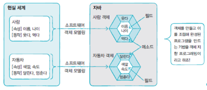


#### 객체와 객체간의 상호 작용

: 메소드 호출을 통해서 객체가 다른 객체의 기능을 이용. 

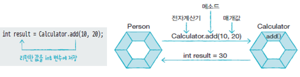


#### 객체간의 관계 

- **집합관계** : 부품과 완성품의 관계 

- **사용관계** : 객체간의 상호작용(메소드 호출) 관계 

- **상속관계** : 상위 객체를 기반으로 하위 객체를 생성

  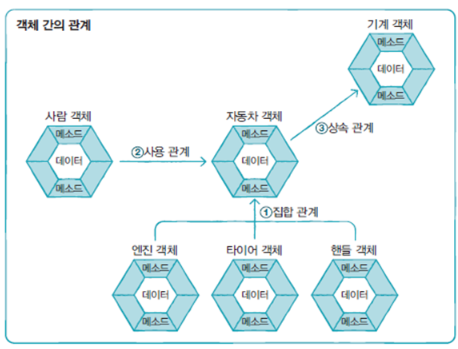


#### 클래스 ( class )

클래스는 인스턴스가 만들어지기 위한 틀 ( 객체를 정의해놓은 것 )

인스턴스 ( instance ) : 클래스로부터 만들어진 객체  ( 정의된 것으로부터 만들어진 객체 )


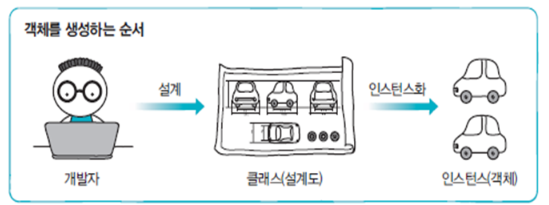


##### 클래스 선언 

`클래스이름.java` 소스파일로 작성 

```java
[접근 제한자] class 클래스이름 [extends 부모클래스명]{
    ......
}
```


##### 클래스로부터 객체를 생성 

```java
클래스명 변수명; 

변수명 = new 클래스명(); 
```

```java
클래스명 변수명 = new 클래스명 (); 
```

- new 연산자로 힙 메모리 영역에 객체를 생성 

- 객체 생성 후 객체의 주소를 반환 

- 클래스 변수에 저장하여 객체를 사용 

  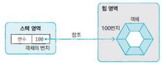


##### 클래스 용도 

- **라이브러리 클래스** (API : Application Programming Interface )

  ​	: 객체 생성 및 메소드 제공하는 역할 

  ```java
  public class Student {
  
  }
  ```

- **실행클래스** 

  ​	: main() 메소드를 제공하는 역할 

  ```java
  public class StudentExample {
  	public static void main(String[] args) {
  		Student s1 = new Student(); 
  		System.out.println("s1변수는 Student 객체를 참조합니다. ");
  	}
  }
  ```


#### 클래스 멤버 

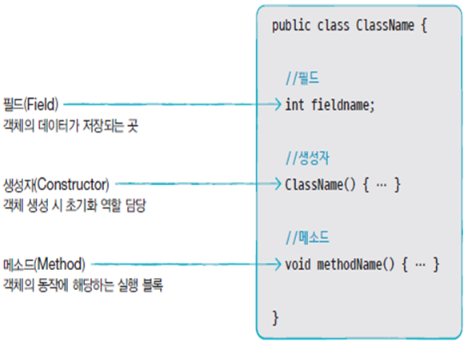

#### 필드 

객체가 가지고 있는 데이터 셋 

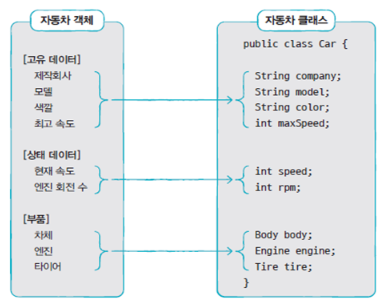

**필드 선언** 

	- 클래스 중괄호 블록 어디에 존재해도 무관 
	- 생성자나 메소드 블록 안에는 정의할 수 없다. ( 메소드나 생성자 안에 정의할 경우 해당하는 메소드나 생성자의 지역변수로 정의 됨 )
	- 필드를 선언할 때 초기값을 설정할 수도 있고, 생략도 가능 ( 생략하면 객체가 생성될 때 기본 초기값으로 자동 설정됨  )


**필드 사용**

- 클래스 내부에서 사용하는 경우 ( 생성자 또는 메소드에서 사용 ) => 필드 이름으로 접근 

- 클래스 외부에서 사용하는 경우 => 클래스로부터 객체를 생성한 후 필드를 사용 . 

  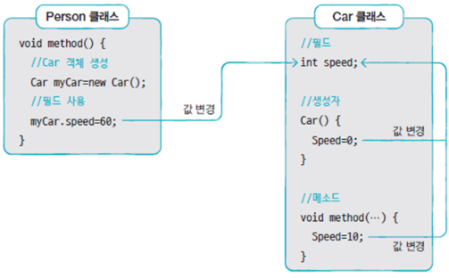


#### 생성자 ( Constructor ) 

클래스로부터 new 연산자로 객체를 생성할 때 호출되는 **객체 초기화를 담당하는 메소드** 

클래스 이름과 동일한 이름의 메소드. 

객체 초기화 = 필드를 초기화하거나 메소드를 호춣해서 객체를 사용할 준비를 하는 것 . 

생성자가 성공적으로 동작하면 힙 영역에 객체를 생성하고 객체의 주소를 반환 . 

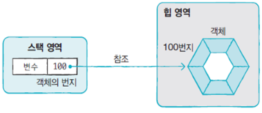


**기본 생성자 ( default constructor )**

클래스에 생성자를 선언하지 않으면 바이트 코드에 자동으로 부착되는 생성자. 

클래스에 생성자를 선언하지 않아도 new 연산자를 이용해서 객체를 생성할 수 있다. 

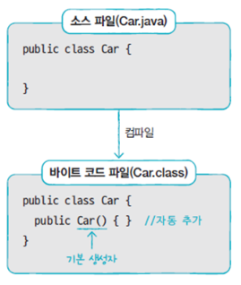

**생성자 선언** 

```java
클래스명 ( 매개변수 , ... ){
    // 객체 초기화 코드 
}
```

매개변수는 생략할 수도 있고, 여러개 사용할 수도 있다. 

클래스에 **생성자가 명시적으로 선언된 경우, 반드시 선언된 생성자를 호출해서 객체를 생성**해야한다. 

```java
public class Car {
	String company = "현대자동자";
	String model = "그랜저";
	String color = "검정";
	int maxSpeed = 350;
	int speed;
	
	public Car(int s) {
		speed = s;
	}
	
	public void speedUp(int no) {
		speed += no;
	}

	public void speedDown(int no) {
		speed -= no;
	}
	
	public static void main(String[] args) {
		/*	정의된 생성자와 형태가 달라 사용할 수 없음 
		Car c1 = new Car();
		Car c2 = new Car();
		*/
		Car c1 = new Car(100);
		Car c2 = new Car(100);
		
		System.out.println("C1 현재 속도: " + c1.speed);
		System.out.println("C2 현재 속도: " + c2.speed);
		
		c1.speed = 60;
		c2.speedUp(100);
		
		System.out.println("C1 변경된 속도: " + c1.speed);
		System.out.println("C2 변경된 속도: " + c2.speed);
	}
}
```


#### 생성자 오버로딩 (overloading)

**오버로딩** : 동일한 이름의 메소드가 여러개 존재한다. 

매개변수의 타입, 개수, 순서가 다른 생성자를 여러 개 선언 -> 해당하는 외부 클래스에서 해당 클래스를 생성할 때 다양한 방식으로 객체를 쉽게 생성하기 위해서 사용. 

```java
// Car 클래스 
public class Car {
	//	필드
	String company = "현대자동자";
	String model;
	String color;
	int maxSpeed;
	
	//	생성자
	//	매개변수의 개수가 다른 생성자를 정의 => 오버로딩
	Car() { }
	
	Car(String model) { 
		this.model = model;
	}
    
	Car(String model, String color) {
		this.model = model;
		this.color = color;
	}
	//	매개변수의 개수와 타입이 동일하고 이름이 다른 것은 오버로딩될 수 없다.
	//	Duplicate method 오류가 발생
	/*
	Car(String color, String model) {
		this.model = model;
		this.color = color;
	}
	*/
	Car(String model, String color, int maxSpeed) {
		this.model = model;
		this.color = color;
		this.maxSpeed = maxSpeed;
	}	
    
	//	매개변수의 순서를 변경
	Car(String model, int maxSpeed, String color) {
		this.model = model;
		this.color = color;
		this.maxSpeed = maxSpeed;
	}
}
```

```java
// CarExample 클래스 
public class CarExample {

	public static void main(String[] args) {
		Car c1 = new Car();
		System.out.println("c1");
		System.out.println("- company : " + c1.company);
		System.out.println("- model   : " + c1.model);
		System.out.println("- color   : " + c1.color);
		System.out.println("- maxSpeed: " + c1.maxSpeed);
		
		Car c2 = new Car("자가용");
		System.out.println("c2");
		System.out.println("- company : " + c2.company);
		System.out.println("- model   : " + c2.model);
		System.out.println("- color   : " + c2.color);
		System.out.println("- maxSpeed: " + c2.maxSpeed);
		
		Car c3 = new Car("택시", "검정", 200);
		System.out.println("c3");
		System.out.println("- company : " + c3.company);
		System.out.println("- model   : " + c3.model);
		System.out.println("- color   : " + c3.color);
		System.out.println("- maxSpeed: " + c3.maxSpeed);	
	}
}
```


#### this() 

생성자에서 다른 생성자를 호출 -> 생성자 오버로딩 코드 작성 시 발생하는 중복을 해결 

**생성자에 첫 번째 줄에서만 사용 가능** 

```java
public class Car {
	//	필드
	String company = "현대자동자";
	String model;
	String color;
	int maxSpeed;
	
	Car() { }
	
	Car(String model) { 
		this(model, null, 0);
	}
	
	Car(String model, String color) {
		this(model, color, 0);
	}

	Car(String model, String color, int maxSpeed) {
		this.model = model;
		this.color = color;
		this.maxSpeed = maxSpeed;
	}
	
	//	매개변수의 순서를 변경
	Car(String model, int maxSpeed, String color) {
		this(model, color, maxSpeed);
	}
}

```


#### 메소드 선언부 (signature)

리턴 타입, 메소드 이름, 매개변수 선언, 메소드 실행 블록 

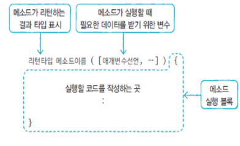

**리턴타입**  : 메소드 실행 결과 반환되는 데이터 타입 . 

반환 값이 없을 수 있고, 

반환 값이 있을 수 있다 ( 선언부에 데이터 타입을 명시 ) . 

```java
void PowerOn(){ ... }	// 반환값 x 
double divied() { ... }	// 반환값 o 
```


**메소드 이름** 

- 숫자로 시작할 수 없고, `_` 또는 `$` 를 제외한 특수문자를 사용할 수 없다. 
- (관례적으로) 소문자로 시작
- 서로다른 단어가  혼합될 경우, 뒤에 오는 단어의 첫 글자를 대문자로 작성 .

```java
// Calculator 클래스 
public class Calculator {
	//	메소드 
	
	// 	전원을 켜는 것
	void powerOn() {
		System.out.println("전원을 켭니다.");
	}
	
	// 	더하기 연산 결과를 반환
	int plus(int x, int y) {
		return x + y;
	}
	
	//	나누기 연산 결과를 반환
	double divide(int x, int y) {
		return (double) x / (double) y;
	}
	
	// 	전원을 끄는 것
	void powerOff() {
		System.out.println("전원을 끕니다.");
	}
}
```

```java
// CalculatorExe 클래스 
public class CalculatorExe {

	public static void main(String[] args) {
		Calculator myCalc = new Calculator();
		
		myCalc.powerOn();
		
		int result1 = myCalc.plus(5, 6);
		System.out.println("5 + 6 = " + result1);
		
		int x = 10;
		int y = 4;
		double result2 = myCalc.divide(x, y);
		System.out.println("10 / 4 = " + result2);
		
		myCalc.powerOff();
	}
}
```


#### 매개변수 선언 

매개변수의 타입이 일치하지 않으면 컴파일 오류가 발생 

매개변수의 개수를 모를 경우 

1. 배열 타입으로 선언 

   ```java
   int sum(int[] values){ ... }
   ```

   ```java
   int[] params = {1,2,3}; 
   int result = sum(params);
   // ----- or --------
   int result = sum(new int[] {1,2,3});
   ```

2. 배열을 생성하지 않고 값 목록만 넘겨주는 방식 

   ```java
   int sum(int ...values){ ... }
   ```

   ```java
   int result = sum(1,2,3); 
   //------- or ---------
   int result = sum(1,2,3,4,5); 
   ```


예제 

```java
// Computer 클래스
// 	가변 길이의 숫자를 받아서 합계를 반환하는 
//	sum() 메소드를 제공하는 클래스
public class Computer {
	int sum1(int[] values) {
		int sum = 0;
		for (int v : values) {
			sum += v;
		}
		return sum;
	}
	
	int sum2(int ... values) {
		int sum = 0;
		for (int v : values) {
			sum += v;
		}
		return sum;
	}
}

```

```java
// ComputerExe 클래스 
public class ComputerExe {
	public static void main(String[] args) {
		Computer myCom = new Computer();
		
		int[] value1 = { 1, 2, 3 };
		int result1 = myCom.sum1(value1);
		System.out.println("result1 = " + result1);

		int result2 = myCom.sum1(new int[] { 1, 2, 3 });
		System.out.println("result2 = " + result2);
		
		int result3 = myCom.sum2(1, 2, 3, 4);
		System.out.println("result3 = " + result3);
	}
}
```


#### 리턴값이 있는 메소드 

- 메소드 선언에 리턴 타입이 있는 경우 -> return 구문을 이용해서 리턴값을 지정 

- return 구문을 통해서 반환하는 리턴값의 타입은 리턴 타입이거나 변환될 수 있는 타입이어야함. 

  ```java
  int plus(int x, int y) {
      int result = x + y;
      return result;
  }
  
  int plus(int x, int y) {
      byte result = (byte)(x + y);
      return result;
  }
  ```


#### 리턴값이 없는 메소드 

void 로 선언된 메소드에서는 return 구문을 사용해서 메소드 실행을 종료 


예제 

```java
// Car 클래스
public class Car {
	//	필드
	int gas;
	
	// 	생성자
	
	// 	메소드
	//	setter = 필드의 값을 매개변수로 전달된 값으로 설정하는 메소드
	void setGas(int gas) {
		this.gas = gas;
	}
	
	//	가스가 남아 있는지 여부를 확인
	boolean isLeftGas() {
		if (gas == 0) {
			System.out.println("가스가 없습니다.");
			return false;
		}
		System.out.println("가스가 있습니다.");
		return true;
	}
	void run() {
		//	무한루프
		while (true) {
			if (gas > 0) {
				System.out.println("달립니다. (가스잔량: " + gas + ")");
				gas --;
			} else {
				System.out.println("멈춥니다. (가스잔량: " + gas + ")");
				return;
			}			
		}
	}
}
```

```java
// CarExample 클래스
public class CarExample {
	public static void main(String[] args) {
		Car myCar = new Car();
		
		myCar.setGas(10);
		if (myCar.isLeftGas()) {
			System.out.println("출발합니다.");
			myCar.run();
		}
		
		if (myCar.isLeftGas()) {
			System.out.println("가스를 주입할 필요가 없습니다.");
		} else {
			System.out.println("가스를 주입하세요.");
		}
	}
}
```


#### 메소드 호출 

- 클래스 내부의 경우, 단순 메소드 이름으로 호출 

- 클래스 외부의 경우, 클래스로부터 객체를 생성한 후 참조변수와 도트연산자를 이용해서 메소드를 호출 

  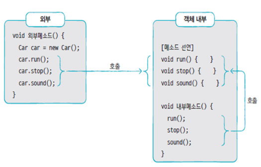


#### 메소드 오버로딩 (overloading)

- 같은 이름의 메소드를 여러개 선언 

- 매개변수의 타입, 개수, 순서가 다른 것

- 오버로딩된 메소드가 호출되면 JVM은 매개변수 타입을 보고 메소드를 선택 

  ```java
  int plus(int x, int y){ ... }
  double plus(double x, double y){ ... }
  
  plus(10,20); 			-> int plus(int x, int y)
  plus(10.5, 20.3); 		-> double plus(double x, double y)
  plus(10, 20.3); 		-> double plus(double x, double y)
  ```

예시 ) 

```java
public class Calculator {
	//	정사각형의 넓이는 계산해서 반환하는 메소드
	int areaRect(int width) {
		//	return width * width;
		return areaRect(width, width);
	}

	/*	리턴타입은 오버로딩에 포함되지 않음
	double areaRect(int width) {
		return width * width;
	}
	*/
	
	//	직사각형의 넓이를 계산해서 반환하는 메소드
	int areaRect(int width, int height) {
		return width * height;
	}
	
	/*	매개변수의 이름이 바뀌는 것은 오버로딩에 포함되지 않음
	int areaRect(int height, int width) {
		return width * height;
	}
	*/
}
```


#### 인스턴스 멤버 vs 정적 멤버 

멤버 = 필드 + 메소드 

**인스턴스 멤버** = 객체마다 가지고 있는 멤버 

- 인스턴스 필드 : 힙 영역에 객체마다 가지고 있는 멤버, 객체마다 다른 데이터를 저장 
- 인스턴스 메서드 : 객체가 있어야 호출가능한 메소드, 클래스 코드(메소드영역)에 위치 

**정적 멤버** = 객체와 상관 없는 멤버, 클래스 코드(메소드 영역)에 위치 

- 정적 필드 : 객체 없이 클래스만으로 사용 가능한 코드 
- 정적 메소드 : 객체 없이 클래스만으로 사용 가능한 메소드

```java
public class Car { 
	int gas;
	void setSpeed(int speed) { … }
}

Car myCar = new Car();
myCar.gas = 10;
myCar.setSpeed(60);

Car yourCar = new Car();
yourCar.gas = 20;
yourCar.setSpeed(80);
```

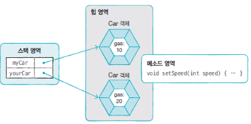


#### this 

객체 내에서 인스턴스 멤버에 접근하기 위해 사용 

생성자와 메소드의 매개변수 이름이 필드 이름과 동일한 경우, 필드임을 지정하기 위해서 사용. 


#### 싱글톤 ( singleton )

: 전체 프로그램에서 단 하나의 객체만 만들어지도록 보장하는 코딩 기법 

```java
public class 클래스명 { 
	private 클래스명() { ... }
    
    private static 클래스명 singleton = new 클래스명(); 
	
    public static 클래스명 getInstance() { 
    	return singleton ;
    }
}
```

