#### final 필드

초기값이 저장되면 최종값이 되어 프로그램 실행 중 변경이 불가능 


**final 필드 초기화**

단순 값인 경우, 필드 선언할 때 초기화 -> 주로 정적필드(상수)인 경우 

객체 생성 시 외부 데이터로 초기화가 필요한 경우, 생성자에서 초기화 -> 주로 인스턴스 필드인 경우 

```java

public class Person {
	//	모든 객체가 국적으로 "한국"을 가져야 하고, 
	//	국적을 변경할 수 없으므로 final로 선언과 동시에 초기화
	final String nation = "한국";
	
	//	주민번호는 생성되는 시점에 결정되어야 하고, 
	//	한 번 설정되면 수정할 수 없어야 하므로 final로 선언
	final String ssn;
	
	int age;
	
	public Person(String ssn, int age) {
		this.ssn = ssn;	//	final 변수의 초기화가 실행
					    //  이후에 변수값 변경이 불가능
		this.age = age;
	}

	public static void main(String[] args) {
		Person p = new Person("123456-1234567", 23);
		
		System.out.println(p.nation);
		System.out.println(p.ssn);
		System.out.println(p.age);
		
		// The final field Person.nation cannot be assigned
		/*
		p.nation = "미국";
		p.ssn = "223456-1234567";
		*/
		p.age = 24;
	}
}
```


#### static final 필드 

상수 

관례적으로 모두 대문자를 사용 

```java
public class Earth {
	// 	지구의 반지름
	static final double EARTH_RADIUS = 6400;
	
	//	지구의 표면적 
	static final double EARTH_AREA = 4 * Math.PI * EARTH_RADIUS * EARTH_RADIUS;
	
	public static void main(String[] args) {
		System.out.println("지구의 반지름: " + Earth.EARTH_RADIUS);
		System.out.println("지구의 표면적: " + Earth.EARTH_AREA);
	}
}
```


#### 패키지 ( package )

물리적으로는 파일 시스템의 디렉터리 

클래스 이름의 일부 -> 클래스를 유일하게 만들어주는 **식별자 역할**

-> 클래스 이름이 동일하더라도 패키지 이름이 다르면 다른 클래스로 인식 

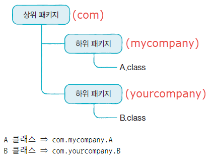

- 패키지 명명 규칙 
  - 숫자로 시작 불가 
  - _ 또는 $ 를 제외한 특수문자 사용이 불가 
  - java 로 시작하는 패키지는 자바 표준 API 에서만 사용 가능 
  - (관례상) 모두 소문자로 작성 


#### import 문 

- 사용하고자 하는 클래스 또는 인터페이스가 다른 패키지에 소속된 경우, 해당 패키지 클래스 또는 인터페이스를 가져와 사용하는 것을 컴파일러에 통지 

  `import 상위패키지.하위패키지.클래스이름; `

  `import 상위패키지.하위패키지.*;`

- 하위패키지는 별도로 import 해야한다. 

  `import com.mypage.*; `

  `import com.mypage.subpackage.*`

  `com.mypage.subpackage.MyClass; `

- 다른 패키지에 동일한 이름의 클래스가 존재하는 경우 import 구문에 관계없이 (패키지 명을 포함한) 클래스 전체 이름을 기술 


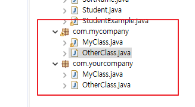

```java
package com.mycompany;
import com.yourcompany.OtherClass;

public class MyClass {
	public void doSomething() {
		// com.yourcompany.MyClass의 기능을 사용
		com.yourcompany.MyClass mc = new com.yourcompany.MyClass(); 
		
		//	com.mycompany.OtherClass
		OtherClass oc1 = new OtherClass();
		com.yourcompany.OtherClass oc2 = new com.yourcompany.OtherClass();
	}
}
```


### 접근 제한자 ( access modifier )

클래스와 인터페이스 및 이들이 가진 멤버(필드, 메소드) 의 접근을 제한  

- **public** : 외부 클래스가 자유롭게 사용할수 있도록 허용 
- **protected** : 같은 패키지 또는 자식 클래스에서 사용할 수 있도록 허용 
- **private** : 외부에서 사용할 수 없도록 제한하는 것
- **default** : 같은 패키지에 소속된 클래스에서만 사용할 수 있도록 허용 . 


#### 클래스 접근 제한 

같은 패키지 내에서만 사용할 수 있도록 허용할 것인지, 다른 패키지에서도 사용할 수 있도록 허용할 것인지를 결정 

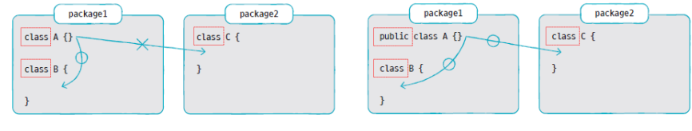

#### 생성자 접근 제한 

생성자 호출 가능 여부를 결정 

```java
public lass ClassName{
    // public 접근 제한 
    public ClassName(){}
    
    // protected 접근 제한 
    protected ClassName(){}
    
    // default 접근 제한 
    ClassName(){}
    
    // private 접근 제한 
    private ClassName(){}
}
```

```java
package modifier;

public class A {
	// 필드
	A a1 = new A(true);
	A a2 = new A(1);
	A a3 = new A("문자열");
	
	// 생성자를 오버로딩하고 있음
	//	public => 클래스 외부에서 호출 가능
	public A(boolean b) {}
	//	default => 동일 패키지 또는 자식 클래스에서만 호출 가능
	A(int i) {}
	//	private => 클래스 외부에서 호출 불가능
	private A(String s) {}
}
-----------------------------------------------------------------------------------------
package modifier;

public class B {
	// 	필드
	A a1 = new A(true);	// public 접근 제한자
	A a2 = new A(1); 		// default
      /* The constructor A(String) is not visible 컴파일 오류 발생
	A a3 = new A("문자열");	// private 
      */
}
```


#### 필드와 메소드 접근 제한 

- 필드 선언 

  ```java
  [ public , protected, private ] [static] 데이터타입 필드명; 
  ```

- 메소드 선언 

  ```java
  [ public , protected, private ] [static] 리턴타입 메소드명 (매개변수) { 메소드 본문 }; 
  ```

  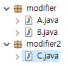

  ```java
  package modifier;
  
  public class A {
  	// 필드
  	public int field1;		// 클래스 외부에서 직접 접근이 가능
  	int field2;				// 동일 패키지 또는 자식 클래스에서 직접 접근이 가능
  	private int field3;		// 클래스 외부에서 접근이 불가능
  	
  	// 생성자
  	public A() {
  		field1 = 1;
  		field2 = 2;
  		field3 = 3;
  		
  		method1();
  		method2();
  		method3();
  	}
  	
  	// 메소드
  	public void method1() { 
  		System.out.println(field1);
  	}
  	void method2() { 
  		System.out.println(field2);
  	}
  	private void method3() { 
  		System.out.println(field3);
  	}	
  }
  ```

  ```java
  package modifier;
  
  public class B {
  	public B() {
  		A a = new A();
  		a.field1 = 10;
  		a.field2 = 20;
  		/* private => 직접 접근이 불가능
  		a.field3 = 30;
  		*/
  	}
  }
  ```

  ```java
  package modifier2;
  
  import modifier.A;
  
  public class C {
  	public C() {
  		A a = new A();
  		a.field1 = 100;
  		/*
  		a.field2 = 200;	// default => 패키지가 상이하므로 접근할 수 없음
  		a.field3 = 300;	// private => 클래스 외부에서 접근할 수 없음
  		*/
  		
  		a.method1();
  		/*
  		a.method2();
  		a.method3();
  		*/
  	}
  }
  ```


#### getter / setter 메소드 

객체의 무결성을 보장하기 위한 방법 

필드를 private 제한하고, 해당 필드에 접근할 수 있는 public 메소드를 제공하는 방식으로 객체의 무결성을 보장

-> **캡슐화**

필드의 값을 외부로 반환하는 메소드 => `getter`  

필드의 값을 외부에서 전달한 값으로 설정하는 메소드 => `setter` 

```java
public class Car {
	//	필드
	private int speed;
	
	public int getSpeed() {
		return speed;
	}

	public void setSpeed(int speed) {
		//	속도를 제한
		if (speed < 0 || speed > 100) 
			this.speed = 0;
		else 
			this.speed = speed;
	}

	private boolean stop;

	public boolean isStop() {
		return stop;
	}

	public void setStop(boolean stop) {
		this.stop = stop;
		if (stop == true) {
			this.speed = 0;
		}
	}	
}
```


### 상속

기존에 만들어져 있는 클래스를 재활용 


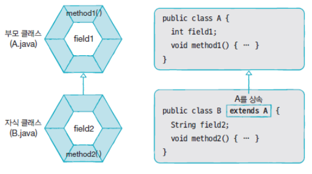

#### 클래스 상속 

- 자식 클래스 선언 시 부모 클래스를 선택 
- `extends `키워드 뒤에 부모 클래스를 기술 
- 부모 클래스의 private 접근 제한을 갖는 필드와 메소드는 상속 대상에서 제외 
- 부모와 자식 클래스가 다른 패키지에 존재할 경우, default 접근 제한된 필드와 메소드 역시 제외 

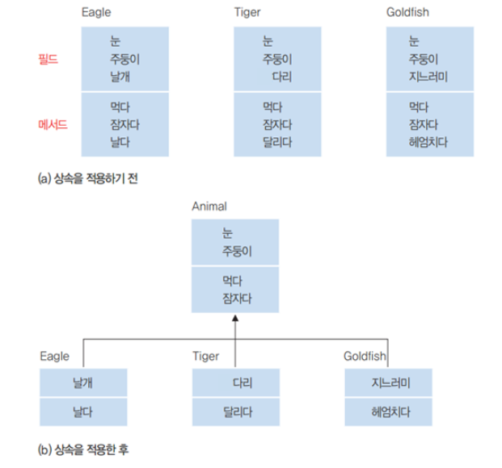

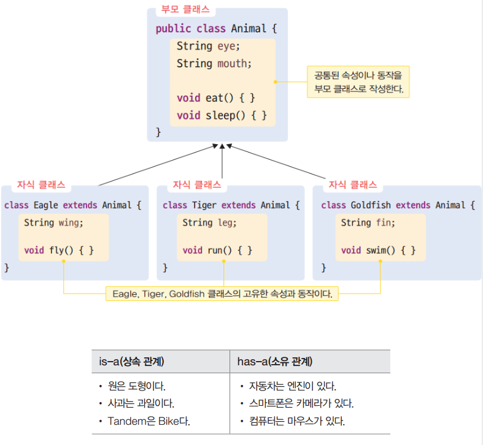

**예시 1)** 

```java
public class People {
	private String name;
	private String ssn;
	
	public String getName() {
		return name;
	}

	public void setName(String name) {
		this.name = name;
	}

	public String getSsn() {
		return ssn;
	}

	public void setSsn(String ssn) {
		this.ssn = ssn;
	}

	public People(String name, String ssn) {
		this.name = name;
		this.ssn = ssn;
	}
}
```

```java
public class Student extends People {
	public int studentNo;
	
	public Student(String name, String ssn, int studentNo) {
		super(name, ssn);
		this.studentNo = studentNo;
	}
}
```

```java
public class StudentExample {
	public static void main(String[] args) {
		Student s = new Student("홍길동", "123456-1234567", 7777);
		
		System.out.println("이름: " + s.getName());
		System.out.println("주민번호: " + s.getSsn());
		System.out.println("학번: " + s.studentNo);
	}
}
```


**예시2 )**

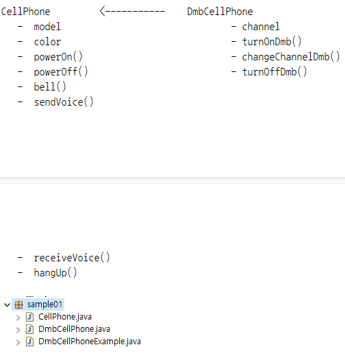

```java
package sample01;

public class CellPhone {
	//	필드
	String model;
	String color;
	
	//	생성자
	
	//	메소드
	void powerOn() {
		System.out.println("전을 켭니다.");
	}
	void powerOff() {
		System.out.println("전을 끕니다.");
	}
	void bell() {
		System.out.println("벨이 울린다.");
	}
	void sendVoice(String message) {
		System.out.println(">>> " + message);
	}
	void receiveVoice(String message) {
		System.out.println("<<< " + message);
	}
	void hangUp() {
		System.out.println("전화를 끊습니다.");
	}
}
```

```java
package sample01;

public class DmbCellPhone extends CellPhone {
	// 	필드
	int channel;
	
	// 	생성자
	DmbCellPhone(String model, String color, int channel) {
		//	super(model, color);
		this.model = model;
		this.color = color;
		this.channel = channel;
	}
	
	// 	메소드
	void turnOnDmb() {
		System.out.printf("채널 %d번 DMB 방송 수신을 시작합니다.\n", channel);
	}
	void turnOffDmb() {
		System.out.println("DBM 방송 수신을 종료합니다.");
	}
	void changeChannelDmb(int channel) {	
		this.channel = channel;
		System.out.printf("채널 %d번으로 변경합니다.\n", channel);
	}
}
```

```java
package sample01;

public class DmbCellPhoneExample {
	public static void main(String[] args) {
		// DmbCellPhone 객체 생성
		DmbCellPhone dmbCellPhone = new DmbCellPhone("자바폰", "검정", 10);

		// CellPhone으로부터 상속 받은 필드
		System.out.println("모델: " + dmbCellPhone.model);
		System.out.println("색상: " + dmbCellPhone.color);

		// DmbCellPhone의 필드
		System.out.println("채널: " + dmbCellPhone.channel);

		// CellPhone으로부터 상속 받은 메소드 호출
		dmbCellPhone.powerOn();
		dmbCellPhone.bell();
		dmbCellPhone.sendVoice("여보세요");
		dmbCellPhone.receiveVoice("안녕하세요! 저는 홍길동인데요");
		dmbCellPhone.sendVoice("아~ 예 반갑습니다.");
		dmbCellPhone.hangUp();

		// DmbCellPhone의 메소드 호출
		dmbCellPhone.turnOnDmb();
		dmbCellPhone.changeChannelDmb(12);
		dmbCellPhone.turnOffDmb();
	}
}
```


### 메소드 재정의 ( 오버라이딩 - overriding )

부모 클래스의 메소드가 자식 클래스에서 사용하기에 부적합할 경우, 자식 클래스에서 수정해서 사용 => 메소드가 재정의되면 부모객체에 정의도니 메소드는 숨겨지고, 자식 객체에서 메소드를 호출하면 재정의된 자식 메소드가 호출됌 . 


#### 메소드 재정의 방법

- 부모 메소드와 동일한 시그니처를 가져야함 
- 접근 제한을 더 강하게 재정의 할 수 없음 
- 새로운 예외를 throws 할 수 없음 

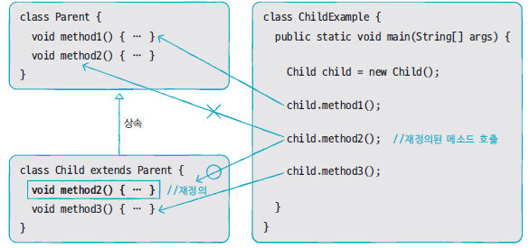


#### 부모 클래스의 메소드를 호출 

자식 클래스 내부에서 재정의한 부모 클래스의 메소드를 호출해야 하는 경우, super 키워드를 붙여서 명시적으로 호출해야 함. 

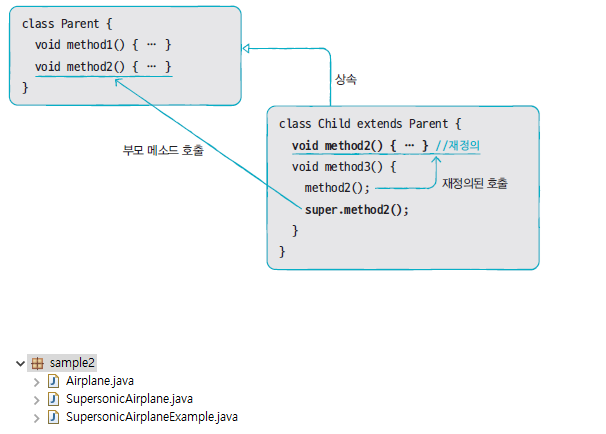

```java
package sample2;

public class Airplane {
	public void land() {
		System.out.println("착륙");
	}
	public void fly() {
		System.out.println("비행");
	}
	public void takeOff() {
		System.out.println("이륙");
	}
}
```

```java
package sample2;

public class SupersonicAirplane extends Airplane {
	public static final int NORMAL = 1;
	public static final int SUPERSONIC = 2;
	
	// 	비행모드 >     1 : 일반비행, 2 : 초음속비행
	public int flyMode = NORMAL;
	
	//	메소드 오버라이딩
	public void fly() {
		if (flyMode == SUPERSONIC) {
			System.out.println("초음속비행");
		} else {
			//	부모 클래스의 메소드를 호출
			super.fly();
		}
	}
}
```

```java
package sample2;

public class SupersonicAirplaneExample {
	public static void main(String[] args) {
		SupersonicAirplane sa = new SupersonicAirplane();
		
		sa.takeOff();
		sa.fly();
		sa.flyMode = SupersonicAirplane.SUPERSONIC;
		sa.fly();
		sa.flyMode = SupersonicAirplane.NORMAL;
		sa.fly();
		sa.land();
	}
}
```


#### final 

- 해당 선언이 최종 상태이며 수정될 수 없음을 의미.
- 클래스 및 메소드 선언 시 final 키워드를 사용하면 상속 및 재정의를 할 수 없음. 

```java
package sample3;

public class Car {
	public int speed;
	
	public void speedUp() {
		speed += 1;
	}
	
	//	final 구문을 이용해서 재정의되는 것을 방지
	public final void stop() {
		speed = 0;
		System.out.println("차를 멈춤");
	}
}
```

```java
package sample3;

public class SportsCar extends Car {
	public void speedUp() {
		speed += 10;
	}
	
	/*
	// final로 정의된 메소드는 재정의할 수 없음
	// Cannot override the final method from Car
	public void stop() {
		speed = 0;
		System.out.println("차를 멈춤");
	}
	*/
}
```


### 다형성 

사용방법은 동일하지만 다양한 객체를 활용해 여러 실행 결과가 나오도록 하는 성질 

다형성 => 메소드 재정의(overriding)와 타입 변환 (promotion, casting) 으로 구현. 


#### 자동 타입 변환 ( promotion )


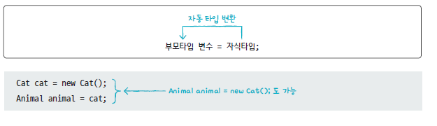

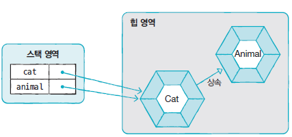

바로 위의 부모가 아니더라도 상속 계층에서 상위 타입인 경우 자동으로 타입 변환이 가능 

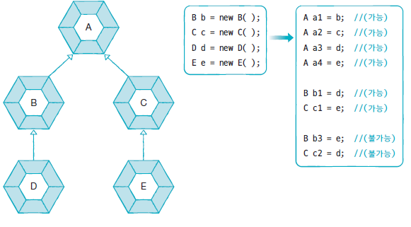

부모 타입으로 자동 타입 변환 이후에는 **부모클래스에 선언된 필드와 메소드만 접근이 가능** 

예외적으로 메소드가 자식 클래스에서 **재정의된 경우(오버라이딩), 자식 클래스의 메소드가 대신 호출** 

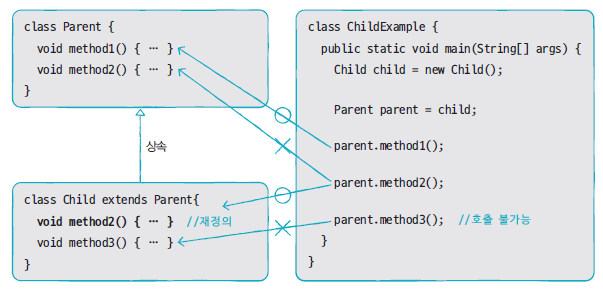


#### 필드의 다형성 

필드의 데이터 타입을 부모 클래스 타입으로 선언 

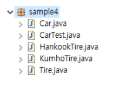

```java
package sample4;

public class Tire {
	public int maxRotation; 		// 최대 회전수 = 최대 수명
	public int accumulatedRotation; // 누적 회전수
	public String location; 		// 타이어의 위치
	
	public Tire(String location, int maxRotation) {
		this.location = location;
		this.maxRotation = maxRotation;				
	}
	
	//	타이어 수명을 체크해서 수명이 남은 경우 true를, 다한 경우 false를 반환 
	public boolean roll() {
		accumulatedRotation++;
		if (accumulatedRotation < maxRotation) {
			System.out.printf("%s 위치의 타이어의 수명이 %d회 남았습니다.\n", 
					location, (maxRotation - accumulatedRotation));
			return true;
		} else {
			System.out.printf("*** %s 위치의 타이어가 펑크 ***\n", location);
			return false;
		}
	}
}
```

```java
package sample4;

public class HankookTire extends Tire {
	public HankookTire(String location, int maxRotation) {
		super(location, maxRotation);
	}
	
	// 	메소드 재정의 
	public boolean roll() {
		accumulatedRotation++;
		if (accumulatedRotation < maxRotation) {
			System.out.printf("%s 위치의 한국 타이어의 수명이 %i회 남았습니다.\n", 
					location, (maxRotation - accumulatedRotation));
			return true;
		} else {
			System.out.printf("*** %s 위치의 한국 타이어가 펑크 ***\n", location);
			return false;
		}
	}
}
```

```java
package sample4;

public class KumhoTire extends Tire {
	public KumhoTire(String location, int maxRotation) {
		super(location, maxRotation);
	}
	
	// 	메소드 재정의 
	public boolean roll() {
		accumulatedRotation++;
		if (accumulatedRotation < maxRotation) {
			System.out.printf("%s 위치의 금호 타이어의 수명이 %d회 남았습니다.\n", 
					location, (maxRotation - accumulatedRotation));
			return true;
		} else {
			System.out.printf("*** %s 위치의 금호 타이어가 펑크 ***\n", location);
			return false;
		}
	}
}
```

```java
package sample4;

public class Car {
	Tire frontLeftTire  = new Tire("앞왼쪽", 6);
	Tire frontRightTire = new Tire("앞오른쪽", 2);
	Tire backLeftTire   = new Tire("뒤왼쪽", 3);
	Tire backRightTire  = new Tire("뒤오른쪽", 4);
	
	void stop() {
		System.out.println("자동차가 멈춥니다.");
	}
	
	int run() {
		System.out.println("자동차가 달립니다 =3=33=333");
		if (frontLeftTire.roll() == false) {
			stop();
			return 1;
		}
		if (frontRightTire.roll() == false) {
			stop();
			return 2;
		}
		if (backLeftTire.roll() == false) {
			stop();
			return 3;
		}
		if (backRightTire.roll() == false) {
			stop();
			return 4;
		}
		return 0;
	}
}
```

```java
package sample4;

public class CarTest {
	public static void main(String[] args) {
		Car car = new Car();		
		for (int i = 1; i < 5; i ++) {
			int problemLocation = car.run();
			switch (problemLocation) {
			case 1:
				System.out.println("앞왼쪽 타이어를 한국 타이어로 교체");
				car.frontLeftTire = new HankookTire("앞왼쪽", 15);
				break;
			case 2:
				System.out.println("앞오른쪽 타이어를 금호 타이어로 교체");
				car.frontRightTire = new KumhoTire("앞오른쪽", 13);				
				break;
			case 3:
				System.out.println("뒤왼쪽 타이어를 한국 타이어로 교체");
				car.backLeftTire = new HankookTire("뒤왼쪽", 14);				
				break;
			case 4:
				System.out.println("뒤오른쪽 타이어를 금호 타이어로 교체");
				car.backRightTire = new KumhoTire("뒤오른쪽", 17);
				break;
			}
			System.out.println("-------------------------------");
		}
	}
}
```

```java
자동차가 달립니다 =3=33=333                              6, 2, 3, 4
앞왼쪽 위치의 타이어의 수명이 5회 남았습니다.         => 5, 1, 2, 3
앞오른쪽 위치의 타이어의 수명이 1회 남았습니다.
뒤왼쪽 위치의 타이어의 수명이 2회 남았습니다.
뒤오른쪽 위치의 타이어의 수명이 3회 남았습니다.
-------------------------------
자동차가 달립니다 =3=33=333                              5, 1, 2, 3 
앞왼쪽 위치의 타이어의 수명이 4회 남았습니다.         => 4, 0
*** 앞오른쪽 위치의 타이어가 펑크 ***                 => 4, 13, 2, 3 
자동차가 멈춥니다.
앞오른쪽 타이어를 금호 타이어로 교체
-------------------------------
자동차가 달립니다 =3=33=333                              4, 13, 2, 3
앞왼쪽 위치의 타이어의 수명이 3회 남았습니다.         => 3, 12, 1, 2  
앞오른쪽 위치의 금호 타이어의 수명이 12회 남았습니다.
뒤왼쪽 위치의 타이어의 수명이 1회 남았습니다.
뒤오른쪽 위치의 타이어의 수명이 2회 남았습니다.
-------------------------------
자동차가 달립니다 =3=33=333                              3, 12, 1, 2
앞왼쪽 위치의 타이어의 수명이 2회 남았습니다.         => 2, 11, 0
앞오른쪽 위치의 금호 타이어의 수명이 11회 남았습니다. => 2, 11, 14, 2
*** 뒤왼쪽 위치의 타이어가 펑크 ***
자동차가 멈춥니다.
뒤왼쪽 타이어를 한국 타이어로 교체
-------------------------------
```


### 매개변수의 다형성 

매개변수 타입을 부모 객체로 선언하면, 매개변수 값으로 부모 객체 또는 모든 자식 객체를 전달할 수 있음 .

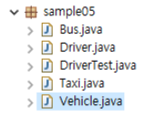

```java
package sample05;

public class Vehicle {
	public void run() {
		System.out.println("차량이 움직인다.");
	}
}
```

```java
package sample05;

public class Bus extends Vehicle {
	public void run() {
		System.out.println("버스가 움직인다.");
	}
}
```

```java
package sample05;

public class Taxi extends Vehicle {
	public void run() {
		System.out.println("택시가 움직인다.");
	}
}
```

```java
package sample05;

public class Driver {
	//	매개변수 다형성을 이용하면, 
	//	메소드 오버로딩을 하지 않아도 다양한 자식 클랙스에 대해
	//	동일한 처리를 제공할 수 있다. 
	public void drive(Vehicle v) {  // 매개변수의 타입을 부모 클래스로 정의
		v.run();
	}
}
```

```java
package sample05;

public class DriverTest {
	
	public static void main(String[] args) {
		Driver d = new Driver();
		
		d.drive(new Taxi());   // 자식 클래스의 인스턴스를 매개변수의 값으로 전달
		d.drive(new Bus());
	}
}
```


### 강제 타입 변환 ( casting ) 

프로모션 이후 자식 객체가 가지고 있는 멤버에 접근하기 위해 사용 .

=> 자식 타입이 부모 타입으로 자동 타입 변환된 이후 

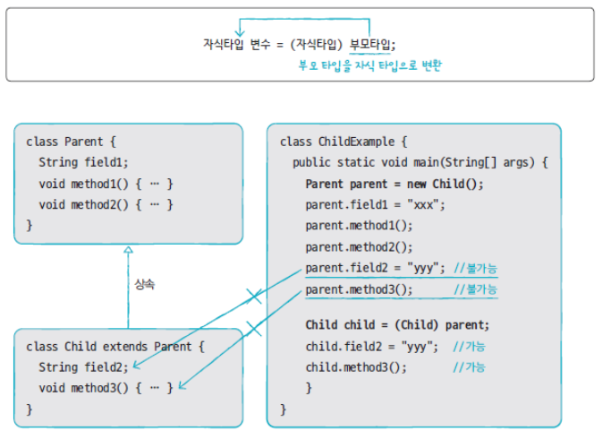

```java
public class Parent {
	public String strParent;
	
	public void method1() {
		System.out.println("Parent Method1()");
	}
	public void method2() {
		System.out.println("Parent Method2()");
	}
}
```

```java
package sample06;

public class Child extends Parent {
	public String strChild;
	
	public void method3() {
		System.out.println("Child Method3()");
	}
}
```

```java
package sample06;

public class ChildTest {
	public static void main(String[] args) {
		// promotion 발생 
		// -> p 변수는 부모 클래스 멤버만 사용
		//    단, 자식 클래스에서 재정의된 메소드는 제외
		Parent p = new Child(); 	
		p.strParent = "parent";
		p.method1();
		p.method2();
		// 	자식 클래스 멤버로는 접근이 불가
		/*
		p.strChild = "child";
		p.method3();
		*/
		
		//	부모 클래스의 인스턴스 변수를 자식 클래스로 casting
		//	Child c = new Child();
		Child c = (Child)p;
		c.strChild = "child";
		c.method3();
		
		c.strParent = "child -> parent";
		c.method1();
		c.method2();
		
		//	Cannot cast from Other to Child
		/*
		Other o = new Other();
		Child c2 = (Child)o;
		*/
	}
}
```


#### instance of 연산자 

객체가 어느 클래스의 인스턴스인지를 확인

메소드 내에서 casting 할 때, 타입을 확인하지 않고 casting 하면 ClassCastException이 발생. 


boolean result = 객체 instanceof 타입 ;

=> 타입에 해당하는 객체이면 true 를 아니면 false 를 반환 

```java
Parent p = new Parent();
Child c = (Child) p;		// 프로모션되지 않은 인스턴스 변수를 캐스팅하므로
		 					// java.lang.ClassCastException 발생

if (p instanceof Child) {
    Child c = (Child) p;
}
```

```java
package sample06;

public class ChildTest {
	public static void main(String[] args) {
		// promotion 발생 
		// -> p 변수는 부모 클래스 멤버만 사용
		//    단, 자식 클래스에서 재정의된 메소드는 제외
		Parent p = new Child(); 	
		p.strParent = "parent";
		p.method1();
		p.method2();
		// 	자식 클래스 멤버로는 접근이 불가
		/*
		p.strChild = "child";
		p.method3();
		*/
		
		//	부모 클래스의 인스턴스 변수를 자식 클래스로 casting
		//	Child c = new Child();
		Child c = (Child)p;
		c.strChild = "child";
		c.method3();
		
		c.strParent = "child -> parent";
		c.method1();
		c.method2();
		
		//	Cannot cast from Other to Child
		/*
		Other o = new Other();
		Child c2 = (Child)o;
		*/
		
		//	문법적으로 문제가 없음
		//	캐스팅이 되기 위해서는 프로모션이 전제되어야 함
		Parent p2 = new Parent();
		if (p2 instanceof Child) {
			Child c2 = (Child) p2;
		} else {
			System.out.println("p2는 Child의 인스턴스가 아님");
		
		}
		
		Parent p3 = new Child();
		Child c3 = (Child) p3;

	}
}
```


### 추상 클래스 

실제 클래스 (= 객체 생성 용도의 클래스 ) 들의 공통적인 특성 (필드, 메소드 등) 을 추출하여 선언한 것 

추상  클래스와 실제클래스는 부모와 자식 클래스로서 상속 관계를 가진다. 


실제 클래스에 반드시 존재해야 하는 필드와 메소드를 선언 

= 실제 클래스의 설계 (구현)

= 실제 클래스는 추상 클래스를 상속받아서 다른 부분만 선언, 구현하면 빠르게 개발이 가능 


#### 추상 클래스 선언 

abstract 키워드를 사용해서 정의 

필드, 생성자, 메소드를 정의 

상속은 가능하나 **객체를 생성할 수는 없다** => 자식 클래스가 생성될 때 객체화됌 = 자식 클래스의 생성자에서 super() 메소드로 추상 클래스의 생성자를 호출 

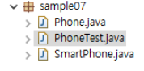

```java
package sample07;

public abstract class Phone {
	public String owner;
	
	public Phone(String owner) {
		this.owner = owner;
	}
	
	public void turnOn() {
		System.out.println("폰을 켭니다.");
	}
	public void turnOff() {
		System.out.println("폰을 끕니다.");
	}
}
```

```java
package sample07;

public class SmartPhone extends Phone {
	public SmartPhone(String owner) {
		super(owner);
	}
	public void internetSearch() {
		System.out.println("인터넷 검색");
	}
}
```

```java
package sample07;

public class PhoneTest {
	public static void main(String[] args) {
		
		/* 객체를 생성할 수 없다. 
		Phone p = new Phone("홍길동");
		p.turnOn();
		p.turnOff();
		*/
		
		SmartPhone sp = new SmartPhone("홍길동");
		sp.turnOn();
		sp.internetSearch();
		sp.turnOff();
	}
}
```


### 추상 메소드 


메소드 선언만 통일하고 실행 내용은 실제 클래스마다 달라야하는 경우에 정의 

abstract 키워드로 선언되고 **중괄호가 없는 메소드** 

하위 클래스는 반드시 해당 메소드를 재정의해서 구현해야 함. 

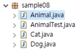

```java
package sample08;

public abstract class Animal {
	/*
	public void sound() {
		System.out.println("동물 소리");
	}
	*/
	public abstract void sound();
}
```

```java
package sample08;

public class Dog extends Animal {
	public void sound() {
		System.out.println("개 소리");
	}
}
```

```java
package sample08;

public class Cat extends Animal {
	public void sound() {
		System.out.println("고양이 소리");
	}
}
```

```java
package sample08;

public class AnimalTest {
	public static void main(String[] args) {
		Dog d = new Dog();
		d.sound();
		
		Cat c = new Cat();
		c.sound();
		
		Animal a1 = new Dog();
		a1.sound();
		
		Animal a2 = new Cat();
		a2.sound();
	}
}
```


### 인터페이스 


인터페이스는 객체로 생성할 수 없다. -> 생성자가 없다. 

```java
interface 인터페이스이름 {
	// 상수 필드 ← 인스턴스 필드 또는 정적 필드는 선언 불가
	데이터타입 상수이름 = 상수값;

	// 추상 메소드
	데이터타입 메소드이름 (매개변수, … );
}

// 상수필드 선언
[public static final] 데이터타입 상수이름 = 값;
// 상수이름은 대문자로 작성하는 것이 관례
// 여러 문자로 구성되는 경우, _ (언더바)로 연결해서 표기

// 추상 메소드 선언
public interface RemoteControl {
	public static final MAX_VOLUME = 10;
	public static final MIN_VOLUME = 0;

	public void turnOn();
	public void turnOff();
	public void setVolume(int volume);
}

```


#### 구현 클래스 

인터페이스에서 정의된 **추상 메소드를 재정의**해서 실행 내용을 가지고 있는 클래스 

```java
public class 구현클래스이름 implements 인터페이스이름 {
	// 인터페이스에서 선언한 추상 메소드를 재정의한다.
}
```


**예시 )** 

```java
package sample09;

public interface RemoteControl {
	int MAX_VOLUME = 10;
	int MIN_VOLUME = 0;
	
	void turnOn();
	void turnOff();
	void setVolume(int volume);	
}
```

```java
package sample09;

public class Audio implements RemoteControl {
	int volume;
	
	@Override
	public void turnOn() {
		System.out.println("Audio를 켭니다.");		
	}

	@Override
	public void turnOff() {
		System.out.println("Audio를 끕니다.");		
	}

	@Override
	public void setVolume(int volume) {
		if (volume < RemoteControl.MIN_VOLUME) {
			this.volume = RemoteControl.MIN_VOLUME;
		} else if (volume > RemoteControl.MAX_VOLUME) {			
			this.volume = RemoteControl.MAX_VOLUME;
		} else {
			this.volume = volume;
		}
		System.out.println("현재 Audio 볼륨은 " + this.volume + "입니다.");
	}
}
```

```java
package sample09;

public class Tv implements RemoteControl {
	int volume;
	
	@Override
	public void turnOn() {
		System.out.println("Tv를 켭니다.");		
	}

	@Override
	public void turnOff() {
		System.out.println("Tv를 끕니다.");		
	}

	@Override
	public void setVolume(int volume) {
		if (volume < RemoteControl.MIN_VOLUME) {
			this.volume = RemoteControl.MIN_VOLUME;
		} else if (volume > RemoteControl.MAX_VOLUME) {			
			this.volume = RemoteControl.MAX_VOLUME;
		} else {
			this.volume = volume;
		}
		System.out.println("현재 Tv 볼륨은 " + this.volume + "입니다.");
	}
}
```

```java
package sample09;

public class RemoteControlTest {
	public static void main (String[] args) {
		RemoteControl rc;
		
		rc = new Audio();
		rc.turnOn();
		rc.setVolume(15);
		rc.turnOff();
		
		rc = new Tv();
		rc.turnOn();
		rc.setVolume(15);
		rc.turnOff();
	}
}
```


**인터페이스는 다중 상속이 가능하다** 

```java
// 인터페이스는 다중 상속이 가능하다.
public class 구현클래스이름 implements 인터페이스1, 인터페이스2 {
	//	인터페이스1에 정의된 메소드를 재정의
	// 	인터페이스2에 정의된 메소드를 재정의
}
```


**예제 )** 

```java
package sample10;

public interface InterfaceA {
	public void methodA();
}
```

```java
package sample10;

public interface InterfaceB {
	public void methodB();
}
```

```java
package sample10;

//	인터페이스는 다중 상속이 가능하다.
public interface InterfaceC extends InterfaceA, InterfaceB {
	public void methodC();
}
```

```java
package sample10;

public class ClassC implements InterfaceC {
	public void methodC() {
		System.out.println("methodC() 호출");
	}
	
	//	상속 받은 인터페이스의 메소드도 함께 재정의, 구현해야 함
	public void methodA() {
		System.out.println("methodA() 호출");
	}
	public void methodB() {
		System.out.println("methodB() 호출");
	}
}
```

```java
package sample10;

public class Test {
	public static void main(String[] args) {
		ClassC c = new ClassC();
		c.methodA();
		c.methodB();
		c.methodC();
		
		InterfaceA a = c;
		a.methodA();
		//	a.methodB();
		
		InterfaceB b = c;
		b.methodB();
		
		InterfaceC cc = c;
		cc.methodA();
		cc.methodB();
		cc.methodC();		
	}
}
```


### 예외처리 


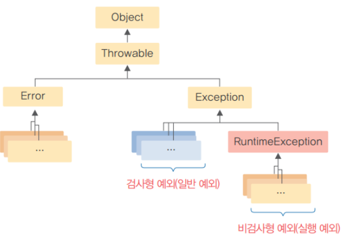

`Error ( 오류 ) ` : 개발자가 해결할 수 없는 치명적인 오류 

`Exception ( 예외 ) ` : 개발자가 해결할 수 있는 오류 


#### 실행 예외 

실행 시점에 결정되는 값으로 인해서 발생하는 예외 

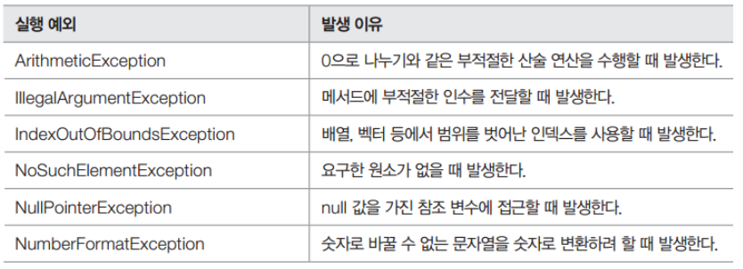


#### 일반예외 

컴파일 시점(IDE 도구에서는 코드를 작성하는 시점) 에 알 수 있음 => 개발자가 예외 처리 코드를 반드시 추가해야한다. 

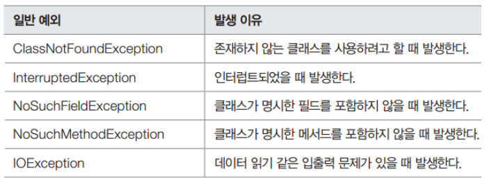


#### 예외 처리 방법 1 . 예외를 잡아서 처리하는 방법 

```java
try{
    // 예외 발생 예상 구문 
}catch(예외){
    // 예외 처리
}finally {
    // 예외 발생 여부에 관계없이 수행해야 할 코드 
}
```

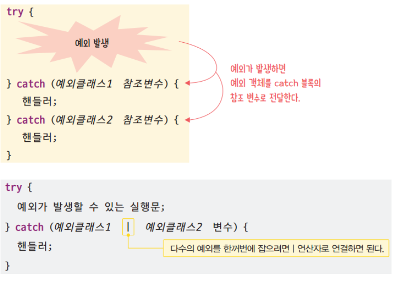


**Throwable 클래스의 주요 메소드** 

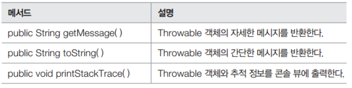


예시 1) 

```java
public class Sample {
	public static void main(String[] args) {
		int[] numbers = { 7, 8, 9 };
		
		System.out.println("첫번째 숫자 : " + numbers[0]);
		try {
			System.out.println("마지막 숫자 : " + numbers[3]);
		} catch (ArrayIndexOutOfBoundsException e) {
			System.out.println("배열 인덱스를 초과했습니다.");
		}		
		System.out.println("숫자의 개수 : " + numbers.length);
	}
}
```

예시 2)

```java
public class Sample {
	public static void main(String[] args) {
		System.out.println("시작");
		try {
			int x = Integer.parseInt(args[0]);
			System.out.println( 100 / x );
		} catch (ArrayIndexOutOfBoundsException e) {
			System.out.println("파라미터가 입력되지 않았습니다. " + e.getMessage());
		} catch (NumberFormatException e) {
			System.out.println("숫자형식이 아닙니다. " + e.toString());
		} catch (ArithmeticException e) {
			System.out.println("0으로 나눌 수 없습니다. ");
			e.printStackTrace();
		} finally {        ⇐ 정상 실행 여부와 관계 없이 항상 마지막에 호출되는 구문
			System.out.println("항상 호출됩니다.");
		}
		System.out.println("끝");		
	}
}
```

```
C:\workspaces\JavaProjects\bin>java Sample     		⇐ 파라미터가 누락 
시작
파라미터가 입력되지 않았습니다. 0
항상 호출됩니다.
끝

C:\workspaces\JavaProjects\bin>java Sample one		⇐ 숫자 형식이 아닌 문자가 입력
시작
숫자형식이 아닙니다. java.lang.NumberFormatException: For input string: "one"
항상 호출됩니다.
끝

C:\workspaces\JavaProjects\bin>java Sample 0		⇐ 숫자로 변환되었으나 연산과정에서 오류
시작
0으로 나눌 수 없습니다.
java.lang.ArithmeticException: / by zero
        at Sample.main(Sample.java:6)
항상 호출됩니다.
끝

C:\workspaces\JavaProjects\bin>java Sample 10		⇐ 정상적인 처리가 왼료
시작
10
항상 호출됩니다.
끝
```


**try-catch-finally 구문** 

```java
try{
    자원 생성 및 사용
} catch(예외 e){
    예외 처리
} finally {
    자원 해제
}
```


**try-with-resource 문 (JDK 7)**

```java
try (자원 생성) {
    자원 사용 
} catch(예외 e){
    예외 처리
}
```


#### 예외 처리방법 2. 예외를 떠넘기는 방법 

메소드에서 발생한 예외를 메소드 내부에서 처리하기 부담스러울 경우, `throws` 키워드를 사용해서 상위 코드로 예외를 전달하는 방법. 

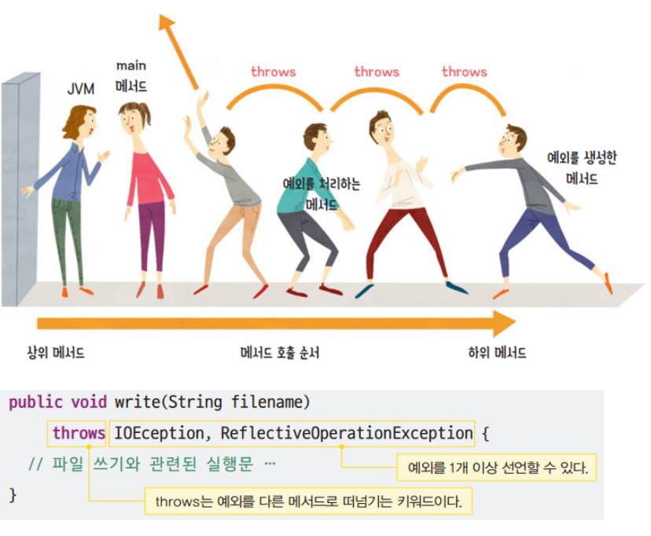

```java
import java.util.Scanner;

public class Sample {
	
	private static void square(String s) throws NumberFormatException {
		int n = Integer.parseInt(s);
		System.out.println( n * n );
	}
	
	public static void main(String[] args) {
		Scanner in = new Scanner(System.in);
		try {
			square(in.nextLine());
		} catch (NumberFormatException e) {
			System.out.println("숫자 타입이 아닙니다.");
		}
	}
}
```


### 제네릭 

하나의 코드를 다양한 타입의 객체에 재사용하는 객체 지향 기법 

클래스, 인터페이스, 메소드를 정의할 때 타입을 변수로 사용 

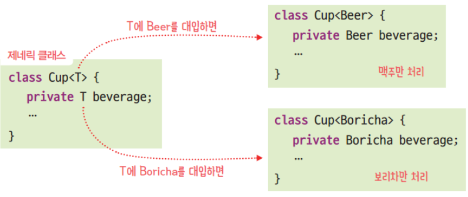

```java
public class Entry<K, V> {
	private K key;
	private V value;
	
	public Entry(K key, V value) {
		this.key = key;
		this.value = value;
	}
	
	public K getKey() {
		return this.key;
	}
	
	public V getValue() {
		return this.value;
	}
}
```

```java
public class Sample {
	public static void main(String[] args) {
		String key = "홍길동";
		int value = 789;
		Entry<String, Integer> e = new Entry<>(key, value);
		
		String key2 = e.getKey();
		int value2 = e.getValue();
		System.out.println(key2 + ", " + value2);
	}
}
```

