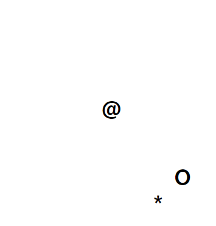

## 문서 객체 모델 


**문서객체모델**은 넓은 의미로 웹 브라우저가 HTML 페이지를 인식하는 방식이고, 좁은 의미로는 document 객체와 관련된 객체의 집합이다. 


정적으로 문서 객체를 생성한다  =>  웹 페이지가 처음 HTML 페이지에 적혀있는 태그들을 읽으며 생성하는 것 

동적으로 문서 객체를 생성한다  =>  자바스크립트로 원래 HTML 페이지에는 없던 문서 객체를 생성하는 것 


#### 문서 객체 만들기1 

```html
<!DOCTYPE html> 
<html>
    <head>
    </head>
    <body>
        <script>
            window.onload = function(){
                var header = document.createElement('h1'); 
                var textNode = document.createTextNode('Hello DOM'); 
    
                header.appendChild(textNode); 
                document.body.appendChild(header); 
            }
        </script>        
    </body>
</html>
```


`appendChild(node)` : 객체에 노드를 연결


#### 문서 객체 만들기 2

```html
<!DOCTYPE html> 
<html>
    <head>
        
    </head>

    <body>
        <script>
            window.onload = function(){
                var img = document.createElement('img'); 
                img.setAttribute('src','peng.png'); 
                img.setAttribute('width',500); 
                img.setAttribute('height',350); 

                // setAttribute 메서드를 사용하지 않으면 불가능하다. 
                img.setAttribute('data-property',350); 

                document.body.appendChild(img);
                
            }
        </script>        
    </body>
</html>
```


문서 객체의 속성 메서드 

| 메서드 이름              | 설명                     |
| ------------------------ | ------------------------ |
| setAttribute(name,value) | 객체의 속성을 지정합니다 |
| getAttribute(name)       | 객체의 속성을 가져옵니다 |


#### 문서 객체 만들기 3 


`innerHTML 속성 ` : 태그의 내부를 의미하는 속성 

```html
<h1>
     // innerHTML 속성 
</h1>
```

```html
<!DOCTYPE html> 
<html>
    <head>
        
    </head>

    <body>
        <script>
            window.onload = function(){
                var output = ''; 
                output += '<ul>'; 
                output += '   <li>JavaScript</li>';
                output += '   <li>JQuery</li>';
                output += '   <li>Ajax</li>';
                output += '</ul>'; 

                document.body.innerHTML = output;
            }
        </script>        
    </body>
</html>
```


인터넷 익스플로러를 제외한 웹 브라우저는 모든 문서 객체의 innerHTMl 속성을 바꿀 수 있다. 

만약 HTML 형태의 문자열을 HTML 태그로 넣지 않고 단순 글자로 넣고 싶다면 `textContent` 속성을 사용 

```html
document.body.textContent = output ; 
```


#### 문서 객체 가져오기 1 

document 객체의 문서 객체 선택 메서드 

| 메서드 이름        | 설명                                                         |
| ------------------ | ------------------------------------------------------------ |
| getElementById(id) | 태그의 id속성이 id매개변수와 일치하는 문서 객체를 가져옵니다. |


```html
<!DOCTYPE html> 
<html>
    <head>   
    </head>
    <body>
        <h1 id="header-1"> Header</h1>
        <h1 id="header-2"> Header</h1>
        <script>
            window.onload = function(){
                var header1 = document.getElementById('header-1'); 
                var header2 = document.getElementById('header-2'); 

                header1.innerHTML = 'with getElementById()' ; 
                header2.innerHTML = 'with getElementById()' ; 
            }
        </script>        
    </body>
</html>
```


#### 문서 객체 가져오기2 

document 객체의 문서 객체 선택 메서드 

| 메서드 이름                   | 설명                                                         |
| ----------------------------- | ------------------------------------------------------------ |
| getElementsByName(name)       | 태그의 name속성이 name 매개변수와 일치하는 문서 객체를 배열로 가져온다 |
| getElementsByTagName(tagName) | tagName 매개변수와 일치하는 문서 객체를 배열로 가져온다.     |

```html
<!DOCTYPE html> 
<html>
    <head>
        <title> Index </title>
        <script>
            window.onload = function () { 
                var headers = document.getElementsByTagName('h1');

                headers[0].innerHTML = 'with getElementsByTagName()_1'; 
                headers[1].innerHTML = 'with getElementsByTagName()_2'; 
            }
        </script>
    </head>
    <body>
        <h1>Header</h1>
        <h1>Header</h1>
    </body>
</html>
```


위의 소스에서 header 은 배열이므로 반복문을 사용할 수 있다. 그러나 `for in ` 반복문은 사용하면 안된다. 그 이유는 문서 객체 이외의 속성에도 접근하기 때문. 

따라서 `getElementsBTabName()` 메서드로 가져온 객체는 꼭 단순 for 반복문을 사용해야한다. 


#### 문서 객체 가져오기 3

 document 객체의 문서 객체 선택 메서드 

| 메서드 이름              | 설명                                               |
| ------------------------ | -------------------------------------------------- |
| querySelector(선택자)    | 선택자로 가장 처음 선택되는 문서 객체를 가져온다   |
| querySelectorAll(선택자) | 선택자를 통해 선택되는 문서 객체를 배열로 가져온다 |

CSS 선택자로 문서 객체를 선택하는 메서드 

```html
<!DOCTYPE html> 
<html>
    <head>
        <title> Index </title>
        <script>
            window.onload = function () { 
                var header1 = document.querySelector('#header1'); 
                var header2 = document.querySelector('#header2'); 

                header1.innerHTML = 'with getElementsByTagName()-1'; 
                header2.innerHTML = 'with getElementsByTagName()-2'; 
            }
        </script>
    </head>
    <body>
        <h1 id="header1">Header</h1>
        <h1 id="header2">Header</h1>
    </body>
</html>
```


#### 문서 객체의 스타일 조작 

문서 객체의 style 속성을 사용하면 해당 문서 객체의 스타일을 변경할 수 있습니다. 

```html
<!DOCTYPE html> 
<html>
    <head>
        <title> Index </title>
        <script>
            window.onload = function () { 
                var header = document.querySelector('#header'); 
                
                header.style.border = '2px solid black'; 
                header.style.color = 'orange'; 
                header.style.fontFamily = 'helvetica'; 
            }
        </script>
    </head>
    <body>
        <h1 id="header">Header</h1>
    </body>
</html>
```


#### 문서 객체 제거 

| 메서드 이름        | 설명                                |
| ------------------ | ----------------------------------- |
| removeChild(child) | 문서 객체의 자식 노드를 제거합니다. |

```html
<!DOCTYPE html> 
<html>
    <head>
        <title> Index </title>
        <script>
            window.onload = function () { 
                var willRemove = document.getElementById('will-remove');

                document.body.removeChild(willRemove);
            }
        </script>
    </head>
    <body>
        <h1 id="will-remove">Header1</h1>
        <h1 id="header">Header2</h1>
    </body>
</html>
```


위의 코드는 body 문서 객체 바로 아래에 제거하고자 하는 문서객체가 있으므로 사용가능. 일반적으로 문서객체를 제거할때는 아래의 코드를 사용 

```html
willRemove.parentNode.removeChild(willRemove); //부모노드로 이동하고 부모노드에서 자식노드 삭제
```


#### 문서 객체를 사용한 시계 

- 1초마다 시간이 현재시간으로 변경 

```html
<!DOCTYPE html> 
<html>
    <head>
        <title> Index </title>
        <script>
            window.onload = function () { 
                var  clock = document.getElementById('clock');

                setInterval(function(){
                    clock.innerHTML = new Date().toString(); 
                },1000);
            }
        </script>
    </head>
    <body>
       <h1 id="clock"></h1>
    </body>
</html>
```


#### 문서 객체를 사용한 움직임 구현 

```html
<!DOCTYPE html> 
<html>
    <head>
        <title> Index </title>
        <script>
            window.onload = function () { 
                var sun= document.getElementById('sun'); 
                var earth = document.getElementById('earth'); 
                var moon = document.getElementById('moon'); 

                sun.style.position = 'absolute'; 
                earth.style.position = 'absolute'; 
                moon.style.position = 'absolute'; 
                sun.style.left = 250 + 'px'; 
                sun.style.top = 200 +'px'; 

                var earthAngle = 0;
                var moonAngle = 0 ; 

                setInterval(function(){
                    var earthLeft = 250 + 150*Math.cos(earthAngle); 
                    var earthTop = 200 + 150*Math.sin(earthAngle); 
                    var moonLeft = earthLeft + 50*Math.cos(moonAngle); 
                    var moonTop = earthTop + 50*Math.sin(moonAngle); 

                    earth.style.left = earthLeft + 'px'; 
                    earth.style.top = earthTop + 'px'; 
                    moon.style.left = moonLeft + 'px'; 
                    moon.style.top = moonTop + 'px'; 

                    earthAngle += 0.1; 
                    moonAngle += 0.3; 
                },1000/30);
            }
        </script>
    </head>
    <body>
       <h1 id="sun">@</h1>
       <h1 id="earth">O</h1>
       <h1 id="moon">*</h1>
    </body>
</html>
```




#### 문서 객체와 객체 지향을 사용한 움직임 구현 

```html
<!DOCTYPE html> 
<html>
    <head>
        <!-- 보조함수 -->
        <script>
            // 랜덤한 정수를 생성
            function nextRandomInteger(limit){
                return Math.round(Math.random() * limit); 
            }
            
            // 랜덤한 알파벳을 리턴하는 함수 
            var alphabet = 'ABCDEFGHIJKLMNOPQRSTUVWXYZ'; 
            function randomAlphabet(){
                return alphabet.charAt(nextRandomInteger(25));
            }

            // 양수와 음수로 랜덤함 속도를 생성하는 함수 
            function randomSpeed(maxSpeed){
                return Math.random() * maxSpeed - Math.random()*maxSpeed; 
            }
        </script>

        <!-- 생성자 함수-->
        <script>
            // MovingText 의 생성자 함수 
            var canvasWidth = 700; 
            var canvasHeight = 400;     // 두 변수는 텍스트가 움직일 수 있는 공간의 너비와 높이 

            function MovingText(){
                // 위치와 속도 속성
                this.x = nextRandomInteger(canvasWidth);
                this.y = nextRandomInteger(canvasHeight);
                this.vx = randomSpeed(10); 
                this.vy = randomSpeed(10); 

                // 문서 객체를 생성합니다. 
                this.body = document.createElement('h1'); 
                this.body.innerHTML = randomAlphabet(); 
                this.body.style.position = 'absolute';

                // 문서 객체를 document.body 에 추가합니다. 
                document.body.appendChild(this.body);
            }

            MovingText.prototype.move = function(){
                //범위 검사 
                if(this.x < 0 || this.x > canvasWidth) { this.vx *= -1;}
                if(this.y < 0 || this.y > canvasHeight) { this.vy *= -1;}

                // 이동 
                this.x += this.vx; 
                this.y += this.vy; 

                // 화면에 이동 표시 
                this.body.style.left = this.x + 'px'; 
                this.body.style.top = this.y + 'px'; 
            }
        </script>

        <!-- window.onload -->
        <script>
                window.onload = function(){
                    var movingTexts = []; 

                    // 배열에 MovingText 객체 100개를 생성 
                    for(var i =0; i<100; i++){
                        movingTexts.push(new MovingText());
                    }

                    // 움직인다 
                    setInterval(function(){
                        for(var i in movingTexts){
                            movingTexts[i].move();
                        }
                    },1000/30);
                }
        </script>
    </head>
    <body>
       
    </body>
</html>
```

