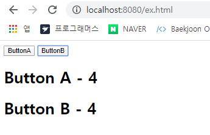

## 이벤트


**이벤트** : 키보드를 이용해 버튼을 입력하거나 마우스 클릭과 같이 다른 것에 영향을 미치는 것 

이벤트는 애플리케이션 사용자가 발생시킬 수도 있고 애플리케이션이 스스로 발생시킬수도있다.


```html
<script>
	window.onload = function(){
        
    }
</script>
```

window 객체의 onload 속성에 함수 자료형을 할당하는 것을 `이벤트를 연결한다`  고 한다 .

`load` : 이벤트 이름 또는 이벤트 타임 

`onload`  : 이벤트 속성 

이벤트 속성에 할당한 함수를 **이벤트 리스너** 또는 **이벤트 핸들러**


문서 객체에 이벤트를 연결하는 벙법 : **이벤트 모델** 

이벤트 모델은 DOM Level 단계에 따라 2가지로 분류 가능 

- DOM Level 0 
  - 인라인 이벤트 모델 
  - 기본 이벤트 모델 
- DOM Level 2 
  - 마이크로소프트 인터넷 익스플로러 이벤트 모델 
  - 표준 이벤트 모델 


### 고전 이벤트 모델 

자바스크립트에서 문서 객체의 이벤트 속성으로 이벤트를 연결하는 방법. 

```html
<!DOCTYPE html> 
<html>
    <head>
        <script>
            window.onload = function(){
                var header = document.getElementById('header'); 

                header.onclick = function(){
                    alert('클릭');
                    
                    // 이벤트를 제거 
                    header.onclick = null;
                }
            }   
    </script>
    </head>
    <body>
        <h1 id="header">Click</h1>
    </body>
</html>
```


### 이벤트 발생 객체와 이벤트 객체 


- 이벤트 리스너 안에서 `this` 키워드를 사용하면 이벤트가 발생한 객체를 찾을 수 있다. 

  ```html
  <!DOCTYPE html> 
  <html>
      <head>
          <script>
              window.onload = function(){
                  document.getElementById('header').onclick = function(){
                      alert(this);
                  }
              }   
      </script>
      </head>
      <body>
          <h1 id="header">Click</h1>
      </body>
  </html>
  ```

  


- 이벤트 리스너 안에서 `this` 키워드의 스타일을 바꾸는 것은 이벤트가 발생한 객체의 스타일을 변경하는 것 

  ```html
  <!DOCTYPE html> 
  <html>
      <head>
          <script>
              window.onload = function(){
                  document.getElementById('header').onclick = function(){
                      this.style.color = "orange";
                      this.style.backgroundColor = 'red'; 
                  }
              }   
      </script>
      </head>
      <body>
          <h1 id="header">Click</h1>
      </body>
  </html>
  ```

  

- 이벤트의 '누가' 와 관련된 정보 이외의 정보는 이벤트 객체 안에 들어있다. 

  ```html
  <!DOCTYPE html> 
  <html>
      <head>
          <script>
              window.onload = function(){
                  document.getElementById('header').onclick = function(e){
                      var event = e || window.event; // e 가 존재하면 e 를 변수 event 에 넣고 , e 가 undefined 면 window.event 속성을 변수에 넣는 짧은 조건문 
                      document.body.innerHTML = ''; 
                      for(var key in event){
                          document.body.innerHTML += '<p>' + key + ': ' + event[key] + '</p>';
                      }
                  }
              }   
      </script>
      </head>
      <body>
          <h1 id="header">Click</h1>
      </body>
  </html>
  ```

  


### 이벤트 강제 실행 

이벤트를 강제로 실행시키는 방법은 메서드를 호출하는 것처럼 이벤트 속성을 호출하면 된다. 

**예시 )** 버튼을 클릭하면 해당 카운트 증가 ( 버튼 B 를 클릭하면 A 도 같이 증가 )

```html
<!DOCTYPE html> 
<html>
    <head>
        <script>
            window.onload = function(){
                var buttonA = document.getElementById('button-a');
                var buttonB = document.getElementById('button-b');
                var counterA = document.getElementById('counter-a');
                var counterB = document.getElementById('counter-b');

                // 이벤트를 연결합니다
                buttonA.onclick = function() { 
                    counterA.innerHTML = Number(counterA.innerHTML) +1 ;
                };
                buttonB.onclick = function() { 
                    counterB.innerHTML = Number(counterB.innerHTML) +1 ;
                    buttonA.onclick();
                };
            }   
    </script>
    </head>
    <body>
        <button id="button-a">ButtonA</button>
        <button id="button-b">ButtonB</button>
        <h1> Button A - <span id="counter-a">0</span></h1>
        <h1> Button B - <span id="counter-b">0</span></h1>
    </body>
</html>
```




### 인라인 이벤트 모델 

인라인 이벤트 모델은 HTML 페이지의 가장 기본적인 이벤트 연결 방법 

```html
<body>
    <h1 onclick = "alert('클릭')">Click</h1>
</body>
```


이벤트 속성에 여러 줄의 자바스크립트 코드를 적을 수도 있다. 

```html
<body>
    <h1 onclick = "var alpha=10; alert(alpha); ">Click</h1>
</body>
```


```html
<!DOCTYPE html> 
<html>
    <head>
        <script>
            function whenClick(e){
                alert('클릭'); 
            }    
        </script>
    </head>
    <body>
        <h1 onclick = "whenClick(event)">Click</h1>
    </body>
</html>
```


### 디폴트 이벤트 제거 

일부 HTML 태그는 이미 이벤트 리스너가 있는데 이러한 것을 **디폴트 이벤트** 라고 한다.

**예시 )** 비밀번호 같을 경우 제출 누르면 성공 팝업 ( 디폴트 이벤트를 제거한 상태 )

```html
<!DOCTYPE html> 
<html>
    <head>
        <script>
            window.onload = function(){
                document.getElementById('my-form').onsubmit = function(){
                    var pass =document.getElementById('pass').value; 
                    var passCheck = document.getElementById('pass-check').value; 

                    if(pass==passCheck){
                        alert('성공'); 
                    }else{
                        alert('다시 입력해주세요.' );
                        return false; 
                    }
                    
                }
            }
        </script>
    </head>
    <body>
        <form id = "my-form">
            <label for ="name">이름</label><br/>
            <input type="text" name="name" id="name" /><br/>
            <label for ="pass">비밀번호</label><br/>
            <input type = "password" name = "pass" id = "pass" /><br/>
            <label for = "pass-check">비밀번호 확인</label><br/>
            <input type ="password" id="pass-check" /><br/>
            <input type = "submit" value = "제출" />
        </form>
    </body>
</html>
```


참고로 인라인 이벤트 모델을 사용할 떄는 form 태그의 onsubmit 이벤트 속성에 'return 함수()' 형태를 입력해야한다. 

```html
<script>
    function whenSubmit(){
    	//유효성 검사
        return false;
    }
</script>
<form onsubmit = "return whenSubmit()"> 
    <!-- 생략 -->
</form>
```


### 이벤트 전달 


**이벤트전달** : 어떠한 이벤트가 먼저 발생해 어떤 순서로 발생하는지

**이벤트버블링** : 자식 노드에서 부모노드 순으로 이벤트를 실행하는 것. 

**이벤트캡쳐링** : 부모노드에서 자식 노드 순으로 실행되는 것 


```html
<!DOCTYPE html> 
<html>
    <head>
        <script>
            window.onload = function(){
                document.getElementById('header').onclick = function(){
                    alert('header');
                };
                document.getElementById('paragraph').onclick = function(){
                    alert('paragraph');
                };
            }
        </script>
    </head>
    <body>
        <h1 id="header">
            <p id="paragraph">Paragraph</p>
        </h1>
    </body>
</html>
```

**결과 )**  이벤트 버블링이 일어나면서 `paragraph -> header` 순으로 경고창이 출력 


- 인터넷 익스플로러와 그외 브라우저가 이벤트 전달을 막는 방법 
  - 인터넷 익스플로러 _ 이벤트 객체의 cancelBubble 속성을 true 로 변경 
  - 그 이외의 브라우저 _ 이벤트 객체의 stopPropagation() 메서드를 사용 

```html
<!DOCTYPE html> 
<html>
    <head>
        <script>
            window.onload = function(){
                document.getElementById('paragraph').onclick = function(e){
                    // 이벤트 객체를 처리합니다. 
                    var event = e || window.event; 

                    // 이벤트 발생을 알린다
                    alert('paragraph'); 

                    // 이벤트 전달을 제거 
                    event.cancelBubble = true; 
                    if(event.stopPropagation){
                        event.stopPropagation();
                    }
                }
            }
        </script>
    </head>
    <body>
        <h1 id="header">
            <p id="paragraph">Paragraph</p>
        </h1>
    </body>
</html>
```


### 인터넷 익스플로러 이벤트 모델 

인라인 이벤트 모델이나 고전 이벤트 모델은 한 번에 하나의 이벤트 리스너만을 가질 수 있다. 이러한 DOM Level 0 이벤트 모델들의 단점을 보완하여 만들어진 이벤트 모델이 DOM Level2 모델 


DOM Level2 이벤트 모델에는 **인터넷 익스플로러 모델**과 **표준 이벤트 모델**이 있다. 


- 인터넷 익스플로러 이벤트 모델은 2가지 메서드로 이벤트를 연결하거나 제거할 수있다. 

  (첫번째 매개변수에 이벤트 속성을 쓴다 )

  ```html
  attachEvent(eventProperty, eventListener); 
  detachEvent(eventProperty, eventListener);
  ```

  예시 ) window 객체에 load 이벤트를 연결하면 아래와 같이 사용 

  ```html
  <script>
  	window.attachEvent('onload',function(){
          
      })
  </script>
  ```

- DOM Level2 이벤트 모델은 여러번 이벤트를 추가할 수 있다. 

  ```html
  <!DOCTYPE html> 
  <html>
      <head>
          <script>
              window.attachEvent('onload',function(){
                  var header = document.getElementById('my-header');
  
                  header.attachEvent('onclick',function(){ alert('클릭');});
                  header.attachEvent('onclick',function(){ alert('클릭');});
                  header.attachEvent('onclick',function(){ alert('클릭');});
              })
          </script>
      </head>
      <body>
          <h1 id="my-header">Click</h1>
      </body>
  </html>
  ```

- 익명함수를 이벤트리스너로 사용한 이벤트는 제거할 수 없습니다. 이벤트를 제거할 때 사용하는 `detatchEvent` 메서드는 어떤 이벤트 리스너를 제거할지 명확하게 알려줘야한다. 

  ```html
  <!DOCTYPE html> 
  <html>
      <head>
          <script>
              window.attachEvent('onload',function(){
                  var header = document.getElementById('my-header');
                  var handler = function () { alert('클릭'); };
  
                  header.attachEvent('onclick', handler);
                  header.detachEvent('onclick', handler);
              })
          </script>
      </head>
      <body>
          <h1 id="my-header">Click</h1>
      </body>
  </html>
  ```

- 참고로 인터넷 익스플로러 이벤트 모델에서 이벤트 리스너의 this 키워드는 이벤트 발생 객체를 의미하지 않는다. 이벤트 리스너에서 this 키워드는 window 객체를 나타낸다. 이벤트 발생 객체를 사용하려면 이벤트 객체의 `srcElement` 속성을 사용해야한다. 


### 표준 이벤트 모델 

웹 표준을 만드는 단체인 W3C 에서 공식적으로 지정한 DOM Level2 이벤트 모델 

한번에 여러가지의 이벤트 리스너를 추가할 수 있다. 

- 표준 이벤트 모델은 이벤트 연결시 아래와 같은 메서드 사용 

  ```html
  addEventListener(eventName, handler, useCapture)
  removeEventListener(eventName, handler)
  ```

  `useCapture` : 입력하지 않으면 자동으로 false 입력 

  **예시)** 

  ```html
  <!DOCTYPE html> 
  <html>
      <head>
          <script>
              window.onload = function(){
                  var header = document.getElementById('my-header');
  
                  header.addEventListener('click',function(){
                      this.innerHTML +='+';
                  })
              }
          </script>
      </head>
      <body>
          <h1 id="my-header">Click</h1>
      </body>
  </html>
  ```

  

  **표준 이벤트 모델은 이벤트 리스너 안에서 this 키워드가 이벤트 발생 객체를 의미.** 