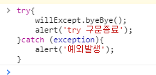
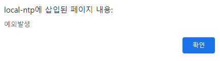

## 예외처리 


### 예외처리개요

프로그램이 실행되는 동안 문제가 발생하면 프로그램이 자동을 중단되는데, 이를 대처할 수 있게 처리하는 것을 **예외 처리** 라고 한다. 


### 기본 예외 처리 

예외가 발생하지 않게 사전에 해결하는 것을 **기본예외 처리** 라고 부른다. 

```html
function whenClick(e){
	var event = window.event || e; 
	var willAlert = ''; 
	willAlert += 'clientX : ' + event.clientX + '\n'; 
	willAlert += 'clientY : ' + event.clientY + '\n'; 
	alert(willAlert);
}
```


### 고급 예외 처리 

고급 예외 처리는 `try ` , `catch` , `finally` 키워드로 예외를 처리하는 방법.  -> 이를 `try catch finally` 구문이라고 부른다 

```html
try {

} catch (exception){

} finally {

}
```

- try 구문 안에서 예외가 발생하면 이를 catch 구문에서 처리한다. finally 구문은 필수사항은 아니며 예외 발생 여부와 상관없이 수행돼야 하는 작업이 있을 때 사용. 

- try  구문 안에서 예외가 발생하면 더 이상 try 구문을 진행하지 않고 catch 구문을 실행 

                        

- try 구문에서 예외가 발생하든 안하든 무조건 finally 구분은 실행된다. 


### 예외 객체

try catch 구문을 사용할 때 catch 괄호 안에 입력하는 식별자가 예외 객체입니다. 

일반적으로 e 나 exception 식별자를 사용합니다. 

| 속성 이름   | 설명        |
| ----------- | ----------- |
| message     | 예외 메시지 |
| description | 예외 설명   |
| name        | 예외 이름   |


### 에러와 예외 

try catch 구문으로 해결할 수 있는 것이 예외이고, 해결할 수 없는 것이 에러. 


### 예외 강제 발생 

에외를 강제로 발생시킬 때는 `throw` 키워드를 사용한다. 

```html
<script>
	throw 'CUSTOM EXCEPTION OCCUR'; 
</script>

// 오류 메시지에 직접적으로 입력한 문자열이 출력되는 것을 확인 
```

```html
// 적절한 강제적 예외 발생과 처리 
<script>
	function divide(alpha, beta){
        if(beta == 0){
            throw 'DivideByZeroException';
        }else {
            return alpha/beta; 
        }
    }
    
    	try{
            divide(10,0); 
        }catch (exception){
            alert('CATCH'); 
        }
</script>
```


### finally 구문 


아래와 같은 경우에 결과가 달라진다. 

- try catch 구문 내부에서 return 키워드를 만날 때 
- try catch 구문 내부에서 break 또는 continue 키워드를 만날때