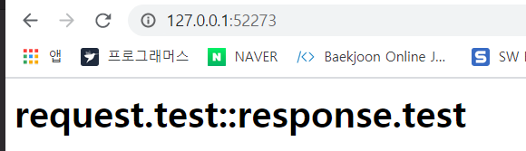
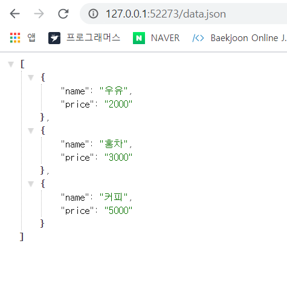

## Ajax


### Ajax 개요 

Ajax 는 구현하는 방식을 의미. 

Ajax 를 사용하면 페이지를 전환하지 않고 서버에서 데이터를 받아와 사용자에게 보여줄 수 있다. 


### 데이터 전송 형식 

서버와 클라이언트가 데이터를 주고받을때는 특정한 형식을 맞춰야한다. 


#### CSV 형식 ( Comma Separated Values )

각 항목을 쉼표로 구분해 데이터를 표현하는 방법. 

CSV 형식은 다른 형식에 비애 굉장히 짧기때문에, 많은 양의 데이터를 전송할 때 활용하면 좋다. 

그러나 데이터의 가독성이 떨어진다. 

CSV 형식의 문자열은 `split` 메서드로 분해한다. 

```html
<script>
	var input = ''; 
    input += '모던 웹 디자인을 위한 HTML5 + CSS3 입문, 한빛미디어, 윤인성, 30000원\n';
    input += '모던 웹 디자인을 위한 Java + JQuery 입문, 한빛미디어, 윤인성, 32000원\n';
    input += '모던 웹 디자인을 위한 node.js, 한빛미디어, 윤인성, 25000원\n';
    
    input = input.split('\n');
    for(var i=0; i<input.length; i++){
        // 쉼표를 기준으로 자른다 
        input[i] = input[i].split(','); 
        for(var j=0; j<input[i].length; i++){
            // 각 데이터 양 옆의 공백을 제거 
            input[i][j] = input[i][j].trim(); 
        }
    }
</script>
```


#### XML 형식 

XML 형식은 HTML 형식처럼 **태그**로 데이터를 표현 

대부분의 정보 제공 사이트에서 제공하는 RSS 형식도 XML 형식을 기반으로 생성 

단점은 닫는 태그와 여는 태그 등이 쓸데없이 용량을 차지하는 문제가 있다. 

( RSS - Really Simple Syndication : 블로그처럼 컨텐츠 업데이트가 자주 일어나는 웹 사이트에서 업데이트된 정보를 쉽게 구독자들에게 제공하기 위해 SML 기초로 만들어진 데이터 형식 )

```html
<?xml version="1.0" encoding="utf-8" ?>
<books>
	<book>
    	<name> 모던 웹 디자인 </name>
        <publisher> 한빛미디어 </publisher>
        <author> 윤인성 </author>
        <price> 30000원 </price>
    </book>
</books>
```


#### JSON 형식 

자바스크립트에서 사용하는 객체 형태로 데이터를 표현하는 방법 . ( Ajax 를 사용할 때 거의 표준으로 사용되는 데이터 표현 방식 )

JSON 에는 객체,배열,문자열,숫자,불,null 만 들어갈 수 있으며, 문자열은 무조건 큰따옴표를 사용해야한다.

데이터의 가독성이 좋으며 XML 형식보다 적은 용량으로 데이터를 전달할 수 있다. 

단점은 데이터의 양이 현저하게 많아지면 데이터 추출 속도가 현저하게 떨어진다. 따라서 데이터의 양이 많다면 CSV  형식을 사용할 것을 추천 

```json
[{
    "name" : "모던 웹 디자인", 
    "publisher" : "한빛미디어", 
    "author" : "윤인성"
},{
 	"name" : "JavaScript", 
    "publisher" : "한빛미디어", 
    "author" : "윤인성" 
}]
```


| 형식 | 장점                           | 단점                                                       |
| ---- | ------------------------------ | ---------------------------------------------------------- |
| CSV  | 용량이 적다                    | 가독성이 떨어진다                                          |
| XML  | 가독성이 좋다                  | 용량이 크다<br />데이터의 양이 커지면 분석 속도가 떨어진다 |
| JSON | 용량이 적다<br />가독성이 좋다 | 데이터의 양이 커지면 분석 속도가 떨어진다.                 |


### node.js 개요와 설치 

**node.js** 는 CommonJS 표준에 따라 라이언달이 크롬V8 엔진을 기반으로 개발한 **플랫폼** 

node.js 를 사용하면 웹 브라우저가 아닌 곳에서 자바스크립트로 프로그램을 개발할 수 있습니다. 


명령 프롬프트에 node 명령어를 입력하면 REPL 이 실행된다 . ( 자바스크립트 코드를 한 줄씩 입력해서 실행 )


#### 기본 파일 실행 

1. `js` 파일을 하나 생성 

   ```js
   var output = ''; 
   for(var i =0; i<10; i++){
       console.log(output += '*');
   }
   ```

2. 명령 프롬프트 창을 실행해야 `node 파일명` 을 통해 실행 

   


#### 내부 모듈

**내부모듈** : 모듈 중에서 Node.js 에 기본적으로 있는 모듈 

내부모듈은 `https://nodejs.org/dist/latest-v6.x/docs/api/ ` 에서 확인할 수 있다. 


- os 모듈을 사용한 내부 모듈 사용법 .

  

  

  

  ```js
  // 모듈을 추출
  var os = require('os'); 
  
  // 속성 출력
  console.log(os);
  ```

  

| 메서드이름             | 설명                                          |
| ---------------------- | --------------------------------------------- |
| hostname()             | 운영체제의 호스트이름 리턴                    |
| type()                 | 운영체제의 이름을 리턴                        |
| platform()             | 운영체제의 플랫폼을 리턴                      |
| arch()                 | 운영체제의 아키텍처를 리턴                    |
| release()              | 운영체제의 버전을 리턴                        |
| uptime()               | 운영체제가 실행된 시간을 리턴                 |
| loadavg()              | 로드 에버리지 정보를 담은 배열을 리턴         |
| totalmem()             | 시스템의 총 메모리를 리턴                     |
| freemem()              | 시스템의 사용 가능한 메모리를 리턴            |
| cpus()                 | CPU의 정보를 담은 객체를 리턴                 |
| getNetworkInterfaces() | 네트워크 인터페이스의 정보를 담은 배열을 리턴 |


#### 외부 모듈 

**외부모듈** : node.js 가 기본적으로 갖지 않고 개인 또는 단체가 만들어 배포하는 모듈

외부모듈은 `httpsL//npmjs.org/` 에서 확인 가능 .


- 외부 모듈을 사용하기 위해서는 별도의 설치 필요 ( 자바스크립트 파일이 있는 디렉터리에서 입력 )

  ```bash
  > npm install 모듈명
  ```

  


### 서버 생성 및 실행 

1. `server.js` 파일 생성 

2. 웹 서버를 만들 때 express 외부 모듈 사용 -> 외부 모듈 설치 

   ```bash
   > npm install express@4.14
   ```

   

   만약 설치가 Error 가 뜰 경우 폴더 자체에 권한을 부여해서 실행 ( 엑세스 제거 )

3. ```js
   var express = require('express'); 
   
   // 웹 서버 생성 
   var app = express(); 
   
   // 웹 서버 실행 
   app.listen(52273,function(){
       console.log('Server Running at http://127.0.0.1:52273');
   })
   ```

   **포트** : 컴퓨터와 컴퓨터를 연결하는 정보의 출입구 역할 ( 컴퓨터는 0 ~ 65535 번 포트 존재 )

   ( 일반적으로 49151 번 이상 원하는 숫자의 포트를 사용할 경우 안전 )

   웹 브라우저에서 서버에 접속 시 `http://[IP주소]:[포트]` 형태로 주소 입력 

4. `app.use()` 를 이용하여 웹 서버에 기능을 부여 

   ```js
   var express = require('express'); 
   
   // 웹 서버 생성 
   var app = express(); 
   app.use(function(request,response){
       response.send('<h1>안녕하세요!</h1>');
   })
   
   // 웹 서버 실행 
   app.listen(52273,function(){
       console.log('Server Running at http://127.0.0.1:52273');
   })
   ```

   ```ba
   > node server.js 
   ```

   

   서버를 종료할 때 `Ctrl+c` 를 누르고, 파일을 수정하면 반드시 서버를 종료하고 다시 실행해야한다. 


#### 미들웨어 

`app.use()` 메서드에 입력하는 콜백함수는 request 이벤트 리스너. 

request 이벤트 리스너는 사용자가 서버에 접속하면 자동으로 실행된다. 

```javascript
app.use(function(request,response,next){
    
})
```

`app.use` 메서드는 여러번 사용할 수 있는데, 매개변수 next 는 다음 콜백 함수를 의미함. 

```js
// 모듈 추출 
var express = require('express'); 

// 웹 서버를 생성 
var app = express(); 
app.use(function(request, response, next){
    console.log('fisrt'); 
    next(); 
});
app.use(function(request, response, next){
    console.log('second'); 
    next(); 
});
app.use(function(request, response, next){
    response.send('<h1>Hello Middleware ..!</h1>')
});

// 웹 서버 실행 
app.listen(52273, function(){
    console.log('Server Running at http://127.0.0.1:52273');
})
```


사용자의 요청을 처리하면서 지나가는 `app.use` 메서드의 콜백함수를 **미들웨어**라고 부른다. 

미들웨어를 사용하면 request 객체와 response 객체에 기능을 추가할 수 있다. 

```js
// 모듈 추출 
var express = require('express'); 

// 웹 서버를 생성 
var app = express(); 
app.use(function(request, response, next){
    request.test = 'request.test'; 
    response.test = 'response.test'; 
    next(); 
});

app.use(function(request, response, next){
    response.send('<h1>' + request.test + '::' + response.test +'</h1>')
});

// 웹 서버 실행 
app.listen(52273, function(){
    console.log('Server Running at http://127.0.0.1:52273');
})
```




**미들웨어는 위에서 아래로 실행된다 !!** 


### 미들웨어 사용 

#### 정적 파일 제공 

`static 미들웨어` : 정적 파일을 제공할 때 사용 . 

1. 프로젝트 폴더에 `public` 폴더 생성 . -> public 폴더 안에 `index.html` 파일 생성 

   ```html
   // index.html
   <!DOCTYPE html>
   <html>
       <head>
           <title>node.js express</title>
       </head>
       <body>
           <h1> index.html</h1>
           <p>Lorem ipsum dolor sit amet <!--글자 많이 입력--></p>
           <p>Ut ac libero vel enim tincidunt pretium. <!-- 글자 많이 입력--></p>
       </body>
   </html>
   ```

   ```js
   // 모듈 추출 
   var express = require('express'); 
   
   // 웹 서버를 생성 
   var app = express(); 
   app.use(express.static('public'));
   app.use(function (request, response){
       response.send('<h1>Hello Middleware..!</h1>');
   })
   
   // 웹 서버 실행 
   app.listen(52273, function(){
       console.log('Server Running at http://127.0.0.1:52273');
   })
   ```

   static 미들웨어는 express.static 메서드를 app.use 메서드의 매개변수로 넣으면 된다. 

   ( `express.static()` 메서드의 매개변수에는 제공할 파일이 들어있는 폴더 이름을 입력 )

   

참고로 static 미들웨어는 요청이 들어오는 순간에 파일을 새로 읽고 웹 브라우저에 제공하기 때문에 public 폴더 내부의 파일 변경은 서버를 다시 시작하지 않아도 반영된다. 

static 미들웨어는 파일이 존재하지 않을 경우 다음 미들웨어를 실행한다. 

존재하지 않는 경로 =>  다음 미들웨어 실행             


만약 미들웨어의 순서를 바꿀 경우 -> 다음 미들웨어를 호출하지 않기 때문에 html 파일을 볼수 없다. 

```js
// 웹 서버를 생성 
var app = express(); 
app.use(function (request, response){
    response.send('<h1>Hello Middleware..!</h1>');
})
app.use(express.static('public'));

```


### 라우터

**라우트** : 사용자의 요청에 따라 사용자가 필요한 정보를 제공하는 것 .

라우트 기능을 수행하는 미들웨어를 라우터라고 한다. 

router 미들웨어는 거의 반드시 사용할 것이라고 판단하기 때문에 따로 설정하지 않아도 자동으로 사용된다. 

```js
// 모듈 추출 
var express = require('express'); 

// 웹 서버를 생성 
var app = express(); 
app.use(express.static('public')); 

// 웹 서버 실행 
app.listen(52273, function(){
    console.log('Server Running at http://127.0.0.1:52273');
})
```


- app 객체의 메서드 

  | 메서드 이름 | 설명                           |
  | ----------- | ------------------------------ |
  | app.get()   | 클라이언트의 GET 요청을 처리   |
  | app.post()  | 클라이언트의 POST 요청을 처리  |
  | app.put()   | 클라이언트의 PUT 요청을 처리   |
  | app.del()   | 클라이언트의 DELETE요청을 처리 |
  | app.all()   | 클라이언트의 모든 요청을 처리  |


- all 사용

```js
// 모듈 추출 
var express = require('express'); 

// 웹 서버를 생성 
var app = express(); 
app.use(express.static('public'));

app.all('/a', function(request, response){
    response.send('<h1>Page A</h1>');
});
app.all('/b', function(request, response){
    response.send('<h1>Page B</h1>');
});
app.all('/c', function(request, response){
    response.send('<h1>Page C</h1>');
});

// 웹 서버 실행 
app.listen(52273, function(){
    console.log('Server Running at http://127.0.0.1:52273');
})
```


### 응답과 응답 형식

서버에서 HTML 형식이 아닌 다른 형식으로 데이터 제공 

`/data.html` 데이터를 HTML 형식으로 제공 

`/data.json` 데이터를 JSON 형식으로 제공 

`/data.xml` 데이터를 XML 형식으로 제공 


1. **HTML 응답** 

   ```js
   // 모듈 추출 
   var express = require('express'); 
   
   // 변수 선언 
   var items = [{
       name : '우유', 
       price: '2000'
   }, {
       name : '홍차', 
       price :'3000'
   }, {
       name : '커피', 
       price : '5000'
   }] ; 
   
   // 웹 서버를 생성 
   var app = express(); 
   app.use(express.static('public'));
   
   app.all('/data.html', function(request, response){
       var output = ''; 
       output += '<!DOCTYPE html>' ; 
       output += '<html>';
       output += '<head>'; 
       output += '     <title>Data HTML</title>';
       output += '<head>';
       output += '<body>';
       items.forEach(function (item){
           output += '<div>';
           output += '     <h1>' + item.name + '</h1>';
           output += '     <h2>' + item.price + '</h2>';
           output += '</div>'
       });
       output += '</body>';
       output += '</html>';
   
       response.send(output); 
   });
   app.all('/data.json', function(request, response){
       response.send('<h1>Page B</h1>');
   });
   app.all('/data.xml', function(request, response){
       response.send('<h1>Page C</h1>');
   });
   
   // 웹 서버 실행 
   app.listen(52273, function(){
       console.log('Server Running at http://127.0.0.1:52273');
   })
   ```

   


HTML 문자열을 직접 조합했지만 실제로는 **템플릿 엔진**을 활용해 HTML 문자열을 생성한다. 


2. **JSON 응답** 

   `send` 메서드는 매개변수의  형식에 따라 아래 표처럼 응답 

   | 자료형 | 응답형식 |
   | ------ | -------- |
   | 문자열 | HTML     |
   | 배열   | JSON     |
   | 객체   | JSON     |

   ```js
   app.all('/data.json', function(request, response){
       response.send(items);
   });
   ```

   

   위와 같이 JSON 형식이 이쁘게 보이려면 `JSON Formatter ` 크롬 확장프로그램 설치 

3. **XML 응답**

   `send` 메서드는 HTML 과 JSON 형식만 제공하기 때문에, 다른 형식의 데이터를 제공하고 싶을 때는 `response.type()` 메서드로 데이터 응답 형식을 지정해야한다. 

   ```js
   // 모듈 추출 
   var express = require('express'); 
   
   // 변수 선언 
   var items = [{
       name : '우유', 
       price: '2000'
   }, {
       name : '홍차', 
       price :'3000'
   }, {
       name : '커피', 
       price : '5000'
   }] ; 
   
   // 웹 서버를 생성 
   var app = express(); 
   app.use(express.static('public'));
   
   app.all('/data.html', function(request, response){
       var output = ''; 
       output += '<!DOCTYPE html>' ; 
       output += '<html>';
       output += '<head>'; 
       output += '     <title>Data HTML</title>';
       output += '<head>';
       output += '<body>';
       items.forEach(function (item){
           output += '<div>';
           output += '     <h1>' + item.name + '</h1>';
           output += '     <h2>' + item.price + '</h2>';
           output += '</div>'
       });
       output += '</body>';
       output += '</html>';
   
       response.send(output); 
   });
   app.all('/data.json', function(request, response){
       response.send(items);
   });
   app.get('/data.xml', function(request, response){
       var output = ''; 
       output += '<?xml version="1.0" encoding = "UTF-8" ?>'; 
       output += '<products>'; 
       items.forEach(function(item){
           output += '<product>'; 
           output += '     <name>' + item.name + '</name>';
           output += '     <price>' + item.price + '</price>';
           output += '</product>';
       });
       output += '</products>';
       response.type('text/xml'); 
       response.send(output);
   });
   
   // 웹 서버 실행 
   app.listen(52273, function(){
       console.log('Server Running at http://127.0.0.1:52273');
   })
   ```

   

   #### Postman 크롬 확장 프로그램 

   Postman 을 사용하면 손쉽게 HTTP 요청을 수행할 수 있다. 

   


### 요청과 요청 매개변수 

서버는 클라이언트에게 파일 또는 문자열을 제공함으로써 정보를 제공. 

클라이언트가 서버로 정보를 전달하는 가장 기본적인 방법은 **주소** 

`http://주소/경로?키=A=값A&키B=값B` 

경로 뒤에 ? 기호를 붙이고 키=값 형태를 & 기호로 이어 입력. 

- 검색의 요청 매개변수 

| 키               | 값          |
| ---------------- | ----------- |
| w                | tot         |
| DA               | YZRR        |
| t__nil_searchbox | byn         |
| sug              | (빈 문자열) |
| q                | html5       |

클라이언트가 서버로 전달하는 데이터를 **요청매개변수**라 한다. 


#### 일반 요청 매개변수 

일반 요청 매개변수는 `키=값` 블록으로 데이터를 전달하는 방법. 

```js
app.all('/parameter',function(request,response){
    var name = request.param('name'); 
    var region = request.param('region'); 

    // 응답 
    response.send('<h1>' + name + ':' + region + '</h1>');
})
```


#### 동적 라우트 요청 매개변수 

경로에서 변할 수 있는 부분을 지정하고 라우트 -> 이렇게 동적으로 변할 수 있는 부분을 처리하는 라우트를 **동적 라우트**라고 부른다 . 

=> `app.all('/wiki/:keyword' , function(request, response){ });` 

```js
app.all('/parameter/:id',function(request,response){
    var id = request.params.id; 

    response.send('<h1>' + id + '</h1>');
})
```


#### 요청 방식 

동작을 나타내는 것은 **요청방식** 으로 처리 

| 메서드  | 의미                       |
| ------- | -------------------------- |
| GET     | 자원 조회                  |
| POST    | 자원 추가                  |
| PUT     | 자원 수정                  |
| DELETE  | 자원 삭제                  |
| HEAD    | 자원의 메타 데이터 조회    |
| OPTIONS | 사용 가능한 요청 방식 조회 |
| TRACE   | 테스트 목적의 데이터 조회  |
| CONNECT | 연결 요청                  |


- 요청방식 처리 메서드 

| 메서드 이름 | 설명                           |
| ----------- | ------------------------------ |
| app.get()   | 클라이언트의 GET 요청을 처리   |
| app.post()  | 클라이언트의 POST 요청을 처리  |
| app.put()   | 클라이언트의 PUT 요청을 처리   |
| app.del()   | 클라이언트의 DELETE요청을 처리 |

GET 요청 이외의 요청에서 요청 매개변수를 추출하려면 body parser 미들웨어가 필요하다 . body parser 미들웨어는 따로 설치해서 사용해야 한다. 

```bash
> npm install body-parser
```


`urlencoded()` : 일반적인 URL 인코딩 요청으로 오는 데이터를 자동으로 분해해주는 함수를 리턴 

```js
// 모듈 추출 
var express = require('express'); 
var bodyParser = require('body-parser');

// 변수 선언 
var items = [{
    name : '우유', 
    price: '2000'
}, {
    name : '홍차', 
    price :'3000'
}, {
    name : '커피', 
    price : '5000'
}] ; 

// 웹 서버를 생성 
var app = express(); 
app.use(express.static('public')); 
app.use(bodyParser.urlencoded({extended:false}));

// 웹 서버 실행 
app.listen(52273, function(){
    console.log('Server Running at http://127.0.0.1:52273');
})
```


1. **데이터 조회** 

   ```js
   app.get('/products', function(request,response){
       response.send(items);
   })
   ```

   

   

   데이터를 하나만 제공하는 GET 요청의 `/products/:id `

   ```js
   app.get('/products/:id', function(request,response){
       var id = Number(request.params.id); 
       if(isNaN(id)){
           // 오류 : 잘못된 경로 
           response.send({
               error : '숫자를 입력하세요!'
           })
       }else if(items[id]){
           // 정상
           response.send(items[id]); 
       }else{
           // 오류 : 요소가 없을 경우 
           response.send({
               error : '존재하지 않는 데이터!!'
           })
       }
       response.send(items[id]);
   })
   ```

   

   

   

   ​		

2. **데이터 추가** 

   GET 요청 이외의 요청 방식에서는 데이터가 주소에 나타나지 않는다. 그래서 body parser 미들웨어를 사용해 별도로 전달되는 데이터를 분해해서 사용. 

   body parser 미들웨어를 사용하면 request 객체에 body 속성이 추가되며, 아래 방식으로 데이터를 추출할 수 있다. 

   ```js
   app.post('/products', function(request, response){
       var name = request.body.name; 
       var price = request.body.price; 
       var item = {
           name:name,
           price:price
       }
   
       items.push(item); 
   
       response.send({
           message : '데이터를 추가했습니다. ', 
           data: item
       })
   })
   
   ```

   

   

   ​															데이터가 추가되었음을 알수있다. 

   3. **데이터 수정** 

      요청 매개변수를 추출하고 데이터를 수정한다. 

      요청과 관련된 속성을 뽑을 때 params 와 body 2가지를 사용한다 ! 

      ```js
      app.put('/products/:id', function(request, response){
          var id = Number(request.params.id); 
          var name = request.body.name; 
          var price = request.body.price; 
      
          if(items[id]){
              // 데이터를 수정합니다. 
              if(name) { items[id].name = name; }
              if(price) {items[id].price = price; }
      
              //응답합니다. 
              response.send({
                  message:'데이터를 수정했습니다', 
                  data : items[id]
              });
          }else{
              // 오류 : 요소가 없을 경우 
              response.send({
                  error : '존재하지 않는 데이터입니다!.'
              })
          }
      })
      ```

      

   

   4. **데이터 삭제**

      DELECT 요청은 id 를 추출하고 이를 기반으로 데이터를 제거한다. 

      ```js
      app.delete('/products/:id',function(request, response){
          var id = Number(request.params.id);
      
          if(isNaN(id)){
              // 오류 : 잘못된 경로 
              response.send({
                  error : '숫자를 입력하세요!'
              }); 
          }else if(items[id]){
              // 정상 : 데이터 삭제 
              items.splice(id,1); 
              response.send({
                  message : '데이터를 삭제했습니다. '
              })
          }else {
              // 오류 : 요소가 없을 경우 
              response.send({
                  error: '존재하지 않는 데이터입니다. '
              })
          }
      })
      ```

      

      


### 클라이언트 페이지 

1. public 폴더의 index.html 파일을 작성 

   ```html
   <!DOCTYPE html>
   <html>
       <head>
           <title>Data Process</title>
       </head>
       <body>
           <!-- /products 경로로 GET 요청을 보내는 간단한 form 태그 -->
           <form action = "/products" method="get">
               <input type="submit" />
           </form>
           <!-- 요청 매개변수 name 과 price 를 생성해 /products 경로로 POST 요청 -->
           <form action = "/products" method="post"></form>    
       </body>
   </html>
   ```

   HTML5 부터는 form 태그로 PUT 요청과 DELETE 요청을 보낼 수 없습니다. 따라서 PUT 요청과 DELETE 요청은 다음장에서 XMLHttpRequest 객체로 대체

   ```html
   <!DOCTYPE html>
   <html>
       <head>
           <title>Data Process</title>
       </head>
       <body>
           <form action = "/products" method="get">
               <fieldset>
                   <legend>GET</legend>
                   <input type="submit" />
               </fieldset>
           </form>    
           <form action = "/products" method="post">
               <fieldset>
                   <legend>POST</legend>
                   <input name = "name" />
                   <input name = "price" />
                   <input type = "submit" />
               </fieldset>
           </form>    
       </body>
   </html>
   ```

   

   


### 서버 정리 


---

**node.js 홀수 버전** : 지속적이로 기능을 추가하는 stable 버전 

**node.js 짝수 버전** : 안정적이고 지속적인 지원을 약속하는 LTS(Long Time Support) 버전.