### XMLHttpRequest 객체

1. public 폴더의 index.html 파일에 코드를 입력합니다. 

   ```html
   <!DOCTYPE html>
   <html>
       <head>
           <title>XMLHttpRequest</title
       </head>
       <body>
           <script>
               var request = new XMLHttpRequest(); 
           </script>        
       </body>
   </html>
   ```

   XMLHttpRequest 객체의 open() 메서드로 편지지의 전송 위치와 방식을 지정. 

   ```js
   // open 메서드의 형태
   
   request.open(<전송 방식>, <경로>, <비동기 사용여부>)
   ```

   첫번째 매개변수 : GET 이나 POST 같은 전송방식 

   두번째 매개변수 : 요청을 수행할 위치 

   세번째 매개변수 : false - 동기방식  / true - 비동기방식 

2. XMLHttpRequest 객체의 send() 메서드로 편지 보내기 ( 편지가 성공적으로 보내져 답장이 오면 XMLHttpREquest 객체의 responseText 속성 살피기 )

   ```html
   <!DOCTYPE html>
   <html>
       <head>
           <title>XMLHttpRequest</title>
           <script>
               var request = new XMLHttpRequest(); 
               request.open('GET','/data.html',false);
   
               // Ajax 를 수행 
               request.send(); 
   
               // 출력
               alert(request.responseText);
           </script>
       </head>
       <body>
           
       </body>
   </html>
   ```

   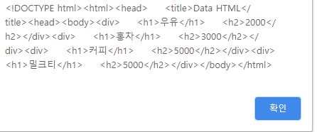


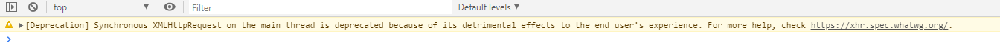

위와 같은 경고는 동기방식으로 XMLHttpRequest 객체를 사용하면, 사용자가 화면 조작 등을 못하는 문제가 발생하므로 사용하지 말라는 의미. 

- 응답 받은 데이터를 innerHTML 속성에 넣어 곧바로 출력

  ```html
  <!DOCTYPE html>
  <html>
      <head>
          <title>XMLHttpRequest</title>
          
      </head>
      <body>
          <script>
              var request = new XMLHttpRequest(); 
              request.open('GET','/data.html',false);
  
              // Ajax 를 수행 
              request.send(); 
  
              // 출력
              document.body.innerHTML += request.responseText;
          </script>
      </body>
  </html>
  ```

  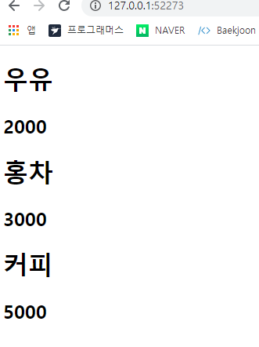


### 동기 방식과 비동기 방식 


**동기방식**은 데이터를 서버와 클라이언트가 같은 속도로 연계하여 동작하는 방식

자바스크립트는 데이터가 배달된 것을 `onreadystatechange` 이벤트로 알 수있다. 

`onreadystatechange` 이벤트는 `XMLHttpRequest` 의 상태가 변경될 때마다 이벤트 호출 .


- readyState 속성 

  | readyState 속성 | 설명                                                         |
  | --------------- | ------------------------------------------------------------ |
  | 0               | request 객체를 만들었지만 open() 메서드로 초기화하지않았음   |
  | 1               | request 객체를 만들고 초기화했지만 send() 메서드가 사용되지않음 |
  | 2               | send() 메서드를 사용했지만 아직 데이터를 받지 못함           |
  | 3               | 데이터의 일부만을 받음                                       |
  | 4               | 모든 데이터를 받음                                           |

- Ajax 로 모든 데이터를 전송받는 시점은 `readyState` 속성이 4 일 때이다. 

  ```html
  <body>
          <script>
              var request = new XMLHttpRequest(); 
              request.onreadystatechange = function(event){
                  if(request.readyState == 4){
                      document.body.innerHTML += request.responseText;
                  }
             
              }
              request.open('GET','/data.html',true);
              request.send();
          </script>
      </body>
  ```

  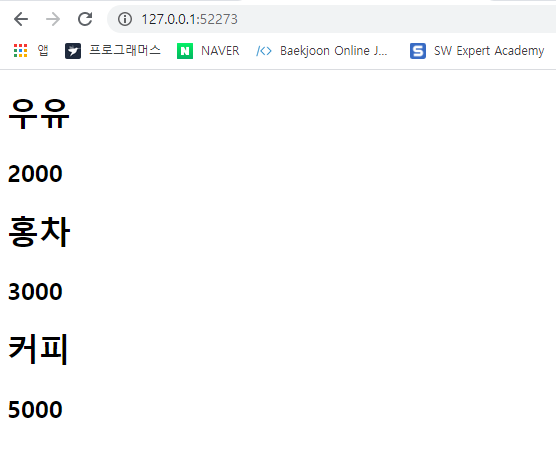

- Ajax 요청으로 데이터를 가져왔는데 가져온 데이터가 올바른 데이터가 아닐 경우 보완 

  ```html
  <script>
      var request = new XMLHttpRequest(); 
      request.onreadystatechange = function(event){
          if(request.readyState == 4){
              if(request.status == 200){
                  document.body.innnerHTML += request.responseText;
              }
          }
  
      }
      request.open('GET','/data.html',true);
      request.send();
  </script>
  ```

- **HTTP Status Code**

  | HTTP Status | 설명            | 예                        |
  | ----------- | --------------- | ------------------------- |
  | 1XX         | 처리 중         | 100 Continue              |
  | 2XX         | 성공            | 200 OK                    |
  | 3XX         | 리다이렉트      | 300 Multiple Choices      |
  | 4XX         | 클라이언트 오류 | 400 Bad Request           |
  | 5XX         | 서버 오류       | 500 Internal Server Error |


### 데이터 요청과 조작

1. **JSON 요청과 조작** 

   XMLHttpRequest 객체로 Ajax 요청을 수행하고 응답받은 JSON 을 자바스크립트 객체로 변환 

   `eval()` 함수를 이용하여 객체로 변환 
   
   ```html
   <!DOCTYPE html>
   <html>
       <head>
           <title>XMLHttpRequest</title>
           
       </head>
       <body>
           <script>
               var request = new XMLHttpRequest(); 
               request.onreadystatechange = function(event){
                   if(request.readyState == 4){
                       if(request.status == 200){
                           var json = eval('(' + request.responseText + ')'); 
                           var output = ''; 
   
                           for( var i =0; i<json.length; i++){
                               for(var key in json[i]){
                                   output += '<h1>' + i + ':' + json[i][key] + '</h1>';
                               }
                           }
                           document.body.innerHTML += output;     
                       }
                   }
               }
               request.open('GET','/data.json',true);
               request.send();
           </script>
       </body>
   </html>
   ```
   
2. **XML 요청과 조작** 

   ```html
   <!DOCTYPE html>
   <html>
       <head>
           <title>XMLHttpRequest</title>
           
       </head>
       <body>
           <script>
               var request = new XMLHttpRequest(); 
               request.onreadystatechange = function(event){
                   if(request.readyState == 4){
                       if(request.status == 200){
                           alert(request.responseXML);
                       }
                   }
               }
               request.open('GET','/data.xml',true);
               request.send();
           </script>
       </body>
   </html>
   ```

   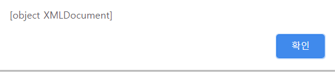

   XML 문서도 문서 객체 모델로 나타낼 수 있으므로 문서 객체 모델과 관련된 속성과 메서드를 사용할 수 있다. 

   -  **DOM 속성**

   | 속성       | 설명                  |
   | ---------- | --------------------- |
   | nodeValue  | 문서 객체의 내부 글자 |
   | attributes | 문서 객체의 속성      |

   - **DOM 메서드** 

     | 메서드                     | 설명                                        |
     | -------------------------- | ------------------------------------------- |
     | getElementById(id)         | id 속성이 일치하는 문서 객체를 선택합니다   |
     | getElementsByTagName(name) | 태그 이름이 일치하는 문서 객체를 선택합니다 |

     

```html
<!DOCTYPE html>
<html>
    <head>
        <title>XMLHttpRequest</title>
        
    </head>
    <body>
        <script>
            var request = new XMLHttpRequest(); 
            request.onreadystatechange = function(event){
                if(request.readyState == 4){
                    if(request.status == 200){
                        var xml = request.responseXML ; 

                        var names =  xml.getElementsByTagName('name'); 
                        var prices = xml.getElementsByTagName('price');

                        for(var i =0; i<names.length; i++){
                            var name = names[i].childNodes[0].nodeValue;
                            var price = prices[i].childNodes[0].nodeValue; 
                            document.body.innerHTML += '<h1>' + name + '</h1>'; 
                            document.body.innerHTML += '<h2>' + price + '</h2>'; 
                        }
                    }
                }
            }
            request.open('GET','/data.xml',true);
            request.send();
        </script>
    </body>
</html>
```

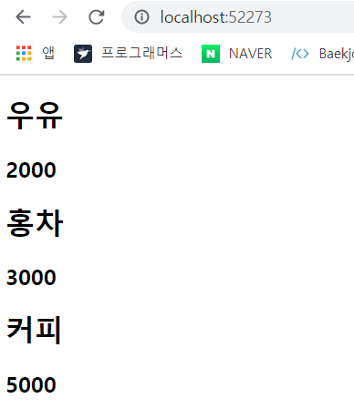


### 데이터 요청 방식 

```html
<!DOCTYPE html>
<html>
    <head>
        <title>XMLHttpRequest</title>
        <script> 
            window.onload = function(){ 
                document.getElementById('get').onclick = function(){};
                document.getElementById('post').onclick = function(){};
                document.getElementById('put').onclick = function(){};
                document.getElementById('delete').onclick = function(){};
            }
        </script>
    </head>
    <body>
        <button id = "get">GET</button>
        <button id = "post">POST</button>
        <button id = "put">PUT</button>
        <button id = "delete">DELETE</button>
        <h1>input</h1>
        <input id="name" />
        <input id="price" />
        <h1>output</h1>
        <textarea id="output" disabled = "disabled" cols="40" rows="5"></textarea>
    </body>
</html>
```

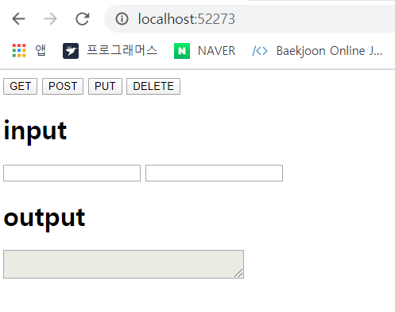

#### 1. GET 요청 

```javascript
document.getElementById('get').onclick = function(){
    	// Ajax 수행 
        var request = new XMLHttpRequest(); 
        request.open('GET', '/products', true); 
        request.send(); 
        request.onreadystatechange = function(event){
        if(request.readyState == 4){
            if(request.status == 200){
            // 출력
            document.getElementById('output').value = request.responseText; 
            }
        }
    }
};
```


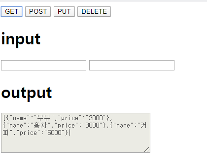

GET 요청으로 요청 매개변수를 전달할 때는 다음과 같이 URL 을 입력 

```javascript
request.open('GET', '/parameter?name=name&region=seoul', true); 
```


#### 2. POST 요청

POST 요청을 보낼 때는 open 메서드의 첫 번째 매개변수에 'POST' 입력. 

`setRequestHeader()` 메서드로 Content-Type 속성을 설정하고 `send` 메서드의 매개변수에 데이터를 넣어 전달 

```html
document.getElementById('post').onclick = function(){
    // 변수 선언 
    var name = document.getElementById('name').value; 
    var price = document.getElementById('price').value; 

    // Ajax 수행 
    var request = new XMLHttpRequest(); 
    request.open('POST', '/products',true); 
    request.setRequestHeader('Content-type', 'application/x-www-form-urlencoded'); 
    request.send('name=' + name + '&price=' + price); 

    request.onreadystatechange = function(event){
    	if(request.readyState == 4){
            if(request.status == 200){
            // 출력
            document.getElementById('output').value = request.responseText; 
            }
        }	
    }
};
```

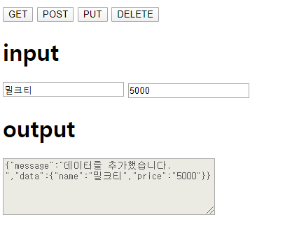

#### 3. PUT 요청 

PUT 요청을 보낼 때는 open() 메서드의 첫 번째 매개변수에 'PUT' 을 입력 

요청 매개변수를 보낼 때는 POST 요청처럼 `setRequestHeader()` 와 `open()` 메서드를 활용 

```html
 document.getElementById('put').onclick = function(){
    // 변수 선언 
    var name = document.getElementById('name').value; 
    var price = document.getElementById('price').value; 

    // Ajax 수행 
    var request = new XMLHttpRequest(); 
    request.open('PUT', '/products/0',true); 
    request.setRequestHeader('Content-type', 'application/x-www-form-urlencoded'); 
    request.send('name=' + name + '&price=' + price); 

    request.onreadystatechange = function(event){
        if(request.readyState == 4){
            if(request.status == 200){
            // 출력
            document.getElementById('output').value = request.responseText; 
            }
        }
    }
};
```


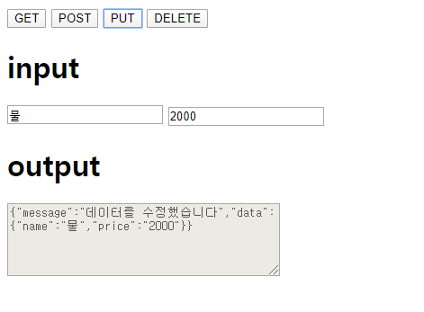

#### 4. DELETE 요청 

```html
 document.getElementById('delete').onclick = function(){
    // Ajax수행 
    var request = new XMLHttpRequest();
    request.open('DELETE', '/products/0',true); 
    request.send();
    request.onreadystatechange = function(event){
        if(request.readyState == 4){
            if(request.status == 200){
            // 출력
            document.getElementById('output').value = request.responseText; 
            }
        }
    }
};
```

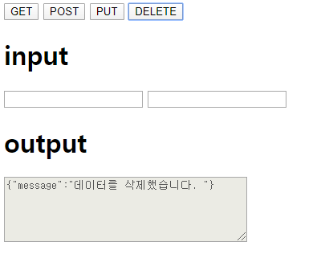


#### XMLHttpRequest 객체 생성 

XMLHttpRequest 객체는 인터넷 익스플로러 6 처럼 아주 오래된 웹 브라우저에서는 동작하지 않는다. 정말 만약의 상황이지만 이런 웹 브라우저까지 지원해야한다면 `createRequest()`  함수로 XMLHttpRequest 객체를 생성해야한다. 

```javascript
// XMLHttpRequest객체를 생성하는 함수 
function createRequest(){ 
    try{
        return new XMLHttpRequest(); 
    }catch (exception){ 
        var versions = [ 
            'Msxml2.XMLHTTP.6.0', 
            'Msxml2.XMLHTTP.5.0', 
            'Msxml2.XMLHTTP.4.0', 
            'Msxml2.XMLHTTP.3.0', 
            'Msxml2.XMLHTTP', 
            'Microsoft.XMLHttp'
        ]; 
        for(var i =0; i<versions.length; i++){
            try{
                return new ActiveXObject(Versions[i]); 
            }catch(e) { 

            }
        }
    }
}
```

