### 사전 준비 - jQuery 설치 

```bash
> npm install jquery
```

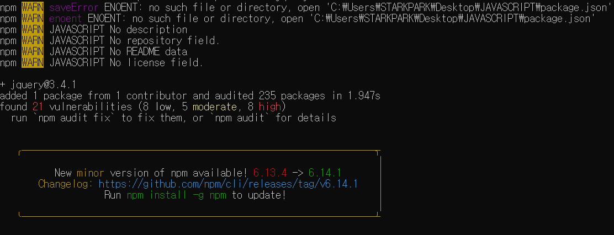


### 기본 


- `$.ajax()` 메서드의 2가지 사용 형태 

```javascript
$.ajax(options); 
$.ajax(url, options); 
```


`$.ajax()` 메서드는 Ajax 가 성공했을 때 자동으로 success 이벤트를 실행

 success 이벤트 리슨의 첫 번째 매개변수는 Ajax 가 성공했을 때 받은 데이터 

```javascript
<!DOCTYPE html>
<html>
    <head>
        <title>jQuery Ajax Basic</title>
        <script src= "http://code.jquery.com/jquery-3.1.1.js"></script>
        <script>     
            $(document).ready(function(){ 
                $.ajax('/data.html', {
                    success: function(data){
                        $('body').append(data); 
                    }
                })
            })    
        </script>
    </head>
    <body>
        
    </body>
</html>
```

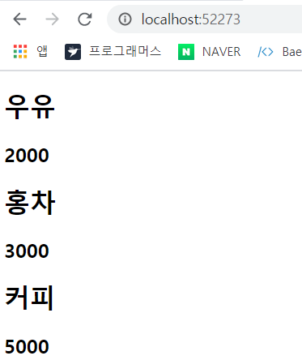

```javascript
$(document).ready(function(){ 
    $.ajax({
        url : '/data.html', 
        success : function(data){
        $('body').append(data); 
        }
    })
})    
```

- `$.ajax()` 메서드 옵션 

| 옵션 속성 이름           | 설명                           | 자료형           |
| ------------------------ | ------------------------------ | ---------------- |
| async                    | 동기, 비동기 지정              | Boolean          |
| complete(xhr,status)     | Ajax 완료 이벤트 리스너 지정   | Function         |
| data                     | 요청 매개변수 지정             | Object, String   |
| error(xhr, status,error) | Ajax 실패 이벤트 리스너를 지정 | Function         |
| jsonp                    | JSONP 매개변수 이름을 지정     | String           |
| jsonpCallback            | JSONP 콜백함수 이름을 지정     | String, Function |
| success(data,status,xhr) | Ajax 성공 이벤트 리스너를 지정 | Function,Array   |
| timeout                  | 만료시간을 지정                | Number           |
| type                     | 'GET', 'POST' 등을 지정        | String           |
| url                      | 대상 URL 을 지정               | String           |


```javascript
 $.ajax({
     url : '/parameter',
     type : 'GET', 
     data : { 
         name : 'test', 
         region : 'test'
     } ,
     success : function(data){
         $('body').append(data); 
     }
 })
```

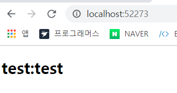


### 추가적인 jQuery Ajax 메서드 

| 메서드 이름        | 설명                                                       |
| ------------------ | ---------------------------------------------------------- |
| $.get()            | get 방식으로 Ajax 를 수행                                  |
| $.post()           | post 방식으로 Ajax 를 수행                                 |
| $.getJSON()        | get방식으로 Ajax를 수행하여 JSON 데이터를 가져온다         |
| $.getScript()      | get 방식으로 Ajax 를 수행해 Script 데이터를 가져온다       |
| $(selector).load() | Ajax 를 수행하고 선택자로 선택한 문서 객체 안에 집어넣는다 |

```js
$.get(url, function (data, textStatus, jqXHR){});
$.post(url, function (data, textStatus, jqXHR){}); 

$.get(url, data, function(data, textStatus, jqXHR){}); 
$.post(url, data, function(data, textStatus, jqXHR){});
```


HTML 태그를 가져와서 문서 객체에 출력할 때는 `$(selector).load()` 메서드를 사용하면 훨씬 간단. 

```javascript
<script>     
    $(document).ready(function(){ 
   		$('body').load('/data.html'); 
	})    
</script>
```


`$.getJSON()` 메서드를 사용하면 JSON 을 손쉽게 가져올 수 있다. 

```javascript
$(document).ready(function(){ 
    $.getJSON('/data.json', function(data){
        $.each(data, function(key, value){
            $('body').append('<h1>' + value.name + ':' + value.price + '</h1>');
        })
    })
})
```

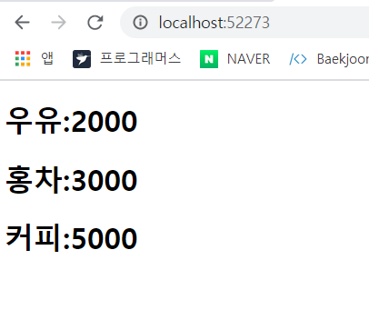

`eval` 함수 또는 `JSON.parse()` 메서드로 JSON 을 자바스크립트 객체로 변경할 필요 없이 바로 자바스크립트 객체로 사용. 

참고로 `$.getJSON()` 메소드로 가져온 문자열이 JSON 규정에 맞지 않으면 매개변수 data 가 문자열로 입력된다.


### XML 조작 

jQuery 로 XML 문서 객체를 다룰 때는 `find ` 메서드를 사용 . 

```javascript
$(document).ready(function(){ 
    $.ajax({
        url : 'data.xml', 
        success : function(data){ 
            $(data).find('product').each(function(){
                var name = $(this).find('name').text(); 
                var price = $(this).find('price').text(); 

                $('<h1></h1>').text(name + ':' + price).appendTo('body'); 
            })
        }
    })
})       
```

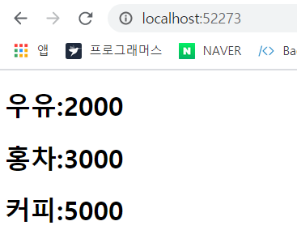


### 데이터 요청 방식 

#### 1. GET 요청

```javascript
 $('#get').click(function(){
     $.ajax({
         url : 'products', 
         type : 'get', 
         dataType : 'text' ,
         success : function(data){
             $('#output').val(data); 
         }
     })
 });
```


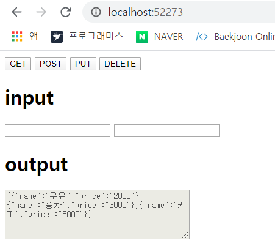

#### 2. POST 요청

```javascript
$('#post').click(function(){
    $.ajax({
        url : 'products', 
        type : 'post', 
        dataType : 'text' ,
        data : {
            name : $('#name').val(), 
            price : $('#price').val()
        },
        success : function(data){
            $('#output').val(data); 
        }
    })   
});
```


 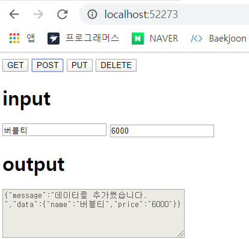


#### 3. PUT 요청

```javascript
$('#put').click(function(){
    $.ajax({
        url : '/products/0', 
        type : 'put', 
        dataType : 'text',
        data : {
            name : $('#name').val(), 
            price : $('#price').val()
        },
        success : function(data){ 
            $('#output').val(data); 
        }
    })
});
```

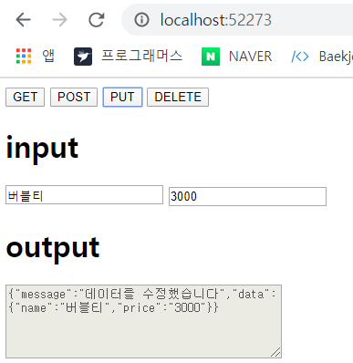


#### 4. DELETE 요청

```javascript
$('#delete').click(function(){
    $.ajax({
        url : '/products/0', 
        type : 'delete', 
        dataType : 'text', 
        success : function(data){
            $('#output').val(data); 
        }
    })
});
```

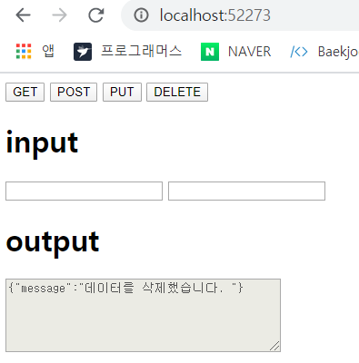


### 보조메서드 

jQuery 는 개발자가 더 쉬운 방식으로 Ajax 를 사용하도록 보조 메서드 제공 

| 메서드 이름      | 설명                                             |
| ---------------- | ------------------------------------------------ |
| serialize()      | 입력 양식의 내용을 요청 매개변수 문자열로 만든다 |
| serializeArray() | 입력 양식의 내용을 객체로 만든다                 |
| $.param()        | 객체의 내용을 요청 매개변수 문자열로 만든다      |

```javascript
$(document).ready(function(){ 
    var data = { 
        name : 'RintIanTta' , 
        region : 'Seoul', 
    }

    $('<h1></h1>').text($.param(data)).appendTo('body');
}) 
```

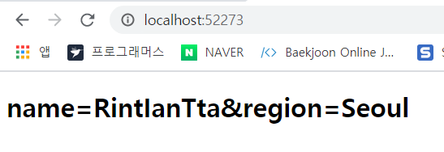

```javascript
		<form id='my-form'>
            <table>
                <tr>
                    <td><label for="name">Name</label></td>
                    <td><input id="name" name="name" type = "text" /></td>
                </tr>
                <tr>
                    <td><label for="region">Region</label></td>
                    <td><input id="region" name="region" type = "text" /></td>
                </tr>
            </table>
            <input type="submit" value = "Get Ajax String" />
        </form>
        <div id="wrap">

        </div>
```

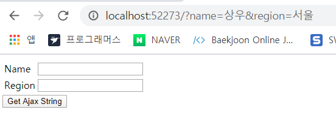


- jQuery Ajax 로 입력 양식을 전송하는 방법  ( 5가지 )

  - 1. 각각의 입력 양식에서 value 속성을 직접 가져온 뒤 URL 생성. 

       ```javascript
       $(document).ready(function(){ 
           $('#my-form').submit(function(event){
               // 입력 양식의 value 속성을 가져온다 
               var name = $('#name').val(); 
               var region = $('#region').val(); 
       
               // Ajax 요청 수행 
               var url = '/parameter?name=' + name + '&region=' + region;
               $('#wrap').load(url); 
       
               event.preventDefault();  // 페이지가 전환되는 것을 막는 메서드
           })
       })    
       ```

       

       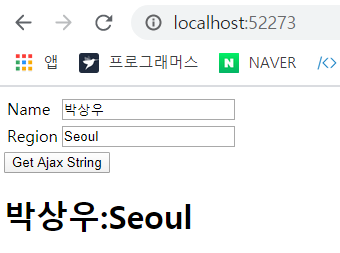

    2. 각각의 입력 양식에서 value 속성을 가져온뒤 , value 속성을 이용해 객체를 만들고 param 메서드를 이용해 쿼리로 만든 후 Ajax 관련된 메서드의 data 속성을 넣는다. 

       ```javascript
       $(document).ready(function(){ 
           $('#my-form').submit(function(event){
               // 입력 양식의 value 속성을 가져온다 
               var name = $('#name').val(); 
               var region = $('#region').val(); 
       
               // Ajax 요청 수행 
               var url = '/parameter'; 
               var data = {name : name, region : region}; 
               var params = $.param(data); 
               $('#wrap').load(url, params); 
       
               event.preventDefault();  // 페이지가 전환되는 것을 막는 메서드
           })
       }) 
       ```

       

    3. 각각의 입력 양식에서 value 속성을 가져온 후 그를 이용해 객체를 만들고 곧바로 Ajax 관련 메서드의 data 속성에 집어넣는 방법 ( submit 이벤트와 연결하는 경우는 많지 않다. )

       ```javascript
       $(document).ready(function(){ 
           $('#my-form').submit(function(event){
               // 입력 양식의 value 속성을 가져온다 
               var name = $('#name').val(); 
               var region = $('#region').val(); 
       
               // Ajax 요청 수행 
               var url = '/parameter'; 
               var data = {name : name, region : region}; 
               $('#wrap').load(url, data); 
       
               event.preventDefault();  // 페이지가 전환되는 것을 막는 메서드
           })
       })  
       ```

    4. `serialize()` 메서드를 사용하여 입력 양식에 적힌 값을 쿼리 문자열로 바꾼다 ( 추천 )

       ```javascript
        $(document).ready(function(){ 
            $('#my-form').submit(function(event){
                // Ajax 요청 수행 
                $('#wrap').load('/parameter', $(this).serialize());
       
                event.preventDefault();  // 페이지가 전환되는 것을 막는 메서드
            })
        }) 
       ```

    5. (추천) `serializeArraly()` 메서드를 사용하여 입력양식에 적힌 값을 객체로 만들고, 이를 Ajax 관련 메서드의 data 속성으로 넣는다. 

       ```javascript
       $(document).ready(function(){ 
           $('#my-form').submit(function(event){
               // Ajax 요청 수행 
               $('#wrap').load('/parameter', $(this).serializeArray());
       
               event.preventDefault();  // 페이지가 전환되는 것을 막는 메서드
           })
       })  
       ```


입력 양식을 Ajax 로 제출할 떄는 네번째, 다섯번째 방식을 이용해라 ! 

- `serialize ` 와 `serializeArray` 의 차이 

  ```javascript
  $(document).ready(function(){ 
      $('#my-form').submit(function(event){
          // Ajax 요청 수행 
          var serialize = $(this).serialize(); 
          var serializeArray = $(this).serializeArray(); 
  
          $('<h1></h1>').text(serialize).appendTo('#wrap'); 
          $('<h1></h1>').text(serializeArray).appendTo('#wrap'); 
  
          event.preventDefault();  // 페이지가 전환되는 것을 막는 메서드
      })
  })  
  ```

  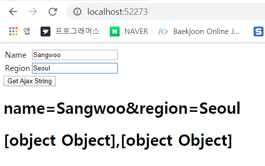


#### 이벤트 

Ajax 를 사용하는 대부분의 사이트는 Ajax 요청을 시작하면 스피너를 볼 수 있다. 스피너는 Ajax 를 이용하는 사이트라면 꼭 있는 요소 

| 메서드 이름            | 설명                                |
| ---------------------- | ----------------------------------- |
| ajaxComplete(function) | Ajax 요청이 완료될때 function 실행  |
| ajaxError(function)    | Ajax 요청이 실패할 때 function 실행 |
| ajaxSend(function)     | Ajax 요청을 보낼 때 function 실행   |
| ajaxStart(function)    | Ajax 요청을 시작할 때 function 실행 |
| ajaxStop(function)     | Ajax 요청을 중지할 때 function 실행 |
| ajaxSuccess(function)  | Ajax 요청이 성공할 때 function 실행 |

