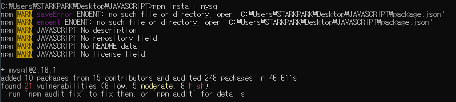
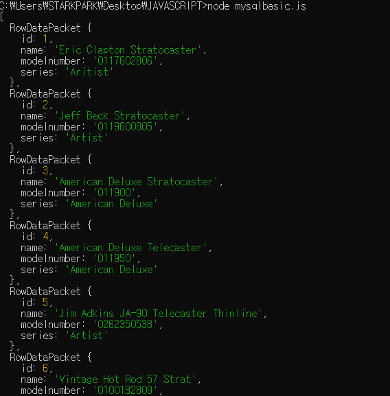
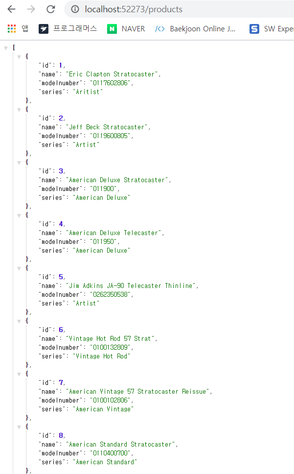
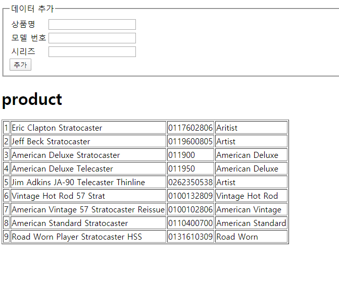

### 기본 명령어 


**데이터베이스**는 데이터를 자신에게 곧바로 입력하는 것이 아니라 데이터가 입력되어있는 테이블을 소유. 

#### 1. DB 생성 

```mysql
mysql> CREATE DATABASE company;
Query OK, 1 row affected (0.02 sec)
```

데이터베이스 생성 후 데이터베이스를 사용ㅎ아겠다고 선언 

```mysql
mysql> USE company
Database changed
```


#### 2. 테이블 생성 

가로에 위치하는 행 : **레코드** 

세로에 위치한 열 : **필드** 

테이블 생성시에는 각 필드에 어떠한 자료형을 사용할 것인지 지정해야한다.  

필드를 지정할 때는 `필드명 자료형 속성` 순서로 입력한다. 

| 자료형  | 설명      |
| ------- | --------- |
| VARCHAR | 문자열    |
| INT     | 정수 숫자 |
| DOUBLE  | 실수 숫자 |

```mysql
mysql> CREATE TABLE products(
    -> id INT NOT NULL AUTO_INCREMENT PRIMARY KEY,
    -> name VARCHAR(50) NOT NULL,
    -> modelnumber VARCHAR(15) NOT NULL,
    -> series VARCHAR(30) NOT NULL
    -> );
Query OK, 0 rows affected (0.06 sec)
```

- 필드 속성 

  | 속성           | 설명                            |
  | -------------- | ------------------------------- |
  | NOT NULL       | 반드시 입력하게 만든다          |
  | AUTO_INCREMENT | 자동으로 숫자가 증가하게 만든다 |
  | PRIMARY KEY    | 기본 키로 지정한다              |

```mysql
mysql> DESCRIBE products;
+-------------+-------------+------+-----+---------+----------------+
| Field       | Type        | Null | Key | Default | Extra          |
+-------------+-------------+------+-----+---------+----------------+
| id          | int(11)     | NO   | PRI | NULL    | auto_increment |
| name        | varchar(50) | NO   |     | NULL    |                |
| modelnumber | varchar(15) | NO   |     | NULL    |                |
| series      | varchar(30) | NO   |     | NULL    |                |
+-------------+-------------+------+-----+---------+----------------+
4 rows in set (0.01 sec)
```


#### 3. 데이터 저장 

테이블에 데이터 입력 시 `INSERT INTO 테이블명(필드, 필드) VALUE(데이터, 데이터)` 

```mysql
mysql> INSERT INTO products (name, modelnumber, series) VALUES
    -> ('Eric Clapton Stratocaster', '0117602806', 'Aritist');
Query OK, 1 row affected (0.02 sec)
```

```mysql
mysql> INSERT INTO products (name, modelnumber, series) VALUES
->     ('Jeff Beck Stratocaster', '0119600805', 'Artist'),
->     ('American Deluxe Stratocaster', '011900', 'American Deluxe'),
->     ('American Deluxe Tele', '011950', 'American Deluxe'),
->     ('Jim Adkins JA-90 Telecaster Thinline', '0262350538', 'Artist'),
->     ('Vintage Hot Rod 57 Strat', '0100132809', 'Vintage Hot Rod'),
->     ('American Vintage 57 Stratocaster Reissue', '0100102806', 'American Vintage'),
->     ('American Standard Stratocaster', '0110400700', 'American Standard'),
->     ('Road Worn Player Stratocaster HSS', '0131610309', 'Road Worn'),
->     ('Road Worn Player Telecaster', '0131082306', 'Road Worn');
Query OK, 9 rows affected (0.01 sec)
Records: 9  Duplicates: 0  Warnings: 0
```


#### 4. 데이터 조회 

```mysql
mysql> select * from products;
+----+------------------------------------------+-------------+-------------------+
| id | name                                     | modelnumber | series            |
+----+------------------------------------------+-------------+-------------------+
|  1 | Eric Clapton Stratocaster                | 0117602806  | Aritist           |
|  2 | Jeff Beck Stratocaster                   | 0119600805  | Artist            |
|  3 | American Deluxe Stratocaster             | 011900      | American Deluxe   |
|  4 | American Deluxe Tele                     | 011950      | American Deluxe   |
|  5 | Jim Adkins JA-90 Telecaster Thinline     | 0262350538  | Artist            |
|  6 | Vintage Hot Rod 57 Strat                 | 0100132809  | Vintage Hot Rod   |
|  7 | American Vintage 57 Stratocaster Reissue | 0100102806  | American Vintage  |
|  8 | American Standard Stratocaster           | 0110400700  | American Standard |
|  9 | Road Worn Player Stratocaster HSS        | 0131610309  | Road Worn         |
| 10 | Road Worn Player Telecaster              | 0131082306  | Road Worn         |
+----+------------------------------------------+-------------+-------------------+
10 rows in set (0.00 sec)
```

이렇게 전체 선택자로 모든 데이터를 조회할 수도 있고, 조회를 원하는 필드를 하나씩 선택하여 데이터를 조회할 수도 있다. 


#### 5. 조건검사 

특정 조건이 있는 데이터를 선택할 때는 `SELECT 필드, 필드 FROM 테이블 WHERE 조건` 

```mysql
mysql> select * from products where series = 'Artist';
+----+--------------------------------------+-------------+--------+
| id | name                                 | modelnumber | series |
+----+--------------------------------------+-------------+--------+
|  2 | Jeff Beck Stratocaster               | 0119600805  | Artist |
|  5 | Jim Adkins JA-90 Telecaster Thinline | 0262350538  | Artist |
+----+--------------------------------------+-------------+--------+
2 rows in set (0.00 sec)
```

- 기본적인 MySQL 관계 연산자 

  | 연산자     | 설명                            |
  | ---------- | ------------------------------- |
  | =          | 좌변과 우변이 같습니다          |
  | != 또는 <> | 좌변과 우변이 다릅니다          |
  | <          | 우변이 좌변보다 큽니다          |
  | >          | 좌변이 우변보다 큽니다          |
  | <=         | 우변이 좌변보다 크거나 같습니다 |
  | >=         | 좌변이 우변보다 크거나 같습니다 |

- 조건 검사와 논리연산자 

  | 연산자 | 설명          |
  | ------ | ------------- |
  | OR     | 논리합 연산자 |
  | AND    | 논리곱 연산자 |

```mysql
mysql> select * from products where (series='Artist') or (series = 'Road Worn');
+----+--------------------------------------+-------------+-----------+
| id | name                                 | modelnumber | series    |
+----+--------------------------------------+-------------+-----------+
|  2 | Jeff Beck Stratocaster               | 0119600805  | Artist    |
|  5 | Jim Adkins JA-90 Telecaster Thinline | 0262350538  | Artist    |
|  9 | Road Worn Player Stratocaster HSS    | 0131610309  | Road Worn |
| 10 | Road Worn Player Telecaster          | 0131082306  | Road Worn |
+----+--------------------------------------+-------------+-----------+
4 rows in set (0.00 sec)
```

- 만약 글자에서 특정 부분이 일치하는 데이터를 조회하고싶을때는 `LIKE` 명령어를 사용 

  ```mysql
  mysql> select * from products where modelnumber LIKE '011%';
  +----+--------------------------------+-------------+-------------------+
  | id | name                           | modelnumber | series            |
  +----+--------------------------------+-------------+-------------------+
  |  1 | Eric Clapton Stratocaster      | 0117602806  | Aritist           |
  |  2 | Jeff Beck Stratocaster         | 0119600805  | Artist            |
  |  3 | American Deluxe Stratocaster   | 011900      | American Deluxe   |
  |  4 | American Deluxe Tele           | 011950      | American Deluxe   |
  |  8 | American Standard Stratocaster | 0110400700  | American Standard |
  +----+--------------------------------+-------------+-------------------+
  5 rows in set (0.01 sec)
  ```

- 문자 개수까지 지정할때는 `_` 를 사용 

  ```mysql
  mysql> select * from products where modelnumber LIKE '011___';
  +----+------------------------------+-------------+-----------------+
  | id | name                         | modelnumber | series          |
  +----+------------------------------+-------------+-----------------+
  |  3 | American Deluxe Stratocaster | 011900      | American Deluxe |
  |  4 | American Deluxe Tele         | 011950      | American Deluxe |
  +----+------------------------------+-------------+-----------------+
  2 rows in set (0.00 sec)
  ```


#### 6. 데이터 정렬 

데이터 정렬시 `ORDER BY` 명령어를 사용 

```mysql
mysql> select id, name, series from products order by name;
+----+------------------------------------------+-------------------+
| id | name                                     | series            |
+----+------------------------------------------+-------------------+
|  3 | American Deluxe Stratocaster             | American Deluxe   |
|  4 | American Deluxe Tele                     | American Deluxe   |
|  8 | American Standard Stratocaster           | American Standard |
|  7 | American Vintage 57 Stratocaster Reissue | American Vintage  |
|  1 | Eric Clapton Stratocaster                | Aritist           |
|  2 | Jeff Beck Stratocaster                   | Artist            |
|  5 | Jim Adkins JA-90 Telecaster Thinline     | Artist            |
|  9 | Road Worn Player Stratocaster HSS        | Road Worn         |
| 10 | Road Worn Player Telecaster              | Road Worn         |
|  6 | Vintage Hot Rod 57 Strat                 | Vintage Hot Rod   |
+----+------------------------------------------+-------------------+
10 rows in set (0.00 sec)
```

오름차순으로 정렬 시 : `ASC` 

내림차순으로 정렬 시 : `DESC` 

```mysql
mysql> select id, name, series from products order by name desc;
+----+------------------------------------------+-------------------+
| id | name                                     | series            |
+----+------------------------------------------+-------------------+
|  6 | Vintage Hot Rod 57 Strat                 | Vintage Hot Rod   |
| 10 | Road Worn Player Telecaster              | Road Worn         |
|  9 | Road Worn Player Stratocaster HSS        | Road Worn         |
|  5 | Jim Adkins JA-90 Telecaster Thinline     | Artist            |
|  2 | Jeff Beck Stratocaster                   | Artist            |
|  1 | Eric Clapton Stratocaster                | Aritist           |
|  7 | American Vintage 57 Stratocaster Reissue | American Vintage  |
|  8 | American Standard Stratocaster           | American Standard |
|  4 | American Deluxe Tele                     | American Deluxe   |
|  3 | American Deluxe Stratocaster             | American Deluxe   |
+----+------------------------------------------+-------------------+
10 rows in set (0.00 sec)
```


#### 7. 특정 위치에 있는 데이터 선택 

테이블 안에서 특정 위치에 있는 데이터를 선택하고 싶을 때는 `LIMIT` 명령어를 사용 

```mysql
mysql> select * from products limit 2;
+----+---------------------------+-------------+---------+
| id | name                      | modelnumber | series  |
+----+---------------------------+-------------+---------+
|  1 | Eric Clapton Stratocaster | 0117602806  | Aritist |
|  2 | Jeff Beck Stratocaster    | 0119600805  | Artist  |
+----+---------------------------+-------------+---------+
2 rows in set (0.00 sec)
```

아래 쿼리문장처럼 LIMIT 명령어 뒤에 숫자를 2개 입력하면 특정 위치에서 특정 개수의 데이터를 선택 

```mysql
mysql> select * from products limit 2,2;
+----+------------------------------+-------------+-----------------+
| id | name                         | modelnumber | series          |
+----+------------------------------+-------------+-----------------+
|  3 | American Deluxe Stratocaster | 011900      | American Deluxe |
|  4 | American Deluxe Tele         | 011950      | American Deluxe |
+----+------------------------------+-------------+-----------------+
2 rows in set (0.00 sec)
```


SELECT 명령어와 다른 명령어를 복합적으로 사용할 때는 명령어 순서를 꼭 지켜야한다. 

​								`SELECT FROM WHERE ORDER BY LIMIT` 


#### 8. 데이터 수정 

```mysql
mysql> update products set name = 'American Deluxe Telecaster' where id = 4;
Query OK, 1 row affected (0.01 sec)
Rows matched: 1  Changed: 1  Warnings: 0
```

UPDATE 명령어를 사용할 때 WHERE 명령어를 함께 사용하지 않으면 모든 데이터의 name 속성이 변경된다. 


#### 9. 데이터 삭제 

```mysql
mysql> DELETE FROM products where id = 10;
Query OK, 1 row affected (0.01 sec)
```

데이터를 수정할 때와 마찬가지로 WHERE 명령어를 함께 사용하지 않으면 모든 데이터가 삭제된다. 

```mysql
mysql> DELETE FROM products; 
```


테이블 삭제시에는 아래 쿼리문 사용 

```mysql
mysql > drop table products; 
```

데이터베이스 삭제 시 아래 쿼리문 사용

```mysql
mysql > drop database company; 
```


### MySQL 모듈 

1. MySQL 모듈 설치 

   ```bash
   > npm install mysql 
   ```

   MySQL 모듈은 https://github.com/felixge/node-mysql 에서 제공한다. 

   

2. 모듈 추출 ( `server.js` )

   ```js
   var mysql = require('mysql'); 
   ```

   - Mysql 모듈의 메서드 

     | 메서드 이름               | 설명                    |
     | ------------------------- | ----------------------- |
     | createConnection(options) | 데이터베이스에 접속한다 |

     options 객체에는 아래 표의 속성을 입력 ( 이 중 user 속성과 password 속성은 필수로 입력해야한다. )

     | 속성 이름 | 설명                             |
     | --------- | -------------------------------- |
     | host      | 연결할 호스트를 나타낸다         |
     | port      | 연결할 포트를 나타낸다           |
     | user      | 사용자 이름을 나타낸다           |
     | password  | 사용자 비밀번호를 나타낸다       |
     | database  | 연결할 데이터베이스를 나타낸다   |
     | debug     | 디버그 모드를 사용할지 나타낸다. |

   

3. 데이터 베이스 연결 

   ```js
   var mysql = require('mysql'); 
   
   // 데이터베이스와 연결
   var client = mysql.createConnection({
       user : 'root', 
       password : 'mysql'
   });
   ```

   - Client 객체는 아래 표의 메서드를 가지고 있다. 

     | 메서드 이름            | 설명                |
     | ---------------------- | ------------------- |
     | query(sql[, callback]) | 쿼리문장을 실행한다 |

     query() 이벤트 기반 비동기 처리 방식을 사용 

     ```js
     // 데이터베이스 쿼리를 사용 
     client.query('USE Company'); 
     client.query('SELECT * FROM products', function(error, result,fields){
         if(error){
             console.log('쿼리 문장에 오류가 있습니다' ) ; 
         }else{
             console.log(result); 
         }
     });
     ```

     쿼리 문장을 실행한 이후에 매개변수 result 로 결과가 입력, 만약 오류가 있을 경우 error 에 오류와 관련된 정보가 입력. 

4. 실행 

   ```bash
   > node mysqlbasic.js 
   ```

   


- createConnection() 메서드의 매개변수로 database 속성을 지정할 수 있다. 

  ```js
  var client = mysql.createConnection({
      user : 'root', 
      password : 'mysql',
      database : 'Company'
  });
  ```

- MySQL 모듈로 데이터를 입력할 때는 `?` 토큰을 사용할 수 있다. 

  ```js
  client.query('INSERT INTO products (name, modelnumber, series) VALUES (?,?,?)', ['Name Value', 'Model Number Value', 'Series Value'], function(error, results, fields){
      //
  }
  ```

- MySQL 데이터베이스는 연결된 클라이언트가 1시간 이상 응답이 없을  경우 자동으로 연결을 종료한다. 


### 데이터베이스 웹 서비스 

1. 모듈 설치 

   ```bash
   > npm install mysql 
   > npm install express@4.14
   > npm install body-parser
   ```

2. 기본 서버 구성 ( `server.js 파일`  )

   ```js
   // 모듈 추출 
   var express = require('express'); 
   var bodyParser = require('body-parser');
   var mysql = require('mysql'); 
   
   // 데이터베이스와 연결
   var client = mysql.createConnection({
       user : 'root', 
       password : 'mysql',
       database : 'Company'
   });
   
   
   // 변수 선언 
   var items = [{
       name : '우유', 
       price: '2000'
   }, {
       name : '홍차', 
       price :'3000'
   }, {
       name : '커피', 
       price : '5000'
   }] ; 
   
   // 웹 서버를 생성 
   var app = express(); 
   app.use(express.static('public')); 
   app.use(bodyParser.urlencoded({extended:false}));
   
   // 전체 데이터 조회
   app.get('/products', function(request, response){
       // 데이터 베이스 요청을 수행합니다. 
       client.query('SELECT * FROM products', function(error, data){
           response.send(data); 
       })
   });
   
   // 개인 데이터 조회 
   app.get('/products/:id', function(request, response){
       // 변수 선언 
       var id = Number(request.params.id);
   
       // 데이터베이스 요청을 수행 
       client.query('SELECT * FROM products WHERE id = ?', [ id ], function(error, data){ 
           response.send(data); 
       })
   })
   
   // 데이터 추가 
   app.post('/products', function(request, response){
       // 변수 선언 
       var name = request.body.name; 
       var modelnumber =request.body.modelnumber; 
       var series = request.body.series; 
   
       // 데이터베이스 요청을 수행 
       client.query('INSERT INTO products (name, modelnumber, series) VALUES (?,?,?)', [name, modelnumber,series], function(error, data){
           response.send(data); 
       })
   })
   
   // 데이터 수정 
   app.put('/products/:id', function(request,response){
       // 변수 선언 
       var id = Number(request.params.id); 
       var name = request.body.name; 
       var modelnumber = request.body.modelnumber; 
       var series = request.body.series; 
       var query = 'UPDATE products SET' ; 
   
       // 쿼리 생성 
       if (name) query += 'name="' + name + '" '; 
       if (modelnumber) query += 'modelnumber ="' + modelnumber + '" '; 
       if (series) query += 'series="' + series + '" ';
       query = 'WHERE id = ' + id ; 
   
       // 데이터 베이스 요청을 수행 
       client.query(query, function(error, data){ 
           response.send(data); 
       })
   })
   
   // 데이터 삭제 
   app.delete('/products/:id', function (request, response){
       // 변수 선언 
       var id = Number(request.params.id); 
   
       // 데이터베이스 요청을 수행 
       client.query('DELETE FROM products WHERE id = ?', [ id ], function(error, data){ 
           response.send(data); 
       })
   })
   
   // 웹 서버 실행 
   app.listen(52273, function(){
       console.log('Server Running at http://127.0.0.1:52273');
   })
   ```

   


### Ajax를 사용한 데이터 추가와 삭제 


1. body 태그 구성 

   ```js
   <body>
           <div>
           <form id='insert-form'>
               <fieldset>
                   <legend> 데이터 추가</legend>
                   <table>
                       <tr>
                           <td><label> 상품명 </label></td>
                           <td><input type="text" name="name" /></td>
                       </tr>
                       <tr>
                           <td><label> 모델 번호 </label></td>
                           <td><input type="text" name="modelnumber" /></td>
                       </tr>
                       <tr>
                           <td><label> 시리즈 </label></td>
                           <td><input type="text" name="series" /></td>
                       </tr>
                   </table>
                   <input type="submit" value = "추가" />
               </fieldset>
           </form>
           </div>
           <h1>product</h1>
           <table id = "output" border="1"> 
               
           </table>
   </body>
   ```

2. head 태그 구성 

   ```js
   <head>
           <title>DB Basic</title>
           <script src="http://code.jquery.com/jquery-3.1.1.js"></script>
           <script>
               $(document).ready(function(){ 
                   // 데이터를 보여주는 함수 
                   function selectData(){ 
                       // #output 내부의 내용물을 제거 
                       $('#output').empty(); 
   
                       // Ajax 수행 
                   }
   
                   // 데이터 추가 
                   $('#insert_from').submit(function(event){
                       // 기본 이벤트 제거 
                       event.preventDefault(); 
                   });
                    
                   // 초기 화면에 데이터를 표시 
                   selectData(); 
               })
           </script>
   </head>
   ```

3. 코드 완성 

   ```js
   <!DOCTYPE html>
   <html>
       <head>
           <title>DB Basic</title>
           <script src="http://code.jquery.com/jquery-3.1.1.js"></script>
           <script>
               $(document).ready(function(){ 
                   // 데이터를 보여주는 함수 
                   function selectData(){ 
                       // #output 내부의 내용물을 제거 
                       $('#output').empty(); 
   
                       // Ajax 수행 
                       $.getJSON('/products', function(data){ 
                           $(data).each(function (index, item){
                               var output = ''; 
                               output += '<tr>';
                               output += '     <td>' + item.id + '</td>'; 
                               output += '     <td>' + item.name + '</td>'; 
                               output += '     <td>' + item.modelnumber + '</td>';
                               output += '     <td>' + item.series + '</td>';
                               output += '</tr>';
                               $('#output').append(output); 
                           })
                       })
                   }
   
                   // 데이터 추가 
                   $('#insert_from').submit(function(event){
                       // Ajax 수행 
                       var data = $(this).serialize(); 
                       $.post('/products', data, selectData); 
   
                       // 기본 이벤트 제거 
                       event.preventDefault(); 
                   });
                    
                   // 초기 화면에 데이터를 표시 
                   selectData(); 
               })
           </script>
       </head>
       <body>
           <div>
           <form id='insert-form'>
               <fieldset>
                   <legend> 데이터 추가</legend>
                   <table>
                       <tr>
                           <td><label> 상품명 </label></td>
                           <td><input type="text" name="name" /></td>
                       </tr>
                       <tr>
                           <td><label> 모델 번호 </label></td>
                           <td><input type="text" name="modelnumber" /></td>
                       </tr>
                       <tr>
                           <td><label> 시리즈 </label></td>
                           <td><input type="text" name="series" /></td>
                       </tr>
                   </table>
                   <input type="submit" value = "추가" />
               </fieldset>
           </form>
           </div>
           <h1>product</h1>
           <table id = "output" border="1"> 
   
           </table>
       </body>
   </html>
   ```

   