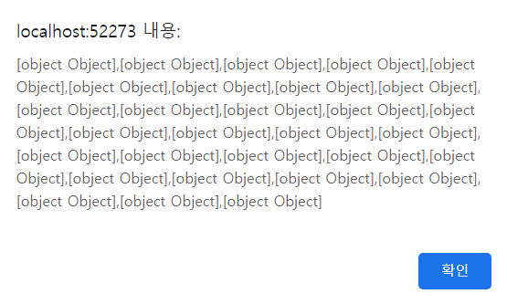
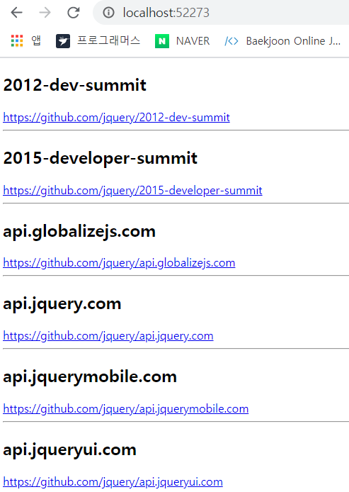
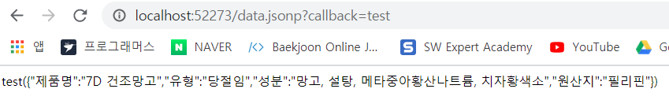
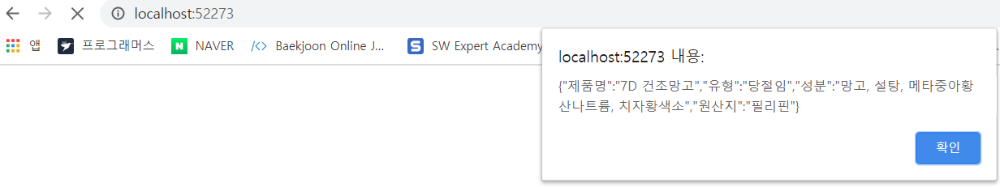
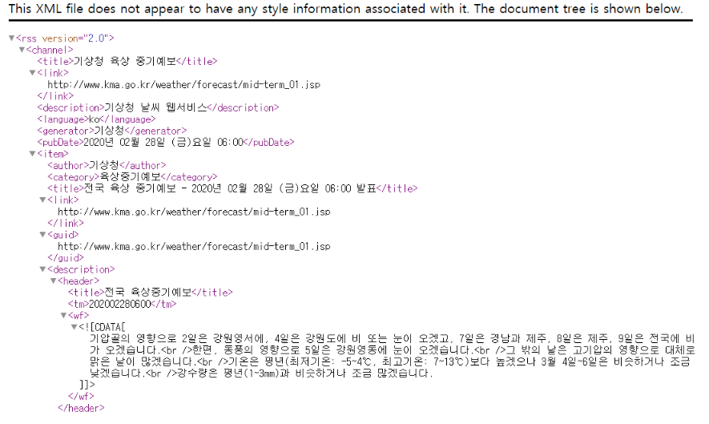
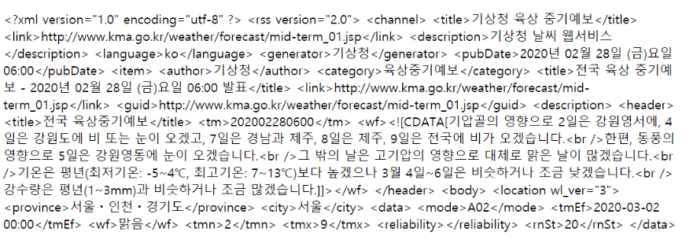

## 크로스 도메인 


**크로스 도메인** : 도메인이 다른 곳에 요청하는 것. 


#### JSONP 개요 

**JSONP** 는 크로스 도메인에서 벗어나서 좀 더 유연하게 동적으로 데이터를 서버에 전달하고 응답받아 처리하려고 고안한 방법. 

클라이언트에서 다른 도메인에 마음대로 접근할 수 없지만, 서버측에서 접근하는 것은 문제가 없으므로 사용할 수 있는 방법. 


GET 요청을 할 때 ?callback 매개변수를 보내면 JSON 함수로 감싸진 형태의 결과를 받을 수 있다. 

```html
<!DOCTYPE html>
<html>
<head>
    <script>
        function test(input) {
            alert(input.data);
        }
    </script>
    <script src="https://api.github.com/users/jquery/repos?callback=test"></script>
</head>
<body>

</body>
</html>
```



위 예제에서 알 수 있듯이 요청 쿼리로 callback 을 입력했더니 함수가 실행되는 것이 아니라, 크로스 도메인 통신이 가능하다는 것을 알 수 있다. 

위의 예제를 자바스크립트로 문서 객체 모델을 조작해서 동적으로 삽입 

```javascript
<script>        
    window.test = function(input){
        alert(input.data); 
    }

    var script = document.createElement('script'); 
    script.src = 'https://api.github.com/users/jquery/repos?callback=test';
    document.head.appendChild(script);
</script>
```


`Ajax` 메서드의 dataType 속성에 `jsonp` 를 입력하면 크로스 도메인 통신이 가능하다. 

```js
<head>
    <script src="https://code.jquery.com/jquery-3.1.1.js"></script>
    <script>
        $(document).ready(function (){
            $.ajax('https://api.github.com/users/jquery/repos', {
                dataType: 'jsonp',
                success: (input) => {
                    $.each(input.data, (index, item) => {
                        // 문서 객체를 생성합니다.
                        const a = $('<h2></h2>').html(item.name);
                        const b = $('<a></a>')
                            .attr('href', item.html_url)
                            .html(item.html_url);
                        const c = $('<hr />');

                        // body 태그에 내용을 추가합니다.
                        $('<div></div>').append(a, b, c).appendTo('body');
                    });
                }
            });
        });
    </script>
</head>
```




getJSON 메서드를 사용하고 싶을 때는 아래와 같이 입력. 자동으로 jQuery 가 다른 도메인의 데이터라는 것을 확인하고 알아서 처리 

```js
$.getJSON('httpsL//api.github.com/users/jquery/repos', function(data){
    alert(data);
})
```


#### JSONP 웹 서비스 

JSON 문자열을 함수 형태로 감싸서 제공하기만 하면된다. 

1. **서버**

   ```javascript
   // 모듈 추출 
   var express = require('express'); 
   
   // 웹 서버 생성
   var app = express(); 
   app.use(express.static('public')); 
   
   // 웹 서버를 라우트 
   // JSONP 웹 서비스 생성 
   app.get('/data.jsonp', function(request, response){
       // 요청 매개변수를 추출 
       var callback = request.query.callback; 
   
       // 응답 
       response.send(callback + '(' + JSON.stringify({
           제품명 : '7D 건조망고', 
           유형 : '당절임', 
           성분 : '망고, 설탕, 메타중아황산나트륨, 치자황색소', 
           원산지 : '필리핀'
       }) + ')'); 
   })
   
   // 웹 서버 실행 
   app.listen(52273, function(){
       console.log('Server Running at http://127.0.0.1:52273');
   })
   ```

   `http://127.0.0.1:52273/data.jsonp?callback=test` 에 접속 

   


2. **클라이언트** 

   ```javascript
   <head>
       <title> redirect</title>
       <script src= "http://code.jquery.com/jquery-3.1.1.js"></script>
       <script>
           $.ajax({
               url : '/data.jsonp', 
               dataType : 'jsonp',
               success : function (data) { 
                   alert(JSON.stringify(data)); 
               }
           })
       </script>
   </head>
   ```

   


#### 간접 접근 웹 서비스 

JSONP 방식은 JSON 파일만 사용할 수 있기 때문에 앞서 배운 내용을 크로스 도메인 통신에 모두 이용할 수 없다. 

XML 문서나 HTML 페이지를 전송받으려면 다른 방식을 취해야한다. 


실습 데이터 : 기상청의 RSS 문서 ( RSS 문서는 뉴스 등 웹 콘텐츠를 쉽게 배급 배포할 수 있게 만든 규격화된 XML 문서 )


1. 서버 ( `/data.redirect` 경로 라우트 )

   ```js 
   // 모듈을 추출합니다.
   
   const express = require('express');
   const http = require('http');
   
   
   // 웹 서버를 생성합니다.
   const app = express();
   app.use(express.static('public'));
   
   // 웹 서버를 라우트합니다.
   app.get('/data.redirect', function(request, response) {
       // 기상청 RSS 페이지에 데이터 요청
       http.get('http://www.weather.go.kr/weather/forecast/mid-term-rss3.jsp?stnId=108',
           (web) => {
               // 데이터를 읽을 때마다
               web.on('data', (buffer) => {
                   response.write(buffer);
               });
               // 데이터를 모두 읽으면
               web.on('end', () => {
                   response.end();
               });
           }
       );
   });
   
   // 웹 서버를 실행합니다.
   app.listen(52273, () => {
       console.log('Server Running at http://127.0.0.1:52273');
   });
   ```

   접속 : http://127.0.0.1:52273/data.redirect

   


2. **클라이언트**

   ```js
   <!DOCTYPE html>
   <html>
   <head>
       <title>redirect Client</title>
       <script src="https://ajax.googleapis.com/ajax/libs/jquery/3.4.1/jquery.min.js"></script>
       <script>
           $(document).ready(() => {
               $.ajax({
                   url: '/data.redirect',
                   success: (data) => {
                       $('body').text(data);
                   }
               });
           });
       </script>
   </head>
   <body>
   
   </body>
   </html>
   ```

   접속 : http://127.0.0.1:52273/

   


---

- CORS ( Cross=Origin Resource Sharing ) : 서로 다른 도메인끼리 통신하는 것을 의미. 웹 브라우저는 보안상의 위협으로부터 사용자를 보호하기 위해 이러한 통신을 막는다 
- JSON ( JSON with Padding ) : 서로 다른 도메인끼리 어떻게 해서라도 통신을 하기위해 만들어진 방법 
- request 모듈 : Node.js 로 웹 요청을 할 때 사용하는 모듈 