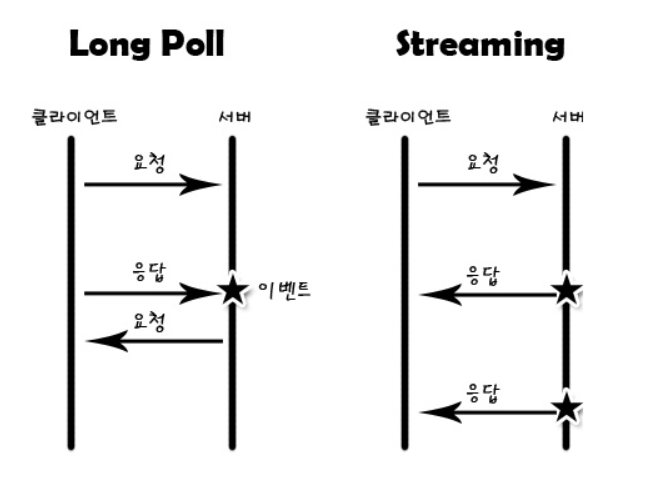
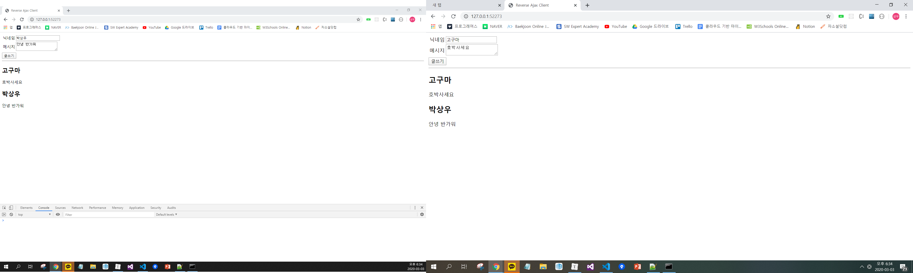

## Reverse Ajax 


**Reverse Ajax** : 서버에서 원하는  경우에 클라이언트에게 데이터를 제공하는 방법 

- Ajax 기법 3가지

  - Polling

    : 주기적으로 타이머로 서버에게 변경된 사항이 있는지 계속 Ajax 요청으로 물어보는 방식. 

    : 클라이언트가 계속 요청해야하므로 클라이언트에게 일이 많이 부과 

  - Long Polling

    : Polling 을 약간 보완한 것으로, 클라이언트가 서버에게 Ajax 요청을 하면 서버가 이를 이벤트가 발생하기 전까지 붙잡고 있는 방식. 

    : 서버에게 일이 많이 부과 

  - Streaming (Comet) -> 가장 완벽한 방식의 Reverse Ajax - 정말 서버가 원하는 순간에 데이터 전송. 




### 채팅 어플리케이션 

#### 서버 구성 

```js
// 모듈 추출 
var express = require('express'); 
var bodyParser = require('body-parser'); 

// 웹 서버 생성 
var app = express(); 
app.use(express.static('public')); 
app.use(bodyParser.urlencoded({extended : false})); 

/// 변수 선언 
var messages = []; 

// 웹 서버를 라우트 
app.get('/messages', function (request, response){
    response.send(messages); 
})

app.post('/messages', function(request, response){ 
    // 변수 선언 
    var name = request.body.name; 
    var content = request.body.content; 
    var message = {
        name : name, 
        content : content
    }; 

    // 데이터 추가 
    messages.push(message); 

    // 응답 
    response.send({
        message : '데이터를 추가했습니다' , 
        data : message 
    })
})

// 웹 서버 실행 
app.listen(52273, function(){
    console.log('Server Running at http://127.0.0.1:52273'); 
})
```


#### 클라이언트 구성 

```js
<!DOCTYPE html>
<html>
<head>
    <title> Reverse Ajax Client </title>
    <script src ="http://code.jquery.com/jquery-3.1.1.js"></script>
    <script>
        $(document).ready(function(){ 
            // 이벤트 연결 
            $('#write_form').submit(function(event){
                // Ajax 수행 
                $.post('/messages', $(this).serialize()); 

                // 디폴트 이벤트 제거 
                event.preventDefault(); 
            }); 

            // 1초마다 함수를 실행 
            setInterval(function(){ 
                $.getJSON('/messages', {
                    dummy : new Date().getTime()
                }, function(data){
                    // #output 내용물을 제거 
                    $('#output').empty(); 

                    // # output 내용물 추가 
                    $.each(data, function(index, item){ 
                        var output = '';
                        output += '<h2>' + item.name + '</h2>'; 
                        output += '<p>' + item.content + '</p>'; 
                        $('<div></div>').html(output).prependTo('#output');
                    })
                })
            }, 1000); 
        })
    </script>
</head>
<body>
    <form id = "write_form">
        <table>
            <tr>
                <td> 닉네임 </td>
                <td> <input type="text" name="name" /></td>
            </tr>
            <tr>
                <td> 메시지 </td>
                <td> <textarea name="content"></textarea></td>
            </tr>
        </table>
        <input type = "submit" value = "글쓰기" />
    </form>
    <hr />
    <div id = "output"> 

    </div>
</body>
</html>
```

Polling 기법은 일정 시간마다 서버에서 변경 사항이 있는지 확인하는 기법이기 때문에 setInterval 함수로 확인.

다른 요청임을 구분하기 위해 요청 매개변수 dummy 에 지속적으로 다른 값을 넣어 요청한다. 



---

**웹소켓** : HTML5 에서 추가된 기능으로, 실시간으로 웹 브라우저와 서버가 통신할 수 있는 기능 

**socket.io 모듈** : Node.js 의 가장 대표적인 모듈로, 웹 소켓 통신(스트리밍) 또는 롱폴링을 매우 쉬운 형태로 구현하게 해주는 모듈 