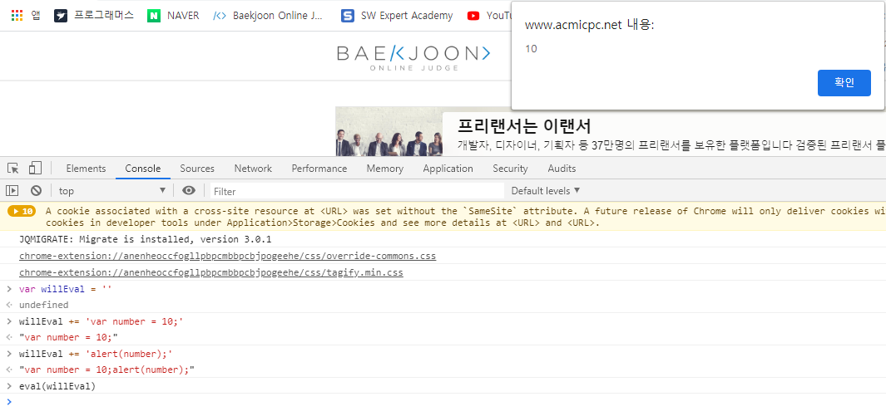
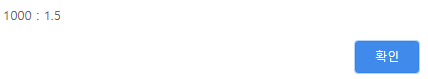

###  함수란 ? 

코드의 집합을 나타내는 자료형 


#### 익명함수 

: 형태는 함수지만 이름이 없는 함수. 이름이 없기 때문에 변수에 넣어 사용해야한다. 


#### 선언적 함수 

```javascript
function 함수(){
    
}
```

- 웹 브라우저는 script 태그 내부의 내용을 한 줄씩 읽기 전에 선언적 함수부터 읽는다. 따라서 아래와 같은 코드는 선언적 함수를 사용하면 정상적으로 실행된다 ( 익명함수일경우 에러 발생 )

  ```javascript
  <script>
      함수(); 
  	var 함수 = function () {alert('함수A'); };
  	var 함수 = function () {alert('함수B'); }; // 함수 재정의 가능 
  </script>
  ```

- **주의)** 선언적 함수와 익명함수의 순서 

  ```javascript
  <script>
      var 함수 = function () {alert('함수A'); }; // 익명 함수 
  	function 함수() {alert('함수B'); };	// 선언적 함수 
  </script>
  ```

  ```
  < 결과 > 
  
  함수A				// 그 이유는 선언적 함수가 먼저 생성되고 익명함수가 나중에 생성되기 때문. 
  ```


#### 매개변수 

함수를 호출할 때 괄호안에 적는 값 

- 자바스크립트는 함수를 생성할 때 함수에서 지정한 매개변수 개수보다 많거나 적은 매개변수를 사용하는 것을 허용.  ( 원래 선언할 수 있는 매개변수보다 많은 수를 선언하면 일반적으로 추가된 매개변수는 무시 .  그리고 원래 선언할 수 있는 매개변수보다 적게 선언하면 지정하지 않는 매개변수는 undefined 로 입력된다. )

- Array() 함수의 매개변수에 따른 차이 

  | 함수 형태            | 설명                                             |
  | -------------------- | ------------------------------------------------ |
  | Array()              | 빈 배열을 만듭니다.                              |
  | Array(number)        | 매개변수 값만큼의 크기를 가지는 배열을 만듭니다. |
  | Array(any, ... any ) | 매개변수를 배열로 만듭니다.                      |

  

#### 가변 인자 함수 

매개변수의 개수가 변할 수 있는 함수. 

예시 ) 

```javascript
<script>
    function sumAll(){
    	alert(typeof (arguments) + ' : ' + arguments.length);
	}

	sumAll(1,2,3,4,5,6,7,8,9); 
</script>
```

```javascript
<결과>
    
object : 9 			// 배열은 객체자료형이기 때문에 object
```


- 자바스크립트의 모든 함수는 내부에 기본적으로 변수 arguments 가 있다. -> 매개변수의 배열  
- 함수의 매개변수 개수가 다를 때에는 arguments 의 요소 개수에 따라 조건을 설정하여 처리하면 된다. 


##### 리턴값

`return` 키워드 : 함수가 실행되는 도중에 함수를 호출한 곳으로 돌아가라는 의미


#### 내부함수 

함수 내부에 선언하는 함수 

```javascript
function <외부함수> (){
    function <내부함수1>(){
        // 함수코드
    }
    function <내부함수2>(){
        // 함수코드 
    }
    // 함수코드 
}
```

- 내부함수를 사용하면 간단하게 함수 이름 충돌을 막을 수 있습니다.  ( 내부 함수를 사용하면 함수 외부에 이름이 같은 함수가 있어도 내부함수를 우선 실행한다. ) 
- 내부함수는 내부함수를 포함하는 함수에서만 사용할 수 있다는 것에 주의 


​	**자기호출함수** : 함수를 생성하자마자 호출하는 함수 

```javascript
<script>
    (function (){
    	// 코드
    	// 코드
	})(); 
</script>
```


#### 콜백함수 

자바스크립트는 함수도 하나의 자료형이므로 매개변수로 전달할 수 있다. 이렇게 매개변수로 전달하는 함수를 콜백함수라고 한다.

```javascript
<script>
    function callTenTimes(callback){
    	for(var i=0; i<10; i++){
            callback(); 
        }
	}

	var callback = function(){
        alert('함수 호출'); 
    };

	callTenTimes(callback); 
</script>
```

- 콜백함수는 익명함수로 사용하는 경우가 많다. 

  ```javascript
  <script>
      function callTenTimes(callback){
      	for(var i=0; i<10; i++){
              callback(); 
          }
  	}
  	callTenTimes(function(){
          alert('함수 호출'); 
      }); 
  </script>
  ```


#### 함수를 리턴하는 함수 

```javascript
<script>
    function returnFunction(){
    	return function(){
            alert('Hello Function .. !'); 
        }
	}

	returnFunction()(); 	// 리턴받은 함수의 실행이 필요하므로 () 하나 더 필요하다. 
</script>
```

- 함수를 리턴하는 함수는 사용하는 가장 큰 이유는 클로저 

 

### 클로저

- 지역 변수를 남겨두는 현상 

- 리턴된 함수 자체 , 살아남은 지역 변수 등 .. 정의가 다양 

- 지역변수를 남겨둔다고 외부에서 마음대로 사용할 수 있는 것은 아니다. 반드시 리턴된 클로저 함수를 사용해야 지역변수를 사용할 수 있다. 

  ```javascript
  <script>
      function test(name) {
  	    var output = 'Hello' + name + '..! '; 
      	return function (){
          	alert(output); 
      	};
  	}
  
  	var test_1 = test('Web'); 
  	var test_2 = test('JavaScript');
  
  	test_1(); 	// Hello Web ..! 
  	test_2();   // Hello JavaScript ..!
  </script> 
  ```


### 자바스크립트 내장 함수 


#### 타이머 함수

특정 시간에 특정 함수를 실행할 수 있게 하는 함수 .

| 메서드 이름                        | 설명                                                |
| ---------------------------------- | --------------------------------------------------- |
| setTimeout(function,millisecond)   | 일정 시간 후 함수를 한 번 실행합니다.               |
| setInterval(function, millisecond) | 일정 시간마다 함수를 반복해서 실행합니다.           |
| clearTimeout(id)                   | 일정 시간 후 함수를 한 번 실행하는 것을 중지합니다. |
| clearInterval(id)                  | 일정 시간마다 함수를 반복하는 것을 중단합니다.      |

예제 ) 10 초동안 경고창을 계속 출력

```javascript
<script>
    var intervalId = setInterval(function (){
        alert('<p>' + new Date() + '</p>');
    }, 1000); 

	setTimeout(function (){
        clearInterval(intervalID);
    }, 1000); 
</script>
```


#### 인코딩과 디코딩 함수 

**인코딩** : 문자를 컴퓨터에 저장하거나 통신에 사용할 목적으로 부호화 하는 방법. 

**디코딩** : 문자를 원래대로 되돌리는 것 

| 함수 이름                        | 설명                            |
| -------------------------------- | ------------------------------- |
| escape()                         | 적절한 정도로 인코딩합니다      |
| unescape()                       | 적절한 정도로 디코딩합니다      |
| encodeURI(uri)                   | 최소한의 문자만 인코딩합니다    |
| decodeURI(encodedURI)            | 최소한의 문자만 디코딩합니다    |
| encodeURIComponent(uriComponent) | 문자 대부분을 모두 인코딩합니다 |
| decodeURIComponent(encodedURI)   | 문자 대부분을 모두 디코딩합니다 |

- `escape() ` 
  - 영문 알파벳과 숫자, 일부 특수문주 (@, *, -, _ , + ... ) 을 제외하고 모두 인코딩 
  - 1바이트 문자는 %XX 형태로, 2바이트 문자는 %uXXXX 형태로 변환
- `encodeURI()`
  - escape() 함수에서 인터넷 주소에 사용되는 일부 특수문자 (: , ; , / , = , ? , & ) 는 변환하지 않습니다. 
- `encodeURIComponent()`
  - 알파벳과 숫자를 제외한 모든 문자를 인코딩 
  - UTF-8 인코딩과 동일하다.


#### 코드 실행함수 

```javascript
eval(string) 			 string 을 자바 스크립트 코드로 실행합니다. 
```

```javascript
<script>
    var willEval = ''; 
	willEval += 'var number =10;' ;
	willEval += 'alert(number); '; 

	eval(willEval) ; 
</script>
```




#### 숫자 확인 함수

| 함수 이름  | 설명                              |
| ---------- | --------------------------------- |
| isFinite() | number가 무한한 값인지 확인합니다 |
| isNaN()    | nubmer가 NaN인지 확인합니다       |


자바스크립트는 0으로 숫자를 나눌 경우 infinity 라는 값이 들어간다. 


#### 숫자 변환 함수 

| 함수 이름          | 설명                         |
| ------------------ | ---------------------------- |
| parseInt(string)   | string을 정수로 바꿔줍니다   |
| parseFloat(string) | string을 유리수로 바꿔줍니다 |

위의 함수들은 Number 함수의 단점을 보완하고자 만들어진 함수. Number() 함수의 단점은 숫자로 바꿀 수 없으면 NaN 으로 변환 . 그러나 parseInt 나 parseFloat 는 숫자로 변환할 수 있는 부분까지는 모두 숫자로 변환한다. 

```javascript
<script>
    var won = '1000원'; 
	var dollar = '1.5$'; 
	alert(parseInt(won) + ' : ' + parseInt(dollar)); 
	alert(parseFloat(won) + ' : ' + parseFloat(dollar)); 
</script>
```




**주의점)**

자바스크립트는 0으로 시작하거나 0x 로 시작하면 10진수가 아니라 8진수, 16진수로 생각하고 변환합니다. 

```javascript
parseInt('0x273') => 627
parseInt('273')   => 273 
parseInt('0273')  => 187
```

parseInt() 함수의 두번째 매개변수에 진법을 입력하면 앞의 수를 해당 진법의 수로 인식 

```javascript
parseInt('FF', 16)  => 255
parseInt('52', 10)  => 52
```

parseFloat() 함수도 중간에 e 가들어가면 e 앞부분에서 끊어버리는 것이 아니라 자릿수로 인식한다. 

```javascript
parseFloat('52.273e5')  => 5227300
```


### 화살표 함수 

ECMAScript6 에서 추가  ( 익명함수를 간단하게 사용할 수 있다. )

```
() => {}
```

익명함수와의 차이는 내부에서 사용하는 this 키워드의 의미가 다르다 

- 익명함수 : 함수 자체에 바인딩되어있는 객체 ( window 객체 또는 프로토타입 객체가 될수도 있습니다 ) 
- 화살표 함수 : 전역객체 ( 웹 브라우저 환경에서는 window 객체 )


화살표 함수 사용 시 전제 조건 

- 프로토타입을 사용하지 않고, ECMAScript 6에서 추가된 클래스를 사용할 때 
- jQuery 의 문서 객체 조작에서 this 키워드가 아니라, event.currentTarget 사용할 때 


화살표 함수의 코드가 한줄이라면 중괄호를 생략해도 되며, return 키워드를 사용하지 않아도 값을 리턴한다. 

```javascript
<script>
    const multiply = (a,b) => a*b; 
	alert(multiply(1,2)); 
	alert(multiply(3,4)); 
</script>
```


#### 전개연산자

마침표 3개 `...` 을 찍어 표기하는 연산자. 

전개연산자는 함수 또는 배열에 적용할 수 있다. -> 가변 매개변수 함수를 만들때 사용. 

```javascript
<script>
    function test(...numbers){
    	alert(numbers[0]); 
    	alert(numbers[1]); 
    	alert(numbers[2]); 
	}

	test(1,2,3); 
</script>
```

