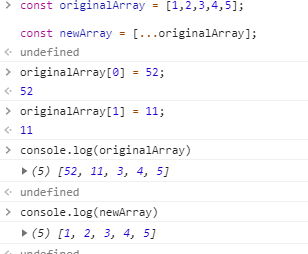

### 배열 


배열은 객체를 기반으로 만들어졌다 -> **객체는 키를 사용**한다. 

```javascript
<script>
    var product = {
        제품명 : '바나나'
        유형 : '말랑이'
        성분 : '노란껍질, 하얀속',
        원산지 : '제주도'
    }
</script>
```

사용법 ) 

- 객체 뒤에 대괄호를 사용하고 키를 표시  ( 대괄호를 이용하여 접근시 `''` 를 이용해야 한다)

  ```javascript
  product['제품명']  => 바나나 
  ```

- 객체 뒤에 `.` 을 쓰고 키를 표시 

  ```javascript
  product.제품명     => 바나나
  ```

객체의 키는 식별자 또는 문자열을 모두 사용할 수 있다.

식별자가 아닌 문자를 키로 사용했을 때는 무조건 대괄호를 사용해야 객체의 요소에 접근할 수 있다. 


#### 속성과 메서드 

**속성** : 객체 내부에 있는 값 

**메서드** : 객체의 속성 중  함수 자료형인 속성 

메서드 내에서 자기 자신이 가진 속성을 출력하고 싶을 때는 자신이 가진 속성임을 `this` 키워드를 이용하여 분명하게 표시해야한다.  ( 자바스크립트는 this 키워드를 생략할 수 없다. )

```javascript
<script>
    var person = {
        name : '박상우',
        eat : function (food){
            alert(this.name + '이' + food + '을 먹습니다. ');
        }
    }; 

	person.eat('밥'); 
</script>
```


#### 객체와 반복문 

`for in` 반복문에 객체를 넣으면 객체의 요소 개수만큼 반복문을 샐행한다. 


#### 객체 관련 키워드

`in` : 해당 키가 객체 안에 있는지 확인  

``` =\
'속성' in 객체 => 있을 경우 true, 없을 경우 false 
```

`with`  : 복잡하게 사용해야 하는 코드를 짧게 줄여주는 키워드

```javascript
with (<객체>){
      // 코드
}
```


`with` 키워드를 사용하는 객체의 속성 이름과 외부 변수의 이름이 같으면 충돌이 발생하나, 자바스크립트는 객체의 속성을 우선시한다. 


#### 객체의 속성 추가와 제거 


- **동적으로 속성 추가**  ( 메서드도 다음과 같이 추가할 수 있다. )

```javascript
<script>
    var student = {}; 

	student.이름 = '박상우'; 
	student.취미 = '수영'; 
</script>
```


- **속성 제거** - `delete ` 키워드 사용 

```javascript
delete (student.취미); 
```


#### 옵션 객체 초기화 

함수의 매개변수로 전달하는 객체를 일반적으로 **옵션객체**  라고 부른다.  옵션객체는 기본 매개변수처럼 값을 입력하지 않으면 초기화해주는 과정이 필요하다. 

```javascript
<script>
    function test(options){
    	options.valueA = options.valueA || 10 ; 
    	options.valueB = options.valueB || 20 ; 
    
    	alert(options.valueA + ':' + options.valueB );	
	}

	test({
        valueA : 52,
    })
</script>
```


### 참조 복사와 값 복사 


#### 기본 자료형의 값 복사 

자바스크립트는 기본 자료형 (숫자, 문자열, 불) 을 복사할 때 값을 완전히 복사한다. 

**값 복사 , 깊은 복사** : 값이 복사되어 두개의 변수가 완전히 독립성을 갖는 것 


#### 객체의 참조 복사 

객체를 변수에 저장하면, 실제 값을 저장하는 것이 아니라 `객체를 메모리 어딘가에 만들고, 객체가 메모리 위의 어디에 있는지` 라는 참조를 저장하게 된다. 

**참조복사, 얕은 복사** : 복사 이후에 두 변수가 독립적이지 않게 복사되는 것 


#### 객체의 깊은 복사 

객체의 깊은 복사를 하기 위해서는 새로운 객체를 만들고, for in 반복문을 이용하여 원본 객체에 반복을 돌리며 키와 값을 하나하나 옮기는 것 .


#### 전개 연산자를 사용한 배열 테크닉 

전개연산자를 사용하면 배열을 복제하거나 병합할 수 있다. ( 깊은 복사가 일어남 )

```javascript
const originalArray = [1,2,3,4,5]; 

const newArray = [...originalArray]; 
```




#### 배열 병합 

전개 연산자를 두번 사용하면 배열을 병합 할 수 있다. 

```javascript
<script> 
    const arrA = [1,2,3,4,5] ; 
	const arrB = [11,22,33,44,55]; 
	
	const newArr = [...arrA, ...arrB];
</script>
```


---


JSON 

**추상화** : 현실에 존재하는 객체의 필요한 속성을 추출하는 작업  


