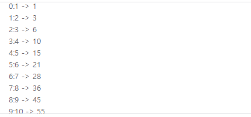
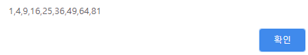
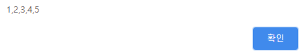

### 기본 자료형과 객체의 차이점 

기본 자료형은 `숫자, 문자열, 불 ` 3가지 자료형을 의미

기본 자료형에도 속성과 메서드가 있다. 그리고 기본 자료형의 속성이나 메서드를 사용하면 기본 자료형이 자동으로 객체로 변환된다. 

그러나 기본자료형은 객체가 아니므로 속성과 메서드를 추가할 수 없다. 

만약 기본 자료형의 속성이나 메서드를 추가하고 싶다면 `프로토타입`을 이용하면 가능하다. 


### Object 객체 

Object 객체 : 자바스크립트의 최상위 객체 


#### 생성 

```javascript
// 2가지 방법 
var object = {}; 
var object = new Object(); 
```


#### 속성과 메서드 

| 메서드 이름                | 설명                                               |
| -------------------------- | -------------------------------------------------- |
| constructor()              | 객체의 생성자 함수를 나타냅니다                    |
| hasOwnProperty(name)       | 객체가 name 속성이 있는지 확인합니다               |
| isPrototypeof(object)      | 객체가 object의 프로토타입인지 검사합니다          |
| propertyIsEnumerable(name) | 반복문으로 열거할 수 있는지 확인합니다             |
| toLocaleString()           | 객체를 호스트 환경에 맞는 언어의 문자열로 바꿉니다 |
| toString()                 | 객체를 문자열로 바꿉니다                           |
| valueOf()                  | 객체의 값을 나타냅니다                             |


#### 자료형 구분 

`constructor()` 메서드는 객체의 생성자 함수를 의미하며, 자료형을 검사할 때 유용하게 사용한다. 

`typeof` 를 이용하여 자로형을 비교할 경우 문제가 발생하는 경우가 존재 

```javascript
var numberFromLiteral = 273; 
var numberFromObject = new Number(273); 

alert(numberFromLiteral); 	// number
alert(numberFromObject); 	// object 
```

위와 같이 숫자일지라도 생성자 함수로 만든 숫자는 객체이다. 따라서 constructor 을 이용한다.


#### 모든 객체에 메서드 추가 

Object 객체는 모든 자바스크립트 객체의 최상위 객체이므로, 프로토타입에 속성 또는 메서드를 추가하면 모든 객체에서 활용할 수 있다. 

```javascript
<script>
    Object.prototype.test = function(){
    	alert(this);
	}

	var number = 273; 
	number.test(); 
</script>
```


#### Array 객체 

| 생성자 함수           | 설명                                         |
| --------------------- | -------------------------------------------- |
| Array()               | 빈배열을 만듭니다                            |
| Array(number)         | 매개변수만큼의 크기를 가지는 배열을 만듭니다 |
| Array(any, ... , any) | 매개변수를 배열로 만듭니다.                  |


#### Date 객체 

날짜와 시간을 표시하는 객체 

예시 ) 

```javascript
<script>
    var date = new Date(); 

	date.setDate(data.getDage()+7); 

	alert(date); 
</script>
```


#### Math 객체 

자바스크립트의 기본 내장 객체 중 유일하게 생성자 함수를 사용하지 않는 객체 

Math 객체의 메서드로 넘겨진 모든 매개변수는 종류에 관계없이 모두 숫자로 변환한다. 


#### ECMAScript 5 Array 객체

```javascript
alert(Array.isArray([1,2,3])); 		=> true 
alert(Array.isArray({}));			=> false
alert(Array.isArray(1));			=> false
```


반복 메서드 

ECMAScript 5 의 Array 객체는 반복 메서드가 있다. 

| 메서드 이름 | 설명                                                         |
| ----------- | ------------------------------------------------------------ |
| forEach()   | 배열 각각의 요소를 사용해 특정 함수를 for in 반복문처럼 실행 |
| map()       | 기존의 배열에 특정 규칙을 적용해 새로운 배열을 만든다        |

```javascript
var array = [1,2,3,4,5,6,7,8,9,10]; 

array.forEach(function (element, index, array){
     	 sum += element; 
    	 output += (index + ':' + element + ' -> ' + sum + '\n'); 
   	   });
```



`element ` : 현재 반복에서 배열의 요소 

`index` : 현재 반복에서 요소의 인덱스 

`array` : 현재 반복을 수행하는 배열 자체 

```javascript
var array = [1,2,3,4,5,6,7,8,9]; 

var output = array.map(function(element){
    return element*element; 
});
```




#### 조건 메서드 

| 메서드 이름 | 설명                                                        |
| ----------- | ----------------------------------------------------------- |
| filter()    | 특정 조건을 만족하는 요소를 추출해 새로운 배열을 만듭니다   |
| every()     | 배열의 요소가 특정 조건을 모두 만족하는지 확인합니다        |
| some()      | 배열의 요소가 특정 조건을 적어도 하나 만족하는지 확인합니다 |

```javascript
<script>
    var array = [1,2,3,4,5,6,7,8,9,10] ; 
	array = array.filter(function (element, index,array){
        return element <=5 ; 
    }); 

	alert(array); 
</script>
```



`filter` 메서드의 매개변수로 입력한 함수는 불 자료형 값으로 리턴해야하며, 이 때 리턴하는 값이 true 인 배열의 요소만 골라 새로운 배열 생성.


`every` 메서드는 배열의 모든 요소가 true 를 리턴하면 true 를 리턴하고, 그 외의 경우에는 false 를 리턴 

`some` 메서드는 배열의 요소 중 적어도 하나 이상의 함수에서 true 를 리턴할 경우에 true 를 리턴. 


#### JSON 객체 

**JSON ( JavaScript Object Notation )** : 자바스크립트 객체의 형태를 갖는 문자열.

| 메서드 이름      | 설명                                   |
| ---------------- | -------------------------------------- |
| JSON.stringify() | 자바스크립트 객체를 JSON 문자열로 반환 |
| JSON.parse()     | JSON 문자열을 자바스크립트 객체로 변환 |

