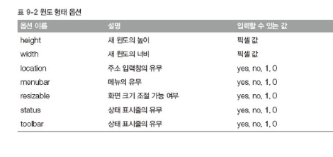

## 브라우저 객체 모델 


**브라우저 객체 모델** : 웹 브라우저라는 플랫폼이 제공하는 기능 . 웹 브라우저와 관련된 객체의 집합


`screen 객체` : 화면 전체와 관련된 객체 

`navigator 객체 ` : 웹 브라우저와 관련된 객체 

`location 객체 ` : 주소와 관련된 객체 

`history 객체` : 기록과 관련된 객체 

`document 객체` : HTML 문서와 관련된 객체 


#### window 객체 

window 객체는 자바 스크립트의 브라우저 기반 최상위 객체. 


#### 새로운 window 객체 생성 

| 메서드 이름                         | 설명                            |
| ----------------------------------- | ------------------------------- |
| open(URL, name, features, replace ) | 새로운 window 객체를 생성합니다 |

`open` 메서드의 첫번쨰 매개변수는 열고자 하는 HTML 페이지의 URL,  두번째 매개변수는 윈도우간 통신하는데 사용하는 윈도우 이름, 세번째 매개변수는 윈도우를 어떠한 모양으로 출력할지 지정하는 옵션


- 세번째 매개변수에서 사용하는 옵션 




```javascript
<script>
    var child = window.open('','','width=300, height=200');

	child.document.write('<h1>From Parent Window</h1>');
</script>
```


#### window 객체의 기본 메서드 


`--By` 형태의 메서드는 현재 윈도우를 기준으로 상대적으로 속성을 변화 

`--To` 형태의 메서드는 절대적인 기준으로 속성을 변화하는 메서드 .


#### Screen 객체 

Screen 객체 : 웹 브라우저의 화면이 아니라 운영체제 화면의 속성을 갖는 객체 


#### Location 객체 

location 객체는 웹 브라우저의 주소 표시줄과 관련된 객체. 프로토콜의 종류, 호스트이름, 문서위치 등의 정보가 있다. 


`assign` 메서드와 `replace` 메서드의 차이점은 `replace` 메서드는 뒤로가기 버튼을 사용할 수 없다. 


#### Navigator 객체 

navigator 객체는 웹 페이지를 실행하고 있는 브라우저에 대한 정보가 있다. 


#### window 객체의 onload 이벤트 속성 

```javascript
<script>
    window.onload = function(){ 
	};
</script>
```

문서 객체의 속성 중 `on` 으로 시작하는 속성을 이벤트 속성이라 한다. 이러한 이벤트 속성은 함수를 할당해야한다. 

`window.onload` 는 window 객체가 로드가 완료되고 자동으로 할당한 함수를 실행한다. 

(HTML 페이지에 존재하는 모든 태그가 화면에 올라가는 순간이 로드가 완료되는 순간 )


---

> **브라우저 객체 모델 참고자료** 
>
> **모질라 웹 API 문서** ( https://developer.mozilla.org/ko/docs/Web/API )
>
> **Dev Docs** ( http://devdocs.io/ )
>
> **Zeal Docs** (https://zealdocs.org/)
>
> **Kapeli** ( https://kapeli.com/dash )