> HTML 을 스스로 공부 할 수 있는 사이트

http://w3shcools.com 

HTML Basic ~ HTML id 까지는 혼자서 꼭 보기. 

---


## HTML

태그 == 엘리먼트 ( 요소 )

속성 : 엘리먼트의 부가적인 정보. 

- href <- 링크를 눌렀을 때 이동해야하는 주소. 

```html
<a href="https://www.w3schools.com">This is a link</a>
```

- 태그 중 닫는 태그가 없는 경우. 

  - 이미지 

    ```html
    1. 
    2. 
    ```

  - <p/> == <p></p>  : p 태그의 값이 없음을 의미. 

- list 구조 : 동일한 레벨의 정보들이 쭉 떨어지는 것. 

  - **ul** : unordered - 순서에 관계없이 나열된다. 

  - **ol** : ordered - 순서 관계. 1,2,3,4 로 표시된다. 

    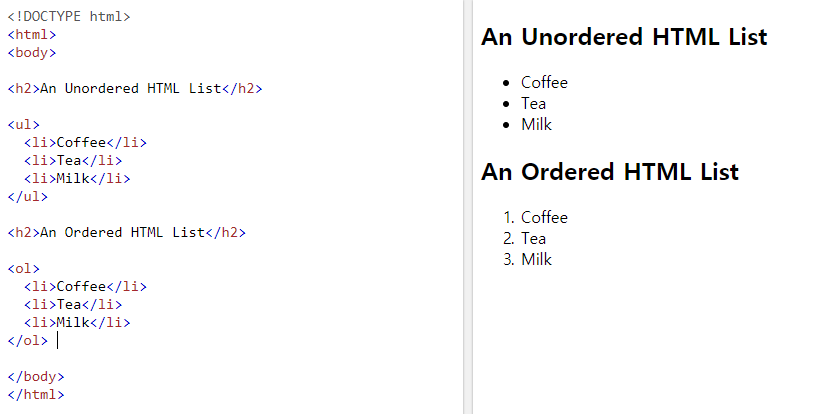

    

- 속성도 태그별로 반드시 가져가야하는 속성이 있고, 옵션으로 가져가야하는 속성도 있다. 

  - **alt 속성** : 이미지가 로드되지 못했을 경우, 파일의 정보를 보여주는 것. 시각 장애인들을 위한 정보제공으로도 사용 ( 이미지를 소리로 알려줄 때 alt 에 적은 정보를 읽어준다. )

    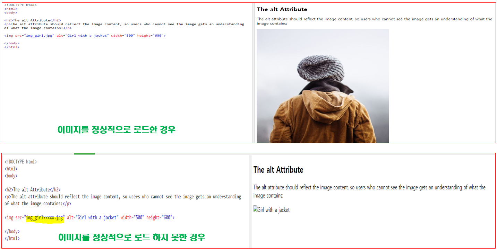

- ```html
  <table style="width:100%" border="1">  // border 은 테이블의 테두리를 만드는 부분
  <tr></tr>		// 테이블의 row 
  <th colspan = "2">Name</th>		// 표 병합( 열을 병합 )
  <td rowspan = "3">70</td> 		// 표 병합 ( 행을 병합 )
  <th></th>		// 테이블의 헤더 (제목)
  <td></td>		// 테이블의 데이터 
  ```

  - `기본`

    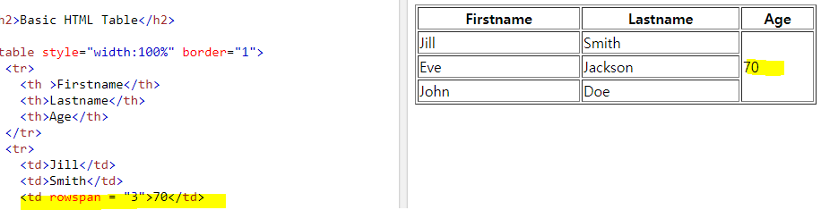

  - `colspan`

  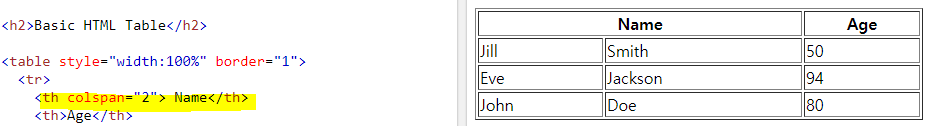

  - `rowspan`

  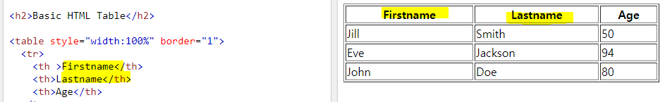

  

- HTML Classes 

  - ID : 유일한 값. 문서 안에서는 그 ID 는 하나만 있어야 한다. 
  - Class : 집합. 비슷한 것들 끼리 묶어놓은 것을 의미. 유일하게 식별하기 위해 ID 라는 속성 부여. 

  ```html
  <!DOCTYPE html>
  <html>
  <head>
  <style>
  h2 {				// h2 인 부분에만 적용 
  	color : red
  }
  #first{				// ID 가 first 에 해당하는 부분에만 적용 
  	color:yellow;
  }
  .cities {			// cities 라는 클래스에 해당하는 부분에만 적용 
    background-color: black;
    color: white;
    margin: 20px;
    padding: 20px;
  }
  </style>
  </head>
  <body>
  
  <div class="cities" id = "first">
  <h2>London</h2>
  <p>London is the capital of England.</p>
  </div> 
  ```

  클래스 명을 참조하기 위해서는 `.` 을 사용. 

  ID 명을 참조하기 위해서는 `#` 을 사용. 

  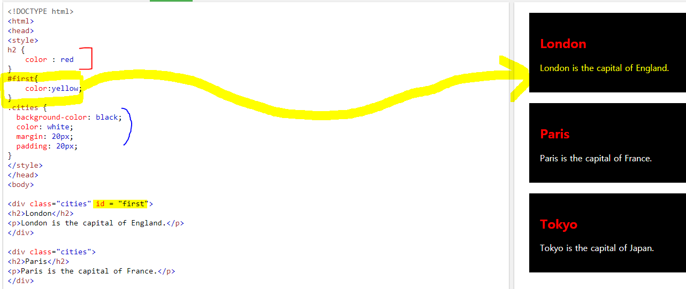

- form 태그  : 브라우저에서 입력된 정보를 서버쪽으로 전달하는 용도로 사용 ( 동적인 요청 )

  - input 태그 : 자유 입력 방식. 

    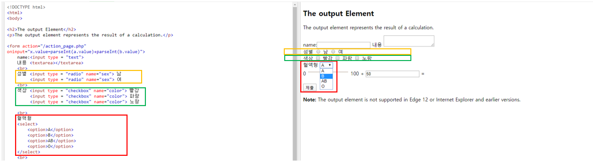

     

---

---

### 입력 

#### 문자열을 입력하는 방법 

- 숫자를 입력 받는 방법 
  - 문자열을 입력 받은 후 숫자로 변환 
  - 문자열을 입력을 할 때 사용하는 함수는 `prompt()`  -> 2개의 매개변수 필요 

**주의 )** 문자열 + 숫자 = 문자  

**주의 )** 숫자와 문자열 덧셈을 제외한 사칙연산은 숫자가 우선된다. 

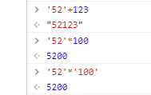

명시적 형변환 == 강제적으로 형변환    ( 반대 : 암시적 형변환 ) 

다른 데이터 타입을 숫자형으로 변환 -> Number() 함수를 사용

다른 데이터 타입을 문자열로 변환 -> String() 함수를 사용 

```javascript
> Number("abcd")
<  Nan  		// Not a Number 이라는 의미. 
				// 자료형은 숫자이나 자바스크립트로 나타낼 수 없는 숫자를 의미 
				// 예 ) 자바스크립트에서는 복소수 표현이 불가능 
```

**typeof()**는 연산자에 속한다. 

**Boolean()** 함수 : 다른 자료형을 불 (bool) 자료형으로 변환  -> 명시적인 형변환

​								**0, NaN, '', null, undefined**  -> false 로 변환 

​								**나머지**		->     true 로 변환

​							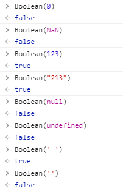

 

0, NaN, '', null, undefined 데이터에 대한 암시적인 형변환  -> Boolean() 함수의 결과와 동일 

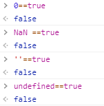


**일치 연산자**  : 양변의 자료형과 값의 일치 여부를 확인 

**===** : 양변의 자료형과 값이 모두 일치 

**!==** :  양변의 자료형과 값이 일치하지 않아야 true 

```javascript
<script>
	console.log('' === false);
	console.log('' === 0);
	console.log(0 === false);
	console.log('273' === 273);
</script> 
⇒ 모두 false를 반환
```


- **스코프** : 특정 변수를 사용할 수 있는 유효 범위 

  - var 변수는 스코프가 달라도 다른 영역에 있는 변수를 참조할 수 있기 때문에 프로그램의 규모가 클 경우 다른 부분에서 var 변수를 건드릴 가능성이 있기 때문에 var 사용을 지양한다. 

    

  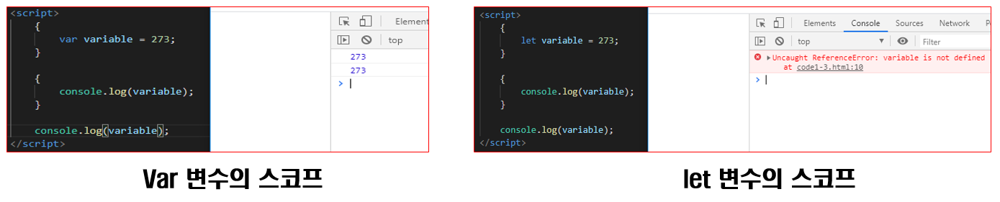


- **익명 함수 (Anonymous function)** : 일반적으로 만들어놓고 한번만 사용하는 1회성 함수일 경우에 사용. 

- **화살표 함수 (arrow function)** : 어떤 값이 들어가면 화살표가 가리키는 값을 수행하는 함수. 

- **비동기 함수 (Asynchronous function)** : 일이 끝나지 않은 상태에서 다른 일을 하는 것. 시켜놓은 일의 결과가 나타난다 ( callback )

  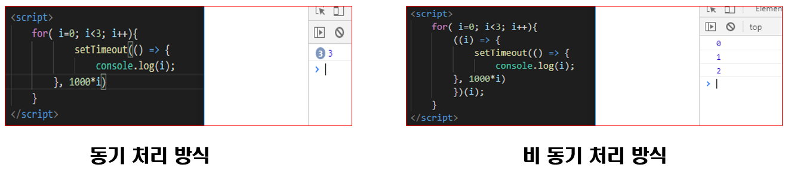

  


자바 스크립트는 함수단위로 스코프가 적용된다. 

**호이스팅** : 선언되어있는 변수나 함수가 자신이 갈 수 있는 스코프의 최상위로 가는 것. 

- NaN 은 비교연산자를 이용하여 판단이 불가능하기 때문에 `isNaN()` 함수를 이용하여 해당 변수가 NaN 인지 확인을 할 수 있다. 

- **삼항연산자**    

  조건식 ? 참인 경우 : 거짓인 경우 ; 

- **짧은 조건식**

  -  `불 표현식` || `불 표현식이 거짓일 때 실행할 문장` 

  - `불 표현식` && `불 표현식이 참일 때 실행할 문장`

    ```bash
    input % 2 === 0 || console.log("홀수"); 
    input % 2 === 0 && console.log("짝수");
    ```

- 반복문 

  for ( 변수 = 초기값 ; 조건문 ; 증가분 ){

  ​		조건문을 만족하는 경우 수행할 구문 

  }

- 배열 : **다양한 형태**의 데이터 타입을 **모두** 넣을 수 있다. ( 형에 대한 데이터 타입이 유연하다. )

  ```javascript
  let  array = [ 273, 'String', true, function() {}, {}, [100,200] ];
  //				숫자   문자열     불        함수       객체    배열 
  ```

  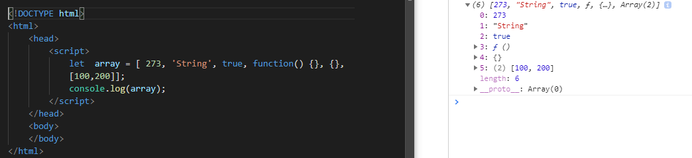

  - `arr.push("xyz");` 이런식으로 배열의 맨 뒤부분에 값을 추가할 수 있다. 

- `forEach` 와 같은 iterator 형식을 많이 사용. 방을 순차적으로 돌며 현 시점에서 그 값을 사용해야한다. 그것을 받아오는 값이. 

  ```javascript
  arr.forEach(function(ii) { console.log(ii); }); 	// 익명 함수를 사용 
  ```

  ```javascript
  arr.forEach(ii => {console.log(ii)});
  ```

  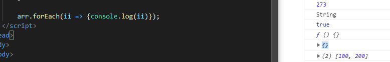


```javascript
<script>
            let value = 0; 

            // 현재 시간을 밀리 세컨드 ( 1/1000초 ) 단위로 가져오는 것 
            let startTime = new Date().getTime(); 

            while (new Date().getTime() < startTime + 1000){
                value++; 
            }
            console.log(`1초동안 while 루프를 수행하는 회수 : ${value}`);
</script>     
```

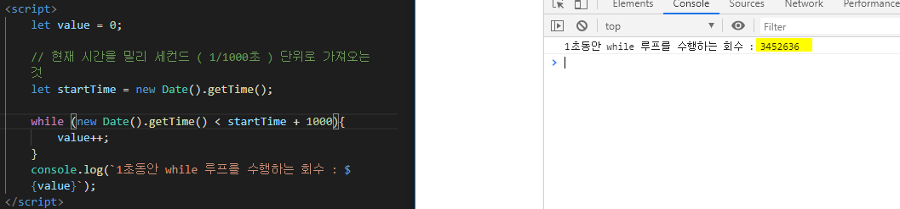


```javascript
    <script>
        //  사용자 입력이 
        //  숫자이면 짝수, 홀수 여부를 콘솔에 출력 후 다시 입력을 요구 
        //  숫자가 아니면 메시지를 콘솔에 출력 후 종료
 
        let input = prompt("숫자를 입력하세요");
        while (!isNaN(input)) {
            input % 2 === 0 ? console.log("짝수") : console.log("홀수");
            input= prompt("숫자를 입력하세요");
        }
        console.log("종료");
    </script>
```

```javascript
    <script>
        //  숫자 맞추기 게임
        //  1~20 사이의 임의의 숫자를 맞추는 게임
        const MIN = 1;
        const MAX = 20;
 
        let answer = Math.floor(Math.random() * (MAX - MIN + 1)) + MIN;
        let guesses = 0; // 사용자가 입력한 회수
        let input;
        do {
            input = prompt(`${MIN} ~ ${MAX} 사이의 숫자를 입력하세요.`);
            input = Number(input);
            guesses ++;
 
            if (input > answer) {
                console.log("입력한 값 보다 작은 값을 입력하세요");
            } else if (input < answer) {
                console.log("입력한 값 보다 큰 값을 입력하세요");
            } else {
                console.log(`정답입니다. (시도회수: ${guesses})`);
            }
        } while (input !== answer);
    </script>
```

- **for 문  4가지 방법**

  ```javascript 
      <script>
          const fruits = [ "사과", "오렌지", "딸기", "바나나" ];
   
          console.log("방법1. for loop");	
          for (let i = 0; i < fruits.length; i ++) {
              console.log(fruits[i]);
          }
   
          console.log("방법2. for in");
          for (let i in fruits) {
              console.log(fruits[i]);
          }
   
          console.log("방법3. forEach");
          fruits.forEach(function(fruit) { 
              console.log(fruit);
          });
   
          console.log("방법4. forEach + arrow function");
          fruits.forEach(fruit => console.log(fruit));
          
      </script>
  ```

---

**가상화** : 소프트웨어가 소프트웨어를 제어하는데 이를 마치 하드웨어인것처럼 작동. 


가상화의 가장 큰 문제 -> 하드웨어 자원을 사용하는데 불필요한 부분들이 너무 많다. 


**도커** : 가상화 SW 가 돌고있는 SW 의 리소스를 공유해서 사용. 

도커의 장점 : 올라가는 컨테이너들이 공통적으로 설치해야하는 운영체제 부분이 다 사라지기 때문에, 리소스를 보다 효율적으로 사용할 수 있다. 


모듈화. 

현재는 모든 것들이 다 파일로 되어있어서, 파일 실행 시 컨테이너. 


내가 만들고자 하는 서비스가 왜 MSA 에 적합한지. 

서비스의 안정성과 가용성을 보장하기 위해 컨테이너를 여러개를 사용하는 방식으로 설계. 


식별자 : unique 하게 구분할 수 있어야하기 때문에 식별자 라고 한다. 

