### HTML, JavaScript, JQuery 연습.

https://www.w3schools.com/html/default.asp

https://www.w3schools.com/js/default.asp

https://www.w3schools.com/jquery/default.asp


---


### JavaScript 파일 작성 및 테스트 

terminal -> new terminal  

터미널에서 `npx http-server` 명령어를 이용하여 서버를 킨다. 

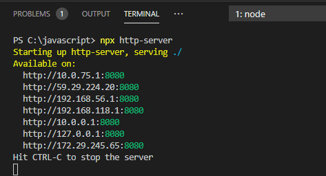

html 파일을 작성한 이후 테스트를 하기 위해서는 `http://localhost:8080/test.html` 에 접속하여 `F12` 개발자 실행환경에서 확인할 수 있다. 

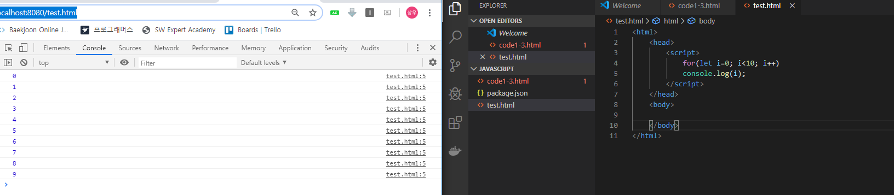


위와 같이 콘솔창이 아닌 화면에 보이게 하기 위해서는 `<body></body> ` 내부에 값을 넣어주어야한다. 

이 때 `<div></div>` 값이 어디 있는지 쉽게 알기 위해서 `id` 라는 속성을 부여하여 위치를 찾는다. 


##### * 사용자 화면에 구구단 출력하기

```html
<html>
    <head>
        <script>
            window.onload = function() {
                for(let dan = 2; dan<=9; dan++){
                    for(let num=1; num<=9; num++){
                        document.getElementById("display").innerText += `${dan}*${num} = ${dan*num}\n`;
                    }
                }
            }
        </script>
    </head>
    <body>
        <div id="display">

        </div>
    </body>
</html>
```

- 위의 html 파일을 실행할 때 만약 `window.onload` 부분이 없다면 오류가 발생할 것이다. 그 이유는 display 에 해당하는 <div> 가 script 하단에 위치하기 때문에 위에서 부터 랜더링 하는 과정에서 오류가 발생하기 때문. 
- innerText 에서 `+= ` 이 부분이 `=` 이라면 마지막 문장 하나만 화면에 출력된다. 그 이유는 한 문장위에 계속 덮어 씌워지기 때문. 따라서 `+= ` 로 바꿔서 이전 내용에 새롭게 추가하는 방식으로 화면에 출력해야한다.  

```javascript
window.onload = function()   // 전체가 다 로딩 된 이후에 해당 구문을 실행하라는 의미 
```


Element  - 요소  --> 태그 

Attribute  - 속성  --> 


`innerHTML`  html 코드처럼 생각한다. (`\n` 문자는 html 에서는 공백문자로 취급하여 개행문자의 역할을 못한다. )

`innerText` 내가 입력한 코드가 일반적인 텍스트 문자로 다 찍히지만, `innerHTML` 는 내가 입력한 코드가 HTML 의 태그 요소일 경우 해당 역할을 반영하여 출력. 

`tab` 문자가 적용되도록 하는 태그가 <pre></pre> 이다. 

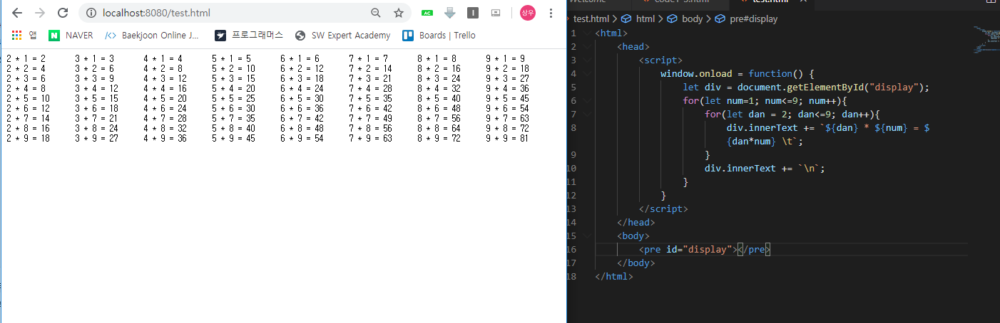


##### 1초 동안 for 문이 실행된 횟수를 출력

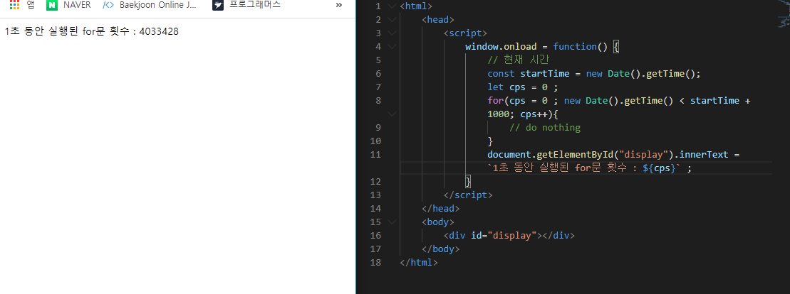

##### for 문을 이용하는 다양한 방법

```html
<html>
    <head>
        <script>
            window.onload = function() {
                let fruits = ['사과', '딸기', '바나나', '배'];

                console.log('for 문을 이용한 출력');
                for(let i=0; i<fruits.length; i++){
                    console.log(fruits[i]);
                }

                console.log('for in 문을 이용한 출력');
                for (let i in fruits){
                    console.log(fruits[i]);
                }

                console.log('forEach 문을 이용한 출력');
                // arrow function 이용 
                fruits.forEach(i => {   // i 자체가 배열의 요소
                    console.log(i); 
                })
                // 익명함수 이용
                fruits.forEach(function(i){
                    console.log(i); 
                })
            }
        </script>
    </head>
    <body>
        <div id="display"></div>
    </body>
</html>
```


`<br>` : HTML 에서 줄 바꿈에 사용하는 태그.

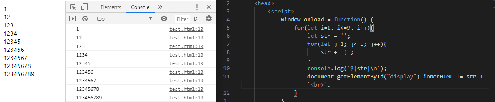


##### 교재 코드4-18

`confirm` 은 사용자에게 물어보는것.` yes` 를 클릭하면` true`, `no` 를 클릭하면 `false` 를 반환. 

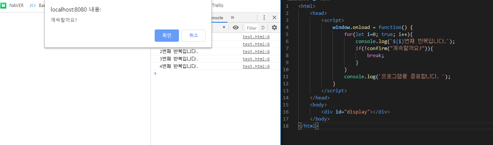


##### 배열에 포함된 숫자의 합 구하기.

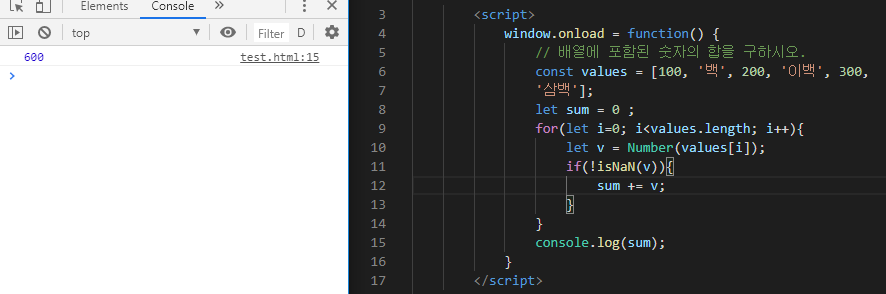

- `for of` 구문은 배열의 값을 반환해준다. 

  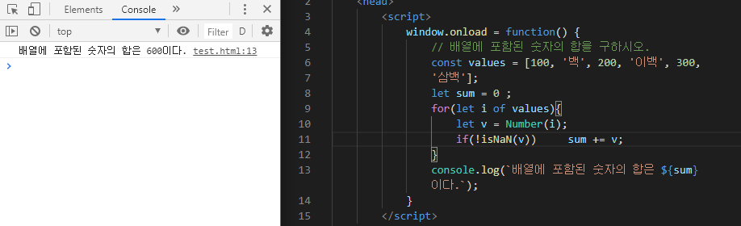


### 함수


- 함수

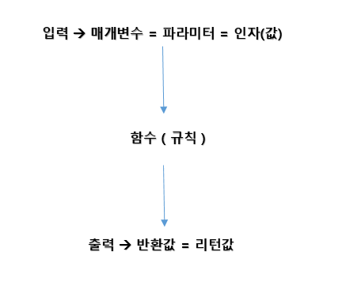


- 함수 리터럴 

  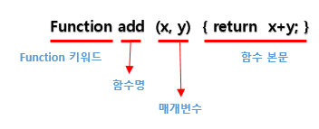

- 함수 정의 방식 

  - 함수 선언문 ( function statement )
  - 함수 표현식 ( function expression )
  - Function() 생성자 함수 

- **함수 선언문을 이용한 함수 정의 방식** 

  - 함수 리터럴과 동일 

  - 반드시 함수 이름을 정의해야 함. 

    ```java script
    function add (x,y){	// 함수 선언 
    	return x+y ; 
    }
    
    add(3,4); // 함수 호출 
    ```

  - 함수 선언문 형식으로 정의한 함수는 자바스크립트 내부에서 함수 이름과 함수 변수 이름이 동일한 함수 표현식 형식으로 변경. 

    ```javascript
    function add(x,y){
        return x+y; 
    }
              ↓
    let add = function add(x,y){
        return x+y; 
    };
    ```

    

- **함수 표현식을 이용한 함수 정의 방식**

  - 자바스크립트에서 함수는 **하나의 값으로 취급** -> 문자열, 숫자처럼 변수에 할당이 가능 

    - 함수의 이름이 있는 경우 -> 기명함수 **( 주의_ 함수 표현식에 사용된 함수 이름은 외부 코드에서 접근이 불가하다 )**

    - 함수의 이름이 없는 경우 -> 익명함수

    ```javascript
    let add = function(x,y) { return x+y; };
    
    add(3,4); 
    ```

- Function() 생성자 함수를 이용한 함수 생성

  https://developer.mozilla.org/ko/docs/Web/JavaScript/Reference/Global_Objects/Function

  ```javascript
  let add = new Function('x', 'y', 'return x + y');
  
  add(3, 4);
  ```


- 익명함수 표현식

  ```javascript
  // 선언 
  let 함수이름변수 = function (매개변수) { 함수본문 };
  
  // 호출 
  함수이름변수(매개변수); 
  
  // Example 
  // 1부터 사용자가 입력한 숫자만큼의 합을 반환하는 함수를 정의 - 익명함수 사용 
          <script>
              let sigma = function (n){
                  let sum = 0; 
                  for(let i=1; i<=n; i++)
                      sum+=i; 
                  return sum; 
              }
              let num = prompt("숫자를 입력하세요. ");
              console.log(`1~${num} 합은 ${sigma(num)} 입니다.`);
          </script>
  
  // - arrow function 사용 
          <script>
              let sigma =(n) => {
                  let sum = 0; 
                  for(let i=1; i<=n; i++)
                      sum+=i; 
                  return sum; 
              }
              let num = prompt("숫자를 입력하세요. ");
              console.log(`1~${num} 합은 ${sigma(num)} 입니다.`);
          </script>
  ```

- 함수 재정의

  : 동일한 이름의 함수가 중복해서 정의되는 것. 

  ```javascript
          <script>
              function doSomething(x,y) {return x+y;};
              function doSomething(x,y) {return x*y;};
  
              console.log(doSomething(3,4));
          </script>
  // 동일한 이름의 함수가 재정의 될 경우, 마지막에 정의한 함수가 반영된다. 
  ```

  ```javascript
          <script>
              console.log(doSomething(3,4)); // 12 출력
              function doSomething(x,y) {return x+y;};
              function doSomething(x,y) {return x*y;};
  
  			console.log(doSomething2);		// undefined
              console.log(doSomething2(4,5));	// Error - doSomething2 is not a function
              var doSomething2 = function(x,y) { return x+y; };
              var doSomething2 = function(x,y) { return x*y; };
          </script>
  ```

  `doSomething2` 함수는 선언 이전에 변수를 사용했기 때문에 오류가 발생한다. 그러나 위의 `doSomething` 은 오류가 발생하지 않는다. 그 이유는 웹 브라우저는 script 태그 내부의 내용을 한 줄씩 읽기 전에 **선언적 함수부터 읽기 때문**이다. 

  ```javascript
          <script>
              // 선언문 형식으로 정의된 함수와
              // 표현식 형식으로 정의된 익명 함수가 공존하는 경우
              // --> 선언문 형식이 먼저 생성된 후 익명함수가 마지막에 생성. 
              var f = function() { console.log("#1 f is called."); };
  
              function f() {console.log("#2 f is called.")};
  
              f(); 
          </script>
  // 출력 : #1 f is called.  
  ```

  

- 다양한 형식의 매개변수를 전달할 수 있다. 

  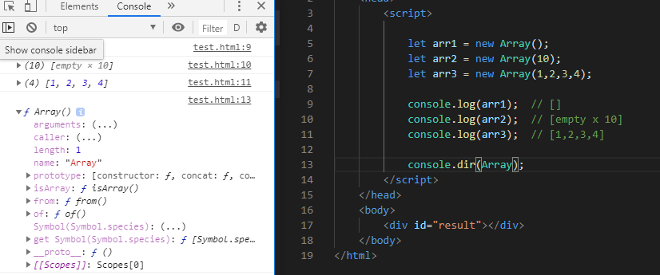


함수라는 것은 argument 라는 독특한 값을 가지고 있다.

`console.dir` 걔가 가지고 있는 구조 전체를 다 보여준다. `


- p130 . 가변 인자 함수 

  파라미터(매개변수)의 개수가 변할 수 있는 함수.

  ​		-> 함수 객체의 arguments 속성을 이용해서 매개변수를 이용 ( 처리 )

```javascript
        <script>
            //  매개변수로 전달된 숫자값의 합을 구하는 함수를 정의
            function sumAll() {
                console.log(typeof arguments);
                console.log(arguments);
                let sum = 0;
                for (i of arguments) {
                    if (!isNaN(Number(i))) {
                        console.log(i);
                        sum += i;
                    }
                }
                return sum;
            }

            console.log("모든 숫자의 합: " + sumAll(1, "하나", 2, "둘", 3, "셋", 4, 5, 6, 7));   
        </script>
```

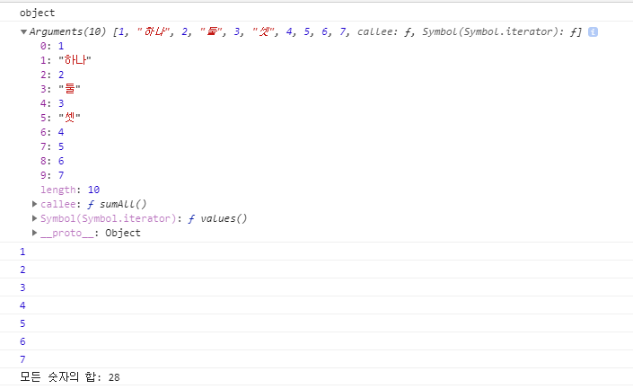


- 내부함수 : 함수 내부에서 함수를 정의 

  ```javascript
              function 외부함수 (){
                  function 내부함수1 () { ... }
  
                  function 내부함수2 () { ... }
              }
  ```

- 자기 호출 함수 : 생성하자마자 한 번 호출되는 함수 

  ```javascript
  (function () {
      console.log("^^");
  })();
  ```

- 주의) forEach() 를 중간에 멈출 수 없음. 

  ```javascript
  			//  예외를 던지지 않고는 forEach()를 중간에 멈출 수 없음
              //  중간에 멈춰야 한다면 forEach()는 적절하지 않음
              function f2() {
                  let value;
                  Array.from(arguments).forEach(i => {
                      if (i % 3 === 0) {
                          value = i;
                          return false;
                      }
                  });  
                  return value; 
              }
              function f3() {
                  let value;
                  [...arguments].forEach(i => {
                      if (i % 3 === 0) {
                          value = i;
                          return false;
                      }
                  });  
                  return value; 
              }
              // https://developer.mozilla.org/ko/docs/Web/JavaScript/Reference/Global_Objects/Array/find
              function f2() {
                  return Array.from(arguments).find(i => i % 3 === 0);  
              }
  ```

  

- **콜백함수** : 비동기처리에서 서브함수가 처리가 끝났을 때 호출하는 함수 . 

- 함수를 리턴하는 함수 

  ```javascript
  <script>
         function returnFunction(){
            return function(){  console.log("^^"); };
         }
         returnFunction()();  // 함수를 리턴받았기때문에 해당함수를 호출하기 위해서 () 하나 더 필요
  </script>
  
  // 출력
  >>  ^^
  ```


자바스크립트는 함수 안에 정의되어있는 변수는 해당하는 함수 안에서만 유효 범위를 가진다. 함수 외부에서는 함수 내부에 정의되어 있는 변수를 직접 참조할 수 없다. 

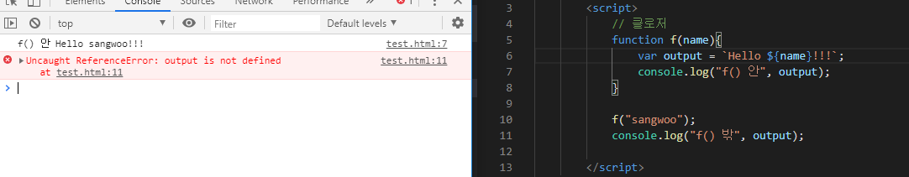

- 클로저 ( 정의가 다양 )

  - 지역 변수를 남겨두는 현상 

  - 리턴된 함수 자체 

  - 살아남은 지역 변수

  - 함수 내부에 정의되어 있는 변수가 함수를 반환한 이후에도 참조할 수 있는 형태. 

  - 함수 내부에 생성된 변수의 소멸을 지연시키는 느낌. 

    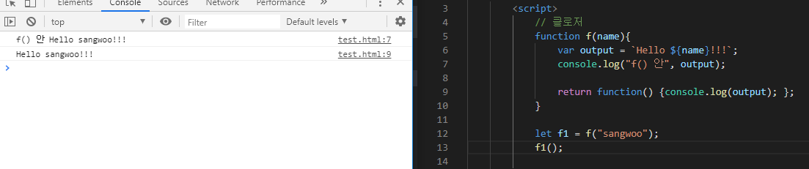