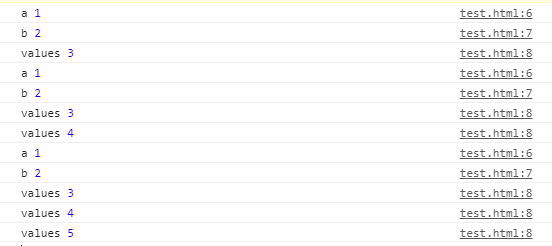

#### 전개연산자

- 마침표 3개 `...` 을 찍어 표기하는 연산자.
- 함수 또는 배열에 적용할 수 있다. 

- 고정된 값과 가변 길이의 매개변수를 분리해서 받을 수 있다. 반드시 입력해야하는 것들은 a,b 와 같이 사용하고 들어와도, 안들어와도 되는것은 values 와 같이 사용한다. 

  

```javascript
<html>
    <head>
        <script src = "https://code.jquery.com/jquery-3.4.1.js"></script>
        <script>
            function test(a,b, ... values){ // 전개연산자는 `반드시 가장 뒤에 딱 하나만 사용` 
                console.log('a',a);
                console.log('b',b);
                values.forEach(i => console.log('values',i));
            }

            test(1,2,3); 
            test(1,2,3,4);
            test(1,2,3,4,5);
        </script>
    </head>
    <body>
    </body>
</html>
```

