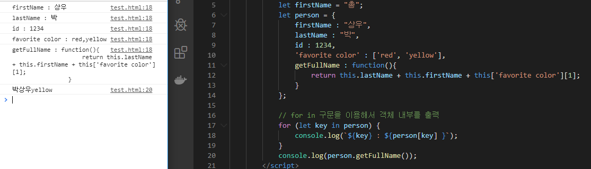

#### 전개연산자

- 마침표 3개 `...` 을 찍어 표기하는 연산자.
- 함수 또는 배열에 적용할 수 있다. 

- 고정된 값과 가변 길이의 매개변수를 분리해서 받을 수 있다. 반드시 입력해야하는 것들은 a,b 와 같이 사용하고 들어와도, 안들어와도 되는것은 values 와 같이 사용한다. 

  

```javascript
<html>
    <head>
        <script src = "https://code.jquery.com/jquery-3.4.1.js"></script>
        <script>
            function test(a,b, ... values){ // 전개연산자는 `반드시 가장 뒤에 딱 하나만 사용` 
                console.log('a',a);
                console.log('b',b);
                values.forEach(i => console.log('values',i));
            }

            test(1,2,3); 
            test(1,2,3,4);
            test(1,2,3,4,5);
        </script>
    </head>
    <body>
    </body>
</html>
```


---

### 객체 


- 중괄호 내부에 객체의 속성 이름 : 속성 값,  ...   -->  `JSON 형식`으로 입력

- 속성(=요소)의 값은 `''` 로 묶어줘도 되고 안묶어도 되지만, 속성의 이름에 공백이 들어갈 경우에는 무조건 `''` 을 써야한다.

- 객체 내부의 값에 접근하기 위해서는 속성명을 이용하여 접근 . ( 배열은 인덱스를 이용하여 접근 )

  ```javascript
   person.name 			// . 을 이용하여 접근 
   person['name']		// 대괄호를 이용하여 접근할 경우에는 ''을 이용하여 접근해야한다. 
  ```

- 자바스크립트가 제공하는 모든 데이터 타입을 속성으로 사용할 수 있다. 

  

- 객체에 정의되어있는 함수를 '메소드' 라고 한다. 

- 객체 내부에서 가지고 있는 값을 참조할 때는 해당하는 정보의 위치를 나타내는 `this` 를 넣어줘야한다.

  ( 자바스크립트는 `this` 를 생략할 수 없다.  `this` 란 개체가 가지고 있는 속성을 의미. )

  

  ​                                                                                           **↓**

  


- 만약 해당 함수 내에서 찾고자 하는 변수가 없을 경우 최상위 객체 ( 전역변수 ) 에서 값을 찾는다. 

  

- 객체 내부의 값을 참조할때에는 `for in` 구문을 이용한다. 

  

- 특정 객체 안에 내가 찾는 값이 있는지 찾을 때 사용하는 키워드는 `in ` 사용 . 

  

- 동일 객체애 대해서 참조가 반복해서 일어나는 경우 이 객체를 지정하지 않도록 사용하는 `with` 가 있다 .

  

- 객체의 속성들은 마음대로 집어 넣을 수 있다. ( 만약 넣는 속성이 해당 객체에 있으면 속성의 값이 바뀌고, 없을 경우 객체에 새로운 속성이 추가된다. )

  

- 객체의 속성은 `delete ` 를 이용하여 제거할 수도 있다. 또한 아무것도 가지고 있지 않은 빈 객체를 생성하고 속성을 추가할 수도 있다. 

  


#### 객체와 배열을 사용한 데이터 관리	

```javascript
	let students = [];
    students.push({ name: 'aaa', korean: 46, math: 65, english: 25, science: 64 });
    students.push({ name: 'bbb', korean: 56, math: 63, english: 85, science: 62 });
    students.push({ name: 'ccc', korean: 56, math: 63, english: 22, science: 43 });
    students.push({ name: 'ddd', korean: 12, math: 25, english: 26, science: 23 });
    students.push({ name: 'eee', korean: 18, math: 85, english: 25, science: 25 });
    students.push({ name: 'fff', korean: 32, math: 22, english: 79, science: 25 });
    students.push({ name: 'ggg', korean: 52, math: 26, english: 42, science: 42 });
    students.push({ name: 'hhh', korean: 22, math: 25, english: 41, science: 56 });
    students.push({ name: 'iii', korean: 87, math: 79, english: 25, science: 86 });
    students.push({ name: 'jjj', korean: 24, math: 42, english: 71, science: 88 });

            // 학생별 총점, 평균점을 구하는 메소드를 추가
            students.forEach(student => {
                console.log(typeof student );
                console.log(student);
                // 총점을 구하는 메소드를 추가 
                student.getSum = function(){
                    return this.korean + this.math + this.english + this.science;
                };
                // 평균점을 구하는 메소드를 추가 
                student.getAverage = function(){
                    return this.getSum() /4 ;
                };
            });
            // 학생별 총점, 평균점을 출력
            students.forEach(student => {
               // console.log(`이름 : ${student.name}, 총점 : ${student.getSum()}, 평균점 : ${student.getAverage()}` );
               with(student){
                   console.log(`이름 : ${name}, 총점 : ${getSum()}, 평균점 : ${getAverage()}`);
               }
            });
```

- students.push 를 하면 객체가 하나씩 저장된다. 

#### 함수를 사용한 객체 생성 


#### 옵션 객체 

- **옵션객체** : 함수의 매개변수로 전달되는 객체로서, 기본 매개변수처럼 값을 입력하지 않으면 초기화해주는 과정이 필요합니다. 

- 만약 초기화해주는 과정이 없을 경우 오류가 발생. 

  

  ​																							▼

  

- 따라서 옵션 객체를 사용할 경우에는 초기화 해주는 과정이 무조건 필요하다 !! 

  

  


#### 참조 복사와 값 복사 

- 값 그자체가 들어가있는 타입  -> value 타입	
- 값의 주소를 가지고 있는 타입 -> reference 타입 


배열은 실제 데이터의 크기가 어떻게 될지 알수 없기때문에 실제 데이터가 저장되어있는 주소를 가지고 있고, 실제 데이터는 다른 곳에 저장한다. 


- **깊은 복사** : 실제 값이 복사되는 것. 
- **얕은 복사** : 값이 저장되어있는 주소영역을 복사. 필요에 따라 얕은 복사는 성능에 영향을 준다. ( 성능이 향상되는 이점이 있다. )


#### 전개 연산자를 사용한 배열 테크닉 

- 전개 연산자를 이용해 배열을 할당하면 깊은 복사가 일어난다. 배열의 값을 복사할 때 for루프를 돌리지 않아도 된다. 

  

- 전개 연산자를 이용하여 배열을 병합할 수 있다. 

  

- 전개 연산자를 이용하여 객체의 깊은 복사를 할 수 있다. 

  