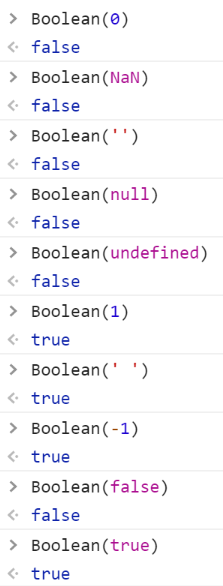
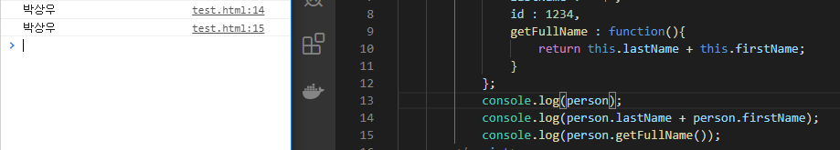
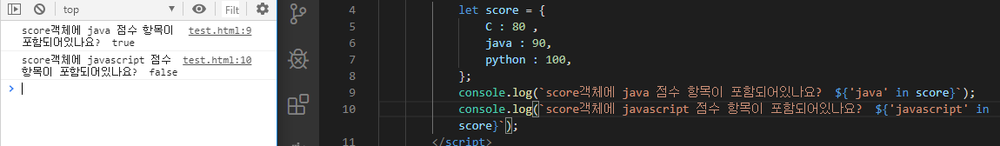
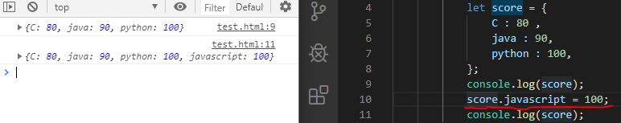
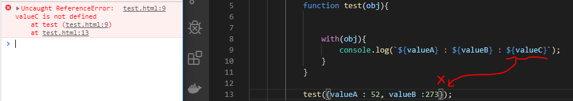
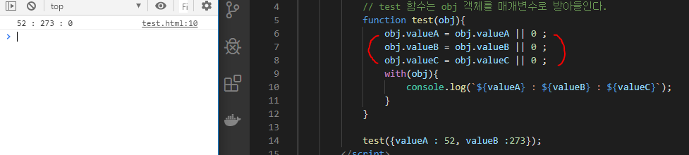

### 식별자 

- 자바스크립트에서 이름을 붙일 때 사용. 
- 식별자 생성 시 규칙
  - 키워드 사용불가	
  - 숫자로 시작하면 불가
  - 특수 문자 _ 과 $ 만 허용 
  - 공백 문자 포함 불가 
- 자바 스크립트 개발자가 식별자를 만들 때 지키는 관례 
  - 생성자 함수의 이름은 대문자로 시작 
  - 변수와 인스턴스, 함수, 메서드의 이름은 **항상 소문자**로 시작
  - 식별자가 여러 단어로 이루어지면 **각 단어의 첫 글자는 대문자** . 
- 자바 스크립트의 식별자 종류 

| 구분                  | 단독으로 사용 | 다른 식별자와 사용 |
| --------------------- | ------------- | ------------------ |
| 식별자 뒤에 괄호 없음 | 변수          | 속성               |
| 식별자 뒤에 괄호 있음 | 함수          | 메서드             |


---

### 주석 

- 프로그램 진행에 영향을 끼치지 않음 

- 코드의 특정 부분을 설명. 

- HTML 내에서 주석 

  ```html
  <html>
      <!-- -->			//왼쪽과 같은 방식으로 문자열을 감싸 생성. 
  </html>
  ```

- 자바스크립트 주석 

  ```javascript
   // 를 사용해 한 줄 주석 표현 
  
   /*  */ 를 사용해 여러 줄 주석 표현 .
  ```


---

### 문자열 이스케이프 방법 


- 특수한 기능을 수행하는 문자 

- 따옴표를 사용하고 싶을 때 이스케이프 문자를 사용 

- \ 를 escape 문자라고 한다. ( **escape** - 의미 문자에서 의미를 제거 하고 문자 그 자체로 인식되도록 하는 것 )

  **의미문자 ( meta-character )** : 특별한 용도와 의미를 가지고 있는 문자

- escape 하는 방법 

  1. 이스케이프 문자를 이용  :  `\`
  2. 약속(규칙)에 따라서 변형을 한다. 일반적으로 `encoding` 한다고 얘기한다. 
  3. 백틱(` : 숫자 1 왼쪽 옆에 있는 글자 )을 활용하는 방법. 

| 이스케이프 문자 | 설명        |
| --------------- | ----------- |
| \t              | 수평 탭     |
| \n              | 줄바꿈      |
| \\'             | 작은 따옴표 |
| \\"             | 큰 따옴표   |
| \\\\            | 역 슬래시   |


---


### 비교연산자 타입별, 상황별 


---


### false 값을 가지는 것 


**0, NaN, '', null, undefined ⇒ false로 변환**

나머지 ⇒ true로 변환



---

### 객체 

- 중괄호 내부에 객체의 속성 이름 : 속성 값,  ...   -->  `JSON 형식`으로 입력
- 속성(=요소)의 값은 `''` 로 묶어줘도 되고 안묶어도 되지만, 속성의 이름에 공백이 들어갈 경우에는 무조건 `''` 을 써야한다.

- 객체 내부의 값에 접근하기 위해서는 속성명을 이용하여 접근 . ( 배열은 인덱스를 이용하여 접근 )

  ```javascript
   person.name 			// . 을 이용하여 접근 
   person['name']		// 대괄호를 이용하여 접근할 경우에는 ''을 이용하여 접근해야한다. 
  ```

- 자바스크립트가 제공하는 모든 데이터 타입을 속성으로 사용할 수 있다. 

  

- 객체에 정의되어있는 함수를 '메소드' 라고 한다. 

- 객체 내부에서 가지고 있는 값을 참조할 때는 해당하는 정보의 위치를 나타내는 'this' 를 넣어줘야한다. 

  ( 자바스크립트는 `this` 를 생략할 수 없다.  `this` 란 개체가 가지고 있는 속성을 의미. )

  

  ​																					▼

  

- 만약 해당 함수 내에서 찾고자 하는 변수가 없을 경우 최상위객체(전역변수)에서 값을 찾는다. 

  

- 객체 내부의 값을 참조할 때에는 `for in` 구문을 이용한다. 

  

- 특정 객체 안에 내가 찾는 값이 있는지 찾을 때 사용하는 키워드는 `in` 사용. 

  

- 동일 객체애 대해서 참조가 반복해서 일어나는 경우 이 객체를 지정하지 않도록 사용하는 `with` 가 있다 .

  

- 객체의 속성들은 마음대로 집어 넣을 수 있다. ( 만약 넣는 속성이 해당 객체에 있으면 속성의 값이 바뀌고, 없을 경우 객체에 새로운 속성이 추가된다. )

  

  

----


### 기본값, 전개 연산자 

- 마침표 3개 `...` 을 찍어 표기하는 연산자.

- 함수 또는 배열에 적용할 수 있다. 

- 고정된 값과 가변 길이의 매개변수를 분리해서 받을 수 있다. 반드시 입력해야하는 것들은 a,b 와 같이 사용하고 들어와도, 안들어와도 되는것은 values 와 같이 사용한다. 

   

```html
<html>
    <head>
        <script src = "https://code.jquery.com/jquery-3.4.1.js"></script>
        <script>
            function test(a,b, ... values){ // 전개연산자는 `반드시 가장 뒤에 딱 하나만 사용` 
                console.log('a',a);
                console.log('b',b);
                values.forEach(i => console.log('values',i));
            }

            test(1,2,3); 
            test(1,2,3,4);
            test(1,2,3,4,5);
        </script>
    </head>
    <body>
    </body>
</html>
```


#### 

- **옵션객체** : 함수의 매개변수로 전달되는 객체로서, 기본 매개변수처럼 값을 입력하지 않으면 초기화해주는 과정이 필요합니다. 

- 만약 초기화해주는 과정이 없을 경우 오류가 발생. 

  

  ​																							▼

  

- 따라서 옵션 객체를 사용할 경우에는 초기화 해주는 과정이 무조건 필요하다 !! 

  

  


---


### selector

- DOM 에서 특정위치를 지정(선택) 하기 위한 방법 

- CSS 선택자 대부분을 지원 

  - `$("*")` : 전체 선택자, all selector 
  - `$(".class") `: 클래스 선택자 
  - `$("#id") `: 아이디 선택자 
  - `$("element") `: 요소(태그, element) 선택자 
  - `$("selector1, selector2, ..., selectorN") `: 다중 선택자 ( multiple selector )

  

- **$("*")** : 전체 선택자, all selector  

  - HTML 내에 있는 모든 태그들을 다 가져오는 것. 

  


  - **$("body *")** :  후손 선택자 
    - body 태그 안에 있는 모든 태그들.

 

  - **$(".class")** : 클래스 선택자 


  - **$("#id")** : 아이디 선택자 
- id 는 해당 문서에서 **유일**해야한다.


  

  - **$("element")** : 요소(태그, element ) 선택자

  

  

  - **$("selector1, selector2, ... , selectorN")** : 다중 선택자 (multiple selector)


`<p></p>` 태그는 뒤에 공간이 남아도 다음 줄로 넘어가지만, 

`<span></span>` 태그는 뒤에 공간이 남으면 계속 이어서 쓴다. 


#### 자식 선택자, 후손 선택자

https://api.jquery.com/child-selector/


**자식 선택자** :  $("parent > child") - 부모 바로 밑에 있는 태그 선택 

**후손 선택자** : $("parent child") - 부모 밑에 있는 모든 태그 선택


- body 밑에 있는 모든 태그들은 후손. 

- body 바로 밑에 있는 태그는 자식. 


#### 속성 선택자

- `element이름[속성이름='속성값']`

- `<form>` 아래에서 사용하는 사용자 입력을 처리하는 태그를 제어할 때 사용한다. 

- <input type="text"> <input type="number"> <input type="radio"> ...

```html
**** html ****

<!--
	<태그명 속성명 = "속성값" 속성명="속성값">태그값</태그명>
	태그 -> element
	속성 -> attribute 
-->
```


https://api.jquery.com/category/selectors/attribute-selectors/

- jQuery 속성 선택자 

| 선택자 형태 | 설명                                     |
| ----------- | ---------------------------------------- |
| E[A=V]      | 속성과 값이 같은 문서 객체를 선택        |
| E[A!=V]     | 속성 값에 '단어'와 다른 문서 객체를 선택 |
| E[A~=V]     | 속성값에 '단어'를 포함하는 객체를 선택   |
| E[A^=V]     | 속성값이 '글자'로 시작하는 객체를 선택   |
| E[A$=V]     | 속성값이 '글자'로 끝나는 객체를 선택     |
| E[A*=V]     | 속성값에 '글자'를 포함한 객체를 선택     |


---


### jQuery 시작문 


---


### create-react-app  / ReactDOM.render() 


---


### JSX 구문과 createElement 사이의 변환 


---


### JSX 구문 - 태그는 반드시 닫아야함 


---


### props 와 state 활용 


---

### react component 작성 


