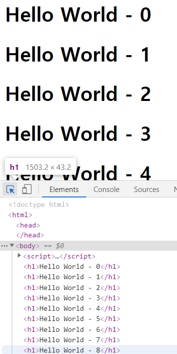
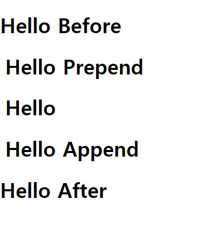
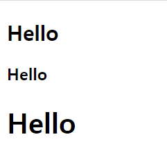
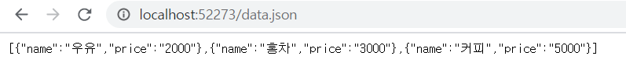

# 목차 

[TOC]


# PART 1  - JAVA SCRIPT 

# 1강_개발 환경과 파일생성 및 실행 방법

- 텍스트 에디터 필요 (visual code)
- 프로그래밍 언어로 작성된 파일을 실행할 수 있는 실행기가 필요 (Chrome)


통합 개발 환경이란 텍스트 에디터와 실행기가 같이 동작하는 환경. 


개발 환경 테스트 

```html
<!DOCTYPE html>
<html>
	<head>
		<meta charset=" -8">
		<title>JavaScript연습</title>
        <script>
            alert("Hello World ~! ");
        </script>
	</head>
	<body >
	</body>
</html> 
```


# 2강 기본 용어 정리와 출력 


### 2.1.1 표현식과 문장 

- 값을 만들어내는 간단한 코드를 '표현식'


### 2.1.2 키워드 

- 처음 만들어질 때 정해진 특별한 의미가 있는 단어를 '키워드'

|          |          |            |        |
| -------- | -------- | ---------- | ------ |
| break    | else     | instanceof | true   |
| case     | false    | new        | try    |
| catch    | finally  | null       | typeof |
| continue | for      | return     | var    |
| default  | function | switch     | void   |
| delete   | if       | this       | while  |
| do       | in       | throw      | with   |


### 2.1.3 식별자

- 자바스크립트에서 이름을 붙일 때 사용하는 단어 (변수, 속성, 함수, 메서드)
- 식별자 생성 시 규칙
  - 키워드 사용불가	
  - 숫자로 시작하면 불가
  - 특수 문자 _ 과 $ 만 허용 
  - 공백 문자 포함 불가 
- 자바 스크립트 개발자가 식별자를 만들 때 지키는 관례 
  - 생성자 함수의 이름은 대문자로 시작 
  - 변수와 인스턴스, 함수, 메서드의 이름은 **항상 소문자**로 시작
  - 식별자가 여러 단어로 이루어지면 **각 단어의 첫 글자는 대문자** . 
- 자바 스크립트의 식별자 종류 

| 구분                  | 단독으로 사용 | 다른 식별자와 사용 |
| --------------------- | ------------- | ------------------ |
| 식별자 뒤에 괄호 없음 | 변수          | 속성               |
| 식별자 뒤에 괄호 있음 | 함수          | 메서드             |


### 2.1.4 주석 

- 프로그램 진행에 영향을 끼치지 않음 

- 코드의 특정 부분을 설명. 

- HTML 내에서 주석 

  ```html
  <html>
      <!-- -->			//왼쪽과 같은 방식으로 문자열을 감싸 생성. 
  </html>
  ```

- 자바스크립트 주석 

  ```javascript
   // 를 사용해 한 줄 주석 표현 
  
   /*  */ 를 사용해 여러 줄 주석 표현 .
  ```


## 2.3 문자열 자료형 

- 문자열 자료형을 생성하는 방법 `''` 또는 `""` 으로 감싸준다.

- 문자열은 `+` 을 이용하여 연결 처리를 할 수 있다. 

  

### 이스케이프 문자

- 특수한 기능을 수행하는 문자 

- 따옴표를 사용하고 싶을 때 이스케이프 문자를 사용 

- \ 를 escape 문자라고 한다. ( **escape** - 의미 문자에서 의미를 제거 하고 문자 그 자체로 인식되도록 하는 것 )

  **의미문자 ( meta-character )** : 특별한 용도와 의미를 가지고 있는 문자

- escape 하는 방법 

  1. 이스케이프 문자를 이용  :  `\`
     2. 약속(규칙)에 따라서 변형을 한다. 일반적으로 `encoding` 한다고 얘기한다. 
              	3. 백틱(` : 숫자 1 왼쪽 옆에 있는 글자 )을 활용하는 방법. 

- | 이스케이프 문자 | 설명        |
  | --------------- | ----------- |
  | \t              | 수평 탭     |
  | \n              | 줄바꿈      |
  | \\'             | 작은 따옴표 |
  | \\"             | 큰 따옴표   |
  | \\\\            | 역 슬래시   |


예시) 

```html
<!DOCTYPE html>
<html>
	<head>
		<meta charset="utf-8">
		<title>JavaScript연습</title>
        <script>
            console.log("동해물과 백두산이 마르고 닳도록");
            console.log("동해물과 백두산이\n 마르고 닳도록");
            console.log("동해물과 백두산이\t 마르고 닳도록");
        </script>
	</head>
	<body >
	</body>
</html> 
```


## 2.4 숫자 자료형 

- 자바스크립트에서는 정수와 실수 2가지만 다룬다. 

- `+`,`-`,`x`,`%`,`/` 를 사용가능. 

- 자바스크립트에서는 음수로 나눈다면 앞에 있는 숫자를 따라가게 된다.

  ```html
  <script>
  	console.log(10%3);     // 1 
  	console.log(10%-3);    // 1
  	console.log(-10%3);    // -1 
  	console.log(-10%-3);   // -1
  </script>
  ```

- 너무 큰 숫자를 사용할 경우 작은 숫자를 무시한다 (부동소수점의 특성)

- 자바스크립트에서는 오버플로우가 따로 없다.  엄청 큰 숫자가 되었을 경우 infinite 로 바뀌게 된다. 


## 2.5 불 자료형 

- 참과 거짓을 나타내는 값. 
- 자바스크립트는 `true`, `false` 로 소문자로 사용한다. 

```html
<script>
	// 비교 연산자 
    52 >= 273	// false 
    52 <= 273 	// true	
    52  < 273 	// false
    52  < 273  	// true	
    52 == 273 	// false
    52 != 273 	// true
</script>
```

- 비교연산자는 숫자 뿐만 아니라 문자도 할 수 있다. (사전순)

  ```javascript
  '가' > '나' ;  // false
  ```

  

### 자바스크립트 논리연산자의 종류

| 연산자 | 설명                                                     |
| ------ | -------------------------------------------------------- |
| !      | 논리 부정 연산자 ( 참 -> 거짓, 거짓 -> 참 ) - 단항연산자 |
| &&     | 논리곱 연산자                                            |
| \|\|   | 논리합 연산자                                            |


## 2.6 변수 

- 값을 저장할 때 사용하는 식별자 

- 변수를 사용하려면 ? 

  1. 변수 선언 : 변수를 만듬 
  2. 변수에 값 할당 (초기화)

- 변수 선언 방법

  - `let` 은 변수 값을 수시로 바꿀 수 있다. 

  - `const` 는 처음에 설정한 값 말고는 쓸 수 없다. ( == 상수형 변수 ) 

    `const` 는 선언하면서 할당을 해줘야한다. 

- 자료형 

  - 문자열,숫자,불리언,함수,객체와 같은 것 

  - JavaScript 에는 총 6가지 자료형이 있음 

    -cf. undefined 자료형 

    ​	-> 선언되지 않거나 할당되지 않은 변수 

    ​	-> 변수에 저장해도 의미가 없음. 


- ```
  10 + 10  // 덧셈 연산 : 숫자 덧셈 연산 
  
  message + message // 연결 연산 : 문자열 덧셈 연산
  ```

  

 

### 2.6.2 복합 대입 연산자 

- ```html
  <script>
  	radius = radius + 10
  	radius += 10  // 위와 아래 코드는 동일 
  <script>
  ```


### 2.6.3 증감 연산자 

- ```html
  <script>
      var radius = 10 ; 
  	console.log(radius++) // 후위
      console.log(++radius) // 전위 
  </script>
  ```

  


## 2.7 자료형 검사 

- 자바스크립트는 `typeof` 를 이용하여 자료형을 검사한다. 

  `typeof` 는 키워드이자  연산자이다.  

  ```html
  <script>
      console.log(typeof 273); 
      console.log(typeof 'String'); 
      console.log(typeof true); 
      console.log(typeof({}));
      console.log(typeof( () =>{} )); 
      console.log(typeof(alpha));
  </script>
  ```

  

  


## 2.9 입력 

- `prompt` 함수를 사용 .( 첫번째 매개변수에 메세지, 두번째 매개변수에 초기값)

  문자열을 입력 받는다. 

  ```html
  <script>
      var output = prompt('메시지', '디폴트'); 
      alert(output);
  </script>
  ```

  

- `confirm` 함수를 통해 bool 을 입력받을 수 있다. (실행이 될 경우 true 가 되거나 false 가 된다. )

  ```html
  <script>
      var output = confirm('메시지'); 
      alert(output);
  </script>
  ```

  

  


## 2.10 숫자와 문자열 자료형 변환 


### 자료형 변환

- **강제 자료형 변환**  : 개발자가 원하는 시점에 특정한 코드로 자료형 변환

  - `Number ()`

    1. 숫자처럼 생긴 문자열 변환 

       ```html
       Number('273'); // 273
       ```

    2. 숫자처럼 생기지 않은 문자열 변환

       숫자로 변환되기는 하나 **NaN**: Not a Number 이라는 값으로 변환

       ```
       Number('안녕하세요');   // NaN
       ```

    3. 불을 변환 

       ```html
       Number(true);   // 1
       number(false);  // 0
       ```

  - `String` 

    1. 숫자를 문자열로 변환

       ```html
       String(273);     //  273
       String(52.273);  //  52.273
       String(NaN);	 //  NaN
       ```

    2. 불을 문자열로 변환 

       ```html
       String(true); 	// 	true	
       String(false); 	//	false
       ```

  - `Boolean`

    ```html
    Boolean(0); 		//false
    Boolean(NaN);		//false 
    Boolean(''); 		//false
    Boolean(null); 		//false
    Boolean(undefined); //false
    ```

    위의 다섯가지 경우를 제외한 나머지는 모두 `true` 로 변환 

    

- **자동(암묵적) 자료형 변환** : 프로그래밍 언어가 내부적으로 자동으로 자료형 변환 

  - 연산자와 함께 사용 했을 때 자료형 변환 	

    - <어떤 자료형> + ""   : 앞의 자료형은 무조건 문자열로 변한다.

      ```html
      52 + "273"	 =>   "52273"
      ```

    - 숫자로 자동 변환되는 연산자는 `-`,`*`,`/`,`%` 

      ```html
      "52273" - 10   =>  52263
      ```

    - 논리 부정 연산자 `!` 를 사용할 경우 자동으로 변환

      ```html
      !true  // false  
      ```

      

  연습) 

  ```html
  <script>
      console.log(100 + 10	);// 110
      console.log(100 - 10	);// 90
      console.log(100 * 10 	);// 1000
      console.log(100 / 10	);//); 10
      console.log(""); 
      console.log("100" + 10	);// 10010
      console.log("100" - 10	);// 90
      console.log("100" * 10 );	// 1000
      console.log("100" / 10 ); // 10
      console.log(""); 
      console.log(100 + "10"	);// 10010
      console.log(100 - "10"	);// 90	
      console.log(100 * "10"	);// 1000
      console.log(100 / "10"	);// 10
      console.log(""); 
      console.log("100" + "10");// 10010
      console.log("100" - "10");// 90
      console.log("100" * "10");// 1000
      console.log("100" / "10");// 10
  </script>
  ```

  

- 자바스크립트는 자동 자료형의 변환이 다른 프로그램이 언어에 비해 유연하다. 


## 2.12 일치 연산자 

 

- `==` 은 최대한 유연하게 자료를 비교한다. 

  ```html
  <script>
  	console.log(10 == "10"); 	// true
      console.log(0==false) ;  	// true
  </script>
  ```

- `===` , `!==` 은 최대한 유연하지 않게 자료를 비교한다. 

  ```html
  <script>
  	console.log(10 === "10"); 		// false
      console.log(0 !== false) ;  	// false
  </script>
  ```

- `==` , `!=` : 비교 연산자 

- `===` , `!==` : 일치 연산자


## 2.13 조금 더 나아가기 


### 2.13.1 템플릿 문자열 - ECMAScript6


- 백틱과 `${}` 을 이용하여 보다 쉽게 표현 

  ```html
  <script>
      alert('표현식 273 + 27의 값은' + (273+27) + '입니다'); 
      alert(`표현식 273 + 27의 값은 ${273+27} 입니다. `);
  </script>
  ```


#### var - let - const  차이점

- var 키워드는 let 으로 대체가 가능하다. 

  - let 과 var 의 가장 큰 차이 

    `let ` 키워드는 오류를 조금 더 일으켜 개발자의 실수를 줄이는 것. 

- `const` 키워드는 변하지 않는 값을 의미하며 선언할 때 값을 넣어줘야 하고 이후 변경하면 안된다. 

  

- **호이스팅** - var 선언문이나 function 선언문 등을 해당 스코프의 선두로 옮긴 것처럼 동작하는 특성 

  자바스크립트는 ES6 에서 도입된 let, const 를 포함하여 모든 선언(var, let, cosnt, function, function* class) 를 호이스팅한다. 

  반면 var 로 선언된 변수와는 달리 let 으로 선언된 변수를 선언문 이전에 참조하면 참조 에러 발생 

  ```html
  <script>
      console.log(foo); // undefinedz
      var foo; 
  
      console.log(bar); // Error: Uncaught ReferenceError: bar is not defined
      let bar;  // 선언 이전에 참조할 경우 참조 에러 발생 
  </script>
  ```

  


# 3강 조건문 

- 조건을 판별하는 문장. 


## 3.1 if 문 

- `if( <불표현식> ){   }`

  예시) 

  ```html
  <script>
      let date = new Date(); 
      let hours =  date.getHours(); 
  	// 주의 ) 대부분의 프로그래밍 언어에서 '월'을 셀경우에는 0부터 센다. 
      // 현재 시간이 12시 이전 
      if(hours <12 ){
          alert('오전'); 
      }
  
      if(hours >= 12){
          alert('오후');
      }
  </script>
  ```

- `if(<불표현식>) {  }  else {  } ` 

- `if(<불표현식>) {  } else if(<불 표현식>) {   }  else {   } ` 


## 3.2 switch 조건문 

- ```html
  <script>
  	switch(<표현식>){
             case <값> : 
             			<문장>
             			break;
             case <값2> : 
             			<문장>
             			break; 
             case <값3 	> : 
             			<문장>
             			break;            
             default : 
             			<문장>
             			break; 
      }
  </script>
  ```

- `break` 가 없을 경우 아래로 계속 내려간다. 따라서 탈출하기 위해서는 넣어줘야한다.

  예시 ) 

  ```html
  <script>
      var input = 5; 
  
      switch(input%2){
          case 0 : 
              console.log('짝수'); 
              break;
          case 1 : 
              console.log('홀수');
              break; 
          default :
              console.log('숫자가 아닙니다.'); 
              break; 
      }
  </script>
  ```

  

  


## 3.3 삼항 연산자 

- 항이 3개라는 의미로, 조건부 연산자를 의미. 

```html
<script>
    var input = prompt('숫자를 입력해주세요',''); 
    var number = Number(input); 

    (number >0 ) ? alert('자연수') : alert('자연수 아니다'); 

</script>
```


## 3.4 짧은 조건문 


- <불표현식> ||  <불 표현식이 거짓일 때 사용하는 문장>
- <불 표현식> && <불 표현식이 참일 대 사용하는 문장> 

```html
<script>
    var number = Number(prompt('숫자를 입력해주세요','')); 
    (number > 0) || alert('자연수가 아닙니다.') ;
    (number > 0) && alert('자연수 입니다.'); 
</script>
```


# 4강 반복문 


## 4.2 배열 


- 배열 만들기 

  `[]` 를 사용하고 내부 자료를 `,` 를 통해서 구분. 

  ```
  var array = [10,20,30,40,50,60]; 
  ```

- 자바스크립트에서는 내부 배열 요소를 통일할 필요가 없다. 

  ```html
  <script>
      var array = [10,20,30,40,50,60]; 
      
      // 배열 뒤에 요소를 추가 
      array.push(70); 
      array.push(80); 
      
      array[array.length] = 90; 
      
      console.log(array);  // [10,20,30,40,50,60,70,80,90]
      
      // 배열의 요소를 제거 
      array.splice(1,1);  // 시작위치, 개수 
      console.log(array); // [10,30,40,50,60,70,80,90]
  </script>
  ```

  


## 4.3 while반복문


- ```html
  <script>
  	while(<불표현식>){
          
      }
  </script>
  ```


## 4.4 for 반복문 


- ```html
  <script>
  	for(초기식; 조건식; 종결식; ){
          문장
      }
  </script>
  ```

  

## 4.6 for in 반복문 

- 배열 내부에 있는 요소를 조금 더 간편하게 사용하기 위한 반복문

- ```html
  <script>
  	var array = ["과자", "사탕", "젤리"] ;
      for (let i in array){
          console.log(array[i]);
      }
  </script>
  ```


## 4.8 break 키워드 

- 반복문을 벗어날 때 사용하는 키워드


```html
<!-- 예시 -->
<script>
	while(true){
        if(confirm('종료할래?')){
            break; 
        }
    }
</script>
```


## 4.9 continue 키워드 

- 반복문의 다음 반복문을 실행하기 위해 사용하는 키워드 


```html
<!-- 예시 -->
<script>
	for(let i=0; i<10; i++){
        if(i%2 ==0){ // 짝수라면 
            continue; 
        }
        alert(i); 
    }
</script>
```


## 4.10 for of 반복문 


- ```html
  <script>
      var array = ["과자", "사탕", "젤리"] ;
  	for(let item of array){
          console.log(item); 
      }
  </script>
  ```


# 5강 함수 


## 함수 생성하기 

- 이름 있는 함수를 만드는 방법 

  `function name() { }  `  : 유명함수 (선언적 함수)

- 이름 없는 함수를 만드는 방법 

  `function () {  } `  : 익명함수 


```html
<script>
	function testA () { 
    	// 함수의 내용 
    }
    let testB = function () {
        // 함수의 내용
    } ;
    
    console.log(testA); 
    console.log(testB); 
</script>
```


- 이름있는 함수와 이름 없는 함수의 차이 

  선언적 함수는 스크립트 태그문을 읽을 때 먼저 실행되지만, 익명함수는 해당 줄을 읽을 때 먼저 실행된다. 

```html
<script>
    let test = function () { alert("B입니다. ")}; 
    function test() { alert("A입니다"); }
    
    test(); 
</script>
```

```html
<script>
    function test() { alert("A입니다"); }
    let test = function () { alert("B입니다. ")};    
    
    test(); 
</script>
```

위의 두개의 결과 모두 "B입니다" 를 출력. 


## 5.3 매개변수


- 매개변수 : 함수에 넣어 주는 값 
- 리턴 값 : 함수를 실행하면 반환하는 값 

```html
<script>
    function f(x){
        return x*x; 
    }

    let output = f(3); 
    alert(output) ; 
</script>
```

 

- 매개변수를 넣지 않을 경우 값은 `undefined` 로 설정된다. 
- 매개변수보다 더 많은 값을 넣을 경우 앞에서부터 순차적으로 들어간다. 

```html
<script>
    function f(x,y,z){
        console.log(x); 
        console.log(y); 
        console.log(z); 
    }

    f(); 
    f(1,2,3,4,5,6,7,8,9);
</script>
```


```html
<script>
	console.log(Array()); 
    console.log(Array(10)); 
    console.log(Array(1,2,3,4,5,6,7,8,9));
</script>
```


### 가변 매개변수 `arguments` 

- 매개변수로 들어간 값이 마치 배열처럼 적용된다. 

- 가변 매개변수는 for in 반복문을 적용할 수 없다. 

```html
<script>
	function sumAll() {
        for (let i=0; i<arguments.length; i++)
            console.log(arguments[i])
    }
   	
    console.log(sumAll(1,2)); 
    console.log(sumAll(1,2,3,4)); 
    console.log(sumAll(1,2,3,4,5,6,7,8,9,10));
</script>
```


- **함수를 사용하는 이유** 

   	1. 코드를 입력하는 양이 줄어든다.
      	2. 수정했을 때 실수 없이 수정할 수 있다. 
              	3. 가독성이 좋아진다. 
            	4. 재사용이 가능하다. 


## 5.6 리턴 값 


- 함수를 호출했던 위치로 돌아가라는 의미. 

- `return` 을 만나게 되면, 함수는 곧바로 종료가 된다. 

```html
<script>
    function findNumber(array, number){
        
        if(!Array.isArray(array)) return ; 		// 조기 리턴
        if(typeof(number) != "number") return ; // 조기 리턴
        
        for (let i=0; i<array.length; i++){
            if(array[i] == number)
                return i; 
        }
    }

    let output = findNumber([1,2,3,4,5,6,7,8,9], 4); 
    console.log(output);
</script>
```


## 5.8 콜백 함수 


- 매개변수로 전달하는 함수

```html
<script>
    // 매개변수로 들어온 함수를 10번 실행 
    function callTenTimes(callback){
        for(let i=0; i<10; i++)
            callback(); 
    }

    function testA(){
        console.log("testA함수입니다");
    }

    callTenTimes(testA); 
    callTenTimes(function (){
        console.log("testB함수입니다")
    }); 
</script>
```


- 일반적으로 콜백함수를 가장 마지막에 써준다. 

```html
<script> 
    // 매개변수로 들어온 함수를 10번 실행 
    function callTenTimes(n,callback){
        for(let i=0; i<n; i++)
            callback(); 
    }

    function testA(){
        console.log("testA함수입니다");
    }

    callTenTimes(10,testA); 
    callTenTimes(20,function (){
        console.log("testB함수입니다")
    }); 
</script>
```


## 5.9 함수를 리턴하는 함수 


```html
<script>
    function returnFunction(){
        return function() {
            console.log("hello Function..! ")
        }
    }

    returnFunction()();
</script>
```


## 5.10 클로저 


- 장점1 . 변수를 보호할 수 있다.
- 장점2 . 한 번에 여러 변수를 선언하고 활용할 수 있다. 

```html
<script>
    function returnFunction(){
        let a = 10; 
        let b = 20; 
        let c = 30; 

        return function(){
            console.log(a); 
            console.log(b); 
            console.log(c); 
        }
    }

    returnFunction()();
</script>
```


## 5.11 자바스크립트 내장 함수 


- 자바스크립트 내에 탑재되어 있는 기본 함수 


- setTimeout() : 특정 시간 후에 함수를 1번만 실행하는 함수 
- clearTimeout() 

```html
<script>	
    let id = setTimeout(function () {
        alert('1초가 지났다.');
    },1000);	

    clearTimeout(id);  // setTimeout() 으로 설정한 타이머 제거
</script>
```


- setInterval()  : 계속 반복 

- clearInterval() 

```html
<script>	
    let id = setInterval(function(){
        alert('1초마다 실행')
    },1000);

    setTimeout(function(){
        clearInterval(id); 
    },3000);
</script>
```


- 인코딩 ( Encoding )

- 디코딩 ( Decoding ) 

  

```html
<script>
    let a = escape("초콜릿")
    let b = unescape(a); 

    console.log(a); 
    console.log(b); 
</script>
```


- `isFinite()`  : 셀 수 있을 경우 true , 셀 수 없을 경우 false 

  ```html
  <script>
      console.log(isFinite(10/0)); 
      console.log(isFinite(-10/0));
      console.log(isFinite(10)); 
      console.log(isFinite(Number.MAX_VALUE));
      console.log(isFinite(Number.MIN_VALUE));
  </script>
  ```

  

- `isNaN ()` : NaN 일 경우 true, 아닐 경우 False 

- `is` 로 시작하는 함수는 대체적으로 True 나 False 를 반환. 


- `parseInt()` 
- `parseFloat()` 

```html
<script>
	console.log(parseInt("200가나다라")); 		// 200
    console.log(parseFloat("52.273가나다라")); 	// 52.273
</script>
```


## 5.12 조금 더 나아가기 


### 5.12.1 자바스크립트의 실행 순서 

```html
<script>
    // A를 출력해야겠다. 
    alert('A'); 

    // 뭔지는 모르겠지만 0초 후에 실행을 해야한다 => 기록/예약 걸어둔다
    setTimeout(function(){
        alert('B')
    },0); 

    // C를 출력해야겠다. 
    alert('C'); 

    // 예약된걸 확인 : B 를 출력해야겠다. 

    // A -> C -> B 
</script>
```

```html
<script>
    // A를 출력해야겠다. 
    alert('A'); 

    // 뭔지는 모르겠지만 0초 후에 실행을 해야한다 => 기록/예약 걸어둔다
    setTimeout(function(){
        alert('B')
    },0); 

    // C를 출력해야겠다. 
    alert('C'); 
	
    // 무한 반복 
    while(true) {}
    
    // 실행 끊김 
    // A -> C  ( B는 실행 안된다. )
</script>
```


### 5.12.2 반복문과 콜백함수 

```html
<script>
	// let const var   
    // var 전역변수를 선언하는 키워드 
    for(var i=0; i<3; i++){
        // i=0
        // 예약을 걸고! 
        // i=1
        // 예약을 걸고! 
        // i=2
        // 예약을 걸고    
        setTimeout(function(){alert(i); },0); 
    }
    // i=3
    //    function(){ alert(3)}; 
    //	  function(){ alert(3)}; 
	//    function(){ alert(3)}; 
    // 계속 3만 출력 . 
</script>
```


- 1번째 방법

```html
<script>
	// let const var
    // 스코프 내부에서만 작동하는 변수를 선언 
    for(let i=0; i<3; i++){
        // i=0
        // 예약을 걸고! 
        // i=1
        // 예약을 걸고! 
        // i=2
        // 예약을 걸고    
        setTimeout(function(){alert(i); },0); 
    }
</script>
```

- 2번째 방법 

```html
<script>
	for(var i=0; i<3; i++){
        (function(i){
            setTimeout(function() {
                alert(i); 
            },0);
        })(i);     // 클로저 형성  
    }
</script>
```


### 5.12.3 기본 매개변수 

```html
<script>
    // ECMAScript5 
	function test(a,b,c){
        // a 가 undefined => a = 10 
        
        if(typeof(a) == "undefined")  { a=10; } 
        if(!b) {b = 20; } 
        c = c || 30; 
        
        alert(a+b+c); 
    }
    
    function test(a=10, b=20, c=30){
        alert(a+b+c);  // 기본 매개변수는 뒤쪽에 붙여서 사용할 수 있다. 
    }
    
</script>
```


### 5.12.4 화살표 함수 

```html
<script>
	function () {}   
    () => { }  
</script>
```

- 화살표 함수 내부에서는 arguments 를 사용할 수 없다. 
- 화살표 함수 내부에서는 전개 연산자 (`...`) 을 사용한다. 
  - 전개연산자는 마지막 하나만 사용할 수 있다. 

```html
<script>
    var sumAll = (a,b,...numbers) =>{
        var output = 0 ; 
        for(var i=0; i<numbers.length; i++){
            output += numbers[i]
        }
        return output; 
    }
    
    var array=  [1,2,3,4,5,6,7,8,9] 
    // ECMAScript 5 
    sumAll.apply(null, array); 
    // ECMAScript 6
    sumAll(...array); 
    
    console.log(sumAll(1,2,3,4,5)); 
</script>
```


# 6강 객체 


- 객체는 `{ } ` 를 이용해서 생성. 

- 배열은 인덱스로 접근, 객체는 키로 접근 

```html
<script>
	// 객체 생성 
    var object = {
        키A : "값A", 
        키B : "값B", 
        키C : "값C",         
    } ; 
    
    // 객체 요소 접근 
    object["키A"]
    
    object[키A] // object[undefined]
    
    object.키A
    
    // 반복문 사용 
    for (var i in object)
        alert(object[i]); 
</script>
```


## 6.2 속성과 메서드 


```html
<script>
	// 변수 선언 
    
    var person = {
        naem = '박상우', 
        eat : function (food) {
            alert(this.name + "이" + food + "을/를 먹습니다. ");		// this 를 생략할 수 없다.
        }
    }
    
    person.eat('밥'); 
</script>
```

```html
<script>
	// 변수 선언 
    
    var person = {
        naem = '박상우', 
        eat_a : function (food) {
            alert(this.name + "이" + food + "을/를 먹습니다. ");		// this 를 생략할 수 없다.
        }
    	eat_b : (food) =>{
            alert(this.name + '이' + food + '을/를 먹습니다' ) ; // 화살표 함수는 this 를 바인드 하지 않는다. 
        }
    }
    
    person.eat_a('밥');
    person.eat_b('밥'); 
</script>
```

- `this` 키워드를 사용하기 위해서는 화살표 함수를 사용하면 안된다. 


## 6.4 객체 관련 키워드 


- `<문자열> in <객체>`  : 객체 안에서 해당 문자열이 있는지 확인하는 키워드 

- `with() {  } `  

  


## 6.5 객체의 속성 추가와 제거 


- 속성 추가 

```html
<script>
	var student = {}; 
    
    console.log(student); 
    student.이름 = "박상우" ;	// 동적으로 속성 추가 
    console.log(student); 
</script>
```


- 속성 제거 

  - `delete` 키워드 사용 	

  ```html
  <script>
  	var student = {}; 
     
      student.이름 = "박상우" ;	// 동적으로 속성 추가 
      console.log(student); 
      delete student.이름 
      console.log(student); 
  </script>
  ```


## 6.6 객체와 배열을 사용한 데이터 관리 


- **추상화** : 현실에 있는 객체를 모두 모방하는 것이 아니라 프로그램에 필요한 속성만을 가져와서 객체화 하는 것. 

 

                                                            

​																							▼

```html
<script>
	function createStudent(이름,국어,수학,영어,과학){
        var object = {
            이름 : 이름, 
            국어 : 국어, 
            수학 : 수학, 
            영어 : 영어, 
            과학 : 과학 
        }
        object.getSum = function () {
            return this.국어 + this.수학 + this.영어 + this.과학;    
        }

        object.getAverage = function(){
            return this.getSum()/4 ; 
        }

        object.toString = function(){
            return this.이름 + '\t' + this.getSum() + '\t' + this.getAverage() +'\n'; 
        }
        
         return object; 
    }
</script>
```


## 6.8 참조 복사와 값 복사 

- 두 개의 변수가 완전한 독립성을 갖는 것을 **값 복사** 또는  "**깊은 복사**"라고 부른다. 

```html
<script>
	var originalValue = 10; 
    var newValue = originalValue;
    // 원본 값 변경 
    originalValue = 273; 
    // 출력 
    console.log(originalValue);	// 273 
    console.log(newValue);		// 10
</script>	
```

- 기본 자료형(숫자,문자,불)으로 선언된 값을 value 라고 한다. 

```html
<script>
	var originalArray = [1,2,3,4]; 
    var newArray = originalArray ; 
    // 원본 배열 값 변경 
    originalArray[0] = 273; 
    // 출력 
    console.log(originalArray) ;	// [273,2,3,4]
    console.log(newArray); 			// [273,2,3,4]
</script>
```

- 기본 자료형을 제외한 자료형 (함수, 배열, 객체 등 ..)은 메모리의 주소를 할당한다. 


- 깊은 복사 하는 방법. ( 각각의 요소들을 직접 복사 ) or `clone()` 메서드 사용. 

```html
<script>
	var originalArray = [1,2,3,4] ; // 0x10
    var newArray = [] ; // 0x20
    for(var i=0; i<originalArray.length; i++)
        newArray[i] = originalArray[i]; 
</script>
```


# 7강 


## 7.2 프로토 타입 


- 생성자 함수는 **앞글자를 대문자**로 시작한다. 

```html
<script>
	function Student(이름,국어,수학,영어,과학) {
        this.이름 : 이름, 
        this.국어 : 국어, 
        this.수학 : 수학, 
        this.영어 : 영어, 
        this.과학 : 과학 
    } 	
        
    Student.prototype.getSum= function (){
        return this.국어 + this.수학 + this.영어 + this.과학;    
    }
        
    Student.prototype.getAverage = function(){
       return this.getSum()/4 ; 
    }

    Student.prototype.toString = function(){
       return this.이름 + '\t' + this.getSum() + '\t' + this.getAverage() +'\n'; 
    }
</script>
```

- getSum, getAverage, toString 는 공유된 공간에 선언되었다고 생각해라. 
- 생성자 함수를 호출할 때는 `new` 를 붙여서 호출한다. 
- 생성자 함수로 객체화된 것은 인스턴스 라고 부른다. 


- 위의 프로토 타입을 클래스로 변환한 코드 

```html
<script>
    class Student { 
    	constructor(이름,국어,수학,영어,과학){
            this.이름 : 이름, 
            this.국어 : 국어, 
            this.수학 : 수학, 
            this.영어 : 영어, 
            this.과학 : 과학 
        }
    }

    getSum(){
        return this.국어 + this.수학 + this.영어 + this.과학;    
    }
        
    getAverage(){
       return this.getSum()/4 ; 
    }

    toString(){
       return this.이름 + '\t' + this.getSum() + '\t' + this.getAverage() +'\n'; 
    }
</script>
```


## 7.4 캡슐화 

- 변수를 보호하는 것. 

- 1. 밑줄(`_` ) 로 시작하는 변수는 **"절대 건드리지 말자" 라는 약속** 

- 2. 

  ```html
  <script>
  	function Rectangle(width, height){
          var _width = width ; 
          var _height = height; 
          
          this.getWidth = function (){ 
          	return _width; 
          }
          this.getHeight = function(){ 
          	return _height; 
          }
          this.setWidth = function(value){
              if(value <= 0)	return alert('0보다 작은 값 x ') ; 
              _width = value; 
          }
          this.setHeight = function(value){
              if(value <=0 ) return alert('0보다 작은 값 x'); 
              _height = value; 
          }
      }
      
      Rectangle.prototype.getArea = function(){
          return this._width * this._height; 
      }
      
      var rectangel = new Rectangle(5,7); 
  </script>
  ```

  - 약간의 메모리가 낭비되지만, 변수를 보호하는 역할에 초점. 


- 위의 2가지 약속을 타협하여 아래와 같이 사용 .

  ```html
  <script>
  	function Rectangle(width, height){
          this._width = width ; 
          this._height = height; 
      }
      Rectangle.prototype.getWidth = function (){ 
          	return _width; 
      }
      Rectangle.prototype.getHeight = function(){ 
          return _height; 
      }
      Rectangle.prototype.setWidth = function(value){
          if(value <= 0)	return alert('0보다 작은 값 x ') ; 
          _width = value; 
      }
      Rectangle.prototype.setHeight = function(value){
          if(value <=0 ) return alert('0보다 작은 값 x'); 
          _height = value; 
      }
      Rectangle.prototype.getArea = function(){
          return this._width * this._height; 
      }
      
      var rectangel = new Rectangle(5,7); 
  </script>
  ```

  

## 7.5 상속 

- 부모가 가지고 있는 속성을 자식이 재활용 하겠다. 


# 8강 기본 내장 객체 


## 8.1 기본 자료형과 객체의 차이점 

```html 
<script>
	var primitiveNumber = 273;
    var objectNumber = new Number(273); 
    
    // 출력 
    var output =''; 
    output += typeof(primitiveNumber) + ':' + primitiveNumber + '\n'
    output += typeof(objectNumber) + ':' + objectNumber; 
    alert(output);  
    
    // number : 273
    // object : 273
</script>
```

- 기본 자료형 뒤에 `.` 을 찍으면 **일시적**으로 객체로 변환이 일어나게 돼서 내부에 있는 메서드를 사용할 수 있다. 


- 우리가 원하는 기능을 기본 자료형에 추가해서 일시적으로 사용할 수 있다. 

  ```html
  <script>
  	var primitiveNumber = 273 ; 
      var objectNumber = new Number(273); 
      
      Number.prototype.power = function(){
          return this*this; 
      }
      
      alert(primitiveNumber.power()); 
  </script>
  ```


## 8.2 Object 객체 


- 객체를 생성하는 방법 

  ```html
  <script>
  	var object = {}; 
      var object = new Object(); 
  </script>
  ```

  

- object 는 모든 자바스크립트의 기본 객체의 부모 객체이다. 


- ```html
  <script>
  	var pritimitiveNumber = 273; 
      var objectNumber = new Number(52); 
      
      console.log(typeof(pritimitiveNumber));	// number 
      console.log(typeof(objectNumber)); // object
  </script>
  ```

  자바스크립트의 개발자들은 object 도 숫자로 취급하고 싶어한다. 

  1. `constructor` 객체를 사용한다. 

     ```html
     <script>
         
         function isNumber(value){
             return value.constructor === Number; 
         }
         
     	var pritimitiveNumber = 273; 
         var objectNumber = new Number(52); 
         
         console.log(pritimitiveNumber.constructor);	// number 
         console.log(objectnumber.constructor); // number
         
         console.log(isNumber(pritimitiveNumber)); 
         console.log(isNumber(objectNumber));
     </script>
     ```

  2. `isNumber` 

     ```html
     <script>
         
         function isNumber(value){
             return value.constructor === Number; 
         }
         
     	var pritimitiveNumber = 273; 
         var objectNumber = new Number(52); 
         
         console.log(isNumber(pritimitiveNumber));	// true 
         console.log(isNumber(objectNumber));		// true
     </script>
     ```

     - underscore.js : 자바스크립트의 기본적인 기능을 모두 구현한 녀석 

       

       ```html
       <script>
       	console.log(({}).toString.call(10)); 			// [object Number]
           console.log(({}).toString.call("문자열")); 	  // [object String]
           console.log(({}).toString.call(new Date())); 	// [object Date]
           
           var _ = {}; 
           _["isNumber"] = function (obj){
               return toString.call(obj) === '[object Number]'
           }
       </script>
       ```

       - 객체의 `toString` 메서드는 기본적으로 `[object <현재 자료형>]` 을 출력한다.


### **비파괴적 메서드**  

- 자기 자신을 파괴시키지 않고 사용하는 메서드 

  일반적으로 string 메서드들은 비파괴적 메서드이다. 

```html 
<script>
	var string = "Hello Programming ...! " 
    string.toUpperCase() // 비 파괴적 메서드 이기 때문에 그냥 나온다 
    console.log(string); // Hello Programming ...!
    
    string = string.toUpperCase(); 
    console.log(string);  // HELLO PROGRAMMING ...! 
</script>
```

- **메서드 체이닝** 

  ```html
  <script>
  	var string = "Hello Programming...!" ; 
      string = string 
      	.toUpperCase()
      	.fontcolor("red")
      	.anchor("test")
      console.log(string); 
   // <a name="test"><font color="red">HELLO PROGRAMMING...!</font></a>
  </script>
  ```

  

### **파괴적 메서드** 

-  자기 자신을 변형시키면서 사용하는 메서드 

  일반적으로 배열 메서드들이 파괴적 메서드이다. 

```html
<script>
	var array = [1,2,3,4,5,6]
    array.push(7)
    array.push(8)
    array.push(9)
    console.log(array); // 1,2,3,4,5,6,7,8,9
    array.reverse(); 
    console.log(array); // 9,8,7,6,5,4,3,2,1
</script>
```


### 8.10.3 underscore 라이브러리 

- 자바스크립트의 기본적인 유틸리티 기능을 모아둔 라이브러리 
- http://underscore.org


- 라이브러리 가져오기 

  ```html
  <!DOCTYPE html>
  <html>
  	<head>
  		<script src="underscore.js"></script>
          <script>
         		 
          </script>
  	</head>
  	<body>
  		
  	</body>
  </html>
  ```

  - script 태그는 위에서 아래로 실행되기 때문에 라이브러리는 위쪽에 모아서 적어야한다. 


- ```html
  <!DOCTYPE html>
  <html>
  	<head>
  		<script src="underscore.js"></script>
          <script>
         		var array = [
                  {이름 : "바나나" , 가격 : 500},
                  {이름 : "사과", 가격 : 600}, 
                  {이름 : "배" , 가격 :300}
              ];
              
              // 함수 방식 (비파괴적 함수)
              var output = _.sortBy(array, function(item){ return item.가격; }) // 첫번째 : 리스트,  두번째 : 정렬방식 
              _.sortBy(array, (item) => item.가격) // 위의 코드와 동일(화살표함수사용)
              // 객체 방식 
              _(array).sortBy(array, function(item){ return item.가격; })
              
              console.log(output); 
          </script>
  	</head>
  	<body>
  		
  	</body>
  </html>
  ```


# 9강 브라우저 객체 모델 


웹 브라우저에서 사용하는 객체의 가장 상위에는 window 가 있다. 


- window.location
- window.navigator
- window.history
- window.screen
- window.document 


```html
<script>
	window.onload = function(){
        
    }
</script>
```

- window 가 load 가 완료될 때 실행되는 부분. 

  

- 

```html
<!DOCTYPE html>
<html>
	<head>
        <script>
       		console.log('process-0')
        </script>
	</head>
	<body>
		<h1> process-1</h1>
		<script>
       		console.log('process-2')
        </script>
        <h2> process-2</h2>
        <script>
       		console.log('process-3')
        </script>
	</body>
</html>
```

- 위에서 아래로 읽는다. 
- 내부에 있는 값을 조작하기 위해서 조작하는 부분을 아래로 내리거나, `window.onload()` 를 사용해서 조작한다. 


# 10강 문서객체 모델 

- 웹 브라우저가 html 페이지를 인식하는 방법 


- 각 요소를 '노드' 라고 부른다. 
- 문자열이 입력된 부분은 '텍스트 노드' 라 부른다.
- html, head, title 등과 같은 부분은 '요소 노드' 라고 부른다. 


### 요소 노드 만들기 

```html
<!DOCTYPE html>
<html>
<head>
	<script>		
		window.onload = function(){
			var header = document.createElement("h1")
			var image = document.createElement("img")
			
			document.body.appendChild(header); 
			document.body.appendChild(image); 		
		}
	</script>
</head>
<body>
 
</body>
</html>
```


### 텍스트 노드 만들기 

```html
<!DOCTYPE html>
<html>
<head>
	<script>		
		window.onload = function(){
			var header = document.createElement("h1")
			var textNode = document.createTextNode("Hello World! ")
			
			document.body.appendChild(header); 
			header.appendChild(textNode);
			 		
		}
	</script>
</head>
<body>
 
</body>
</html>
```


### 속성 노드 만들기  

```html
<!DOCTYPE html>
<html>
<head>
	<script>		
		window.onload = function(){
			var header = document.createElement("h1")
			var textNode = document.createTextNode("Hello World! ")
			document.body.appendChild(header); 
			header.appendChild(textNode);
			
			var image = document.createElement("img"); 
			document.body.appendChild(image); 
			
			var attrNode = document.createAttribute("src") 
			attrNode.value = "http://placehold.it/300x300"
			image.setAttributeNode(attrNode); 
		}
	</script>
</head>
<body>
 
</body>
</html>
```


 

- 위의 방법들을 조금 더 간단하게 

  ```html
  <!DOCTYPE html>
  <html>
  <head>
  	<script>		
  		window.onload = function(){
  			var header = document.createElement("h1")
  			header.innerHTML = "Hello World"; 
  			//var textNode = document.createTextNode("Hello World! ")
  			//header.appendChild(textNode);
  			
  			var image = document.createElement("img"); 
  			image.setAttribute("src", "http://placehold.it/300x300"); // 1번 방법
  			image.src = "http://placehold.it/300x300";  // 2번 방법
  			
  			//var attrNode = document.createAttribute("src") 
  			//attrNode.value = "http://placehold.it/300x300"
  			//image.setAttributeNode(attrNode);
  			
  			document.body.appendChild(header); 
  			document.body.appendChild(image);
  			
  		}
  	</script>
  </head>
  <body>
   
  </body>
  </html>
  ```


- ```html
  <!DOCTYPE html>
  <html>
  <head>
  </head>
  <body>
   	<script>
   		document.body.innerHTML = "<h1>Hello World...! </h1>"
  		document.createElement("h1").innerHTML;
   		</script>
  </body>
  </html>
  ```


- ```html
  <!DOCTYPE html>
  <html>
  <head>
  </head>
  <body>
   	<script>
   		for(var i=0; i<10; i++){
   			document.body.innerHTML += "<h1>Hello World - " + i + "</h1>"
   		}	
   	</script>
  </body>
  </html>
  ```




- ```html
  <!DOCTYPE html>
  <html>
  <head>
  </head>
  <body>
   	<script>
   		for (var i=0 ; i<10; i++){
   			var text = "<h1>Hello World - " + i + "</h1>"
   			text = text.replace(/\</g,"&lt;"); 
   			text = text.replace(/\>/g,"&gt;");
   			document.body.innerHTML += text; 
   		}	
   	</script>
  </body>
  </html>
  ```


- html sanitize 검색해서 봐보기 .


## 10.5 문서 객체 모델 가져오기 


### `getElementById` 를 사용 

```html
<!DOCTYPE html>
<html>
<head>
</head>
<body>
 	<h1 id = "hello-a"> Hello World A </h1>
 	<h1 id = "hello-b"> Hello World B </h1>
 	
 	<script>
 		var helloA = document.getElementById("hello-a");
 		var helloB = document.getElementById("hello-b")
 		
 		helloA.setAttribute("title", "hello"); 
 		helloB.innerHTML = "안녕하세요B. !"
 		
 	</script>	
</body>
</html>
```


### `document.querySelector`

- 객체를 하나만 들고오는것. 

- 매개변수에는 선택자를 지정. 

- 가장 처음에 발견하는 것을 가져온다. 

```html
<!DOCTYPE html>
<html>
<head>
</head>
<body>
 	<h1 id = "hello-a" class="test" title="hello"> Hello World A </h1>
 	<h1 id = "hello-b"> Hello World B </h1>
 	
 	<script>
 		var headerA = document.querySelector("h1")
 		headerA.style.color = "red" 
 		
 		var headerB = document.querySelector("#hello-a")
 		headerB.style.fontSize = "10px" 
 		
 		var headerC = document.querySelector(".test") 
 		headerC.style.fontFamily = "맑은고딕"
 		
 		var headerD = document.querySelector("[title=hello]")
 		headerD.style.textAlign = "center"
 	</script>	
</body>
</html>
```


### `document.querySelectorAll` 

- 한개가 아닌 모두 가져온다. 

  ```html
  <!DOCTYPE html>
  <html>
  <head>
  </head>
  <body>
   	<h1 id = "hello-a" class="test" title="hello"> Hello World A </h1>
   	<h1 id = "hello-b"> Hello World B </h1>
   	
   	<script>
   		var colors = ["red", "blue"]; 
   		var array = document.querySelectorAll("h1")
   		for (var i=0; i<array.length; i++){
   			array[i].style.color = colors[i]
   		}
   	</script>	
  </body>
  </html>
  ```

  


 ## 10.8 문서 객체 스타일 조작 


- 어떠한 값을 넣을 때는 문자열로 넣는다. 

  ```html
  <h1>Hello World</h1>
  <script>
      var header = document.querySelector("h1"); 
      header.style.height = "10px";
  </script>
  ```

- 스타일 내에서는 `_` , `$` 두개의 기호만 사용가능하기 때문에 - 뒤에 있는 것을 대문자로 변환해서 넣어주어야한다. 


## 10.9 문서 객체 제거 


- 부모객체에서 자식의 객체를 제거. 

  ```html
  <!DOCTYPE html>
  <html>
  <head>
  </head>
  <body>
  	<h1>Hello World</h1>
  	<script>
  		var header = document.querySelector("h1"); 
  		var body = document.body; 
  		
  		//body.removeChild(header);
  		header.parentNode.removeChild(header) // 많이 사용한다. 
  	</script>
  </body>
  </html> 
  ```


## 10.9+ 문서 객체 이동하기 


- 이동을 원하는 부모 객체를 선택한 이후에 `appendChild` 를 붙여서 사용 

```html
<!DOCTYPE html>
<html>
<head>
</head>
<body>
	<div id = "first-div">
		<h1> Hello World</h1>
	</div>
	<hr />
	
	<div id = "second-div">
	
	</div>
	
	<script>
		var firstDiv = document.getElementById("first-div"); 
		var secondDiv =document.getElementById("second-div")
		var header = document.querySelector("h1")
		
		secondDiv.appendChild(header); 
		 
	</script>
</body>
</html> 
```


## 10.10 조금 더 나아가기 


### 현재 시간 표시 

```html
<!DOCTYPE html>
<html>
<head>
</head>
<body>
	<h1 id ="clock"></h1>
	<script>
		var clock = document.getElementById("clock"); 
		clock.innerHTML = (new Date().toString())
        setInterval(function(){  // 1초 뒤부터 시작해서 화면에 초반에 아무것도 안보이기 때문에 상단에 한번 더 적어줘야한다
			clock.innerHTML = (new Date().toString())
		},1000*1)
	</script>
</body>
</html> 
```


### 지구와 달의 공전 표현 

```html
<!DOCTYPE html>
<html>
<head>
</head>
<body>
	<h1 id="sun">@</h1>
	<h1 id="earth">O</h1>
	<h1 id="moon">*</h1>
	
	<script>
		var sun = document.getElementById("sun"); 
		var earth = document.getElementById("earth");
		var moon = document.getElementById("moon")
		
		var sunX = 250; 
		var sunY = 250; 
		
		
		sun.style.position = "absolute" // 절대 좌표계 사용 
		sun.style.left = sunX + "px"; 
		sun.style.top = sunY + "px"; 
		
		
		
		earth.style.position = "absolute" 
		moon.style.position = "absolute"
		
		var earthAngle = 0 ; 
		var moonAngle = 0; 
		
		
		setInterval(function(){
			var earthX = sunX + Math.cos(earthAngle) * 150; //150 은 지구 크기
			var earthY = sunY +  Math.sin(earthAngle) * 150
			var moonX = earthX + Math.cos(moonAngle) * 30 // 30 은 달 크기 
			var moonY = earthY + Math.sin(moonAngle) * 30
			
			earth.style.left = earthX + "px" 
			earth.style.top = earthY + "px" 
			moon.style.left = moonX + "px" 
			moon.style.top = moonY + "px"
			
			earthAngle += 0.1 ; 
			moonAngle += 0.3 ;
			
		}, 1000/30); // 1초에 30분씩 실행  
	</script>
</body>
</html> 
```


    ------


### 10.10.3 문서 객체와 객체지향을 사용한 움직임 구현 

 ```html
<!DOCTYPE html>
<html>
<head>
</head>
<body>
	<!--보조함수-->
	<script>
	
		// Math.random()  :  0<= x <1.0 
		// Math.random()* limit : 0<= x < limit
		// Math.floor(Math.random() * limit)  // 정수 범위 
		
		
		// 랜덤한 정수를 생성 
		function nextRandomInteger(limit){
			return Math.floor(Math.random() * limit); 	
		}
		
		// 랜덤한 알파벳을 리턴하는 함수 
		var alphabet = "ABCDEFGHIJKLMNOPQRSTUVWXYZ"; 
		function randomAlphabet(){
			return alphabet.charAt(nextRandomInteger(alphabet.length)) ;
		}
		
		// 양수와 음수로 랜덤한 속도를 생성하는 함수 
		function randomSpeed(maxSpeed){
			return Math.random() * maxSpeed - maxSpeed/2; 
		}
	</script>
	
	 <!--생성자 함수-->
	<script>
		// MovingText의 생성자 함수 
		var canvasWidth = 700
		var canvasHeight = 400
		
		function MovingText(){ 
			// 위치와 속도 속성 
			this.x = nextRandomInteger(canvasWidth); 
			this.y = nextRandomInteger(canvasHeight); 
			this.vx = randomSpeed(10) ; 
			this.vy = randomSpeed(10); 
			this.ax = 0; 
			this.ay = 0; 
			
			// 문서 객체를 생성 
			this.body = document.createElement('h1')
			this.body.innerHTML = randomAlphabet(); 
			this.body.style.position = 'absolute'
			
			// 문서 객체를 document.body 에 추가한다
			document.body.appendChild(this.body); 
		}
		
		MovingText.prototype.move = function () {
			// 범위 검사 
			if (this.x <0 || this.x > canvasWidth) this.vx *= -1 ;
			if (this.y <0 || this.y > canvasHeight) this.vy *= -1
			// 이동 
			this.vx += this.ax; 
			this.vy += this.ay; 
			this.x += this.vx; 
			this.y += this.vy; 
			
			// 화면에 이동 표시 
			this.body.style.left = this.x + 'px' ;
			this.body.style.top = this.y + 'px'; 
			
		}
	</script>
	
	<!--프로세스 부분-->
	<script>
		var movingTexts = []; 
		// 배열에 MovingText 객체 100개를 생성 
		for(var i=0; i<100; i++){
			movingTexts.push(new MovingText()); 
		}
		
		setInterval(function(){
			for(var i in movingTexts){
				movingTexts[i].move(); 
			}
		}, 1000/30)
	</script>
</body>
</html> 
 ```


# 11강 이벤트 


### 1. 고전 이벤트 모델

- `on` 으로 시작하는 속성이 이벤트 - 함수를 저장한다 ( 이벤트 핸들러 == 이벤트 리스너) . 

```html
<body>
	<h1 id="header">Hello World</h1>
	<script>
		var header = document.getElementById("header") ; 
		header.onclick = function(){
			alert("안녕하세요"); 
		}
	</script>
</body>
```

- 누가 이벤트를 발생시켰는지는 `this` 를 통해서 알 수 있다. 
- event 는 이벤트와 관련된 추가적인 정보를 가지고 있는 녀석 .

```html
<body>
	<h1 id="header">Hello World</h1>
	<script>
		for (var i=0; <10; i++){
            var header = document.createElement("h1") 
            header.innerHTML = "Hello World"
            header.onclick = function (event){
                this.style.color = "red"
            }
            document.body.appendChild(header); 
        }
	</script>
</body>
```


- 기본적으로 발생하는 이벤트를 막을 수도 있다. 

```html
<body>
	<h1 id="header">Hello World</h1>
	<a href="http://naver.com">Default Event</a>
	<script>
		var anchor = document.querySelector('a') 
		anchor.onclick = function(){
			return false; 
		}
	</script>
</body>
```

위의 코드는 a 태그를 클릭해도, 페이지가 이동하지 않도록 `return false` 를 사용하여 이벤트 처리를 막은 코드이다. 


- 이벤트 전달

  같이 어떤 이벤트가 일어날 수 있는 상황에서는 모두 이벤트가 발생한다. 이러한 상황을 막기 위해서는 `event.stopPropagation()` 을 사용하면 막을 수 있다. 

  ```html
  <head>
  	<style>
  		*{
  			border : 3px solid black
  		}
  	</style>
  </head>
  <body>
  	<div id='outer'>
  		<div id='inner'>
  			<h1 id='header'> Hello World</h1>
  		</div>
  	</div>
  	
  	<script>
  		document.getElementById('outer').onclick = function (event){
  			this.style.backgroundColor = 'red'
  		}
  		document.getElementById('inner').onclick = function (event){
  			this.style.backgroundColor = 'yellow'
  		}
  		document.getElementById('header').onclick = function (event){
  			this.style.backgroundColor = 'green'
  		}
  		
  	</script>
  </body>
  ```

  

  ​																											▼

  ```html
  <head>
  	<style>
  		*{
  			border : 3px solid black
  		}
  	</style>
  </head>
  <body>
  	<div id='outer'>
  		<div id='inner'>
  			<h1 id='header'> Hello World</h1>
  		</div>
  	</div>
  	
  	<script>
  		document.getElementById('outer').onclick = function (event){
  			event.stopPropagation()
  			this.style.backgroundColor = 'red'
  		}
  		document.getElementById('inner').onclick = function (event){
  			event.stopPropagation()
  			this.style.backgroundColor = 'yellow'
  		}
  		document.getElementById('header').onclick = function (event){
  			event.stopPropagation()
  			this.style.backgroundColor = 'green'
  		}
  		
  	</script>
  </body>
  ```

  


### 2. 인라인 이벤트 모델 

```html
<body>
	<h1 onclick="alert('경고!')">안녕</h1>
</body>
```

- 여러개를 이어서 사용할 경우에는 `;` 을 사용하여 나열하면 된다. 

  

```html
<body>
    <a href="http://naver.com" onclick = "return false"> Hello </a>
</body>
```


```html
<body onclick="this.style.backgroundColor = 'red'">
    <a href="http://naver.com" onclick = "event.stopPropagation(); return false;"> Hello </a>
</body>
```


### 3. 인터넷 익스플로러 이벤트 모델 (생략)

### 4. 표준 이벤트 모델 

- 현재 표준으로 지정되어있는 모델들. 
- 구버전 익스플로러를 사용하는 경우는 주로 사용 x 


- `addEventListener` 을 사용 

  여러개의 리스너들을 연결해서 사용할 수 있다. 

  ```html
  <body>
  	<h1>Hello</h1>
  	<script>
  		var header = document.querySelector('h1') ;
  		header.addEventListener("click", function(){
  			alert("경고!");
  		});
  		header.addEventListener("click", function(){
  			alert("경고!");
  		});
  		header.addEventListener("click", function(){
  			alert("경고!");
  		});
  		header.addEventListener("click", function(){
  			alert("경고!");
  		});
  		
  	</script>
  </body>
  ```


- 이벤트 리스너 제거 ` removeEventListener` 을 이용해서 제거 , 이 때 함수에 대한 이름을 있어야 제거할 수 있다. 

```html
<script>
	var header = document.querySelector('h1'); 
    var listener = function () { alert('경고') }
    
    header.addEventListener("click", listener); 
    header.removeEventListener("click", listener); 
</script>
```


- 기본 이벤트 제거는 `preventDefault()` 를 사용해서 제거 

  ```html
  <body>
  	<a href="http://naver.com"> hello </a>
  	<script>
  		var header = document.querySelector('a') ;
  		header.addEventListener("click", function(event){
  			event.stopPropagation();
  			event.preventDefault(); 
  		})
  	</script>
  </body>
  ```

  


# 12강 예외 처리 


### 12.1 구문 오류 

- 실행 전에 아예 발생해버리는 것. 


### 12.2 예외 처리 

- 실행 후에 발생하는 오류는 예외 또는 런타임 에러 라고 부른다. 


### 12.3 그 이외의 예외 처리

```html
<body>
	<script>
		var input = prompt("숫자를 입력해주세요", "숫자"); 
		var numberInput = Number(input); 
		
		var array= [
		           function () { alert("0번째 함수입니다")},
		           function () { alert("1번째 함수입니다")},
		           function () { alert("2번째 함수입니다")}
		]; 
		
		array[numberInput](); 
	</script>
</body>
```

- 위의 코드는 배열을 넘어가는 값을 입력하거나, 숫자로 변환 불가능한 값을 입력할 경우 우리가 조치할 수 없는 예외가 발생한다. 
- 위와 같은 에러를 해결하는 방법은 2가지 
- 

#### **기본 예외 처리**

- 조건문을 사용하여 예외 처리 

```html
<body>
	<script>
		var input = prompt("숫자를 입력해주세요", "숫자"); 
		var numberInput = Number(input); 
		
		var array= [
		           function () { alert("0번째 함수입니다")},
		           function () { alert("1번째 함수입니다")},
		           function () { alert("2번째 함수입니다")}
		]; 
		
        if( ({}).toString.apply(array[numberInput]) === "[object Function]"){
            // 존재가 있을 때 
			array[numberInput](); 
        }else {
            // undefined 일 때
            alert('0과 2사이의 값을 입력해주세요')
        }
	</script>
</body>
```


#### 고급 예외 처리

- `try - catch ` 문을 사용하여 예외를 처리 

  - 예외를 정확하게 알지 못해도 처리를 할 수 있다. 
  - `try` 부분에 예외가 발생할 가능성이 있는 코드를 넣는다. 
  - `catch` 부분에는 예외가 발생할 경우 실행하는 코드 
  - `finally` 는 `try` 를 실행하던, `catch` 를 실행하던 무조건 실행하는 코드 

  ```html
  <body>
  	<script>
  		var input = prompt("숫자를 입력해주세요", "숫자"); 
  		var numberInput = Number(input); 
  		
  		var array= [
  		           function () { alert("0번째 함수입니다")},
  		           function () { alert("1번째 함수입니다")},
  		           function () { alert("2번째 함수입니다")}
  		]; 
  		
          try {
              array[numberInput](); 
          }catch(exception){
              console.log(exception);
              console.log(exception.name);
              console.log(exception.message);
              console.log(exception.description);
              alert('0과 2사이의 값을 입력해주세요')
          }finally{
        		      
          }
  	</script>
  </body>
  ```

  

- `finally` 구문 사용 예시 

  ```html 
  <body>
      <script>
          function test(){
              try{
                  alert('a 위치 ')
                  return; 
                  alert('b 위치')
              }catch(exception){
                  alert('c 위치')
              }finally{
                  alert('d 위치')
              }
          }
          test();
      </script>
  </body>
  ```

  위의 코드를 실행하면 `a위치 -> d위치` 만 나오는 것을 확인할 수 있다. 


## 12.6 예외 강제 발생 

- `throw` 키워드를 사용하여 예외 강제 발생 

  ```html
  <body>
      <script>
  		alert('안녕하세요') ;
  		throw 'Test Error';
  		alert('안녕하셍'); 
      </script>
  </body>
  ```


- 예외를 반드시 발생시켜야 하는 경우에 사용 

  ```html
  <body>
      <script>
  		function Test(){
              
          }
          Test.prototype.method = function(){
              throw "Not Implemented"
          }
          
          (new Test()).method()  // 이처럼 해야할 일을 나중에 미루거나 할때 예외를 발생시켜 상기시키는 용도로도 사용
      </script>
  </body>
  ```

  


### 외부 JS 파일을 가져오는 방법 


- 같은 폴더에 있을 경우 그냥 파일명만 입력하거나 `./` 을 입력하고 파일명을 입력.  


# PART2 - jQuery 


사이트에 접속  www.jquery.com

- compressed 버전 : (들여쓰기 등이 모두 안되어 압축되어있는 버전)
- uncompressed 버전 : 들여쓰기 등이 모두 적용되어있는 버전 


**사용방법** 

- 다운받아서 사용하는 방법
  - 파일을 다운받아서 사용할 경우 자동완성이 이루어진다. 
- 웹 사이트 경로를 적어서 사용하는 방법 (CDN)
  - https://code.jquery.com 에서 경로 확인 가능 
  - 웹 사이트 경로를 이용할 경우 코드 자동완성이 이루어지지 않는다. 


### jQuery 객체 


- **css 선택자** : 문서 객체를 선택 

  ```html
  <body>
  	<h1></h1>
      <script>
  		// css 선택자 : 문서 객체를 선택 
  		$("h1").css("color","red")
  		$("h1").css("background-color","orange"); 
  		$("h1").css("backgroundColor","orange"); 
  		$("h1").html("안녕하세요");
      </script>
  </body>
  ```

  

- **문서 객체** : 문서 객체를 선택 

  ```html
  <body>
  	<h1></h1>
      <script>
  		// css 선택자 
  		$("h1").css("color","red")
  		$("h1").css("background-color","orange"); 
  		$("h1").css("backgroundColor","orange"); 
  		$("h1").html("안녕하세요");
  		
  		// 문서객체 : 문서 객체를 선택  
  		var header = document.querySelector("h1")
  		$(header).css("color","blue")
  		
      </script>
  </body>
  ```

  

- **태그 형태의 문자열** : 문서 객체를 생성 

  ```html
  <body>
  	<h1></h1>
      <script>
  		// css 선택자 
  		$("h1").css("color","red")
  		$("h1").css("background-color","orange"); 
  		$("h1").css("backgroundColor","orange"); 
  		$("h1").html("안녕하세요");
  		
  		// 문서객체 : 문서 객체를 선택  
  		var header = document.querySelector("h1")
  		$(header).css("color","blue")
  		
  		// 태그 형태의 문자열 : 문서 객체를 생성 
  		$("<h1></h1>")
  			.appendTo("body")
  			.css("color","red")	
  			.html("Hello World")	
      </script>
  </body>
  ```

  


# 15강 문서 객체 조작 


- `$().css` 

- `$().attr`  : 속성을 조작 

- `$().html`  : html 을 조작 

- `$().text`  : text 를 조작 

  

1. **Setter** : 값을 지정하는 형태 - jQuery 객체를 return 한다. 

   -  `A.(문자열, 문자열)` 
   -  `B.(객체)` 
   - 참고. 함수로 값을 입력 ( 이 때 매개변수로 index 값이 들어온다 )

   

   

2. **Getter** : 매개변수를 하나 생략해서 사용한다.  - 문자열을 리턴 

   - 해당하는 태그가 여러 개 있을 경우 가장 첫번째 만나는 것을 가져온다. 
   - `$().text()` 함수는 처음 만나는 것을 출력하는 것이 아닌 전부를 출력한다. 


```html
	<h1>Hello World </h1>
    <script>
		// 1. Setter - jQuery 객체 
    	$("h1").css("color","red")
		
    	// 2. Getter - 매개변수를 하나 생략해서 사용한다 - 문자열을 리턴 
    	var value = $('h1').css("color")
    	alert(value); 
		
    </script>
```


## 15.2 클래스 속성 추가 


- `addClass` 

```html
<head>
	<meta charset = "utf-8">
	<script src="jquery-3.5.1.js"></script>
	<style>
		.header { text-align : center ;}
		.red-text { color : red }
	</style>
</head>
<body>
	<h1>Hello World </h1>
    <script>
		$('h1').addClass("red-text"); 
		$('h1').addClass("header"); 
    </script>
</body>
```


## 15.3 클래스 속성 제거 


- `removeClass`  

```html
<head>
	<meta charset = "utf-8">
	<script src="jquery-3.5.1.js"></script>
	<style>
		.header { text-align : center ;}
		.red-text { color : red }
	</style>
</head>
<body>
	<h1>Hello World </h1>
    <script>
		$('h1').addClass("red-text"); 
		$('h1').addClass("header"); 
		
		setTimeout(function(){
			$('h1').removeClass('red-text')
			$('h1').removeClass('header')
		},1000*2)
    </script>
</body>
```


- `hasClass` : 내부에 그 클래스가 있는지 없는지 알 수 있다. 

  - boolean 일 경우 화면에 출력되지 않는다. 

  ```html
   <head>
  	<meta charset = "utf-8">
  	<script src="jquery-3.5.1.js"></script>
  	<style>
  		.header { text-align : center ;}
  		.red-text { color : red }
  	</style>
  </head>
  <body>
  	<h1>Hello World </h1>
      <script>
  		$('h1').addClass("red-text"); 
  		$('h1').addClass("header"); 
  		
  		var outputA = $('h1').hasClass("header")
  		var outputB = $('h2').hasClass('contents'); 
  		
  		$("<h2></h2>").html(outputA.toString()).appendTo("body")
  		$("<h2></h2>").html(outputB.toString()).appendTo("body")
  		$("<h2></h2>").html(outputB).appendTo("body")
  		// boolean 일 경우 화면에 출력되지 않는다. 
  		
  		setTimeout(function(){
  			$('h1').removeClass('red-text')
  			$('h1').removeClass('header')
  		},1000*2)
      </script>
  </body>
  ```

  

- `removeAttr()`  

- `toggleClass` 

  ```html
  <body>
      <h1>Hello</h1>
      <script>
      	$('h1').toggleClass('a'); // 생성 
          $('h1').toggleClass('a'); // 제거
      </script>
  </body>
  ```


- `remove()`  

  ```html
  <script>
  	$('h1').remove()   // h1 태그 제거.
  </script>
  ```

  


## 15.14 문서 객체 삽입 


```html
<body>
	<h1>Hello</h1>
    <script>
		$('<h1></h1>').html("Hello Append").appendTo("body");
		$('<h1></h1>').html("Hello Prepend").prependTo("body");
		$('<h1></h1>').html("Hello After").insertAfter("body");
		$('<h1></h1>').html("Hello Before").insertBefore("body");
        
        // 위쪽의 방법을 더 선호 
        
        // $("body").append("<h1></h1>")
		// $("body").prepend("<h1></h1>")
		// $("body").after("<h1></h1>")
		// $("body").before("<h1></h1>")
    </script>
</body>
```




## 15.15 문서 객체 이동 


- ```html
  <body>
  	<h1>Hello</h1>
  	<h2>Hello</h2>
  	<h3>Hello</h3>
  	<script>
  		$('h1').appendTo('body')
  	</script>
  </body>
  ```

- 


# 16강 이벤트 


- `click()` 의 3가지 형태 
  1. 클릭 시 이벤트 자동으로 발생 
  2. 매개변수로 이벤트 핸들러를 넣어줘야한다. 
  3. 첫번째 매개변수로 이벤트 데이터를 넣고, 두번째 매개변수로 핸들러를 넣어준다. 

```html
<body>
	<h1>hello</h1>
	<script>
		$('h1').click(function(event){
			alert('안녕하세요-a')
		})
		$('h1').click(100, function(event){
			alert('안녕하세요-b')
		})
	</script>
</body>
```


### 이벤트 객체 

- 이벤트와 관련된 정보가 들어있는 녀석 


- `event.currentTarget` : 이벤트를 발생시킨 객체를 의미 
  - `this == event.currentTarget` 

```html
<body>
	<h1>hello</h1>
	<script>
		$('h1').click(function(event){
			alert(event.currentTarget)
			$(event.currentTarget).html("click");
            $(this).css("color",'red')
		})
	</script>
</body>
```


- `event.data` : 이벤트의 데이터를 출력 

```html
<body>
	<h1>hello</h1>
	<script>
		$('h1').click(function(event){
			alert(event.currentTarget)
			$(event.currentTarget).html("click");
		})
	</script>
</body>
```


- `event.preventDefault()`  

```html
<body>
	<a href="http://naver.com">네이버 </a>
	<script>
		$('a').click(function(event){
			alert(event.currentTarget)
			$(event.currentTarget).html("click");
		})
		
		$('a').click(function(event){
			event.preventDefault(); 
		})
	</script>
</body>
```


- `event.stopPropagation()` : 이벤트가 뒤로 전달되는 것을 방지. 

  ```html
  <body>
  	<a href="http://naver.com">네이버 </a>
  	<script>		
  		$('a').click(function(event){
  			event.preventDefault() ;
  			event.stopPropagation() 
  		});
  		$("body").click(function(){
  			$(this).css("background-color","orange")
  		});
  	</script>
  </body>
  ```

  ​																				▼ 

  ```html
  <script>	
      // 위 코드와 동일한 기능 수행 
      $('a').click(function(event){
          return false; // preventDefalut + stopPropagation 
      });
  
  
      $("body").click(function(){
          $(this).css("background-color","orange")
      });
  </script>
  ```


- `$().on()` 

  - 첫번째 매개변수 - 문자열로   두번째 매개변수 - 핸들러 함수 

    ```html
    <body>
    	<h1>hello</h1>
    	<script>		
    		$('h1').on("click", 100, function(event){
    			$(this).html("click")
    		})
    		
    		$('h1').on({
    			click : function(){
    				$(this).html("click")
    			}, 
    			dblclick:function(){
    				$(this).html("dblclick")
    			},
    			mouseenter : function(){
    				$(this).html("mouseenter")
    			}
    		})
    	</script>
    </body>
    ```

  - 

    ```html
    <script>
    	$('body').on('click', 'h1', function(){
            console.log(this);
            $(this).html('click');
            $("<h1></h1>").html("hello").appendTo("body")
        })
    </script>
    ```

    body 태그를 클릭하면, 클릭한 것이 h1 태그일 경우 안의 코드를 실행. 

    

# 17강 효과 


## 17.1 기본 시각효과 


```html
<body>
	<button> Toggle SHow </button>
	<div class ="page">
		<h1>한글 lorem ipsum </h1>
		<p>
		이 헌법시행 당시의 법령과 조약은 이 헌법에 위배되지 아니하는 한 그 효력을 지속한다. 이 헌법은 1988년 2월 25일부터 시행한다. 다만, 이 헌법을 시행하기 위하여 필요한 법률의 제정·개정과 이 헌법에 의한 대통령 및 국회의원의 선거 기타 이 헌법시행에 관한 준비는 이 헌법시행 전에 할 수 있다.

국회에서 의결된 법률안은 정부에 이송되어 15일 이내에 대통령이 공포한다. 사회적 특수계급의 제도는 인정되지 아니하며, 어떠한 형태로도 이를 창설할 수 없다.
		</p>
	</div>
	<script>
		$('button').click(function(){
			$('div.page').toggle('slow');
		})
	</script>
</body>
```


## 17.2 사용자 정의 효과 


```html
<body>
	<div></div>
	<script>
		$('div').click(function(){
			$(this).animate({
				width:"+=100",
				height:"+=100"
			}, 1.5*1000)
		})
	</script>
</body>
```


 animate 는 동시에 실행되는 것이 아니라 대기열에 들어간 이후에 차례로 실행 


```html
<head>
	<meta charset = "utf-8">
	<script src="jquery-3.5.1.js"></script>
	<style>
		div{ width : 100px; height : 100px; background-color : orange; position : relative}
	</style>
</head>
<body>
	<div></div>
	<script>
		$('div').click(function(){
            $(this).clearQueue();
			$(this).animate({
				left : '+=60'
			}, 2000).animate({
				width:'+=60'
			},2000).animate({
				height:'+=60'
			},2000)
		})
	</script>
</body>
```


- `$().clearQueue()` : 현재 실행되는 녀석을 제외한 녀석들을 제거하는 것. 

- `$().stop()` : 애니메이션을 중지하는 것. 

  - 첫번째 매개변수는 `clearQueue` ,  `jumpToEnd` - 애니메이션을 중간에 중단할 것인지. 

    ```html
    <head>
    	<meta charset = "utf-8">
    	<script src="jquery-3.5.1.js"></script>
    	<style>
    		div{ width : 100px; height : 100px; background-color : orange; position : relative}
    	</style>
    </head>
    <body>
    	<div></div>
    	<script>
    		$('div').click(function(){
    			$(this).stop(true, true) ; 
    			// clearQueue : true , jumpToEnd : true
    			$(this).animate({
    				left : '+=60',
    				width : '+=60',
    				height : '+=60'
    			})
    		})
    	</script>
    </body>
    ```


- `$().delay()` : 애니메이션 사이에 대기시간을 부여 

```html
<body>
	<div></div>
	<script>
		$('div').click(function(){
			$(this)
				.animate({
					left : "+=100"
				},1000)
				.delay(1000)
				.animate({
					left : "+=100"
				},1000)
		})
	</script>
</body>
```


- `$(document).ready()`	: 이벤트를 연결하는 것. 

  ```html
  <script>
  	document.addEventListener("DOMContentLoaded", function(){
          
      }) 	// DOM이 모두 로드됐을 때 불러오는 부분. 
      
      // 아래 부분이 위와 같은 역할 수행 
      // $(function(){
      //
      //})
      
  	$(document).ready(function(){
          
      })
  </script>
  ```

  ```html
  <head>
  	<meta charset = "utf-8">
  	<script src="jquery-3.5.1.js"></script>
  	<script>
  		document.addEventListener("DOMContentLoaded", function(){
  			console.log("ready")
  		})
  		$(function(){
  			console.log("$()")
  		})
  	</script>
  </head>
  ```

  


# 14강 문서 객체 탐색 


- ```html
  <head>
  	<meta charset = "utf-8">
  	<script src="jquery-3.5.1.js"></script>
  	<script>
  		$(function(){
  			for(var i =0; i<3; i++){
  				$("<div></div>")
  					.append("<h1>Hello</h1>")
  					.append("<p> Lorem ipsum dolor sit amet, ... </p>")
  					.appendTo('body')
  					.click(function(){
  						$('p').css('color','red')
  					})
  				}	
  			})
  	</script>
  </head>
  ```

  

  p 태그를 클릭할 경우 자기 자신 뿐만 아니라 모든 p 태그가 변한다 .

  이를 제한하는 방법이 있다. 

  - `$(this).find()` 

  - `$('p',this)` 

    ```html
    <head>
    	<meta charset = "utf-8">
    	<script src="jquery-3.5.1.js"></script>
    	<script>
    		$(function(){
    			for(var i =0; i<3; i++){
    				$("<div></div>")
    					.append("<h1>Hello</h1>")
    					.append("<p> Lorem ipsum dolor sit amet, ... </p>")
    					.appendTo('body')
    					.click(function(){
    						$(this).find('p').css('color','red');
    						//$('p',this).css('color','red')
    					})
    				}	
    			})
    	</script>
    </head>
    ```

    

  


문서 객체 모델에 변화가 있다 = Java Script 

문서 객체 모델에 변화가 없다 = CSS


### 이미지 슬라이더 

- 화면에 보이는 부분만 보이게하고 , 나머지는 안보이게 하는 방식으로 슬라이드 진행 


```html
<!DOCTYPE html>
<html>
<head>
    <script src="jquery-3.2.1.js"></script>
    <style>
        * { margin:0; padding:0 }
        li { list-style:none; }
    </style>
    <script>
        $(document).ready(function () {
            var length = $(".viewport li").length
            var width = 980
            var height = 380

            $(".viewport").css({ width: width, height: height, overflow: "hidden" })
            $(".viewport ul").css({ width: width * length })
            $(".viewport li").css({ width: width, height: height, float: "left" })
            
            var moveTo = function (index) {
                // 매개변수를 보완합니다.
                index = index || 0
                index = index % length
                // 애니메이션으로 이동합니다.
                $(".viewport ul").animate({
                    marginLeft: -width * index
                })
                // 타이틀을 변경합니다.
                var title = $($(".viewport li").get(index)).attr("data-title")
                $("h1").html(title)
                $("h2").html("0" + (index + 1))
                currentIndex = index
            }

            for (var i = 0; i < length; i++) {
                (function (i) {
                    $("<button></button>").text(i).click(function () {
                        moveTo(i)
                    }).appendTo("body")
                })(i)
            }

            var currentIndex = 0
            setInterval(function () {
                currentIndex += 1
                moveTo(currentIndex)
            }, 1000 * 5)
            moveTo(0)

            window.moveSlider = moveTo
        })
    </script>
</head>
<body>
    <h2 id="index-label"></h2>
    <h1 id="title-label"></h1>
    <div class="viewport">
        <ul>
            <li data-title="가나다"><a href="#"></a></li>
            <li data-title="라마바"><a href="#"></a></li>
        </ul>
    </div>
</body>
</html>
```


이미지를 버튼으로 사용하는 방법 강의 - 73강 확인. 


### 17.8.1 innerfade 플러그인 

- 플러그인 : 다른사람들이 우리를 위해서 미리 구현해둔 것. 

- http://medienfreunde.com/lab/innerfade/ 에서 파일 다운. 

- ```html
  <script src="js/jquery.innerfade.js"></script>
  ```

- 


- 인터넷에 jquery plugin 을 검색해서 다양한 플러그인들을 찾아볼 수 있다. 


# 20강 jQuery 플러그인 


- `fn` 이라는 속성에 무언가를 넣게 되면 jQuery 에서 사용할 수 있는 메서드가 된다. 

  ```html
  <head>
  	<meta charset = "utf-8">
  	<script src="jquery-3.5.1.js"></script>
  	<script>
  		$.fn.reder = function(){
  			$(this).css("color",'red'); 
  		}
  	</script>
  		
  	<script>
  		$(document).ready(function(){
  			$('h1').reder(); 
  		});
  	</script>
  </head>
  <body>
  	<h1> hello</h1>
  </body>
  ```

  


# PART3 Ajax 


# 21강 node.js 기본 


- node.js 설치방법 

  http://nodejs.org  ( 짝수버전의 최신버전을 설치해라 )

  

- 프롬프트에서 `node` 를 입력하여 바로 실행 
- `node 파일명` 


```js
var output = ''; 

for(var i=0; i<10; i++){
	console.log(output += '*')
}
```


## 웹 서버 기본 


- 서버 - 컴퓨터 위의 프로그램 
  - 중앙에 있는 것 
  -  PHP / Java / Ruby / Python / C# / 자바스크립트 


- 클라이언트 - 웹 브라우저 / 애플리케이션 
  - 제공 받는 것 
  - 웹 브라우저 - 자바스크립트


- 클라이언트 -> 서버 : 요청 [request]
  - 목적이 무엇인지 명확하게 전달해야한다. 
  - HTTP : 메서드 / URL 


- 서버 -> 클라이언트 : 응답 [response]
  - 상태 코드 [Status Code]
    - **200** OK 
    - **404** Not Found 
  - 응답 헤더 
  - 응답 본문 


```js
const http = require("http"); // http 모듈을 읽어들인다.

const server = http.createServer((request, response) =>{
	// 요청 정보 확인 
    console.log(request.method)
    console.log(request.url)
    console.log()
   
    // 응답 방법 
    response.writeHead(200, {
        "Content-Type" : "text/html"
    })
    response.write("<h1>Hello World </h1>")
    response.end() 
})

server.listen(52273, () =>{ 
	console.log("Server Running at http://127.0.0.1:52273")
})
```


```js
const http = require("http"); // http 모듈을 읽어들인다.

const server = http.createServer((request, response) =>{
	// 요청 정보 확인 
    console.log(request.method)
    console.log(request.url)
    console.log()
   
    if(request.url === "/hello"){
    	// 응답 방법 
        response.writeHead(200, {
            "Content-Type" : "text/html"
        })
        response.write("<meta charset='utf-8' /><h1>안녕하세요 </h1>")
        response.end() 	
    }else{
    	// 응답 방법 
        response.writeHead(200, {
            "Content-Type" : "text/html"
        })
        response.write("<h1>Hello World </h1>")
        response.end() 
    }
    
})

server.listen(52273, () =>{ 
	console.log("Server Running at http://127.0.0.1:52273")
})
```


## 21.7 서버 생성 및 실행 

- express 모듈 설치 

  ```bash
  > npm install express@4.14 
  
  npm WARN saveError ENOENT: no such file or directory, open 'C:\Users\User\workspace\HtmlExample\WebContent\package.json'
  npm notice created a lockfile as package-lock.json. You should commit this file.
  npm WARN enoent ENOENT: no such file or directory, open 'C:\Users\User\workspace\HtmlExample\WebContent\package.json'
  npm WARN WebContent No description
  npm WARN WebContent No repository field.
  npm WARN WebContent No README data
  npm WARN WebContent No license field.
  
  + express@4.14.1
  added 43 packages from 27 contributors and audited 43 packages in 2.735s
  found 10 vulnerabilities (4 low, 2 moderate, 4 high)
    run `npm audit fix` to fix them, or `npm audit` for deta
  ```

- ```js
  // 모듈 추출 
  const express = require('express')
  const app = express(); 
  
  app.get('/', (req, res) =>{
  	res.send('<h1>hello world</h1>')
  })
  app.listen(52273, () => {
  	console.log('Server Running at http://127.0.0.1:52273')
  })
  ```


## 21.9 정적 파일 제공 


예시 ) 

​	public 디렉터리 생성 - 그 안에 test.html 파일 생성 

```html
<!-- test.html --> 
<!DOCTYPE html>
<html lang="ko" xmlns="http://www.w3.org/1999/xhtml">
    <head>
        <meta charset="utf-8" />
        <title> express Test</title>   

    </head>
    <body>
        <h1>
            Hello World
        </h1>
    </body>
</html>
```

​	main.js 

```js
// 모듈 추출 
const express = require('express')
const app = express(); 

app.use(express.static('public'))

app.get('/', (req, res) =>{
	res.send('<h1>hello world 정적파일</h1>')
})
app.listen(52273, () => {
	console.log('Server Running at http://127.0.0.1:52273')
})
```


## 21.11 응답과 응답 형식 


#### `/data.html` 

- 데이터를 HTML 형식으로 제공한다. 

```js
// 모듈 추출 
const express = require('express')
const app = express(); 

// 변수 선언 
var items = [{
    name : '우유', 
    price: '2000'
}, {
    name : '홍차', 
    price :'3000'
}, {
    name : '커피', 
    price : '5000'
}] ; 

app.use(express.static('public'))

app.get('/data.html',(req,res)=>{
    let output = ''
    output += '<!DOCTYPE html>'
    output += '<html>'
    output += '<head>'
    output += '     <title>Data HTML </title>'
    output += '</head>'
    output += '<body>'
    items.forEach(function(item){
        output += '<div>'
        output += '     <h1>'+item.name + '</h1>'
        output += '     <h2>'+item.price+ '</h2>'
        output += '</div>'
    })
    output += '</body>'
    output += '</html>'
    res.send(output); 
})

app.listen(52273, () => {
	console.log('Server Running at http://127.0.0.1:52273')
})
```


#### `/data.json` 

- 데이터를 JSON 형식으로 제공한다

  ```js
  // 모듈 추출 
  const express = require('express')
  const app = express(); 
  
  // 변수 선언 
  var items = [{
      name : '우유', 
      price: '2000'
  }, {
      name : '홍차', 
      price :'3000'
  }, {
      name : '커피', 
      price : '5000'
  }] ; 
  
  app.use(express.static('public'))
  
  app.get('/data.json', (req,res) =>{
      res.send(items)
  })
  
  app.listen(52273, () => {
  	console.log('Server Running at http://127.0.0.1:52273')
  })
  ```

  

  

#### `/data.xml` 

- 데이터를 XML 형식으로 제공한다. 

- xml 파일임을 명확하게 지정해줘야한다. 

  ```js
  // 모듈 추출 
  const express = require('express')
  const app = express(); 
  
  // 변수 선언 
  var items = [{
      name : '우유', 
      price: '2000'
  }, {
      name : '홍차', 
      price :'3000'
  }, {
      name : '커피', 
      price : '5000'
  }] ; 
  
  app.use(express.static('public'))
  
  app.get('/data.xml', (req, res)=>{
      var output = '' ;
      output += '<?xml version="1.0" encoding="UTF-8" ?>'
      output += '<products>'
      items.forEach(function(item){
          output += '<product>'
          output += '     <name>' + item.name + '</name>'
          output += '     <price>'+item.price + '</price>'
          output += '</product>'
      })
      output += '</products>'
      res.type('text/xml')
      res.send(output)
  })
  
  app.listen(52273, () => {
  	console.log('Server Running at http://127.0.0.1:52273')
  })
  ```

  


#### ajax 사용법 

- `$.ajax` 

  - 매개변수 - url 

  - success (data, textStatus, xhr)

    ```html
    <!DOCTYPE html>
    <html>
        <head>
            <meta charset="utf-8" />
            <title> express Test</title>   
            <script src = "jquery-3.5.1.js"></script>
        </head>
        <body>
            <h1>Hello World Static File</h1>
            <script>
                $.ajax({
                    url : "/data.html", 
                    success : function(data, textStatus, xhr){
                        console.log(data)
                        console.log(textStatus)
                    }
                })
            </script>
        </body>
    </html>
    ```

    


- ```html
  <!DOCTYPE html>
  <html>
      <head>
          <meta charset="utf-8" />
          <title> express Test</title>   
          <script src = "jquery-3.5.1.js"></script>
      </head>
      <body>
          <h1>Hello World Static File</h1>
          <script>
              $.ajax({
                  url : "/data.xml", 
                  success : function (data, textStatus, xhr){
                      console.log(data); 
                  }
              })
  
              $.ajax({
                  url : "/data.json", 
                  success : function (data, textStatus, xhr){
                      console.log(data); 
                  }
              })
          </script>
      </body>
  </html>
  ```


### HTML , XML, JSON 데이터를 동적으로 가져와서 화면에 출력 - GET 메서드 

- html 사용

  ```html
  <!DOCTYPE html>
  <html>
      <head>
          <meta charset="utf-8" />
          <title> express Test</title>   
          <script src = "jquery-3.5.1.js"></script>
      </head>
      <body>
          <h1>Hello World Static File</h1>
          <script>
              setTimeout(function(){
                  $.ajax({
                  url : "/data.html", 
                  success : function (data, textStatus, xhr){
                          $('body').html(data); 
                      }
                  })
              },1000)
              
          </script>
      </body>
  </html>
  ```

                     -                                    

- 위의 코드를 실행하면 1초 뒤에 html 문서로 화면이 바뀌게 된다.  


- xml 사용 

  ```html
  <!DOCTYPE html>
  <html>
      <head>
          <meta charset="utf-8" />
          <title> express Test</title>   
          <script src = "jquery-3.5.1.js"></script>
      </head>
      <body>
          <h1>Hello World Static File</h1>
          <button id = "hello">데이터 가져오기 </button>
          <script>
              $('button').click(function(){
                  $.ajax({
                      url : '/data.xml', 
                      success : function(data, textStatus, xhr){
                          $(data).find('product').each(function(){
                              var name = $(this).find('name').text(); 
                              var price = $(this).find('price').text(); 
                              
                              var $header = $('<h1></h1>').text(name + " - " + price + '원')  ;
                              $('<div></div>').append($header).appendTo("body"); 
                              console.log(name, price); 
                          })
                      }
                  })
              });
             
              
          </script>
      </body>
  </html>
  ```

  


- json 사용 

  ```html
  <!DOCTYPE html>
  <html>
      <head>
          <meta charset="utf-8" />
          <title> express Test</title>   
          <script src = "jquery-3.5.1.js"></script>
      </head>
      <body>
          <h1>Hello World Static File</h1>
          <button id = "hello">데이터 가져오기 </button>
          <script>
              $.ajax({
                  url : '/data.json', 
                  success : function(data, textStatus, xhr){
                      data.forEach(function(item){
                          var $header = $("<h1></h1>")
                              .text(item.name + ' - ' + item.price + '원')
                          $("<div></div>").append($header).appendTo('body')
                      })
                  }
              })
             
              
          </script>
      </body>
  </html>
  ```

  


- 데이터 

  - Create - POST 메서드 
  - Read - GET 메서드 

  - Update - PUT 메서드 

  - Delete - DELETE 메서드 


### GET 이외의 메서드 

#### `app.all` 사용 

```html
<body>
    <h1>Hello World Static File </h1>
    <buttion id = "hello"> 데이터 가져오기 </buttion>
    <script>
    	$.ajax({
            method : 'GET', 
            url : '/data',
            success : function(data, textStatus, xhr){
                $("body").html(data);
            }
            
        })
    </script>
</body>
```

```js
// 모듈 추출 
const express = require('express')
const app = express(); 

// 변수 선언 
var items = [{
    name : '우유', 
    price: '2000'
}, {
    name : '홍차', 
    price :'3000'
}, {
    name : '커피', 
    price : '5000'
}] ; 

app.use(express.static('public'))
app.all('/data', (req,res)=>{
    console.log(req.method)
    console.log(req.url)
    res.send("hello")
})

app.listen(52273, () => {
	console.log('Server Running at http://127.0.0.1:52273')
})
```


#### RESTful 

-  클라이언트와 서버가 추가적인 의견전달 없이 알아듣도록 약속 
  - GET  - /data : 모든 데이터를 주세요 
  - POST - /data : 데이터를 추가할게요 
  - GET - /data/0 : 0번째 데이터를 주세요 
  - PUT - /data/0 : 0번째 데이터를 모두 수정할게요 
  - DELETE - /data/0 : 0번째 데이터를 모두 제거할게요 

```js
// 모듈 추출 
const express = require('express')
const app = express(); 

// 변수 선언 
var items = [{
    name : '우유', 
    price: '2000'
}, {
    name : '홍차', 
    price :'3000'
}, {
    name : '커피', 
    price : '5000'
}] ; 

app.use(express.static('public'))

app.get('/drink', (req,res)=>{
    res.send(items)
})

app.post('/drink', (req,res)=>{
    items.push({
        name : '테스트', 
        price : '테스트'
    })
    res.send(items[items.length-1])
})

app.get('/drink/:id', (req,res)=>{
    const id = Number(req.params.id)
    res.send(items[id])
})

app.put('/drink/:id', (req,res)=>{
    const id = Number(req.params.id)
    items[id].name = '테스트'
    items[id].price = 1000
    res.send(items[id])
})

app.delete('/drink/:id', (req,res)=>{
    const id = Number(req.params.id)
    items.splice(id,1)
    res.send("success")
})

app.listen(52273, () => {
	console.log('Server Running at http://127.0.0.1:52273')
})
```

```html
<!DOCTYPE html>
<html>
    <head>
        <meta charset="utf-8" />
        <title> express Test</title>   
        <script src = "jquery-3.5.1.js"></script>
    </head>
    <body>
        <h1>Hello World Static File</h1>
        <button id = "get-all">데이터 가져오기 </button>
        <button id="post-all">데이터 추가하기</button>
        <button id="get-one">데이터 하나 가져오기</button>
        <button id="put-one">데이터 하나 수정하기</button>
        <button id="delete-one">데이터 하나 삭제하기</button>
        <script>
            $('#get-all').click(function(){
                $.ajax({
                    url : '/drink', 
                    method : 'GET', 
                    success : function(data){
                        console.log(data); 
                    }
                })
            })
            $('#post-all').click(function(){
                $.ajax({
                    url : '/drink', 
                    method : 'POST', 
                    success : function(data){
                        console.log(data); 
                    }
                })
            })
            $('#get-one').click(function(){
                $.ajax({
                    url : '/drink/0', 
                    method : 'GET', 
                    success : function(data){
                        console.log(data); 
                    }
                })
            })
            $('#put-one').click(function(){
                $.ajax({
                    url : '/drink/0', 
                    method : 'PUT', 
                    success : function(data){
                        console.log(data); 
                    }
                })
            })
            $('#delete-one').click(function(){
                $.ajax({
                    url : '/drink/0', 
                    method : 'DELETE', 
                    success : function(data){
                        console.log(data); 
                    }
                })
            })
        </script>
    </body>
</html>
```


### GET POST PUT DELETE 요청과 응답 데이터 주고 받기 

- 편지 : 가볍다 + 쉽게 처리 
  - GET 
  - ?a=10&b=10  : 요청 매개변수 ( 쿼리 )
- 택배 : 무겁다 + 복잡하게 처리 
  - POST PUT DELETE 
  - Body 에 감싸서 보낸다 


#### GET 

- get 요청을 할 때 `data { } ` 만 하면 데이터가 전달된다. 

  ```html 
  <script>
      $('#get-all').click(function(){
          $.ajax({
              url : '/drink', 
              method : 'GET', 
              data: {
                  a:"hello_1", 
                  b:"hello_2"
              },
              success : function(data){
                  console.log(data); 
              }
          })
      })
  </script>
  ```

  ```js
  app.get('/drink', (req,res)=>{
      console.log(req.query); 
      res.send(items)
  })
  ```


#### POST

```html
<script>
    $('#post-all').click(function(){
        $.ajax({
            url : '/drink', 
            method : 'POST', 
            data : {
                a : "hello_1", 
                b : "hello_2"
            },
            success : function(data){
                console.log(data); 
            }
        })
    })
</script>
```


위의 Data Body - Form Data 를 서버에서 받으려면 매우 복잡한 처리가 필요하다.  따라서 우리는 라이브러리를 활용 


- 라이브러리 설치 

  ```bash
  > npm install body-parser
  
  npm WARN saveError ENOENT: no such file or directory, open 'C:\Users\User\workspace\test\package.json'
  npm WARN enoent ENOENT: no such file or directory, open 'C:\Users\User\workspace\test\package.json'
  npm WARN test No description
  npm WARN test No repository field.
  npm WARN test No README data
  npm WARN test No license field.
  
  + body-parser@1.19.0
  updated 1 package and audited 113 packages in 0.972s
  found 11 vulnerabilities (4 low, 3 moderate, 4 high)
    run `npm audit fix` to fix them, or `npm audit` for details
  ```

- `js` 파일에 라이브러리 추가 

  ```js
  // 모듈 추출 
  const express = require('express')
  const bodyParser = require('body-parser')
  const app = express(); 
  ```

- 자세한 사용법은 문서를 보고 파악. 

  http:// github.com/expressjs/body-parser

- 사용 

  ```js
  // 상단에 아래 코드 추가 
  app.use(bodyParser.urlencoded({extended : false}))
  
  app.post('/drink', (req,res)=>{
      items.push({
          name : '테스트', 
          price : '테스트'
      })
      console.log(req.body)
      res.send(items[items.length-1])
  })
  ```

  


실습  _  input 태그를 통해 데이터를 입력받아서 수정하기 

```html
  <hr />
        <span>이름 : </span>        <input id= "name"> 
        <br />
        <span>가격 : </span>        <input id= "price">
        <script>
            $('#post-all').click(function(){
                $.ajax({
                    url : '/drink', 
                    method : 'POST', 
                    data : {
                      name : $("#name").val(), 
                      price : $("#price").val()
                    },
                    success : function(data){
                        console.log(data); 
                    }
                })
            })
</script>           
```

```js
app.post('/drink', (req,res)=>{
    items.push({
        name : req.body.name,
        price : req.body.price
    })
    console.log(req.body)
    res.send(items[items.length-1])
})
```

